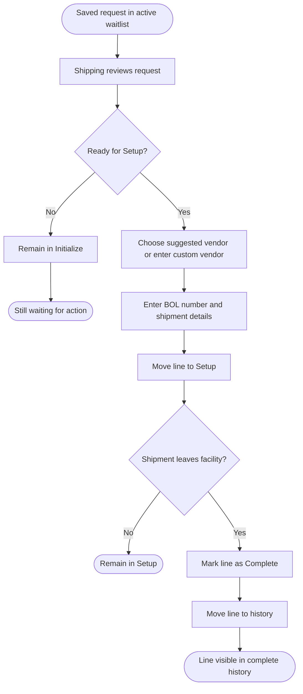
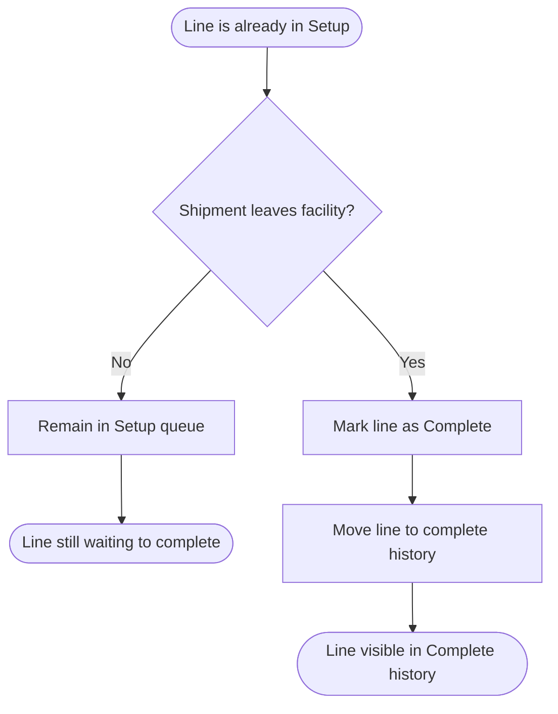

# Module_OutsideService — End-User Workflow And Mockups

Last Updated: 2026-03-27

This document explains how the new Outside Service waitlist is expected to work for day-to-day users.
It is written for coordinators, Shipping, and support staff.
This release includes the full line lifecycle.
Each waitlist line moves through three phases: `Initialize`, `Setup`, and `Complete`.
The mockups below are concept sketches, not exact screen replicas.

---

## Who This Is For

- Outside Service Coordinator
- Shipping team
- Leads and support staff who need to understand the process

---

## What Version 1 Includes

- Create a new outside-service request
- Add one or more part lines to the request
- Use a Part Match Helper if the entered part number is close but not exact
- Enter number of packages and quantity per package for each line
- Move lines through `Initialize`, `Setup`, and `Complete`
- Choose vendor and enter BOL information during `Setup`
- Save the request into an active waitlist
- View the open waitlist and completed history

## What Version 1 Does Not Include

- Editing a saved request after it is submitted
- Cancelling a saved request

---

## Workflow Overview

### Version 1 Flow


### Full Lifecycle



### Complete Phase Flow



---

## Screen Summary

| Screen                             | Version   | Purpose                                                                                   |
| ---------------------------------- | --------- | ----------------------------------------------------------------------------------------- |
| `Outside Service Request Entry`    | Version 1 | Create a new request with part lines only                                                 |
| `Part Match Helper`                | Version 1 | Help the user choose the correct part when the entered part number is close but not exact |
| `Outside Service Active Waitlist`  | Version 1 | Show open waitlist lines and their current phase                                          |
| `Outside Service Setup`            | Version 1 | Capture vendor, BOL number, and shipment setup details                                    |
| `Outside Service Complete History` | Version 1 | Review lines that have already completed the process                                      |

---

## Screen 1 — Outside Service Request Entry

This is the main Version 1 screen for the Outside Service Coordinator.

### Part Match Helper Steps

1. Starts a new request.
2. Adds one or more part lines.
3. If a part number is not found, uses the Part Match Helper to choose the correct part.
4. Enters package count and quantity per package for each line.
5. Saves the request.

### Request Entry Mockup

```text
+----------------------------------------------------------------------------------+
| Outside Service - New Request                                                    |
+----------------------------------------------------------------------------------+
| Requested By: [Current User                     ]   Request Date: [2026-03-27]   |
| Notes:        [______________________________________________________________]   |
|                                                                                  |
| Part Lines                                                                       |
| [Add Part Line]                                                                  |
|                                                                                  |
| Line | Part ID        | Packages | Qty / Package                                 |
| 1    | [ABC-123_____] | [4_____] | [25_______]                                   |
| 2    | [XYZ-900_____] | [2_____] | [10_______]                                   |
|                                                                                  |
| [Save Request]   [Clear Form]                                                    |
+----------------------------------------------------------------------------------+
```

### Request Entry User Notes

- The request cannot be saved unless every part line has valid counts.
- If the entered part number is not found, the Part Match Helper opens and shows similar parts.
- Vendor selection does not happen in Version 1.
- Shipping will choose the vendor later when the request is scheduled.

---

## Screen 1A — Part Match Helper

This helper appears when the part number typed by the coordinator does not exactly match a part in Infor Visual.

### What The User Does

1. Reviews the closest part matches.
2. Selects the correct part if one is shown.
3. Returns to the request form if the entered value needs to be corrected manually.

### Part Match Helper Mockup

```text
+----------------------------------------------------------------------------------+
| Part Match Helper                                                                |
+----------------------------------------------------------------------------------+
| We could not find an exact match for: [ABC1234]                                  |
|                                                                                  |
| Did you mean one of these parts?                                                 |
|                                                                                  |
| ( ) ABC-1234   Widget Housing                                                    |
| ( ) ABC-1235   Widget Housing Rev B                                              |
| ( ) ABC-1284   Widget Cover                                                      |
|                                                                                  |
| [Use Selected Part]   [Go Back And Edit]                                         |
+----------------------------------------------------------------------------------+
```

### Part Match Helper Notes

- This helper is meant to be easier for end users to understand than the term fuzzy search.
- It helps prevent failed requests caused by a small typing error in the part number.
- If none of the shown parts is correct, the user returns to the form and fixes the value manually.

---

## Screen 2 — Outside Service Active Waitlist

This is the Version 1 list that Shipping uses to see open work.

### What The User Sees

- newest requests first
- vendor still pending Shipping assignment
- number of part lines in the request
- current line phase, which starts as `Initialize`

### Active Waitlist Mockup

```text
+-------------------------------------------------------------------------------------------------------------------+
| Outside Service Queue                                                     Initialize [12]  Setup [4]  Complete [84] |
+-------------------------------------------------------------------------------------------------------------------+
| Filter: [All Parts v]   Search: [__________________________]   Sort: [Oldest Waiting v]   [New Request]        |
|                                                                                                                   |
| Req/Line   Part                    Details                       Waiting   Contact        Next Step               |
| 128-1      ABC-123                 Widget Housing                51 mins   [Call] [Msg]  [Open] [Move to Setup] |
| 128-2      XYZ-900                 Widget Cover                  47 mins   [Call] [Msg]  [Open] [Move to Setup] |
| 127-1      MMC-725                 Transfer to outside service   45 mins   [Call] [Msg]  [Open] [Move to Setup] |
|                                                                                                                   |
| Details Panel                                                                                                     |
| Request 128 / Line 1                                                                                Phase: Initialize |
| Part: ABC-123   Packages: 4   Qty Each: 25   Created By: J. Smith   Vendor: Pending Shipping                    |
| Notes: [Transfer to outside service after inspection]                                                          |
| [Open Full Request]                                                                                                |
+-------------------------------------------------------------------------------------------------------------------+
```

### Active Waitlist User Notes

- This layout is intended to feel like a live waitlist board rather than a plain data table.
- The badges, quick actions, and side detail panel are conceptual design cues, not fixed control requirements.
- Shipping uses this list to move lines into `Setup` and later `Complete`.
- Vendor assignment is intentionally deferred until Shipping works the request.
- The existing Ship/Rec Outside Service History screen remains separate and continues to serve historical lookup needs.

---

## Screen 3 — Outside Service Setup

This screen is part of the delivered workflow.
Shipping uses it to move a waitlist line from `Initialize` into `Setup`.

### Setup Mockup

```text
+-------------------------------------------------------------------------------------------------------------------+
| Outside Service Setup                                                                         Request 128 / Line 1 |
+-------------------------------------------------------------------------------------------------------------------+
| Line Summary: ABC-123 / Widget Housing                           Current Phase: Initialize   Wait Time: 51 mins   |
|                                                                                                                   |
| Vendor Decision                                                                                                   |
| Suggested Vendor: [Metro Heat Treat v]        [Use Custom Vendor]                                                |
| Custom Vendor Name: [__________________________________________]                                                  |
|                                                                                                                   |
| Shipment Setup                                                                                                    |
| BOL Number: [________________________]      Scheduled Date: [03/30/2026]                                         |
| Pickup Window: [2:00 PM - 4:00 PM]       Shipping Contact: [______________________________]                      |
| Notes: [______________________________________________________________________________________________]          |
|                                                                                                                   |
| [Save Setup]   [Return to Queue]   [Notify Coordinator]                                                           |
+-------------------------------------------------------------------------------------------------------------------+
```

### Setup Notes

- This phase is where Shipping would choose the vendor and add the BOL number.
- Once saved, the line moves from `Initialize` to `Setup`.

---

## Screen 4 — Outside Service Complete History

This screen is part of the delivered workflow.
It shows what the end-state history screen looks like after lines are marked complete.

### Complete History Mockup

```text
+-------------------------------------------------------------------------------------------------------------------+
| Outside Service Complete History                                                           Completed Lines [84]    |
+-------------------------------------------------------------------------------------------------------------------+
| Search: [____________________]   Vendor: [All v]   Completed: [Last 30 Days v]   [Export]                        |
|                                                                                                                   |
| Req/Line   Part                    Completed On   Vendor            BOL         Actions                           |
| 091-1      ABC-123                 03/19/26       Metro Heat Treat  445991      [View] [Reopen]                  |
| 087-2      XYZ-900                 03/17/26       Allied Plating    445870      [View]                           |
|                                                                                                                   |
| History Detail Panel                                                                                              |
| Request 091 / Line 1   Phase: Complete   Vendor: Metro Heat Treat   BOL: 445991                                 |
| Completed On: 03/19/26   Final Notes: [Picked up on second afternoon run]                                        |
| [Open History Record]                                                                                                |
+-------------------------------------------------------------------------------------------------------------------+
```

### Complete History Notes

- This is the screen that would replace manual tracking for completed shipments.
- It is intended for history and follow-up, not for new request entry.
- The completed-history view should feel like the same waitlist screen family, but filtered to finished work.

---

## Daily Workflow Summary

| Role                        | Version 1 Action                                                                             |
| --------------------------- | -------------------------------------------------------------------------------------------- |
| Outside Service Coordinator | Create new requests with part and package details only                                       |
| Shipping                    | Review the active waitlist and move each line through `Setup` and `Complete`                 |
| Support Staff               | Use the screen layout and lifecycle summary to understand how the delivered line phases work |

---

## Support Notes

- If a user asks where BOL number entry is, the correct answer is: Shipping enters it during the `Setup` phase.
- If a user asks why the request does not appear in Ship/Rec history, the answer is: the waitlist and the history lookup are separate tools.
- If a user asks why there is no vendor field during request entry, the answer is: vendor selection belongs to Shipping, not the Outside Service Coordinator.
- If a user asks what the progress steps are, the correct answer is: each waitlist line moves through `Initialize`, then `Setup`, then `Complete`.
