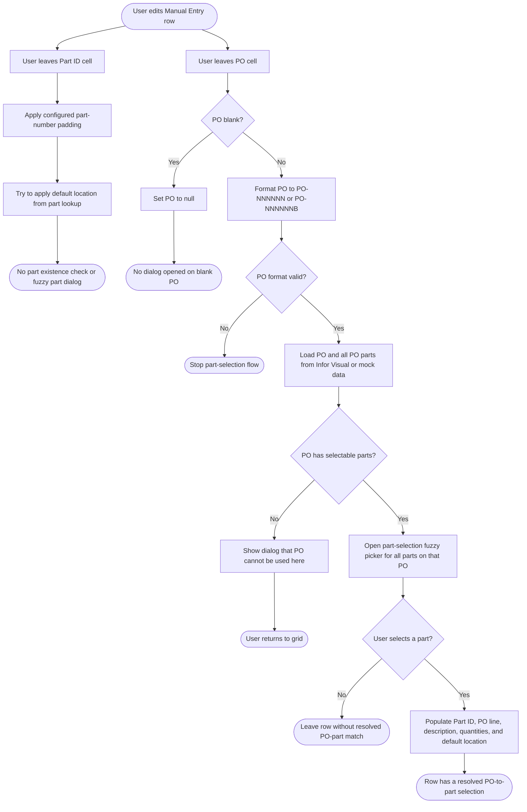
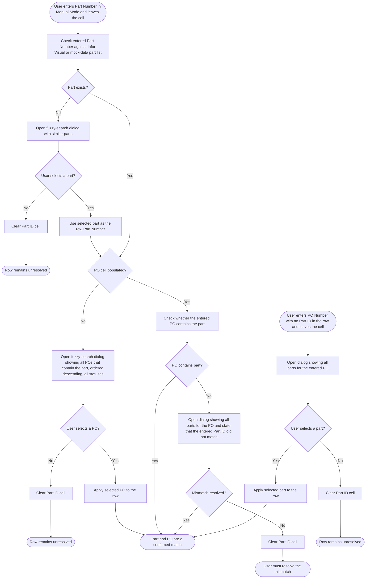

# Manual Mode Part and PO Workflow Comparison

Last Updated: 2026-03-24

This document compares the current Manual Mode behavior in Module_Receiving against the intended workflow described for part and PO matching.

## Current Workflow

## Intended Workflow

## Key Differences

- Current flow is PO-driven. Intended flow is Part-driven.
- Current Part ID lost-focus behavior only formats the part number and applies a default location. It does not verify that the part exists and does not open a fuzzy-search dialog.
- Current PO lost-focus behavior formats the PO and immediately opens a part-selection dialog for parts on that PO.
- Intended behavior requires checking whether the part exists first, then resolving the PO relationship from that part.
- Intended behavior requires showing all matching POs for a part when the PO cell is blank.
- Intended behavior requires checking whether a populated PO contains the entered part before considering the row resolved.

## Current Code Entry Points Reviewed

- Module_Receiving/Views/View_Receiving_ManualEntry.xaml.cs
- Module_Receiving/ViewModels/ViewModel_Receiving_ManualEntry.cs
