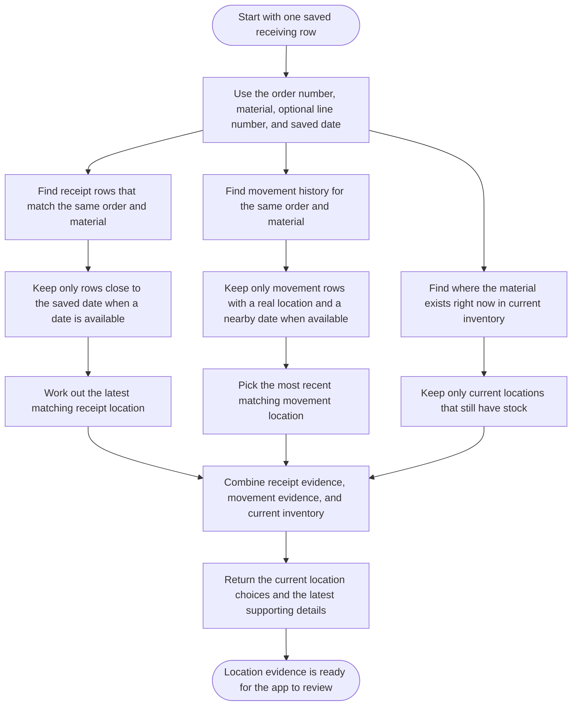

# Receiving Location Evidence Query Workflow

Last Updated: 2026-04-14

This diagram explains how the location-evidence lookup works in simple terms.
It is based on the flow used by `16_GetReceivingLocationEvidence.sql`.

## Plain-English Summary

- The lookup starts from one saved receiving row.
- It checks three kinds of evidence:
- Past receipt rows for the same order and material.
- Past movement rows for the same order and material.
- Current inventory locations where that material is still on hand.
- It narrows the results with the saved date when a date is available.
- The app then uses that evidence to decide whether there is one clear current location, no clear answer, or too many possible answers.
- When one destination location holds the full matched PO transfer quantity for the same receipt-day group, the reconciliation flow can allocate that aggregate movement across all affected saved MTM rows.
