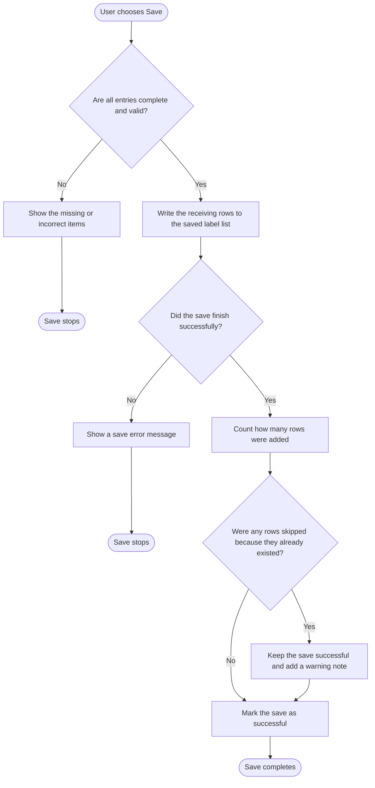

# Receiving Save Workflow - Mock Data Off

Last Updated: 2026-04-05

This diagram shows the normal save path when test data mode is off.

## Plain-English Summary

- The save starts only if every row passes the normal checks.
- If the data is not ready, the user sees what needs to be fixed and the save stops.
- If the data is ready, the app saves the receiving rows to the saved label list.
- If that save fails, the user sees an error and nothing else happens.
- If it succeeds, the app finishes the save and can also show a warning if some rows were already there.
