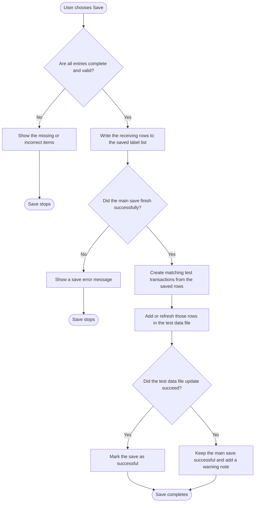

# Receiving Save Workflow - Mock Data On

Last Updated: 2026-04-05

This diagram shows the save path when test data mode is on.
It includes the extra step that writes a matching test transaction so location checking can still be tried later.

## Plain-English Summary

- The first half is the same as the normal save flow.
- After the main save succeeds, the app creates test transactions that match the saved material, order, date, and location.
- Those test transactions are written into the mock data file.
- If that extra test-data write fails, the main save still stays successful, but the app records a warning so the issue is visible.
- This lets the later location-check feature work in test mode without needing a live system.
