# MTM Receiving Application - Architecture Document

## Architecture Overview

```mermaid
graph TB
%% === STYLES ===
classDef core fill:#1E90FF,stroke:#000,color:#000,stroke-width:2px,rx:10px,ry:10px;
classDef db fill:#9ACD32,stroke:#000,color:#000,stroke-width:2px,rx:10px,ry:10px;
classDef module fill:#FFD700,stroke:#000,color:#000,stroke-width:2px,rx:10px,ry:10px;
classDef external fill:#FF69B4,stroke:#000,color:#000,stroke-width:2px,rx:10px,ry:10px;

%% === USERS ===
User(("User<br/>Interacts with Application"))

%% === APPLICATION CORE ===
subgraph "Application Core"
  App["Main Application<br/>App.xaml.cs"]:::core
  DIContainer["Dependency Injection Container<br/>Service Registry"]:::core
end

User -->|"launches"| App

%% === MODULES ===
subgraph "Modules"
  Module_Core["Module_Core<br/>Shared Utilities, Converters"]:::module
  Module_Dunnage["Module_Dunnage<br/>Dunnage Management"]:::module
  Module_Receiving["Module_Receiving<br/>Receiving Operations"]:::module
  Module_Routing["Module_Routing<br/>Routing Logic"]:::module
  Module_Volvo["Module_Volvo<br/>Volvo Integration"]:::module
  Module_Reporting["Module_Reporting<br/>Reporting Logic"]:::module
  Module_Settings["Module_Settings<br/>Application Settings"]:::module
end

App -->|"loads modules"| Module_Core
App -->|"loads modules"| Module_Dunnage
App -->|"loads modules"| Module_Receiving
App -->|"loads modules"| Module_Routing
App -->|"loads modules"| Module_Volvo
App -->|"loads modules"| Module_Reporting
App -->|"loads modules"| Module_Settings

%% === DATA ACCESS LAYER ===
subgraph "Data Access Layer"
  Dao_DunnageType["Dao_DunnageType<br/>Dunnage Data Access"]:::db
  Dao_ReceivingLine["Dao_ReceivingLine<br/>Receiving Data Access"]:::db
  Dao_VolvoShipment["Dao_VolvoShipment<br/>Volvo Shipment Data Access"]:::db
  Dao_InforVisualPO["Dao_InforVisualPO<br/>InforVisual PO Data Access"]:::db
  Dao_InforVisualPart["Dao_InforVisualPart<br/>InforVisual Part Data Access"]:::db
end

Module_Dunnage -->|"uses"| Dao_DunnageType
Module_Receiving -->|"uses"| Dao_ReceivingLine
Module_Volvo -->|"uses"| Dao_VolvoShipment
Module_Dunnage -->|"uses"| Dao_InforVisualPO
Module_Dunnage -->|"uses"| Dao_InforVisualPart

%% === BUSINESS LOGIC SERVICES ===
subgraph "Business Logic Services"
  IService_DunnageWorkflow["IService_DunnageWorkflow<br/>Dunnage Workflow Service"]:::core
  IService_Receiving["IService_Receiving<br/>Receiving Service"]:::core
  IRoutingService["IRoutingService<br/>Routing Service"]:::core
  IService_Dispatcher["IService_Dispatcher<br/>Dispatcher Service"]:::core
  IService_ErrorHandler["IService_ErrorHandler<br/>Error Handling Service"]:::core
  IService_LoggingUtility["IService_LoggingUtility<br/>Logging Utility Service"]:::core
end

Module_Dunnage -->|"uses"| IService_DunnageWorkflow
Module_Receiving -->|"uses"| IService_Receiving
Module_Routing -->|"uses"| IRoutingService
App -->|"registers"| IService_Dispatcher
App -->|"registers"| IService_ErrorHandler
App -->|"registers"| IService_LoggingUtility

%% === VIEWMODELS ===
subgraph "ViewModels"
  ViewModel_MainWindow["ViewModel_MainWindow<br/>Main Window ViewModel"]:::core
  ViewModel_Shared_Base["ViewModel_Shared_Base<br/>Shared Base ViewModel"]:::core
end

App -->|"registers"| ViewModel_MainWindow
Module_Core -->|"uses"| ViewModel_Shared_Base

%% === USER INTERACTION ===
User -->|"interacts with"| ViewModel_MainWindow
ViewModel_MainWindow -->|"triggers commands"| IService_DunnageWorkflow
ViewModel_MainWindow -->|"triggers commands"| IService_Receiving

%% === DATA FLOW ===
Dao_DunnageType -->|"executes stored procedures"| MySQL["MySQL Database<br/>Core Data"]
Dao_ReceivingLine -->|"executes stored procedures"| MySQL
Dao_VolvoShipment -->|"executes stored procedures"| MySQL
Dao_InforVisualPO -->|"executes stored procedures"| MySQL
Dao_InforVisualPart -->|"executes stored procedures"| MySQL

%% === EXTERNAL SYSTEMS ===
subgraph "External Systems"
  InforVisual["InforVisual System<br/>Purchase Order Data"]:::external
  Volvo["Volvo System<br/>Shipment Data"]:::external
end

Dao_InforVisualPO -->|"accesses"| InforVisual
Dao_VolvoShipment -->|"accesses"| Volvo

%% === DATA FLOW & CONTROL FLOW ===
IService_DunnageWorkflow -->|"manages workflow"| ViewModel_MainWindow
IService_Receiving -->|"manages receiving operations"| ViewModel_MainWindow
IService_Dispatcher -->|"dispatches UI updates"| ViewModel_MainWindow
IService_ErrorHandler -->|"handles errors"| ViewModel_MainWindow
IService_LoggingUtility -->|"logs events"| ViewModel_MainWindow
```

## Executive Summary

The MTM Receiving Application is a WinUI 3 desktop application built for manufacturing receiving operations. It provides workflows for receiving materials against purchase orders, managing returnable packaging (dunnage), and generating labels for incoming shipments.

**Project Type**: Desktop Application (Windows-only)  
**Architecture**: Modular Monolith with Strict MVVM  
**Primary Language**: C# (.NET 8)  
**UI Framework**: WinUI 3 (Windows App SDK)  
**Database Strategy**: Dual-database (MySQL for app data, SQL Server for ERP integration)

## Deep Architectural Analysis

### 1. Architectural Style & Patterns

- **Layered Architecture**: The project is organized into distinct layers:
  - **Presentation Layer**: WinUI 3 XAML-based views and view models.
  - **Application Layer**: Orchestrates workflows, commands, and UI interactions.
  - **Business Logic Layer**: Encapsulated in services implementing core workflows and domain logic.
  - **Data Access Layer**: DAO classes executing stored procedures against MySQL or external systems.
  - **Shared & Utility Layer**: Common utilities, converters, helpers, and shared view models.

- **MVVM Pattern**: Each UI component (Page/UserControl) is paired with a ViewModel, which exposes observable properties, commands, and event handlers. ViewModels are registered and injected via a dependency injection container.

- **Service-Oriented Architecture (SOA)**: Core functionalities are exposed via interfaces (e.g., `IService_DunnageWorkflow`, `IService_Receiving`, `IService_Dispatcher`) and implemented by concrete classes, enabling loose coupling and testability.

- **Dependency Injection (DI)**: The application uses `Host.CreateDefaultBuilder()` to register services, DAOs, view models, and helpers as singleton or transient instances, facilitating decoupling and testability.

- **Modular Design**: Modules (e.g., Dunnage, Receiving, Routing, Volvo, Reporting, Settings) are encapsulated in separate folders with their own data, models, services, view models, and views, allowing independent development and maintenance.

### 2. Major Containers & Modules

#### 2.1. Application Core Container

- **Main Application (`App.xaml.cs`)**:
  - Uses `HostBuilder` to configure dependency injection.
  - Registers core services (`IService_ErrorHandler`, `IService_LoggingUtility`, `IService_Dispatcher`, `IService_Window`, etc.).
  - Registers data access objects (DAOs) for MySQL, InforVisual, and external systems.
  - Registers business services implementing core workflows (e.g., `IRoutingService`, `IService_DunnageWorkflow`, `IService_Receiving`, etc.).
  - Registers ViewModels for main window, shared components, and module-specific views.

#### 2.2. Modules

- **Module_Core**:
  - Contains shared utilities, converters, base view models, and core services.
  - Provides infrastructure for UI focus management, logging, dispatching, and configuration.

- **Module_Dunnage**:
  - Handles dunnage management, including types, parts, specs, sessions, workflows, and admin UI.
  - Contains dedicated data access (`Dao_Dunnage*`), models, services, and view models.
  - Implements a workflow service (`IService_DunnageWorkflow`) managing multi-step dunnage processes.

- **Module_Receiving**:
  - Manages receiving operations, including data models, DAOs, services, and view models.
  - Handles data import/export, validation, and session management.

- **Module_Routing, Module_Volvo, Module_Reporting, Module_Settings, Module_Shared**:
  - Encapsulate respective domain logic, data, UI, and workflows.
  - Use similar patterns of service registration, MVVM, and modular separation.

### 3. Core Components & Their Responsibilities

#### 3.1. Dependency Injection & Service Registry

- **`Host.CreateDefaultBuilder()`** in `App.xaml.cs`:
  - Registers singleton services for data access, core utilities, and domain workflows.
  - Uses factory methods to inject dependencies (e.g., DAOs with connection strings).
  - Ensures singleton, stateless data access objects for efficiency.

#### 3.2. Data Access Layer (DAO)

- **DAO Classes** (e.g., `Dao_DunnageType`, `Dao_ReceivingLine`, `Dao_VolvoShipment`):
  - Encapsulate database interactions via stored procedures.
  - Use `Helper_Database_StoredProcedure` for executing commands.
  - Return `Model_Dao_Result<T>` for success/error handling.
  - Follow a consistent pattern: parameter validation, stored procedure execution, error handling.

#### 3.3. Business Logic & Workflow Services

- **Workflow Services** (e.g., `IService_DunnageWorkflow`, `IService_Receiving`, `IRoutingService`):
  - Manage multi-step processes, state transitions, and validation.
  - Expose methods like `AdvanceToNextStepAsync()`, `GoToStep()`, `StartWorkflowAsync()`.
  - Raise events (`StepChanged`, `StatusMessageRaised`) for UI updates.
  - Maintain session state (`Model_DunnageSession`, `Model_ReceivingSession`) in memory.

- **Core Services** (e.g., `Service_Dispatcher`, `Service_Focus`, `Service_Notification`):
  - Abstract platform-specific functionalities (UI thread dispatching, focus management, notifications).
  - Enable decoupled, testable interactions with UI and threading.

#### 3.4. ViewModels

- **MVVM Pattern**:
  - Each view (Page/UserControl) has a corresponding ViewModel.
  - ViewModels contain observable properties (`[ObservableProperty]`) for data binding.
  - Commands (`[RelayCommand]`) for user actions.
  - Event subscriptions to workflow or session events for reactive UI updates.
  - Use dependency injection to obtain services and DAOs.

- **Shared ViewModels**:
  - `ViewModel_Shared_Base` provides common functionality.
  - `ViewModel_Shared_MainWindow` manages main window state.
  - ViewModels implement `IResettableViewModel` for resettable UI states.

#### 3.5. Views

- **XAML Views** (Page/UserControl):
  - Bind to ViewModels via DataContext.
  - Use event handlers for lifecycle events (`OnLoaded`, `OnNavigateDataTransferObjects`).
  - Use dependency injection to obtain ViewModels.
  - Attach focus management via `IService_Focus`.

### 4. Data Flow & Control Flow

#### 4.1. Initialization

- Application startup (`App.xaml.cs`) configures DI container.
- Main window initializes, sets up navigation.
- Main ViewModel (`Main_CarrierDeliveryLabelViewModel`) manages top-level navigation.
- Module-specific ViewModels load data via services (e.g., `LoadTypesAsync`, `LoadPartsAsync`).

#### 4.2. User Interaction & Workflow

- User navigates via `NavigationView` or buttons.
- Commands trigger service methods, e.g., `IRoutingService`, `IService_DunnageWorkflow`.
- Workflow services manage state transitions, raise `StepChanged` events.
- ViewModels react to events, update observable properties, and trigger UI updates.
- Data access DAOs execute stored procedures, returning results wrapped in `Model_Dao_Result<T>`.
- UI updates dynamically based on ViewModel properties, e.g., current step title, validation messages.

#### 4.3. Data Persistence & External Systems

- Data access layer interacts with MySQL via stored procedures.
- External systems (InforVisual, Volvo) accessed via dedicated DAOs.
- Data validation, error handling, and transaction management ensure data integrity.
- CSV export/import handled via `CsvHelper` and dedicated services (`IService_DunnageCSVWriter`).

#### 4.4. User Feedback & Notifications

- `Service_Notification` displays status messages.
- Error handling via `IService_ErrorHandler`.
- Focus management via `IService_Focus`.
- User preferences stored in database (`Dao_DunnageUserPreference`) and loaded at startup.

### 5. External Dependencies & Integrations

- **Database**:
  - MySQL for core data (dunnage, receiving, routing, Volvo).
  - Stored procedures for CRUD, validation, and reporting.
- **External Systems**:
  - InforVisual (via DAO `Dao_InforVisualPO`, `Dao_InforVisualPart`) for purchase order data.
  - Volvo system for shipment data.
- **Libraries & Frameworks**:
  - WinUI 3 for UI.
  - CsvHelper for CSV operations.
  - CommunityToolkit.Mvvm for MVVM support.
  - Material.Icons for iconography.
  - Dependency injection via `Microsoft.Extensions.Hosting`.

### 6. Extensibility & Maintainability

- Modular architecture allows independent module updates.
- DI facilitates mocking/testing.
- Consistent pattern for DAOs, services, and view models.
- Event-driven UI updates via property change notifications and events.
- Clear separation of UI, business logic, and data access.

## Technology Stack

### Core Framework

- **.NET 8**: Modern cross-platform framework (Windows-targeted)
- **WinUI 3**: Native Windows UI framework (Windows App SDK 1.8+)
- **C# 12**: Modern language features with nullable reference types enabled

### MVVM Framework

- **CommunityToolkit.Mvvm 8.2.2**: Source generators for MVVM patterns
  - `[ObservableProperty]` for bindable properties
  - `[RelayCommand]` for command methods
  - Replaces manual `INotifyPropertyChanged` implementation

### Dependency Injection

- **Microsoft.Extensions.DependencyInjection 8.0**: Built-in .NET DI container
- **Microsoft.Extensions.Hosting 8.0**: Application lifetime management
- All services registered in `App.xaml.cs`

### Database Access

- **MySql.Data 9.4.0**: MySQL ADO.NET provider
  - Server: localhost:3306
  - Database: `mtm_receiving_application`
  - Access: Full READ/WRITE
  - All operations via stored procedures
- **Microsoft.Data.SqlClient 5.2.2**: SQL Server provider
  - Server: VISUAL
  - Database: MTMFG
  - Access: **READ ONLY** (`ApplicationIntent=ReadOnly`)
  - Used for PO and Part lookups from Infor Visual ERP

### UI Components

- **CommunityToolkit.WinUI.UI.Controls 7.1.2**: Extended WinUI controls
- **Material.Icons.WinUI3 2.4.1**: Material Design icon library
- **Custom Controls**: Touch-optimized inputs for manufacturing terminals

### Utilities

- **CsvHelper 33.0.1**: CSV generation for LabelView label printing
- **OpenTelemetry 1.14.0**: Observability and tracing (future use)
