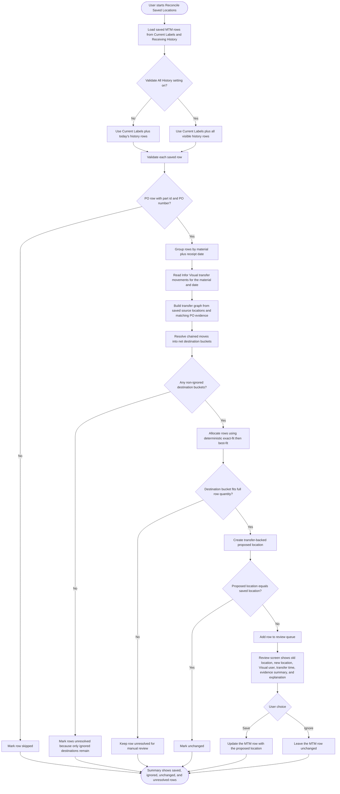

# Receiving Location Reconciliation Process

Last Updated: 2026-05-07

This feature no longer uses the old current-inventory smart-fix flow. Reconciliation is now driven by actual Infor Visual transfer movements and a deterministic allocation pass.

## What The Feature Does Now

- It always scans `Current Labels`.
- It scans `History` rows from today by default.
- If the `Validate All History During Reconciliation` setting is on, it scans all visible history instead.
- It groups candidate MTM rows by material plus receipt date so same-day receipts for the same material can be reconciled together across multiple MTM entries.
- It asks Infor Visual for transfer movements for that material and date window.
- It follows chained moves forward from the saved source locations and from the PO evidence tied to the saved MTM rows.
- It collapses the movement graph into net destination buckets.
- It allocates saved skids or tags by deterministic exact-fit then best-fit allocation:
  rows are sorted by quantity descending, then load number, then load id.
  for each row, the allocator chooses the smallest destination bucket that can still fully cover that row.
  ties break by latest transfer time, then location id.
- It only proposes updates that are supported by confirmed transfer quantity.
- It shows the transfer user from Infor Visual, never the current MTM session user.

## Chained Move Rule

- When material moves through staging, reconciliation targets the latest confirmed destination that still has net quantity after later outbound transfers are removed.
- Example:
  `RECV -> V-STAGE -> V-Z9-01` ends at `V-Z9-01` if the staging quantity is fully transferred onward.
- If a staging location keeps some quantity after onward transfers, that remaining net quantity stays eligible as a destination bucket.
- If the movement graph nets to zero or cannot support a full row quantity, the row stays unresolved for manual review.

## Partial Move Rule

- Reconciliation does not force every row into a new location.
- If transfer evidence covers only part of the same-day receipt group, only the supported rows receive proposed destinations.
- Leftover rows stay unresolved and appear in the review summary.

## Mermaid Diagram

## Plain-English Outcome Rules

- `Updated`: the row has a transfer-backed destination that differs from the saved location.
- `Unchanged`: the transfer-backed destination matches the saved location.
- `IgnoredBySettings`: transfer evidence exists, but every candidate destination is currently ignored by user preference.
- `Ambiguous`: transfer evidence exists, but no remaining bucket can safely cover the full saved row quantity.
- `NotFound`: no relevant Infor Visual transfer movement was found for the same-day material group.
- `Skipped`: the row was not eligible because it was non-PO or missing required keys.

## Acceptance Example

For the five-skid `MMC0000650` example:

- Skids: `4500`, `5000`, `7500`, `4350`, `2000`
- Transfers from `RECV`:
  `12000 -> V-A0-01`, `5000 -> V-B0-01`, `6350 -> V-C0-01`
- Deterministic allocation produces:
  `4500 + 7500 -> V-A0-01`
  `5000 -> V-B0-01`
  `4350 + 2000 -> V-C0-01`

That result comes from sorting rows largest-first and choosing an exact-fit bucket when one exists, otherwise the smallest bucket that can still fully cover the row.