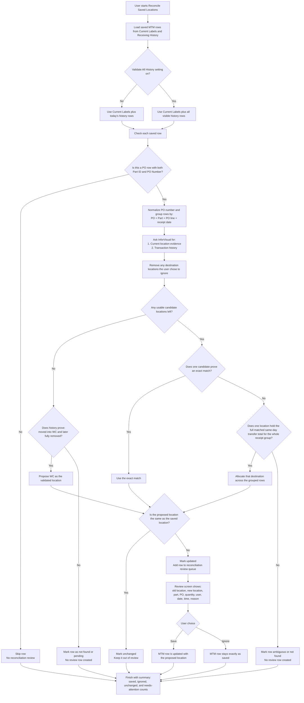

# Receiving Location Reconciliation Process

Last Updated: 2026-05-01

This diagram shows how the current Receiving reconciliation feature decides whether a saved row needs review.

## What The Feature Checks

- It always checks `Current Labels`.
- It checks `History` rows from today by default.
- If the `Validate All History During Reconciliation` setting is on, it checks all visible history instead.
- It only sends rows to the review screen when the system finds a confident new location that is different from the saved one.

## Mermaid Diagram

## Plain-English Outcome Rules

- `Needs review`: only rows marked `Updated` reach the review screen.
- `No review needed`: rows already matching the saved location are marked `Unchanged`.
- `Skipped automatically`: non-PO rows, rows missing PO or part data, and rows whose only candidates are ignored do not enter review.
- `Needs manual follow-up`: ambiguous rows and pending Visual receipt situations are not auto-saved.
- `Hidden from the final needs-attention list`: rows marked `NotFound` are not shown in the final review ViewModel's visible unresolved list.