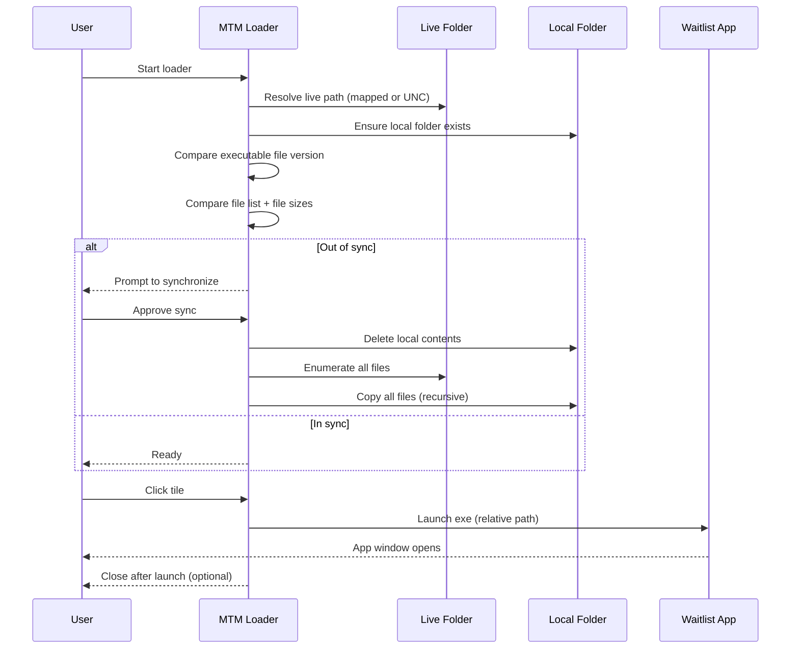
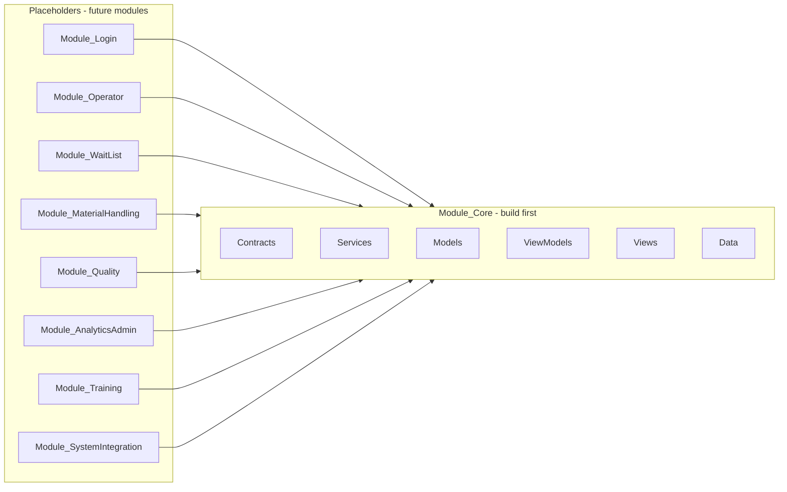
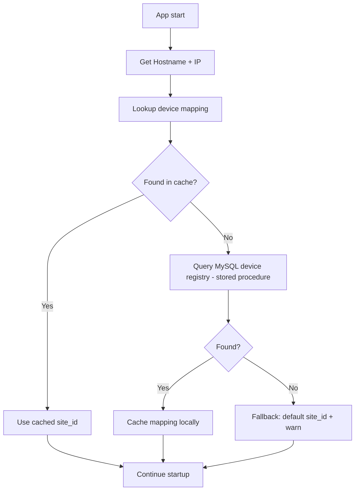
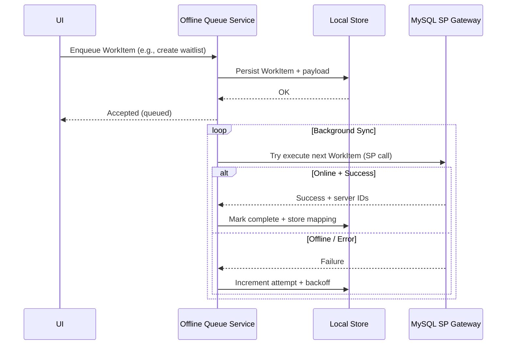
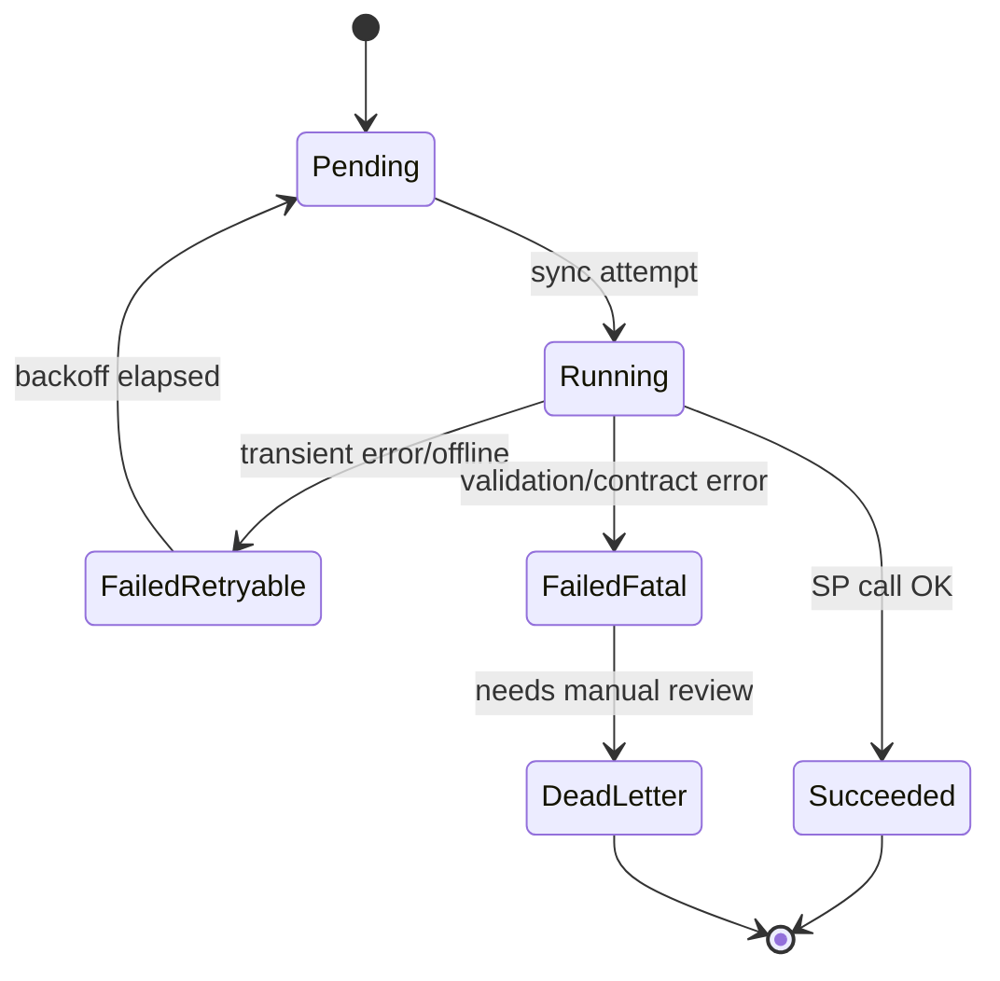
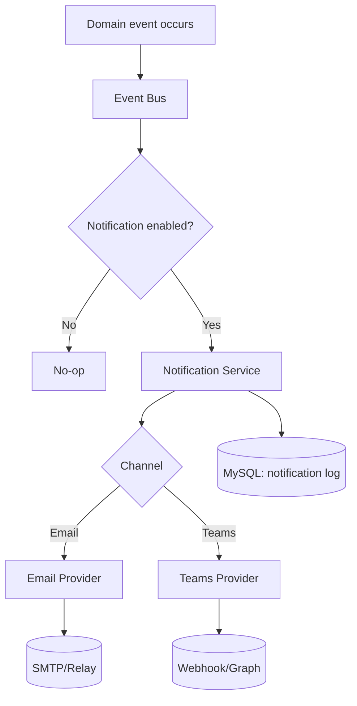
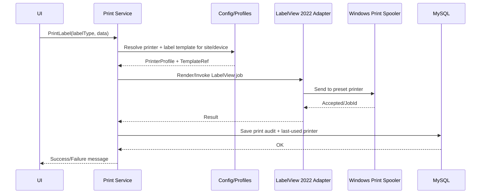
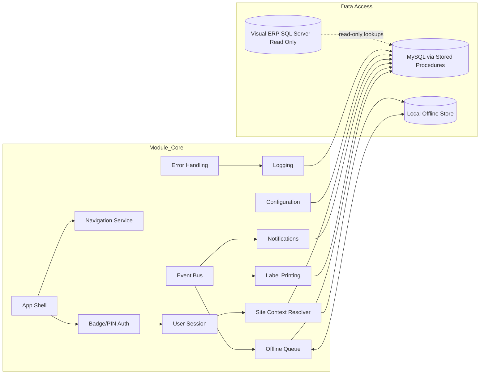
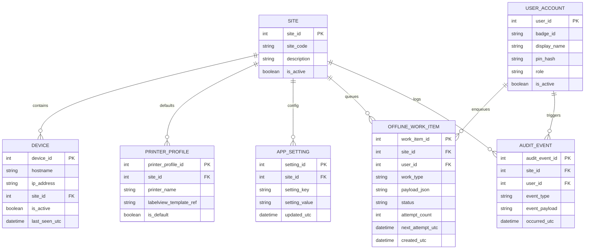

# Kickoff (Revised): Module-Based Waitlist App — Core-First Blueprint

> **Scope of this document**: only the **Core module** (foundation services) + **placeholders** for future modules. This is intended to be reusable as an implementation checklist/template.
>
> **Diagrams**: Mermaid (per request).

## 0) Inputs / Constraints (confirmed)

- **Platform**: Windows only.
- **Hardware**: barcode scanners (keyboard wedge behavior assumed), label printers.
- **Label printing requirement**: print **LabelView 2022** labels directly to a **preset printer**.
  - Printer selection is **stored in MySQL** so it applies consistently across apps.
- **Offline requirement**: **offline queueing is required** (core service).
- **Auth model**: **badge + PIN**, app-managed.
- **UI**: keyboard/mouse.
- **Notifications**: **email + Teams** (no intercom). Notifications are **core**; other modules raise events.
- **Visual ERP**: read-only integration for **Work Order validation** and related objects (part IDs, next/previous op, dies, locations, etc.).
- **Site scoping**: `site_id` determines what waitlist data is shown.
  - `site_id` is derived from the workstation running the app (device mapping), not from Visual.
- **Deployment**: **copy-folder**, managed by a separate loader app.

## 0.1) Deployment Contract: MTM Application Loader (copy-folder)

This app will be deployed and launched via the MTM Loader WinForms launcher. The core implication for this project is that the application’s **installed folder must be treated as read-only at runtime**.

### Loader behavior (observed)

- **Live path resolution**: loader prefers a mapped drive path first, then a UNC fallback.
- **Local install folder**: loader uses a per-user “local applications” directory and syncs a `New Build` subfolder.
- **Out-of-sync detection** (any of these can trigger a sync prompt):
  - **Executable file version mismatch** (primary tile executable)
  - **Folder contents mismatch** (recursive file count + file sizes)
- **Synchronization**: user-approved full copy:
  - deletes local folder contents
  - copies the entire live folder recursively to local



### Critical design rule for this application

To avoid the loader constantly detecting “local folder out of sync”, the app must **never write** any files into its install folder.

Store runtime artifacts in:

- `%LOCALAPPDATA%` for per-user logs, cache, local offline queue DB
- MySQL for shared settings (e.g., printer profile, notification defaults)

### Loader configuration files (for IT / rollout)

The loader stores per-user settings under:

- `%LOCALAPPDATA%\MTM_Loader\Configs\mtm_loader_settings_{username}.json`

This JSON includes:

- `LocalPath`
- `LivePath`
- `ApplicationTiles[]` where each tile can launch a different executable via `ExecutableRelativePath`

Recommended approach for adding this app:

1. Publish the app into the loader’s live folder (or a subfolder) as a **self-contained set of files**.
2. Add an `ApplicationTiles` entry pointing to the new app’s executable relative path.
3. Ensure the app’s executable has a meaningful **file version** that changes with each release.

Example tile shape (illustrative):

```json
{
  "DisplayName": "Waitlist App",
  "ExecutableRelativePath": "WaitlistApp\\WaitlistApp.exe",
  "IconResourceKey": "MTM_3",
  "Caption": "Launch Waitlist",
  "CloseAfterLaunch": true
}
```

## 1) Re-evaluated Framework & Why

### Recommendation: **WPF on .NET 8** (Windows Desktop)

This is the best fit for your constraints because:

- **Printing**: WPF (and the broader Windows desktop stack) has the most mature options for printer selection, Windows spooler integration, and “print-through-another-app” adapters (which is likely how LabelView 2022 will be invoked).
- **Hardware friendliness**: barcode scanners that behave as keyboard input are straightforward.
- **Offline-first**: easy to run a local embedded store for a persistent queue.
- **Stability**: long-running floor apps benefit from predictable UI + mature ecosystem.

### Alternatives (only if you choose to)

- **WinUI 3**: modern UI, but printing scenarios can be more finicky; consider only if you strongly prefer WinUI styling.
- **Avalonia**: cross-platform, but you do not need cross-platform; printing/hardware workflows tend to require more custom work.

## 2) Language + Architecture

- **Language**: C#.
- **Architecture**: strict MVVM, modular boundaries, DI, service layer + DAO/data gateways.

### MVVM Toolkit patterns (non-negotiable)

- Observable properties via toolkit source generators.
- Commands via toolkit source generators.
- Views are binding-only; **no business logic**.
- Core services expose interfaces and are injected into ViewModels/services.

## 3) “Core First” Module Strategy

Only implement `Module_Core` first. Every future module depends on it.



## 4) Recommended NuGet Packages (Core)

> This list is intentionally small. Add packages only when a requirement truly demands it.

### MVVM + DI + config + logging

- `CommunityToolkit.Mvvm`
- `Microsoft.Extensions.DependencyInjection`
- `Microsoft.Extensions.Configuration`
- `Microsoft.Extensions.Configuration.Json`
- `Microsoft.Extensions.Logging`

### Data access

- MySQL driver (match org standard) + a stored-procedure-first gateway pattern
- SQL Server (Visual RO): `Microsoft.Data.SqlClient`

### Offline queue persistence (choose one)

- Preferred: `Microsoft.Data.Sqlite` (SQLite)
- Alternate: `LiteDB` (single-file embedded DB)

### Notifications

- Email: either SMTP (no extra package required if using built-in APIs) or a simple mail client package if you standardize.
- Teams:
  - Preferred (simple): Teams **Incoming Webhook** integration (HTTP client) if allowed.
  - Alternate (enterprise): Graph API (requires security approvals and auth model).

### Printing

- Avoid assuming a special library up front.
- Start with an **adapter** approach:
  - `ILabelPrintAdapter` with one implementation for LabelView 2022 (invocation mechanism TBD).
  - Optional future adapters (raw ZPL, PDF, etc.)

## 5) VS Code Extensions (suggested)

- C# tooling (Dev Kit)
- XAML tooling (WPF/XAML)
- Mermaid preview/diagrams extension
- markdownlint + Markdown All in One

## 6) Module_Core — Folder Structure (matches this repo’s conventions)

Create `Module_Core/` with:

- `Contracts/` (interfaces)
- `Converters/` (UI converters)
- `Data/` (DAO + gateways)
- `Helpers/` (small utilities only)
- `Models/` (core models)
- `Services/` (service implementations)
- `ViewModels/` (shell/core view models)
- `Views/` (shell/core views)
- `Themes/` (optional)

## 7) Core Services (what each does, and why it exists)

### 7.1 App Shell + Navigation

- **Purpose**: host module navigation, show status, route user to the correct landing page by role.
- **Must support**: role-based menu visibility, deep-link navigation to “current task”.

### 7.2 Badge/PIN Authentication Service

- **Purpose**: authenticate users locally against MySQL-stored user accounts.
- **Must support**:
  - PIN hashing (never store raw PIN)
  - lockout/backoff after repeated failures
  - audit event emitted for login success/failure

### 7.3 Session Service

- **Purpose**: hold current user, role, rights flags (e.g., analytics access), and current site context.
- **Must support**: event when session changes (logout/login).

### 7.4 Site Context Resolver (device → site_id)

- **Purpose**: determine `site_id` from workstation identity (hostname/IP).
- **Must support**:
  - local cache for offline startup
  - fallbacks (known default + prominent warning)



### 7.5 Offline Queue Service (core requirement)

- **Purpose**: allow users to continue working offline; queue work items and replay them when online.
- **Design**:
  - a persistent local store of “work items” (type + payload + attempts + next attempt time)
  - background sync loop with backoff
  - dead-letter for fatal items





### 7.6 Notification Service (email + Teams)

- **Purpose**: a single “notify” abstraction; modules publish events and never talk directly to SMTP/Teams.
- **Must support**:
  - enable/disable per site/module via configuration
  - consistent templates + severity
  - audit log in MySQL



### 7.7 Printing Service (LabelView 2022)

- **Purpose**: consistent printing across sites with centrally managed printer selection.
- **Design**: printing should be an **adapter** so you can swap the mechanism without rewiring modules.



### 7.8 Error Handling + Logging + Audit

- **Error handling**: user-friendly message + exception capture.
- **Logging**: correlation IDs; log session/site/device.
- **Audit**: append-only events for security and analytics.

## 8) Core Architecture Diagram



## 9) Core Data Model (starter — adjust to your schema)



## 10) Placeholder Modules (do not build yet)

Keep these as placeholders until Core is stable:

- `Module_Login` (could be thin if auth stays in Core)
- `Module_WaitList`
- `Module_Operator`
- `Module_MaterialHandling`
- `Module_Quality`
- `Module_AnalyticsAdmin`
- `Module_Training`
- `Module_SystemIntegration`

## 11) Implementation “First Steps” Checklist (Core only)

1. Create `Module_Core` folders + DI registration pattern.
2. Implement Shell + Navigation (role-based menu placeholder).
3. Implement Badge/PIN Auth + Session.
4. Implement Site Context Resolver (device mapping + local cache).
5. Implement MySQL Stored Procedure gateway (single path for all calls).
6. Implement Visual read-only gateway for WO validation (SELECT-only contract).
7. Implement Offline Queue (local persistence + sync loop + dead-letter).
8. Implement Notifications (email + Teams providers) + MySQL logging.
9. Implement Printing abstraction + LabelView adapter stub + printer profile storage.
10. Add core converters (busy state, role visibility, null placeholders).

---

## Notes on “internet references”

This revised framework recommendation is based on the constraints above (printing + offline + Windows-only). If you want me to ground it in specific comparable public repos/apps, paste a few public URLs (GitHub repos or product docs) and I’ll add a short “reference patterns” section.
