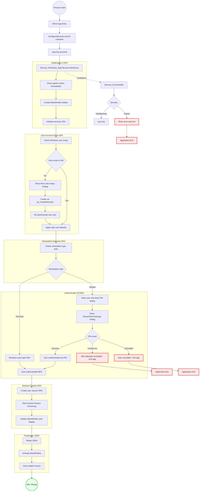

# Startup → Idle Workflow (Robust)

This document describes the actual end-to-end application lifecycle from process start through an **Idle / Ready** state.
It reflects the implementation in `Service_OnStartup_AppLifecycle.StartAsync()` and follows this repo's architecture: WinUI 3 + .NET 8, strict MVVM, DI, centralized error handling/logging, MySQL stored procedures.

**Last Verified**: 2026-01-11  
**Source**: `Module_Core/Services/Startup/Service_OnStartup_AppLifecycle.cs`

## Workflow (Flowchart)

---

## Workflow Summary

The startup workflow consists of **9 major phases**:

1. **Application Bootstrap** - DI container setup
2. **Splash Screen** (0-5%) - Immediate visual feedback
3. **MainWindow Creation** (15%) - Hidden window preparation
4. **User Account Check** (30%) - Verify Windows user in database
5. **Workstation Detection** (50%) - Personal vs. Shared terminal
6. **Authentication** (55-80%) - Windows auto-login OR PIN dialog
7. **Session Creation** (90%) - In-memory session + timeout timer
8. **UI Update** - MainWindow user display
9. **Finalization** (100%) - Show MainWindow, close splash

**No health checks** or configuration loading - services initialized on-demand.  
**No navigation initialization** - MainWindow is a static shell.  
**No background services** - only session timeout timer started.

---

## Key Implementation Details

### Database Stored Procedures Used

| Stored Procedure | Called When | Purpose |
|------------------|-------------|---------|
| `sp_GetUserByWindowsUsername` | Step 4 (User Check) | Check if Windows user exists |
| `sp_CreateNewUser` | New User Setup | Create first-time user account |
| `sp_GetSharedTerminalNames` | Step 5 (Workstation Detection) | Get list of shared terminals |
| `sp_ValidateUserPin` | Shared Terminal Auth | Validate PIN login |
| `sp_LogUserActivity` | Post-Authentication | Audit trail for login events |

### Critical Services

- `IService_OnStartup_AppLifecycle` - Startup orchestrator
- `IService_Authentication` - User authentication (Windows + PIN)
- `IService_UserSessionManager` - Session management + timeout monitoring
- `IService_ErrorHandler` - Centralized error handling
- `IService_Dispatcher` - UI thread dispatcher for timers

### Exit Conditions

Application exits cleanly (not crashes) in these scenarios:

1. **User cancels account creation** (new user setup)
2. **User cancels PIN login** (shared terminal)
3. **Max PIN attempts exceeded** (lockout for security)
4. **Critical startup failure** (exception in `StartAsync()`)

---

## Differences from Original Diagram

**What was corrected:**

1. ❌ **No explicit health checks** - Database connectivity tested on-demand
2. ❌ **No configuration loading step** - Handled by DI container automatically
3. ✅ **User check BEFORE workstation detection** - Changed order
4. ❌ **No "seed defaults" stored procedure** - Defaults applied in-memory
5. ❌ **No "load user preferences" step** - Preferences part of user record
6. ❌ **No navigation initialization** - MainWindow is static shell
7. ❌ **No background services/cache warmup** - Only session timer started

**What was added:**

1. ✅ **Explicit progress percentages** (0%, 5%, 15%, 20%, 30%, 50%, 55%, 80%, 90%, 100%)
2. ✅ **Dialog behaviors** (New User Setup, PIN Login)
3. ✅ **Exit paths** (cancel, lockout, critical error)
4. ✅ **Session timeout monitoring** via `IService_Dispatcher` timer

---

## Performance Characteristics

**Personal Workstation** (auto-login):
- **Total Time**: 1.2-1.5 seconds
- **User Wait**: Minimal (single splash screen transition)

**Shared Terminal** (PIN login):
- **Total Time**: 6-61 seconds (depends on user input speed)
- **User Wait**: Variable (waiting for PIN entry)

**Database Queries**:
- 2-3 queries total (user check, workstation detection, optional PIN validation)
- Each query: 50-200ms latency

---

## References

- **Source**: `Module_Core/Services/Startup/Service_OnStartup_AppLifecycle.cs`
- **Authentication**: `Module_Core/Services/Authentication/Service_Authentication.cs`
- **Session**: `Module_Core/Services/Authentication/Service_UserSessionManager.cs`
- **Database**: `Database/Schemas/02_create_authentication_tables.sql`
