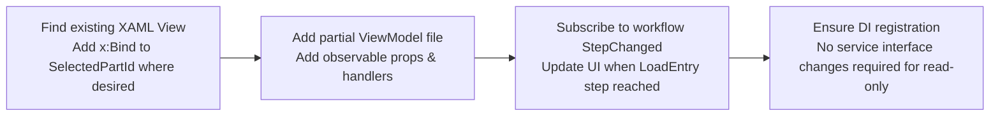

## Integrating the SelectedPart flow into an EXISTING View

**Overview**

If you already have a page or view that should show the selected part, follow these focused steps to add the `SelectedPart` behavior without creating a full new view. The approach minimizes code changes and reuses the existing `Service_ReceivingWorkflow` state.

Required edits (high level):

1. Modify the XAML
   - Locate the XAML file you want to update (e.g., `Module_Receiving/Views/View_Receiving_SomeExistingPage.xaml`).
   - Add a TextBlock or other UI control and set `Text="{x:Bind ViewModel.SelectedPartId, Mode=OneWay}"`.
   - If the view's DataContext is not yet a ViewModel, follow project conventions to bind the view to its ViewModel via DI/registry.

2. Add a partial ViewModel file (non-invasive)
   - If the existing view already has a ViewModel and is partial, create a new partial file (e.g., `ViewModel_Receiving_SomeExistingPage.Partial.cs`) so you do not modify the original file heavily.
   - In the partial file, add:
     - `[ObservableProperty] private string _selectedPartId = string.Empty;`
     - `public void UpdatePartInfo(string partId, string description)` — set `SelectedPartId` and other UI fields.
     - `private void OnStepChanged(object? s, EventArgs e)` — same logic as in `LoadEntry`: if `_workflowService.CurrentStep == Enum_ReceivingWorkflowStep.LoadEntry` then read `_workflowService.CurrentPart` and call `UpdatePartInfo`.

3. Wire StepChanged subscription
   - In the ViewModel constructor, add `_workflowService.StepChanged += OnStepChanged;` and optionally call `OnStepChanged(null, EventArgs.Empty)` to initialize.

4. Minimal DI changes (if any)
   - Most likely none: your ViewModel already gets registered. If not, register your partial ViewModel in the same DI location where other viewmodels are registered.

5. Verify source-of-truth behavior
   - Ensure nothing in your existing view writes to `_workflowService.CurrentPart` — only `ViewModel_Receiving_POEntry` should set it.

6. Build, run, validate
   - Build and navigate through PO Entry -> select part -> navigate to existing page. Confirm `SelectedPartId` appears.

7. Tests (optional)
   - Add a small unit test to mock `IService_ReceivingWorkflow` and verify `OnStepChanged` populates `SelectedPartId`.

Best practices
- Prefer adding a partial ViewModel file instead of editing a large existing file — easier to review and revert.
- Keep UI updates idempotent: calling `UpdatePartInfo` multiple times should not have side effects.
