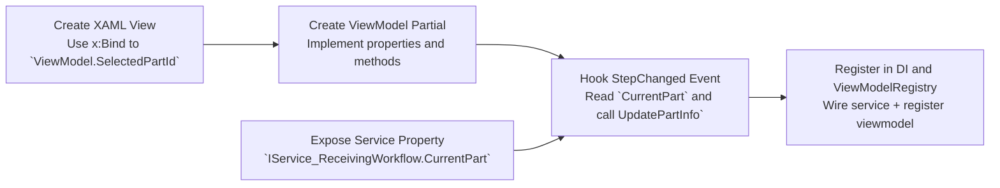

## Implementing the SelectedPart flow in a NEW View

**Overview**

This guide shows the exact steps to implement the `SelectedPart` display/update flow when you add a brand new view (page) to the app. The goal: when a user selects a part in PO Entry, the new view will present that part ID and related info using `x:Bind` and the existing `Service_ReceivingWorkflow` as the source of truth.

**Files you will create**
- `Module_Receiving/Views/View_MyNew_LoadEntry.xaml` — new XAML page (create from template)
- `Module_Receiving/ViewModels/ViewModel_MyNew_LoadEntry.cs` — partial ViewModel implementing required properties and commands

Detailed steps (simple, actionable):

1. Create the XAML view
   - Copy an existing `LoadEntry.xaml` as a template or create a new Page file.
   - Add a `DataContext` pattern consistent with project DI (the project uses ViewModel injection via registry).
   - Add UI element that displays the selected part ID: e.g., a TextBlock bound with `x:Bind ViewModel.SelectedPartId, Mode=OneWay`.

2. Create the ViewModel partial class
   - File: `Module_Receiving/ViewModels/ViewModel_MyNew_LoadEntry.cs`.
   - Inherit `ViewModel_Shared_Base` and register with `IService_ViewModelRegistry` in constructor (see `ViewModel_Receiving_LoadEntry` for pattern).
   - Add observable properties (CommunityToolkit attributes):
     - `[ObservableProperty] private string _selectedPartId = string.Empty;`
     - `[ObservableProperty] private string _selectedPartDescription = string.Empty;`
     - `[ObservableProperty] private int _numberOfLoads = 1;`
   - Add the same helper methods used by `LoadEntry`:
     - `public void UpdatePartInfo(string partId, string description)` — copies values into properties.
     - `private void OnStepChanged(object? sender, EventArgs e)` — check `_workflowService.CurrentStep == Enum_ReceivingWorkflowStep.LoadEntry`; if so, read `_workflowService.CurrentPart` and call `UpdatePartInfo`.
   - Copy or implement `RefreshRecommendedLocationsAsync()` if you need recommended-location behavior.

3. Wire to the service
   - Inject `IService_ReceivingWorkflow` into the new ViewModel constructor.
   - Subscribe to `_workflowService.StepChanged += OnStepChanged;` and call `OnStepChanged(null, EventArgs.Empty)` once during initialization to populate current state.

4. Register ViewModel and View (DI / registry)
   - Add a registration in the module's `Infrastructure/DependencyInjection/` registrations similar to existing ViewModels:
     - Register the new ViewModel as `AddTransient<ViewModel_MyNew_LoadEntry>()` (or appropriate lifetime).
     - Ensure the view is created by navigation or DI in the same pattern as other pages.
   - Call `_viewModelRegistry.Register(this);` inside the ViewModel constructor (pattern exists in other viewmodels).

5. Validate the service property
   - Confirm `IService_ReceivingWorkflow` interface exposes `Model_InforVisualPart? CurrentPart { get; set; }` (it does). No interface change required for read-only consumption.

6. Build and test
   - Build the solution: `dotnet build MTM_Receiving_Application.slnx`.
   - Launch the app, navigate to the PO Entry, select a part, then navigate to your new view. The `SelectedPartId` should display.

7. Optional: unit tests
   - Create unit tests for the new ViewModel using mocked `IService_ReceivingWorkflow` to assert `UpdatePartInfo` and `OnStepChanged` behavior.

Tips & pitfalls (short)
- Always use `x:Bind` in XAML for compile-time binding.
- Do not assign to the service's `CurrentPart` from your new view — PO entry is the authoritative setter.
- Use the `_viewModelRegistry` pattern to find and refresh other viewmodels if needed.
