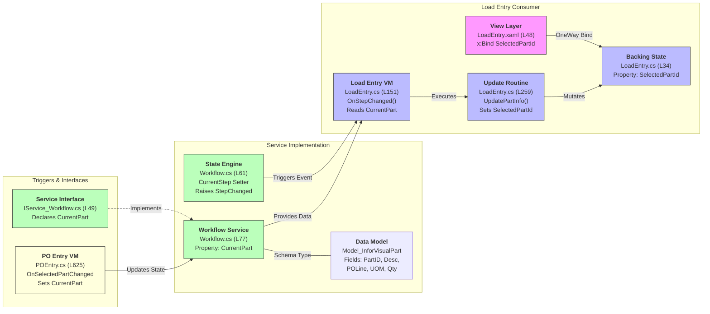

## View -> ViewModel -> Service flow for `SelectedPartId`

### Method anchors (key methods referenced above)

- View / XAML
  - No methods — UI binds to `ViewModel.SelectedPartId` via `x:Bind`.

- `ViewModel_Receiving_LoadEntry` (file: Module_Receiving/ViewModels/ViewModel_Receiving_LoadEntry.cs)
  - `OnStepChanged(object?, EventArgs)` — subscribed to `_workflowService.StepChanged`, updates UI state when `CurrentStep` becomes `LoadEntry`.
  - `UpdatePartInfo(string partId, string description)` — sets `SelectedPartId` and `SelectedPartDescription`.
  - `RefreshRecommendedLocationsAsync()` — asynchronous lookup of recommended locations using `_workflowService.CurrentPart` and `_workflowService.CurrentPONumber`.
  - `CreateLoadsAsync()` — validates `NumberOfLoads` and synchronizes `_workflowService.NumberOfLoads`.
  - `OnNumberOfLoadsChanged(int)` — partial change handler that sets `_workflowService.NumberOfLoads`.
  - `OnLocationChanged(string)` — partial change handler that sets `_workflowService.CurrentLocation`.
  - `ApplyRecommendedLocation(Model_ReceivingRecommendedLocation)` — helper command that sets `Location`.

- `ViewModel_Receiving_POEntry` (file: Module_Receiving/ViewModels/ViewModel_Receiving_POEntry.cs)
  - `OnSelectedPartChanged(Model_InforVisualPart?)` — assigns `_workflowService.CurrentPart = value`, sets `CurrentPODueDate` and `CurrentLocation` in the service, performs quality-hold checks, and notifies workflow buttons.
  - `CheckQualityHoldOnSelectedPartAsync(Model_InforVisualPart)` — warns and clears selection if restricted.
  - `InitializeAsync()` — initialization logic for PO entry (mock data auto-fill, etc.).

- `Service_ReceivingWorkflow` (file: Module_Receiving/Services/Service_ReceivingWorkflow.cs)
  - `StartWorkflowAsync()` — workflow init and step selection logic.
  - `AdvanceToNextStepAsync()` — validation and step transitions (sets `CurrentStep` and relies on `CurrentPart`).
  - `GenerateLoads()` — creates `Model_ReceivingLoad` objects based on `CurrentPart`, `NumberOfLoads`, and `CurrentLocation`.
  - `AddCurrentPartToSessionAsync()` — commits the current batch and resets PO/part inputs.
  - `SaveSessionAsync()` / `SaveToDatabaseOnlyAsync()` — final save workflows that consume `CurrentSession.Loads` produced by `GenerateLoads()`.
  - Property: `Model_InforVisualPart? CurrentPart { get; set; }` — the canonical source-of-truth for the selected part.

These method names are the implementation anchors you can open directly to inspect and follow the runtime flow when a user selects a part in PO entry and moves to LoadEntry.

**Notes / explanation of anchors included in the diagram**

- `View_Receiving_LoadEntry.xaml` — TextBlock showing part number bound to `ViewModel.SelectedPartId` (match at file line ~48).
- `ViewModel_Receiving_LoadEntry.cs` — backing field `_selectedPartId` (line 34), `OnStepChanged` subscribes to `_workflowService.StepChanged` (line ~151) and calls `UpdatePartInfo` (line ~259) which sets `SelectedPartId`.
- `IService_ReceivingWorkflow.cs` — declares `CurrentPart` (line 49) used as the upstream source for part info.
- `Service_ReceivingWorkflow.cs` — implements `CurrentPart` (line 77) and raises `StepChanged` when `CurrentStep` changes (setter at line 61).
- `ViewModel_Receiving_POEntry.cs` — when a user selects a part in the PO entry UI, `OnSelectedPartChanged` assigns `_workflowService.CurrentPart = value;` (line ~625), which is the originating action that eventually flows to the LoadEntry view.
- `Model_InforVisualPart` fields (part id, description, etc.) are read by `LoadEntry` to populate UI and recommended locations lookup.

