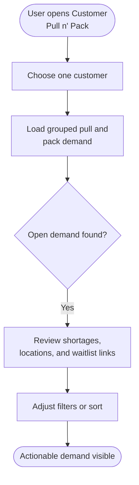
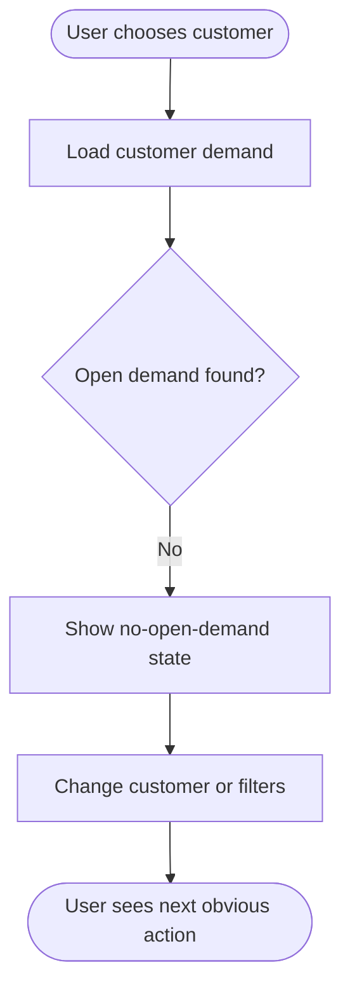
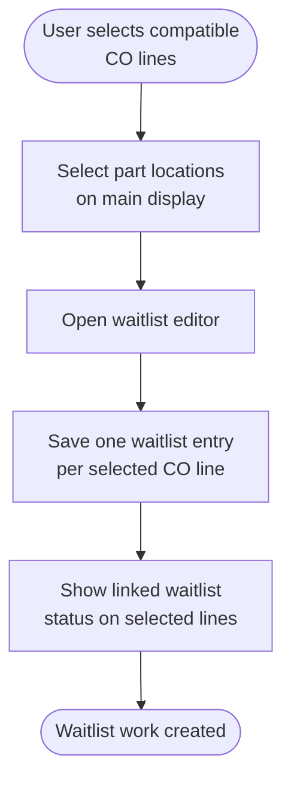
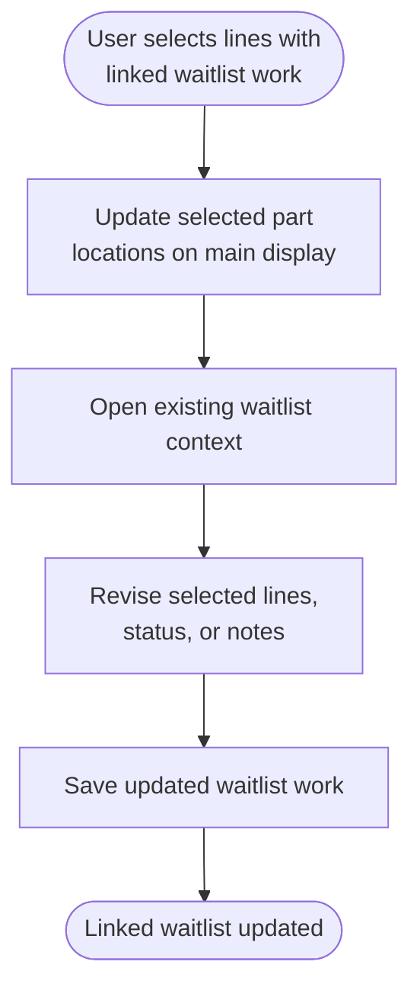
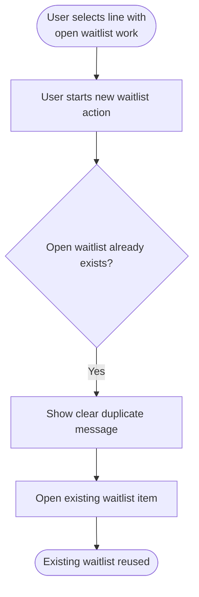
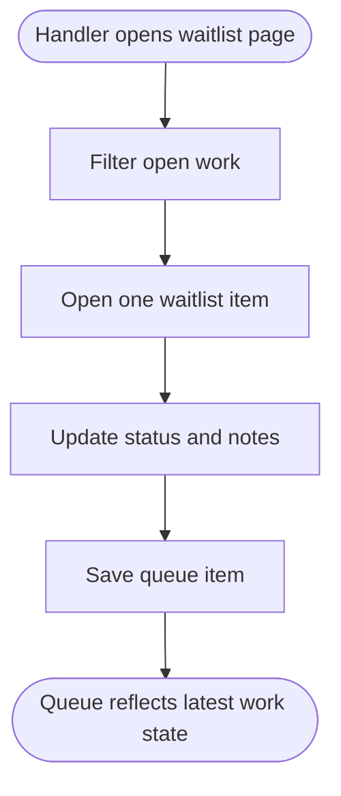
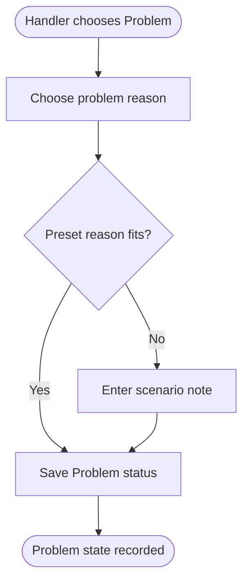
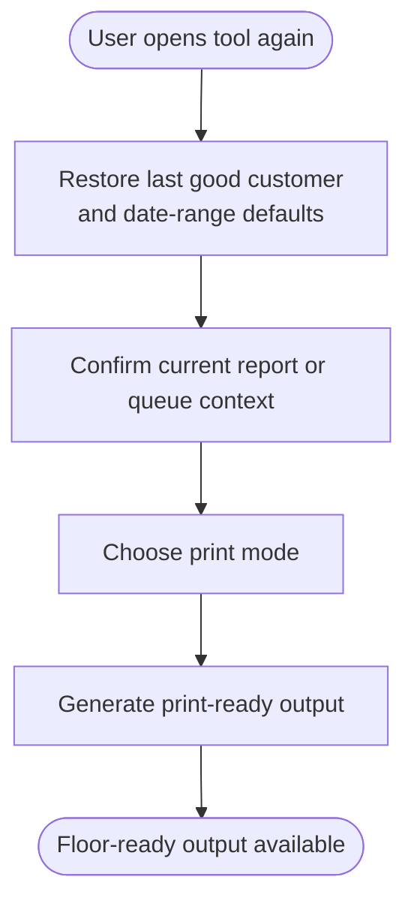

# Feature Specification: Customer Pull n' Pack Tool

**Feature Branch**: `[001-customer-pull-pack]`  
**Created**: 2026-05-21  
**Updated**: 2026-05-26  
**Status**: In Progress  
**Input**: User description: "Formalize the Customer Pull n' Pack Tool for Ship/Rec Tools using the attached review spec, mockup prompt, report references, and current mockup package, including no-typing waitlist creation from selected customer-order lines and part locations chosen from the main display."

## Clarifications

### Session 2026-05-21

- Q: When a requester selects multiple CO lines, does that become one waitlist record or several records created in one action? → A: One waitlist entry per selected CO line, saved in one batch action.
- Q: How should the system handle concurrent edits to the same waitlist entry by different users? → A: Last write wins silently, and each waitlist item should state who owns the line.
- Q: How does waitlist ownership get assigned and changed? → A: Ownership changes only when a material handler marks the item as Accepted, and the current material handler can un-assign themselves so another handler can take the line.
- Q: What should happen when no selectable part locations exist for the selected line? → A: Allow waitlist creation with no location selected, but require a note and flag the item for location review.
- Q: How should the no-location exception appear in queue status? → A: Keep the normal handler status separate and use only a distinct location-review flag.
- Q: What is the initial status for a newly created waitlist item before any material handler accepts it? → A: New waitlist items default to Requested.
- Q: What should happen when source demand or location data changes after a waitlist item was completed? → A: Keep the waitlist item completed. Show a requester-facing recheck indicator outside the waitlist state, and let the requester create a new request if needed.
- Q: After a material handler has accepted and owns the line, what can the requester still edit? → A: The requester can still add or edit requester-facing notes or context, but cannot change handler-owned operational fields.
- Q: What statuses should the default open-work queue include? → A: Requested, Accepted, and Problem.
- Q: Can a waitlist line have more than one status at a time? → A: No. Each line has exactly one current status, and setting a new status replaces the prior status.
- Q: What reason details are required when a handler sets a line to Problem? → A: The handler must supply a reason using preset options `Not in location`, `Incorrect Qty`, or `Incorrect Part Number`, and a note field must be available for scenarios where the presets do not fit.
- Q: What happens to ownership when a handler changes an owned line to Problem? → A: The line keeps its current owner until that handler explicitly un-assigns it or another explicit handoff happens.
- Q: Where should the user select part locations for a new or updated waitlist request? → A: Part locations are selected on the main display screen before the waitlist create or update window opens.
- Q: Which main-display control should act as the location selector? → A: The `SUB PARTS ON HAND` rows are the location-selection buttons.
- Q: Should available locations be auto-selected for a new request? → A: No. Available locations stay unselected unless the user explicitly chooses them, except when existing waitlist data is being reused.
- Q: What should happen if a user tries to create another open waitlist item for a source line that already has one? → A: Do not allow the duplicate request. Show a clear error message and route the user to the existing waitlist item instead.
- Q: How should the report mockup place waitlist actions and screenshot-derived helper panels? → A: Remove image-derived helper panels and place the report-to-waitlist actions in a dedicated row below the crystal-style report layout.

### Session 2026-05-25

- Q: Where should the always-available report actions live after the filter surface becomes collapsible? → A: Put clear, refresh, and waitlist actions in the collapsible panel header so they remain visible even when the filter body is collapsed.
- Q: What is the default state of the filter panel? → A: The filter panel starts collapsed by default.
- Q: How should the in-app crystal-style report be presented? → A: Use an embedded crystal-style report surface aligned to the legacy report layout, with request-line headers directly above the actionable rows.
- Q: How should report-line and location selection be shown? → A: The row itself is the selection target and selected state is communicated by row highlighting rather than checkbox-only affordances.
- Q: How should the application shell behave while this wide report is open? → A: The main window widens while Customer Pull n' Pack is active and returns to the standard shell size when the user leaves the tool.

### Session 2026-05-26

- Q: Should the waitlist remain report-hosted only, or become its own Ship/Rec tool entry? → A: It should become its own Ship/Rec tool entry and standalone page while the report keeps a `Show Waitlist` navigation action.
- Q: What should the standalone waitlist tool be called and how should it be categorized? → A: Use `Customer Pull n' Pack Waitlist` in the `Utilities` category.
- Q: How should `QTY SELECTED` be calculated? → A: It should equal the sum of selected sub-part quantities for the active parent-part group and should show `0` when nothing is selected.
- Q: How should selection behave across parent-part groups? → A: Only one parent-part group should be active at a time, and moving to another group clears the previous group's line and location selections.
- Q: How should the selectable sub-part rows be displayed? → A: Show a one-line `PART_ID • LOCATION_ID` presentation with part id left, separator centered, and location right.
- Q: How should the report status indicator be rendered? → A: Use simplified colored note labels `Normal`, `Shortage`, `Late Order`, and `Waitlist`, with priority `Shortage > Late Order > Waitlist/Recheck > Normal`.
- Q: What should happen when refresh or filter changes invalidate active selections? → A: Clear those selections and warn the user only when there were active selections to lose.

## User Scenarios & Testing *(mandatory)*

### User Story 1 - Review Daily Customer Demand (Priority: P1)

A warehouse or planning user opens the tool, selects one customer at a time, reviews current pull and pack demand in due-date order, identifies shortage conditions quickly, and can tell whether each actionable line already has related waitlist work from an in-app crystal-style report surface that mirrors the legacy grouped layout.

**Why this priority**: The report view is the entry point for the entire feature. If users cannot trust and work from the interactive demand view, the rest of the workflow provides no value.

**Independent Test**: Can be fully tested by selecting a customer with open demand, applying filters and sorting, and confirming that the user can identify actionable lines and shortage conditions without using any waitlist actions.

**Acceptance Scenarios**:

1. **Given** a user opens the tool, **When** they choose a customer with open demand, **Then** the system shows grouped pull and pack results for that single customer with shortage cues, location context, waitlist-link visibility, and request-line headers directly above the actionable rows.
2. **Given** the user changes filters or sort order, **When** the results refresh, **Then** the system preserves the one-customer scope and updates the visible lines to match the chosen criteria.
3. **Given** the user selects a customer with no open demand, **When** the tool finishes loading, **Then** the system shows a clear no-open-demand state instead of a blank results surface.
4. **Given** the user opens the tool, **When** the report page loads, **Then** the filter surface starts collapsed while the primary report actions remain visible in the collapsible panel header.
5. **Given** the user has active line or location selections, **When** they refresh the report or change filters and those selections are invalidated, **Then** the system clears the selections and warns that the prior line and location selections were cleared.

## User Story 1 Workflow Data

<!-- WORKFLOW_START: 1.1 --><!--
WORKFLOW: 1.1
TITLE: Review Customer Demand And Shortages
DIRECTION: TD
DEPENDS_ON: NONE
CONFLICTS_WITH: 1.2
INTERACTION: Primary happy path for opening the tool and reviewing actionable demand for one customer.

NODE: Start
TYPE: start
SHAPE: stadium
LABEL: User opens Customer Pull n' Pack

NODE: ChooseCustomer
TYPE: process
SHAPE: rect
LABEL: Choose one customer

NODE: LoadDemand
TYPE: process
SHAPE: rect
LABEL: Load grouped pull and pack demand

NODE: DemandExists
TYPE: decision
SHAPE: diamond
LABEL: Open demand found?

NODE: ReviewResults
TYPE: process
SHAPE: rect
LABEL: Review shortages, locations, and waitlist links

NODE: AdjustFilters
TYPE: process
SHAPE: rect
LABEL: Adjust filters or sort

NODE: ReviewEnd
TYPE: end
SHAPE: stadium
LABEL: Actionable demand visible

CONNECTION: Start -> ChooseCustomer
CONNECTION: ChooseCustomer -> LoadDemand
CONNECTION: LoadDemand -> DemandExists
CONNECTION: DemandExists -> ReviewResults [Yes]
CONNECTION: ReviewResults -> AdjustFilters
CONNECTION: AdjustFilters -> ReviewEnd
--><!-- WORKFLOW_END: 1.1 -->

<!-- WORKFLOW_START: 1.2 --><!--
WORKFLOW: 1.2
TITLE: Handle Customer With No Open Demand
DIRECTION: TD
DEPENDS_ON: NONE
CONFLICTS_WITH: 1.1
INTERACTION: Alternative report outcome when the selected customer is valid but currently has nothing to work.

NODE: Start
TYPE: start
SHAPE: stadium
LABEL: User chooses customer

NODE: LoadDemand
TYPE: process
SHAPE: rect
LABEL: Load customer demand

NODE: DemandExists
TYPE: decision
SHAPE: diamond
LABEL: Open demand found?

NODE: ShowEmptyState
TYPE: process
SHAPE: rect
LABEL: Show no-open-demand state

NODE: ChangeSelection
TYPE: process
SHAPE: rect
LABEL: Change customer or filters

NODE: EmptyEnd
TYPE: end
SHAPE: stadium
LABEL: User sees next obvious action

CONNECTION: Start -> LoadDemand
CONNECTION: LoadDemand -> DemandExists
CONNECTION: DemandExists -> ShowEmptyState [No]
CONNECTION: ShowEmptyState -> ChangeSelection
CONNECTION: ChangeSelection -> EmptyEnd
--><!-- WORKFLOW_END: 1.2 -->

## User Story 1 Workflow Diagrams

### Workflow 1.1: Review Customer Demand And Shortages

### Workflow 1.2: Handle Customer With No Open Demand

---

### User Story 2 - Create Waitlist Requests Without Typing Locations (Priority: P1)

A requester selects one or more compatible customer-order lines from the report, uses the `SUB PARTS ON HAND` rows on the main display as the location-selection buttons, and then creates or updates linked waitlist work without manually typing the location or quantity for a new request. A single save can process several selected lines, but it creates or updates one waitlist entry per selected customer-order line.

**Why this priority**: This is the main business addition beyond the interactive report. It turns report review into operational action and directly addresses the need to reduce manual entry for requesters.

**Independent Test**: Can be fully tested by selecting compatible lines and then clicking `SUB PARTS ON HAND` rows on the main display for one customer and parent part, creating a waitlist request from those selections, and confirming that a batch save creates or updates one linked waitlist record per selected line with the selected locations and derived quantities.

**Acceptance Scenarios**:

1. **Given** one or more compatible report lines are selected, **When** the user clicks one or more `SUB PARTS ON HAND` rows on the main display and saves, **Then** the system creates or updates one linked waitlist record per selected line without requiring manual location typing for a new request.
2. **Given** a selected line already has related waitlist work, **When** the user opens the request editor after selecting lines and part locations on the main display, **Then** the system shows the existing waitlist context and allows the user to update it from the same selection flow, reusing any previously saved locations when they exist.
3. **Given** compatible report lines are selected for a new request, **When** the main display first loads the available locations, **Then** the available locations remain unselected until the user explicitly clicks them.
4. **Given** a selected report line already has open waitlist work, **When** the user attempts to create another open request for that same source line, **Then** the system blocks the duplicate, shows a clear message, and directs the user to the existing waitlist item.
5. **Given** the selected lines do not belong to the same customer and parent part context, **When** the user attempts to combine them into one request, **Then** the system prevents the mixed selection from being saved as a single waitlist action.
6. **Given** the selected line has no selectable part locations on the main display, **When** the requester creates the waitlist item, **Then** the system allows the save only if the requester adds a note and the new item is flagged for location review.
7. **Given** the user is reviewing lines or `SUB PARTS ON HAND` rows on the report surface, **When** they select one or more rows, **Then** the selected state is communicated by highlighting the selected rows rather than relying on separate checkbox-only selection affordances.
8. **Given** one parent-part group is already active on the report, **When** the user interacts with a different parent-part group, **Then** the system clears the earlier group's line and location selections so only one parent-part group remains active at a time.

## User Story 2 Workflow Data

<!-- WORKFLOW_START: 2.1 --><!--
WORKFLOW: 2.1
TITLE: Create Waitlist From Selected Report Lines
DIRECTION: TD
DEPENDS_ON: 1.1
CONFLICTS_WITH: NONE
INTERACTION: Primary request-creation path that turns selected report lines into waitlist work.

NODE: Start
TYPE: start
SHAPE: stadium
LABEL: User selects compatible CO lines

NODE: SelectLocations
TYPE: process
SHAPE: rect
LABEL: Select part locations on main display

NODE: OpenEditor
TYPE: process
SHAPE: rect
LABEL: Open waitlist editor

NODE: SaveRequest
TYPE: process
SHAPE: rect
LABEL: Save one waitlist entry per selected CO line

NODE: ShowLinkedState
TYPE: process
SHAPE: rect
LABEL: Show linked waitlist status on selected lines

NODE: CreateEnd
TYPE: end
SHAPE: stadium
LABEL: Waitlist work created

CONNECTION: Start -> SelectLocations
CONNECTION: SelectLocations -> OpenEditor
CONNECTION: OpenEditor -> SaveRequest
CONNECTION: SaveRequest -> ShowLinkedState
CONNECTION: ShowLinkedState -> CreateEnd
--><!-- WORKFLOW_END: 2.1 -->

<!-- WORKFLOW_START: 2.2 --><!--
WORKFLOW: 2.2
TITLE: Update Existing Linked Waitlist Work
DIRECTION: TD
DEPENDS_ON: 1.1
CONFLICTS_WITH: NONE
INTERACTION: Alternative edit path when the selected lines already have related waitlist records.

NODE: Start
TYPE: start
SHAPE: stadium
LABEL: User selects lines with linked waitlist work

NODE: SelectLocations
TYPE: process
SHAPE: rect
LABEL: Update selected part locations on main display

NODE: OpenEditor
TYPE: process
SHAPE: rect
LABEL: Open existing waitlist context

NODE: ReviseSelection
TYPE: process
SHAPE: rect
LABEL: Revise selected lines, status, or notes

NODE: SaveUpdate
TYPE: process
SHAPE: rect
LABEL: Save updated waitlist work

NODE: UpdateEnd
TYPE: end
SHAPE: stadium
LABEL: Linked waitlist updated

CONNECTION: Start -> SelectLocations
CONNECTION: SelectLocations -> OpenEditor
CONNECTION: OpenEditor -> ReviseSelection
CONNECTION: ReviseSelection -> SaveUpdate
CONNECTION: SaveUpdate -> UpdateEnd
--><!-- WORKFLOW_END: 2.2 -->

<!-- WORKFLOW_START: 2.3 --><!--
WORKFLOW: 2.3
TITLE: Block Duplicate Open Waitlist Request
DIRECTION: TD
DEPENDS_ON: 1.1
CONFLICTS_WITH: NONE
INTERACTION: Prevents a second open waitlist item from being created for the same source line.

NODE: Start
TYPE: start
SHAPE: stadium
LABEL: User selects line with open waitlist work

NODE: AttemptCreate
TYPE: process
SHAPE: rect
LABEL: User starts new waitlist action

NODE: DuplicateCheck
TYPE: decision
SHAPE: diamond
LABEL: Open waitlist already exists?

NODE: ShowMessage
TYPE: process
SHAPE: rect
LABEL: Show clear duplicate message

NODE: OpenExisting
TYPE: process
SHAPE: rect
LABEL: Open existing waitlist item

NODE: DuplicateEnd
TYPE: end
SHAPE: stadium
LABEL: Existing waitlist reused

CONNECTION: Start -> AttemptCreate
CONNECTION: AttemptCreate -> DuplicateCheck
CONNECTION: DuplicateCheck -> ShowMessage [Yes]
CONNECTION: ShowMessage -> OpenExisting
CONNECTION: OpenExisting -> DuplicateEnd
--><!-- WORKFLOW_END: 2.3 -->

## User Story 2 Workflow Diagrams

### Workflow 2.1: Create Waitlist From Selected Report Lines

### Workflow 2.2: Update Existing Linked Waitlist Work

### Workflow 2.3: Block Duplicate Open Waitlist Request

---

### User Story 3 - Work The Dedicated Waitlist Queue (Priority: P2)

A material handler opens the dedicated waitlist page, filters Requested, Accepted, and Problem work by default, reviews one line at a time, updates the single current status and supporting notes, takes ownership by marking work Accepted, and can un-assign themselves if the work must be handed to another material handler.

**Why this priority**: The waitlist queue is the operational work surface for handlers. It needs to stand on its own so the report remains for review and request creation while execution happens in the queue.

**Independent Test**: Can be fully tested by opening the waitlist page with existing open work, filtering the queue, selecting one item, and saving status and notes through to completion or problem state.

**Acceptance Scenarios**:

1. **Given** Requested, Accepted, or Problem waitlist work exists, **When** the handler opens the queue or filters it by status, location, customer, or requester, **Then** the system updates the visible work list and keeps one selected item actionable.
2. **Given** the handler selects a queue item, **When** they save Accepted, Completed, Cancelled, or Problem status, **Then** the system replaces the line's prior current status with the newly chosen status and updates the waitlist record, audit details, and owner state according to that status.
3. **Given** the handler marks an item as Problem, **When** they save the update, **Then** the system requires either a preset Problem reason or a note when the preset reasons do not fit the scenario.
4. **Given** a handler currently owns a line and changes it to Problem, **When** they save the update, **Then** the line keeps that same owner until the handler explicitly un-assigns it or another explicit handoff occurs.
5. **Given** a handler currently owns an Accepted waitlist item, **When** they un-assign themselves, **Then** the item returns to an unowned state so another handler can take it.

## User Story 3 Workflow Data

<!-- WORKFLOW_START: 3.1 --><!--
WORKFLOW: 3.1
TITLE: Work Open Waitlist Queue Item
DIRECTION: TD
DEPENDS_ON: 2.1
CONFLICTS_WITH: NONE
INTERACTION: Primary handler execution path for accepted, completed, or cancelled work.

NODE: Start
TYPE: start
SHAPE: stadium
LABEL: Handler opens waitlist page

NODE: FilterQueue
TYPE: process
SHAPE: rect
LABEL: Filter open work

NODE: SelectItem
TYPE: process
SHAPE: rect
LABEL: Open one waitlist item

NODE: UpdateStatus
TYPE: process
SHAPE: rect
LABEL: Update status and notes

NODE: SaveItem
TYPE: process
SHAPE: rect
LABEL: Save queue item

NODE: QueueEnd
TYPE: end
SHAPE: stadium
LABEL: Queue reflects latest work state

CONNECTION: Start -> FilterQueue
CONNECTION: FilterQueue -> SelectItem
CONNECTION: SelectItem -> UpdateStatus
CONNECTION: UpdateStatus -> SaveItem
CONNECTION: SaveItem -> QueueEnd
--><!-- WORKFLOW_END: 3.1 -->

<!-- WORKFLOW_START: 3.2 --><!--
WORKFLOW: 3.2
TITLE: Save Problem Status With Required Reason
DIRECTION: TD
DEPENDS_ON: 2.1
CONFLICTS_WITH: NONE
INTERACTION: Problem-handling branch that keeps exception work explicit and auditable.

NODE: Start
TYPE: start
SHAPE: stadium
LABEL: Handler chooses Problem

NODE: ChooseReason
TYPE: process
SHAPE: rect
LABEL: Choose problem reason

NODE: ReasonFitsPreset
TYPE: decision
SHAPE: diamond
LABEL: Preset reason fits?

NODE: EnterNote
TYPE: process
SHAPE: rect
LABEL: Enter scenario note

NODE: SaveProblem
TYPE: process
SHAPE: rect
LABEL: Save Problem status

NODE: ProblemEnd
TYPE: end
SHAPE: stadium
LABEL: Problem state recorded

CONNECTION: Start -> ChooseReason
CONNECTION: ChooseReason -> ReasonFitsPreset
CONNECTION: ReasonFitsPreset -> SaveProblem [Yes]
CONNECTION: ReasonFitsPreset -> EnterNote [No]
CONNECTION: EnterNote -> SaveProblem
CONNECTION: SaveProblem -> ProblemEnd
--><!-- WORKFLOW_END: 3.2 -->

## User Story 3 Workflow Diagrams

### Workflow 3.1: Work Open Waitlist Queue Item

### Workflow 3.2: Save Problem Status With Required Reason

---

### User Story 4 - Print Operational Views And Resume With Saved Defaults (Priority: P3)

A daily user reopens the tool with remembered defaults, runs the same customer view they use most often, and produces print-ready report or pull-list output for floor use without rebuilding the entire working context from scratch.

**Why this priority**: Printing and saved defaults improve daily efficiency, but users can still get core value from the report and waitlist flows without them on day one.

**Independent Test**: Can be fully tested by setting defaults, reopening the tool, confirming the saved context is restored, and generating a print-ready current view or pull list from the active filtered selection.

**Acceptance Scenarios**:

1. **Given** a user has saved defaults or a last good working context, **When** they reopen the tool, **Then** the system restores the remembered customer and date-range behavior while still allowing a different customer to be chosen.
2. **Given** the user has an active filtered report or waitlist context, **When** they choose a print action, **Then** the system generates a print-ready output that preserves title, run context, filters, and shortage cues.
3. **Given** a pull-list print is requested, **When** the system prepares the output, **Then** each unique sub-part is presented with total needed, total on hand, and the chosen locations to pull from.

## User Story 4 Workflow Data

<!-- WORKFLOW_START: 4.1 --><!--
WORKFLOW: 4.1
TITLE: Resume With Saved Defaults And Print Current Work
DIRECTION: TD
DEPENDS_ON: 1.1, 3.1
CONFLICTS_WITH: NONE
INTERACTION: Supports the daily-use rhythm of reopening the tool quickly and producing floor-ready output from current work.

NODE: Start
TYPE: start
SHAPE: stadium
LABEL: User opens tool again

NODE: RestoreDefaults
TYPE: process
SHAPE: rect
LABEL: Restore last good customer and date-range defaults

NODE: ReviewContext
TYPE: process
SHAPE: rect
LABEL: Confirm current report or queue context

NODE: ChoosePrint
TYPE: process
SHAPE: rect
LABEL: Choose print mode

NODE: GeneratePrint
TYPE: process
SHAPE: rect
LABEL: Generate print-ready output

NODE: PrintEnd
TYPE: end
SHAPE: stadium
LABEL: Floor-ready output available

CONNECTION: Start -> RestoreDefaults
CONNECTION: RestoreDefaults -> ReviewContext
CONNECTION: ReviewContext -> ChoosePrint
CONNECTION: ChoosePrint -> GeneratePrint
CONNECTION: GeneratePrint -> PrintEnd
--><!-- WORKFLOW_END: 4.1 -->

## User Story 4 Workflow Diagrams

### Workflow 4.1: Resume With Saved Defaults And Print Current Work

---

### Edge Cases

- If a user selects a customer that exists but currently has no open demand, the system shows the no-open-demand state and keeps the customer and filter controls available for the next selection.
- If a user selects report lines from different parent parts or different customers and tries to create one waitlist action, the system blocks the batch action until the selection is reduced to one customer and one parent part context.
- If a user tries to create another open waitlist item for a source line that already has one, the system blocks the duplicate request, shows a clear message, and directs the user to the existing item.
- If no selectable part locations exist, the system still allows request creation, but it requires a note and flags the item for location review.
- If available part locations do exist, a new request begins with no locations selected until the user explicitly clicks one or more `SUB PARTS ON HAND` rows.
- If two users save changes to the same waitlist item, the most recent save overwrites the prior saved state, and the record continues to show the current owner and latest updater.
- If a handler marks an owned line as Problem, the line keeps that owner until the handler explicitly un-assigns it or another explicit handoff happens.
- If a handler un-assigns themselves from an Accepted line because they were reassigned elsewhere in the plant, the item returns to the unowned queue and remains available for another handler to accept.
- If the source demand or location picture changes after a waitlist item was marked Completed, the completed waitlist item remains completed and the system instead shows a requester-facing recheck indicator so a new request can be created if needed.
- After acceptance, requester edits are limited to requester-facing notes or context and do not alter handler-owned operational fields.
- Print generation calculates and includes all required printable fields even when some on-screen detail was not previously expanded by the user.

## Requirements *(mandatory)*

### Functional Requirements

- **FR-001**: The system MUST let users run the tool for one customer at a time from the full customer list, not only customers with current demand.
- **FR-002**: The system MUST show the selected customer using both customer identifier and customer name.
- **FR-003**: The system MUST present pull and pack demand in a grouped, due-date-driven results view that preserves shortage visibility and the current report's business meaning.
- **FR-003A**: While Customer Pull n' Pack is active, the application shell MUST widen enough to present the crystal-style grouped report clearly, and it MUST restore the standard shell size when the user leaves the tool.
- **FR-004**: The system MUST show, at minimum, pull date, customer order, parent part, location, ship quantity, quantity to pack, finished-goods availability, sub-part availability summary, shortage state, and waitlist state for actionable demand.
- **FR-004A**: The crystal-style request-line headers MUST appear directly above the rows they describe, and the grouped report layout MUST remain readable at the wide tool size without requiring the user to infer column meaning from a distant header band.
- **FR-004B**: The in-app report surface MUST use the MTM logo and keep report legend cues inside the report header rather than duplicating separate helper pills above the report body.
- **FR-005**: The system MUST allow users to sort and filter the demand view by customer, date range, shortage state, late-order state, part, location, waitlist state, pulled state, and requester-related work filters where applicable.
- **FR-005A**: The report filter surface MUST be collapsible and MUST default to the collapsed state when the page opens.
- **FR-005B**: Clear, refresh, and waitlist-oriented actions MUST remain visible in the collapsible filter header even when the filter body is collapsed.
- **FR-005C**: If refresh or filter changes invalidate active report selections, the system MUST clear those selections and warn the user only when there were active selections to lose.
- **FR-006**: The default sort order MUST remain pull date, then customer order, then parent part unless the user chooses a different sort.
- **FR-007**: The system MUST provide a clear no-open-demand state when the selected customer has no matching work instead of leaving the user on a blank report surface.
- **FR-008**: The system MUST let users select one or more report lines to work from the demand view.
- **FR-008A**: Report-line selection and `SUB PARTS ON HAND` location selection MUST use row-level selection visuals so the selected rows themselves become the interaction cue.
- **FR-009**: The system MUST only allow one batch waitlist creation or update action for report lines that share the same customer and parent part context.
- **FR-010**: The system MUST show whether each actionable report line already has related waitlist work and MUST allow the user to open the related waitlist context from the report side.
- **FR-011**: The system MUST let users create a new waitlist request from selected report lines without manually typing a requested location for the new request.
- **FR-012**: When creating or updating waitlist work, the system MUST let the user select available part locations directly from the main display screen before the waitlist create or update window opens.
- **FR-012A**: The `SUB PARTS ON HAND` rows on the main display MUST act as the location-selection controls for the waitlist workflow.
- **FR-012AA**: The selectable `SUB PARTS ON HAND` rows MUST display as a one-line `PART_ID • LOCATION_ID` presentation.
- **FR-012B**: For a new request, available part locations MUST remain unselected until the user explicitly chooses them.
- **FR-012C**: When updating an existing linked waitlist item, the main display MAY preselect locations that were already saved on that waitlist item.
- **FR-012D**: The report MUST allow only one active parent-part selection group at a time, and switching to another group MUST clear the previous group's line and location selections.
- **FR-013**: When creating a new waitlist request, the system MUST derive the requested quantity from the selected report lines rather than requiring manual quantity entry.
- **FR-014**: The system MUST allow users to update existing waitlist work from the report-side request editor when selected lines already have linked waitlist records.
- **FR-014A**: The system MUST NOT allow more than one open waitlist item for the same source report line at the same time.
- **FR-014B**: When a user attempts to create a duplicate open request for a source line that already has open waitlist work, the system MUST show a clear, easy-to-understand message and offer a path to open or update the existing waitlist item.
- **FR-015**: If no selectable part locations exist on the main display for a selected line, the system MUST still allow the requester to create the waitlist item without choosing a location, but only if the requester supplies a note.
- **FR-016**: Waitlist items created without a selectable location MUST be flagged for location review so handlers can identify them quickly in the queue.
- **FR-016A**: The location-review exception MUST NOT automatically change the waitlist item's normal handler status.
- **FR-017**: The system MUST store waitlist work as MTM-managed operational records that remain linked to the originating report lines but are separate from source-system demand records.
- **FR-018**: When a user saves multiple selected report lines in one action, the system MUST create or update one waitlist record per selected customer-order line rather than storing all selected lines inside a single queue item.
- **FR-019**: The system MUST capture, at minimum, customer, customer order, source row linkage, requested location selection made from the main display, parent part, requested quantity, requester identity, current line owner, request time, handler status, handler notes, location-review flag, completion identity and time, and last-updated identity and time for each waitlist record.
- **FR-020**: The system MUST support waitlist statuses of Requested, Accepted, Completed, Cancelled, and Problem for Phase 1 queue work.
- **FR-020A**: Newly created waitlist items MUST default to Requested status until a material handler explicitly accepts the line.
- **FR-020B**: Each waitlist line MUST have exactly one current status at a time, and setting a new status MUST replace the prior current status rather than appending an additional active status to the same line.
- **FR-021**: The system MUST provide a dedicated waitlist page where handlers can review, filter, and update open waitlist work without working directly from the report page.
- **FR-021A**: The dedicated waitlist page MUST also be exposed as its own Ship/Rec tool entry named `Customer Pull n' Pack Waitlist` in the `Utilities` category.
- **FR-021B**: The report page MUST keep a `Show Waitlist` navigation action that routes users to the standalone waitlist page.
- **FR-022**: The dedicated waitlist page MUST allow filtering by status, location, customer, and requester.
- **FR-022A**: The default open-work queue filter MUST show Requested, Accepted, and Problem items while excluding Completed and Cancelled items unless the user changes the filter.
- **FR-023**: Material handlers MUST be able to update waitlist entries created by other users when needed.
- **FR-024**: When a handler saves a waitlist item in Problem status, the system MUST require a reason before accepting the update.
- **FR-024A**: The Problem reason selector MUST offer preset options for `Not in location`, `Incorrect Qty`, and `Incorrect Part Number`.
- **FR-024B**: The system MUST provide a note field for Problem scenarios where the preset reasons do not fit, and that note MUST satisfy the required reason when no preset option applies.
- **FR-024C**: When a handler saves Problem status on a line they currently own, the system MUST retain that current owner until the handler explicitly un-assigns the line or another explicit handoff occurs.
- **FR-025**: When source demand or the related part-location picture changes after a waitlist item was marked Completed, the system MUST keep that waitlist item in Completed status rather than reopening it automatically.
- **FR-025A**: When source demand or location data changes after completion, the system MUST show a requester-facing recheck indicator outside the waitlist status model so the requester can decide whether to create a new waitlist item.
- **FR-026**: The system MUST support print-ready output for the current view, floor copy, shortage-only view, waitlist-only view, pull list, and a user-selected part or customer order context.
- **FR-027**: Print-ready output MUST preserve the report title, run date and time, active filters, and shortage cues while remaining understandable if printed without color.
- **FR-028**: Pull-list output MUST organize work by unique sub-part and show total quantity needed, total quantity on hand, and the chosen locations for each sub-part.
- **FR-029**: The system MUST calculate and include all printable fields before generating output, even if some data is loaded on demand during on-screen use.
- **FR-030**: The system MUST let users save default customer, date-range behavior, sort order, shortage and open-work filters, print preset, waitlist default status filter, and favorite customers.
- **FR-031**: The system MUST remember the user's last good customer and date-range context while still allowing them to override those defaults at runtime.
- **FR-032**: When two users edit the same waitlist entry, the system MUST accept the most recent save as the current record state and update the audit fields to reflect the final save.
- **FR-033**: The system MUST display the current owner for each waitlist entry anywhere that users review or work queue items.
- **FR-034**: The system MUST assign the current owner only when a material handler marks a waitlist item as Accepted.
- **FR-035**: After acceptance, the requester MUST still be allowed to add or edit requester-facing notes or context on the waitlist item.
- **FR-036**: After acceptance, the requester MUST NOT be allowed to change handler-owned operational fields such as ownership, accepted locations, handler status, or other execution-state fields.
- **FR-037**: Edits made by the requester or other users after acceptance MUST NOT automatically replace the current owner unless a material handler explicitly accepts the line again.
- **FR-038**: A material handler who currently owns an Accepted waitlist item MUST be able to un-assign themselves so the item returns to an unowned state and another handler can take it.

### Key Entities *(include if feature involves data)*

- **Customer Demand View**: The grouped operational results for one selected customer, including due-date-driven report lines, shortage context, finished-goods context, sub-part availability, and linked waitlist state.
- **Selectable Report Line**: One actionable customer-order line in the demand view, carrying the source context needed to create or update related waitlist work.
- **Waitlist Entry**: A separate MTM-managed work record linked to one selected report line, including selected pull locations from the main display or a no-location exception, requested quantity, requester details, one current handler status starting at Requested, current owner, requester-facing notes/context, handler-managed execution fields, Problem reason details, location-review flag, acceptance/unassignment ownership state, and audit history. A multi-line save creates multiple waitlist entries.
- **User Working Defaults**: The saved tool preferences and last good working context that reopen the feature in a familiar daily-use state.
- **Print Output Set**: A print-ready operational report or pull-list package generated from the user's current filtered demand or queue context.

### Assumptions

- A single waitlist creation or update action can include multiple report lines only when those lines belong to the same selected customer and the same parent part, and that batch action creates one waitlist entry per selected customer-order line.
- The report's displayed location and selectable location set live on the main display, the requester chooses the actual pull locations there by clicking `SUB PARTS ON HAND` rows, and a new selection starts unselected unless existing waitlist data is being reused.
- The visual design now assumes a collapsed-by-default filter expander with always-visible header actions, an embedded crystal-style grouped report surface, and row-highlight selection for both request lines and selectable location rows.
- For Phase 1, more granular exception outcomes such as partial or short are captured through notes and queue filters rather than separate status values beyond Accepted, Completed, Cancelled, and Problem.
- Ownership is independent from general edit access: requesters may continue editing their requests after acceptance, but ownership only changes through explicit handler acceptance or explicit handler un-assignment.
- Changing a line to Problem does not automatically clear ownership; ownership remains with the current handler until explicit un-assignment or another explicit handoff.
- After acceptance, requester edits are limited to requester-facing notes/context and do not change handler-owned operational fields.
- If no selectable part locations exist, request creation still proceeds as an exception path with a required note and a location-review flag.
- Completed waitlist items are historical workflow records; source-data changes after completion trigger requester-facing recheck context rather than automatic waitlist reopening.
- The location-review flag is independent from the normal handler status lifecycle.
- The default open-work queue is intended to show Requested, Accepted, and Problem work first, because those are the states that still need active attention.

### Dependencies

- Current customer demand, schedule, and inventory-location context must remain available from the source ERP in read-only form.
- MTM must be able to store waitlist records, audit fields, saved user defaults, and generated print contexts independently of the source ERP records.

## Success Criteria *(mandatory)*

### Measurable Outcomes

- **SC-001**: Users can open the tool, choose a customer, and reach either actionable demand results or a clear no-open-demand state in under 30 seconds.
- **SC-002**: At least 90% of new waitlist requests can be created without manual text entry for requested location or requested quantity.
- **SC-003**: At least 95% of daily queue updates can be completed from the dedicated waitlist page without returning to the report view.
- **SC-004**: Print-ready floor copy or pull-list output for the current filtered context is available within 60 seconds of the user choosing a print action.
- **SC-005**: 100% of report lines that have related waitlist work display that relationship and let the user reach the linked work context from the report side.
