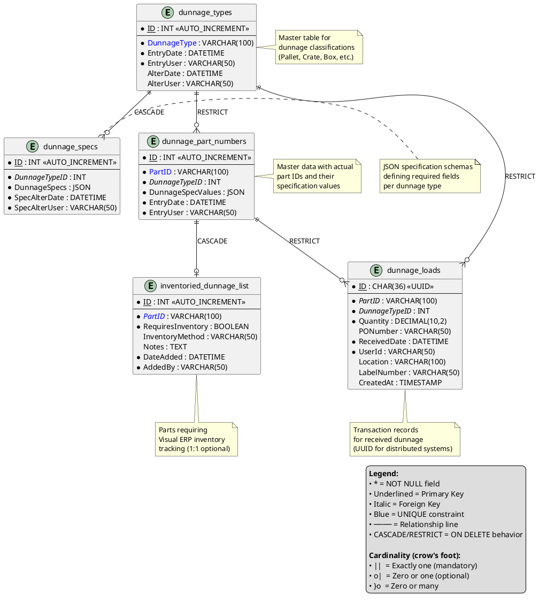

# Data Model: Dunnage Database Foundation

**Feature**: Dunnage Database Foundation  
**Date**: 2025-12-26  
**Version**: 1.0

## Overview

This data model defines the database schema for the dunnage receiving system, replacing the legacy Google Sheets-based `label_table_dunnage` with a modern, normalized Type/Part/Specs architecture. The design uses JSON for flexible specification storage while maintaining strong referential integrity through foreign key constraints.

## Entity Relationship Diagram



## Table Definitions

### 1. dunnage_types

**Purpose**: Master table storing dunnage type classifications (e.g., Pallet, Crate, Box).

**Schema**:

| Column | Data Type | Constraints | Description |
|--------|-----------|-------------|-------------|
| ID | INT | PRIMARY KEY, AUTO_INCREMENT | Unique identifier for each dunnage type |
| DunnageType | VARCHAR(100) | NOT NULL, UNIQUE | Name of the dunnage type (e.g., "Pallet", "Crate") |
| EntryDate | DATETIME | NOT NULL | Timestamp when the type was created |
| EntryUser | VARCHAR(50) | NOT NULL | Username of person who created the type |
| AlterDate | DATETIME | NULL | Timestamp of last modification |
| AlterUser | VARCHAR(50) | NULL | Username of person who last modified |

**Indexes**:
- PRIMARY KEY on `ID`
- UNIQUE INDEX on `DunnageType` (IDX-001)

**Sample Data** (11 default types):
- Pallet, Crate, Box, Skid, Foam, Shrink Wrap, Bubble Wrap, Gaylord, Foldable Crate, Wooden Crate, Plastic Totes

---

### 2. dunnage_specs

**Purpose**: Stores JSON specification schemas for each dunnage type (defines what fields are required for each type).

**Schema**:

| Column | Data Type | Constraints | Description |
|--------|-----------|-------------|-------------|
| ID | INT | PRIMARY KEY, AUTO_INCREMENT | Unique identifier for each spec record |
| DunnageTypeID | INT | FOREIGN KEY → dunnage_types.ID, NOT NULL | References the dunnage type |
| DunnageSpecs | JSON | NOT NULL | JSON schema defining required spec fields (e.g., `{"Width": "number", "Height": "number", "Depth": "number", "IsInventoriedToVisual": "boolean"}`) |
| SpecAlterDate | DATETIME | NOT NULL | Timestamp when spec was last modified |
| SpecAlterUser | VARCHAR(50) | NOT NULL | Username of person who last modified the spec |

**Foreign Keys**:
- `DunnageTypeID` → `dunnage_types.ID` (ON DELETE CASCADE)

**Indexes**:
- PRIMARY KEY on `ID`
- INDEX on `DunnageTypeID` (IDX-002)

**JSON Schema Example**:
```json
{
  "Width": { "type": "number", "unit": "inches", "required": true },
  "Height": { "type": "number", "unit": "inches", "required": true },
  "Depth": { "type": "number", "unit": "inches", "required": true },
  "IsInventoriedToVisual": { "type": "boolean", "required": true }
}
```

**Note**: All dimensional measurements are standardized to inches. Application UI must display unit labels to users.

---

### 3. dunnage_part_numbers

**Purpose**: Master data table storing actual part IDs with their specification values.

**Schema**:

| Column | Data Type | Constraints | Description |
|--------|-----------|-------------|-------------|
| ID | INT | PRIMARY KEY, AUTO_INCREMENT | Unique identifier for each part record |
| PartID | VARCHAR(100) | NOT NULL, UNIQUE | Part number (e.g., "PALLET-48X40-WOOD") |
| DunnageTypeID | INT | FOREIGN KEY → dunnage_types.ID, NOT NULL | References the dunnage type |
| DunnageSpecValues | JSON | NOT NULL | JSON object with actual spec values (e.g., `{"Width": 48, "Height": 40, "Depth": 6, "IsInventoriedToVisual": true}`) |
| EntryDate | DATETIME | NOT NULL | Timestamp when part was created |
| EntryUser | VARCHAR(50) | NOT NULL | Username of person who created the part |

**Foreign Keys**:
- `DunnageTypeID` → `dunnage_types.ID` (ON DELETE RESTRICT - cannot delete type with existing parts)

**Indexes**:
- PRIMARY KEY on `ID`
- UNIQUE INDEX on `PartID` (IDX-003)
- INDEX on `DunnageTypeID` (IDX-004)

**JSON Values Example**:
```json
{
  "Width": 48,
  "Height": 40,
  "Depth": 6,
  "IsInventoriedToVisual": true
}
```

---

### 4. dunnage_loads

**Purpose**: Transaction table for received dunnage loads (one record per receiving event).

**Schema**:

| Column | Data Type | Constraints | Description |
|--------|-----------|-------------|-------------|
| ID | CHAR(36) | PRIMARY KEY | UUID for unique transaction identification |
| PartID | VARCHAR(100) | FOREIGN KEY → dunnage_part_numbers.PartID, NOT NULL | References the part received |
| DunnageTypeID | INT | FOREIGN KEY → dunnage_types.ID, NOT NULL | References the dunnage type (denormalized for query performance) |
| Quantity | DECIMAL(10,2) | NOT NULL | Quantity received (must be > 0, enforced in application layer) |
| PONumber | VARCHAR(50) | NULL | Purchase order number (if applicable) |
| ReceivedDate | DATETIME | NOT NULL | Timestamp when dunnage was received |
| UserId | VARCHAR(50) | NOT NULL | Username of person who received the dunnage |
| Location | VARCHAR(100) | NULL | Receiving location |
| LabelNumber | VARCHAR(50) | NULL | Label number generated for this load |
| CreatedAt | TIMESTAMP | DEFAULT CURRENT_TIMESTAMP | Automatic record creation timestamp |

**Foreign Keys**:
- `PartID` → `dunnage_part_numbers.PartID` (ON DELETE RESTRICT - cannot delete part with transaction history)
- `DunnageTypeID` → `dunnage_types.ID` (ON DELETE RESTRICT - cannot delete type with transactions)

**Indexes**:
- PRIMARY KEY on `ID`
- INDEX on `PartID` (IDX-005)
- INDEX on `ReceivedDate` (IDX-006)
- INDEX on `PONumber` (IDX-007)
- INDEX on `UserId` (IDX-008)

**Constraints** (Application Layer):
- `Quantity` must be > 0 (MySQL 5.7.24 does not support CHECK constraints)

---

### 5. inventoried_dunnage_list

**Purpose**: Reference table for parts requiring Visual ERP inventory tracking.

**Schema**:

| Column | Data Type | Constraints | Description |
|--------|-----------|-------------|-------------|
| ID | INT | PRIMARY KEY, AUTO_INCREMENT | Unique identifier |
| PartID | VARCHAR(100) | FOREIGN KEY → dunnage_part_numbers.PartID, NOT NULL, UNIQUE | Part requiring inventory tracking |
| RequiresInventory | BOOLEAN | NOT NULL | Flag indicating if inventory tracking is required (always TRUE for records in this table) |
| InventoryMethod | VARCHAR(50) | NULL | Method of inventory tracking (e.g., "Cycle Count", "Min/Max") |
| Notes | TEXT | NULL | Additional notes about inventory requirements |
| DateAdded | DATETIME | NOT NULL | Timestamp when part was added to inventory list |
| AddedBy | VARCHAR(50) | NOT NULL | Username of person who added the part |

**Foreign Keys**:
- `PartID` → `dunnage_part_numbers.PartID` (ON DELETE CASCADE - if part is deleted, remove from inventory list)

**Indexes**:
- PRIMARY KEY on `ID`
- UNIQUE INDEX on `PartID` (IDX-009)

---

## Database Constraints Summary

### Unique Constraints
- **UC-001**: `dunnage_types.DunnageType` UNIQUE
- **UC-002**: `dunnage_part_numbers.PartID` UNIQUE
- **UC-003**: `inventoried_dunnage_list.PartID` UNIQUE

### Foreign Key Constraints
- **FK-001**: `dunnage_specs.DunnageTypeID` → `dunnage_types.ID` (CASCADE DELETE)
- **FK-002**: `dunnage_part_numbers.DunnageTypeID` → `dunnage_types.ID` (RESTRICT DELETE)
- **FK-003**: `dunnage_loads.PartID` → `dunnage_part_numbers.PartID` (RESTRICT DELETE)
- **FK-004**: `dunnage_loads.DunnageTypeID` → `dunnage_types.ID` (RESTRICT DELETE)
- **FK-005**: `inventoried_dunnage_list.PartID` → `dunnage_part_numbers.PartID` (CASCADE DELETE)

### Check Constraints (Application Layer)
- **CK-001**: `dunnage_loads.Quantity` > 0 (enforced in application code due to MySQL 5.7.24 limitations)

---

## Indexing Strategy

| Index ID | Table | Column(s) | Purpose |
|----------|-------|-----------|---------|
| IDX-001 | dunnage_types | DunnageType | Fast type lookups by name |
| IDX-002 | dunnage_specs | DunnageTypeID | Fast spec retrieval per type |
| IDX-003 | dunnage_part_numbers | PartID | Fast part lookups (most common query) |
| IDX-004 | dunnage_part_numbers | DunnageTypeID | Filtered queries by type |
| IDX-005 | dunnage_loads | PartID | Transaction history per part |
| IDX-006 | dunnage_loads | ReceivedDate | Date range filtering for reports |
| IDX-007 | dunnage_loads | PONumber | PO-based searches |
| IDX-008 | dunnage_loads | UserId | User-specific query performance |
| IDX-009 | inventoried_dunnage_list | PartID | Fast inventory checks |

---

## JSON Data Standards

### Specification Schema Format (dunnage_specs.DunnageSpecs)

Defines the required fields and their data types for a dunnage type:

```json
{
  "FieldName": {
    "type": "number | string | boolean",
    "unit": "inches | N/A",
    "required": true | false,
    "description": "Field description"
  }
}
```

**Default Schema for All Types**:
```json
{
  "Width": { "type": "number", "unit": "inches", "required": true },
  "Height": { "type": "number", "unit": "inches", "required": true },
  "Depth": { "type": "number", "unit": "inches", "required": true },
  "IsInventoriedToVisual": { "type": "boolean", "required": true }
}
```

### Specification Values Format (dunnage_part_numbers.DunnageSpecValues)

Stores actual values for each field defined in the schema:

```json
{
  "Width": 48,
  "Height": 40,
  "Depth": 6,
  "IsInventoriedToVisual": true
}
```

**Validation Rules**:
- All `required: true` fields from schema must be present
- Data types must match schema definition
- Dimensional values must be positive numbers
- Application layer validates JSON structure against schema

---

## Data Integrity Rules

1. **Referential Integrity**: All foreign keys are enforced at database level
2. **Cascade Deletes**: Only for dependent metadata (specs, inventory flags)
3. **Restrict Deletes**: For master data with transaction history (parts, types with parts/loads)
4. **Unique Constraints**: Prevent duplicate type names and part IDs
5. **Hard Deletes**: No soft delete columns - records are permanently removed
6. **Audit Trail**: EntryUser/AlterUser/AddedBy fields track data ownership
7. **JSON Validation**: MySQL validates JSON syntax; application validates schema compliance

---

## Migration Notes

- **Legacy Table**: `label_table_dunnage` will be dropped during migration
- **No Data Migration**: This is a clean-slate implementation
- **Idempotent Scripts**: Migration can be re-run safely (DROP IF EXISTS patterns)
- **Seed Data**: 11 default dunnage types with standard specs will be created automatically
- **Backward Compatibility**: None - legacy system is completely replaced

---

## Performance Considerations

- **Target Volume**: 100,000+ transaction records in `dunnage_loads`
- **Query Performance**: Sub-second response with proper indexing
- **JSON Indexing**: MySQL 5.7.24 does not support generated columns for JSON indexing - filter in application layer
- **Denormalization**: `DunnageTypeID` in `dunnage_loads` avoids JOIN for common queries
- **Connection Pooling**: Application layer will manage connection pooling

---

## Future Extensibility

- **Additional Spec Fields**: JSON schema allows adding new fields without schema changes
- **Custom Dunnage Types**: Users can add new types beyond the 11 defaults
- **Stored Procedures**: Future features will add CRUD procedures (not in this scope)
- **Audit Tables**: Future feature may add change tracking (not in this scope)
- **Report Views**: Future features may add materialized views for analytics
