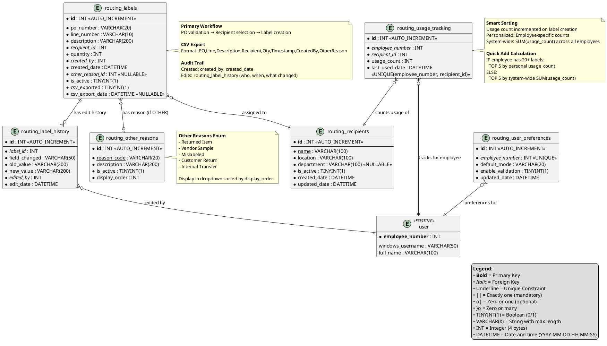

# Data Model: Routing Module

**Feature**: 001-routing-module  
**Date**: 2026-01-04  
**Database**: mtm_receiving_application (MySQL 8.x, 5.7.24 compatible)

This document defines the database schema for the Internal Routing Module with entity relationships, field specifications, and stored procedure contracts.

## Entity Relationship Diagram



## Table Definitions

### routing_labels

**Purpose**: Primary table storing internal routing labels created by users.

| Column | Type | Constraints | Description |
|--------|------|-------------|-------------|
| `id` | INT | PRIMARY KEY, AUTO_INCREMENT | Unique label identifier |
| `po_number` | VARCHAR(20) | NOT NULL | PO number or "OTHER" for non-PO packages |
| `line_number` | VARCHAR(10) | NOT NULL | Line item number or "0" for OTHER |
| `description` | VARCHAR(200) | NOT NULL | Part description (from Visual or manual entry) |
| `recipient_id` | INT | NOT NULL, FK→routing_recipients.id | Recipient who will receive the package |
| `quantity` | INT | NOT NULL | Quantity of items on label |
| `created_by` | INT | NOT NULL, FK→user.employee_number | Employee who created the label |
| `created_date` | DATETIME | NOT NULL, DEFAULT CURRENT_TIMESTAMP | Timestamp of label creation |
| `other_reason_id` | INT | NULL, FK→routing_other_reasons.id | Reason code if po_number='OTHER' |
| `is_active` | TINYINT(1) | NOT NULL, DEFAULT 1 | Soft delete flag (0=deleted, 1=active) |
| `csv_exported` | TINYINT(1) | NOT NULL, DEFAULT 0 | Whether exported to CSV file |
| `csv_export_date` | DATETIME | NULL | Timestamp of CSV export |

**Indexes**:
- PRIMARY KEY: `id`
- INDEX: `idx_po_number` (`po_number`)
- INDEX: `idx_created_by` (`created_by`)
- INDEX: `idx_created_date` (`created_date`)
- INDEX: `idx_recipient_id` (`recipient_id`)
- FOREIGN KEY: `fk_label_recipient` (`recipient_id` → `routing_recipients.id`)
- FOREIGN KEY: `fk_label_created_by` (`created_by` → `user.employee_number`)
- FOREIGN KEY: `fk_label_other_reason` (`other_reason_id` → `routing_other_reasons.id`)

**Validation Rules (Stored Procedure)**:
- `quantity` > 0
- `po_number` NOT empty
- `recipient_id` must reference active recipient (is_active=1)
- If `po_number` = 'OTHER', then `other_reason_id` must NOT be NULL
- If `po_number` != 'OTHER', then `other_reason_id` should be NULL

---

### routing_recipients

**Purpose**: Master table of people/departments that can receive packages.

| Column | Type | Constraints | Description |
|--------|------|-------------|-------------|
| `id` | INT | PRIMARY KEY, AUTO_INCREMENT | Unique recipient identifier |
| `name` | VARCHAR(100) | NOT NULL, UNIQUE | Recipient name (person or department) |
| `location` | VARCHAR(100) | NOT NULL | Physical location (e.g., "Building A - Floor 2") |
| `department` | VARCHAR(100) | NULL | Department name (optional) |
| `is_active` | TINYINT(1) | NOT NULL, DEFAULT 1 | Active status (0=inactive, 1=active) |
| `created_date` | DATETIME | NOT NULL, DEFAULT CURRENT_TIMESTAMP | Timestamp of recipient creation |
| `updated_date` | DATETIME | NOT NULL, DEFAULT CURRENT_TIMESTAMP ON UPDATE CURRENT_TIMESTAMP | Last update timestamp |

**Indexes**:
- PRIMARY KEY: `id`
- UNIQUE INDEX: `idx_unique_name` (`name`)
- INDEX: `idx_is_active` (`is_active`)

**Validation Rules**:
- `name` must be unique (case-insensitive)
- `name` and `location` NOT empty

**Note**: Recipients are soft-deleted (is_active=0) to preserve historical label references.

---

### routing_other_reasons

**Purpose**: Enumerated list of reasons for non-PO packages (po_number='OTHER').

| Column | Type | Constraints | Description |
|--------|------|-------------|-------------|
| `id` | INT | PRIMARY KEY, AUTO_INCREMENT | Unique reason identifier |
| `reason_code` | VARCHAR(20) | NOT NULL, UNIQUE | Short code (e.g., "RETURNED", "SAMPLE") |
| `description` | VARCHAR(200) | NOT NULL | User-facing description (e.g., "Returned Item") |
| `is_active` | TINYINT(1) | NOT NULL, DEFAULT 1 | Active status (0=inactive, 1=active) |
| `display_order` | INT | NOT NULL, DEFAULT 999 | Sort order for dropdown display (lower = first) |

**Indexes**:
- PRIMARY KEY: `id`
- UNIQUE INDEX: `idx_unique_reason_code` (`reason_code`)
- INDEX: `idx_display_order` (`display_order`)

**Seed Data** (initial values):
```sql
INSERT INTO routing_other_reasons (reason_code, description, display_order) VALUES
('RETURNED', 'Returned Item', 1),
('SAMPLE', 'Vendor Sample', 2),
('MISLABELED', 'Mislabeled Package', 3),
('CUSTOMER_RETURN', 'Customer Return', 4),
('INTERNAL_TRANSFER', 'Internal Transfer', 5);
```

---

### routing_usage_tracking

**Purpose**: Tracks how frequently each employee selects each recipient (for personalized Quick Add and smart sorting).

| Column | Type | Constraints | Description |
|--------|------|-------------|-------------|
| `id` | INT | PRIMARY KEY, AUTO_INCREMENT | Unique tracking record identifier |
| `employee_number` | INT | NOT NULL, FK→user.employee_number | Employee being tracked |
| `recipient_id` | INT | NOT NULL, FK→routing_recipients.id | Recipient being tracked |
| `usage_count` | INT | NOT NULL, DEFAULT 0 | Number of times employee selected this recipient |
| `last_used_date` | DATETIME | NOT NULL | Timestamp of most recent usage |

**Indexes**:
- PRIMARY KEY: `id`
- UNIQUE INDEX: `idx_unique_employee_recipient` (`employee_number`, `recipient_id`)
- INDEX: `idx_employee_number` (`employee_number`)
- INDEX: `idx_recipient_id` (`recipient_id`)
- FOREIGN KEY: `fk_usage_employee` (`employee_number` → `user.employee_number`)
- FOREIGN KEY: `fk_usage_recipient` (`recipient_id` → `routing_recipients.id`)

**Update Pattern**:
```sql
-- On label creation, increment usage count
INSERT INTO routing_usage_tracking (employee_number, recipient_id, usage_count, last_used_date)
VALUES (12345, 67, 1, NOW())
ON DUPLICATE KEY UPDATE
    usage_count = usage_count + 1,
    last_used_date = NOW();
```

---

### routing_user_preferences

**Purpose**: Stores per-user preferences for default mode and validation toggle.

| Column | Type | Constraints | Description |
|--------|------|-------------|-------------|
| `id` | INT | PRIMARY KEY, AUTO_INCREMENT | Unique preference record identifier |
| `employee_number` | INT | NOT NULL, UNIQUE, FK→user.employee_number | Employee owning these preferences |
| `default_mode` | VARCHAR(20) | NOT NULL, DEFAULT 'WIZARD' | Default mode: 'WIZARD', 'MANUAL', or 'EDIT' |
| `enable_validation` | TINYINT(1) | NOT NULL, DEFAULT 1 | Infor Visual validation (1=on, 0=off) |
| `updated_date` | DATETIME | NOT NULL, DEFAULT CURRENT_TIMESTAMP ON UPDATE CURRENT_TIMESTAMP | Last update timestamp |

**Indexes**:
- PRIMARY KEY: `id`
- UNIQUE INDEX: `idx_unique_employee` (`employee_number`)
- FOREIGN KEY: `fk_prefs_employee` (`employee_number` → `user.employee_number`)

**Validation Rules**:
- `default_mode` IN ('WIZARD', 'MANUAL', 'EDIT')
- `enable_validation` IN (0, 1)

---

### routing_label_history

**Purpose**: Audit trail for edited labels (tracks who edited, when, and what changed).

| Column | Type | Constraints | Description |
|--------|------|-------------|-------------|
| `id` | INT | PRIMARY KEY, AUTO_INCREMENT | Unique history record identifier |
| `label_id` | INT | NOT NULL, FK→routing_labels.id | Label that was edited |
| `field_changed` | VARCHAR(50) | NOT NULL | Field name (e.g., "recipient_id", "quantity") |
| `old_value` | VARCHAR(200) | NULL | Previous value (as string) |
| `new_value` | VARCHAR(200) | NULL | New value (as string) |
| `edited_by` | INT | NOT NULL, FK→user.employee_number | Employee who made the edit |
| `edit_date` | DATETIME | NOT NULL, DEFAULT CURRENT_TIMESTAMP | Timestamp of edit |

**Indexes**:
- PRIMARY KEY: `id`
- INDEX: `idx_label_id` (`label_id`)
- INDEX: `idx_edited_by` (`edited_by`)
- INDEX: `idx_edit_date` (`edit_date`)
- FOREIGN KEY: `fk_history_label` (`label_id` → `routing_labels.id`)
- FOREIGN KEY: `fk_history_edited_by` (`edited_by` → `user.employee_number`)

**Usage Pattern**:
```sql
-- On label edit, insert history record for each changed field
INSERT INTO routing_label_history (label_id, field_changed, old_value, new_value, edited_by)
VALUES (123, 'recipient_id', '10', '15', 6789);
```

---

## Stored Procedure Contracts

### Label Management

#### sp_routing_label_insert
**Purpose**: Insert a new routing label

**Parameters**:
- IN `p_po_number` VARCHAR(20)
- IN `p_line_number` VARCHAR(10)
- IN `p_description` VARCHAR(200)
- IN `p_recipient_id` INT
- IN `p_quantity` INT
- IN `p_created_by` INT
- IN `p_other_reason_id` INT (NULL if not OTHER)
- OUT `p_label_id` INT (new label ID)
- OUT `p_status` INT (1=success, -1=failure)
- OUT `p_error_msg` VARCHAR(500)

**Business Logic**:
- Validate quantity > 0
- Validate recipient is active
- If po_number='OTHER', require other_reason_id
- Check for duplicate label (same PO, Line, Recipient, Date)
- Insert label record
- Increment usage tracking (sp_routing_usage_tracking_increment)
- Return new label ID

---

#### sp_routing_label_update
**Purpose**: Update an existing label (Edit Mode)

**Parameters**:
- IN `p_label_id` INT
- IN `p_description` VARCHAR(200)
- IN `p_recipient_id` INT
- IN `p_quantity` INT
- IN `p_edited_by` INT
- OUT `p_status` INT
- OUT `p_error_msg` VARCHAR(500)

**Business Logic**:
- Fetch current label values
- Compare each field, log changes to routing_label_history
- Update label record
- Set csv_exported=0 (requires re-export)
- Return success/failure

---

#### sp_routing_label_get_by_id
**Purpose**: Retrieve a single label by ID

**Parameters**:
- IN `p_label_id` INT

**Returns**: Single row with all label fields + recipient name

---

#### sp_routing_label_get_history
**Purpose**: Retrieve all labels, sorted by date DESC (Edit Mode grid)

**Parameters**:
- IN `p_limit` INT (pagination)
- IN `p_offset` INT (pagination)

**Returns**: Rows with label details + recipient name, sorted by created_date DESC

---

#### sp_routing_label_check_duplicate
**Purpose**: Check if identical label exists (prevent duplicates)

**Parameters**:
- IN `p_po_number` VARCHAR(20)
- IN `p_line_number` VARCHAR(10)
- IN `p_recipient_id` INT
- IN `p_created_date` DATE
- OUT `p_exists` TINYINT(1) (1=duplicate found, 0=unique)
- OUT `p_existing_label_id` INT (ID of duplicate, if found)

**Business Logic**:
- Search for label with matching PO, Line, Recipient, and same calendar day
- Return 1 if found, 0 if unique

---

### Recipient Management

#### sp_routing_recipient_get_all
**Purpose**: Retrieve all recipients (including inactive)

**Returns**: All recipient rows

---

#### sp_routing_recipient_get_active
**Purpose**: Retrieve active recipients sorted by usage count

**Parameters**:
- IN `p_employee_number` INT

**Returns**: Recipient rows (is_active=1) with usage_count (personalized for employee), sorted by usage_count DESC

**SQL Pattern**:
```sql
SELECT r.id, r.name, r.location, COALESCE(ut.usage_count, 0) AS usage_count
FROM routing_recipients r
LEFT JOIN routing_usage_tracking ut ON r.id = ut.recipient_id AND ut.employee_number = p_employee_number
WHERE r.is_active = 1
ORDER BY usage_count DESC, r.name ASC;
```

---

### Usage Tracking

#### sp_routing_usage_tracking_increment
**Purpose**: Increment usage count for employee-recipient pair

**Parameters**:
- IN `p_employee_number` INT
- IN `p_recipient_id` INT
- OUT `p_status` INT
- OUT `p_error_msg` VARCHAR(500)

**Business Logic**:
- INSERT INTO routing_usage_tracking ... ON DUPLICATE KEY UPDATE usage_count = usage_count + 1

---

#### sp_routing_usage_tracking_get_top_recipients
**Purpose**: Get top 5 recipients for Quick Add buttons

**Parameters**:
- IN `p_employee_number` INT

**Returns**: 5 rows (recipient_id, name, usage_count)

**Business Logic**:
- Count labels created by employee
- IF count >= 20: Return top 5 by personal usage_count
- ELSE: Return top 5 by system-wide SUM(usage_count)

**SQL Pattern**:
```sql
-- Check employee label count
SELECT COUNT(*) INTO @label_count
FROM routing_labels
WHERE created_by = p_employee_number;

IF @label_count >= 20 THEN
    -- Personalized
    SELECT r.id, r.name, ut.usage_count
    FROM routing_recipients r
    INNER JOIN routing_usage_tracking ut ON r.id = ut.recipient_id
    WHERE ut.employee_number = p_employee_number AND r.is_active = 1
    ORDER BY ut.usage_count DESC
    LIMIT 5;
ELSE
    -- System-wide
    SELECT r.id, r.name, SUM(ut.usage_count) AS total_usage
    FROM routing_recipients r
    INNER JOIN routing_usage_tracking ut ON r.id = ut.recipient_id
    WHERE r.is_active = 1
    GROUP BY r.id, r.name
    ORDER BY total_usage DESC
    LIMIT 5;
END IF;
```

---

### User Preferences

#### sp_routing_user_preference_get
**Purpose**: Retrieve user preferences (or defaults if not set)

**Parameters**:
- IN `p_employee_number` INT

**Returns**: Single row (default_mode, enable_validation)

**Business Logic**:
- If record exists, return it
- Else return defaults: default_mode='WIZARD', enable_validation=1

---

#### sp_routing_user_preference_upsert
**Purpose**: Create or update user preferences

**Parameters**:
- IN `p_employee_number` INT
- IN `p_default_mode` VARCHAR(20)
- IN `p_enable_validation` TINYINT(1)
- OUT `p_status` INT
- OUT `p_error_msg` VARCHAR(500)

**Business Logic**:
- Validate default_mode IN ('WIZARD', 'MANUAL', 'EDIT')
- INSERT ... ON DUPLICATE KEY UPDATE

---

### Other Reasons

#### sp_routing_other_reason_get_all
**Purpose**: Retrieve all active other reasons sorted by display_order

**Returns**: Rows (id, reason_code, description) WHERE is_active=1, ORDER BY display_order ASC

---

## MySQL 5.7.24 Compatibility Notes

### Constraints
- ❌ **CHECK constraints**: Not supported (use stored procedure validation)
- ✅ **FOREIGN KEY**: Supported
- ✅ **UNIQUE**: Supported
- ✅ **AUTO_INCREMENT**: Supported
- ✅ **DEFAULT CURRENT_TIMESTAMP**: Supported
- ✅ **ON UPDATE CURRENT_TIMESTAMP**: Supported

### Forbidden Features (MySQL 8.0+)
- ❌ JSON functions: `JSON_EXTRACT()`, `JSON_TABLE()`
- ❌ Common Table Expressions (CTEs): `WITH ... AS`
- ❌ Window functions: `ROW_NUMBER()`, `RANK()`, `PARTITION BY`
- ❌ CHECK constraints

### Workarounds Used
- **CHECK constraints** → Stored procedure validation (IF...THEN...ROLLBACK)
- **CTEs** → Temporary tables or subqueries
- **Window functions** → User-defined variables or subqueries

---

## CSV Export Format

**File Location**: Configured in appsettings.json (`RoutingModule:CsvExportPath`)  
**File Format**: CSV (comma-separated values)  
**Encoding**: UTF-8  
**Line Ending**: CRLF (Windows)

**Column Order**:
```
PO,Line,Description,Recipient,Qty,Timestamp,CreatedBy,OtherReason
```

**Example Row**:
```
PO-12345,001,Steel Brackets,John Doe,100,2026-01-04 14:30:00,6229,
OTHER,000,Vendor Sample,Engineering Dept,5,2026-01-04 15:15:00,6230,SAMPLE
```

**Field Specifications**:
- `PO`: po_number value
- `Line`: line_number value
- `Description`: description value (may contain spaces)
- `Recipient`: recipient name (from routing_recipients.name)
- `Qty`: quantity value
- `Timestamp`: created_date in format `YYYY-MM-DD HH:MM:SS`
- `CreatedBy`: employee_number of creator
- `OtherReason`: reason_code if po_number='OTHER', otherwise empty

---

**Status**: ✅ Data Model Complete - Ready for implementation
