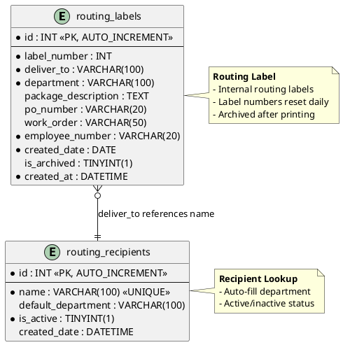

# Data Model: Routing Module

**Feature**: Routing Module  
**Database**: `mtm_receiving_application` (MySQL 8.x)  
**Compatibility**: MySQL 5.7.24+ (no JSON functions, CTEs, window functions, CHECK constraints)

## Entity Relationship Diagram



## Table Schemas

### routing_labels

**Purpose**: Internal routing label records

```sql
CREATE TABLE routing_labels (
  id INT NOT NULL AUTO_INCREMENT,
  label_number INT NOT NULL COMMENT 'Auto-incremented per day',
  deliver_to VARCHAR(100) NOT NULL COMMENT 'Recipient name',
  department VARCHAR(100) NOT NULL,
  package_description TEXT NULL,
  po_number VARCHAR(20) NULL COMMENT 'Formatted as PO-063150',
  work_order VARCHAR(50) NULL,
  employee_number VARCHAR(20) NOT NULL COMMENT 'Employee who created label',
  created_date DATE NOT NULL COMMENT 'Date label was created',
  is_archived TINYINT(1) NOT NULL DEFAULT 0 COMMENT '1 = archived to history',
  created_at DATETIME NOT NULL DEFAULT CURRENT_TIMESTAMP,
  
  PRIMARY KEY (id),
  INDEX idx_label_number (label_number),
  INDEX idx_created_date (created_date),
  INDEX idx_is_archived (is_archived),
  INDEX idx_employee_number (employee_number)
) ENGINE=InnoDB DEFAULT CHARSET=utf8mb4 COMMENT='Internal routing labels';
```

### routing_recipients

**Purpose**: Recipient lookup with default department

```sql
CREATE TABLE routing_recipients (
  id INT NOT NULL AUTO_INCREMENT,
  name VARCHAR(100) NOT NULL UNIQUE COMMENT 'Recipient name',
  default_department VARCHAR(100) NULL COMMENT 'Auto-filled when recipient selected',
  is_active TINYINT(1) NOT NULL DEFAULT 1,
  created_date DATETIME NOT NULL DEFAULT CURRENT_TIMESTAMP,
  
  PRIMARY KEY (id),
  UNIQUE KEY unique_name (name),
  INDEX idx_is_active (is_active)
) ENGINE=InnoDB DEFAULT CHARSET=utf8mb4 COMMENT='Routing recipient lookup';
```

## Stored Procedures

### sp_routing_label_insert

**Purpose**: Insert new routing label

```sql
DELIMITER $$

CREATE PROCEDURE sp_routing_label_insert(
  IN p_label_number INT,
  IN p_deliver_to VARCHAR(100),
  IN p_department VARCHAR(100),
  IN p_package_description TEXT,
  IN p_po_number VARCHAR(20),
  IN p_work_order VARCHAR(50),
  IN p_employee_number VARCHAR(20),
  IN p_created_date DATE,
  OUT p_new_label_id INT
)
BEGIN
  INSERT INTO routing_labels (
    label_number, deliver_to, department, package_description,
    po_number, work_order, employee_number, created_date
  ) VALUES (
    p_label_number, p_deliver_to, p_department, p_package_description,
    p_po_number, p_work_order, p_employee_number, p_created_date
  );
  
  SET p_new_label_id = LAST_INSERT_ID();
END$$

DELIMITER ;
```

### sp_routing_label_get_history

**Purpose**: Get routing labels filtered by date range

```sql
DELIMITER $$

CREATE PROCEDURE sp_routing_label_get_history(
  IN p_start_date DATE,
  IN p_end_date DATE
)
BEGIN
  SELECT 
    id, label_number, deliver_to, department, package_description,
    po_number, work_order, employee_number, created_date, created_at
  FROM routing_labels
  WHERE created_date BETWEEN p_start_date AND p_end_date
    AND is_archived = 1
  ORDER BY created_date DESC, label_number ASC;
END$$

DELIMITER ;
```

### sp_routing_recipient_get_all

**Purpose**: Get all active recipients

```sql
DELIMITER $$

CREATE PROCEDURE sp_routing_recipient_get_all()
BEGIN
  SELECT 
    id, name, default_department, is_active, created_date
  FROM routing_recipients
  WHERE is_active = 1
  ORDER BY name;
END$$

DELIMITER ;
```

## Views

### vw_routing_history

**Purpose**: Flattened view for reporting

```sql
CREATE OR REPLACE VIEW vw_routing_history AS
SELECT 
  id,
  deliver_to,
  department,
  package_description,
  po_number,
  work_order as work_order_number,
  employee_number,
  created_date,
  'Routing' as source_module
FROM routing_labels
WHERE is_archived = 1
ORDER BY created_date DESC, label_number ASC;
```

## Migration Strategy

1. **Create tables** in this order (respect foreign keys):
   - `routing_recipients` (no dependencies)
   - `routing_labels` (references routing_recipients.name)

2. **Create stored procedures** (all listed above)

3. **Create views** (`vw_routing_history`)

4. **Test queries**: Verify data insertion and retrieval

---

**Reference**: See [../011-module-reimplementation/data-model.md](../011-module-reimplementation/data-model.md) for complete data model context

