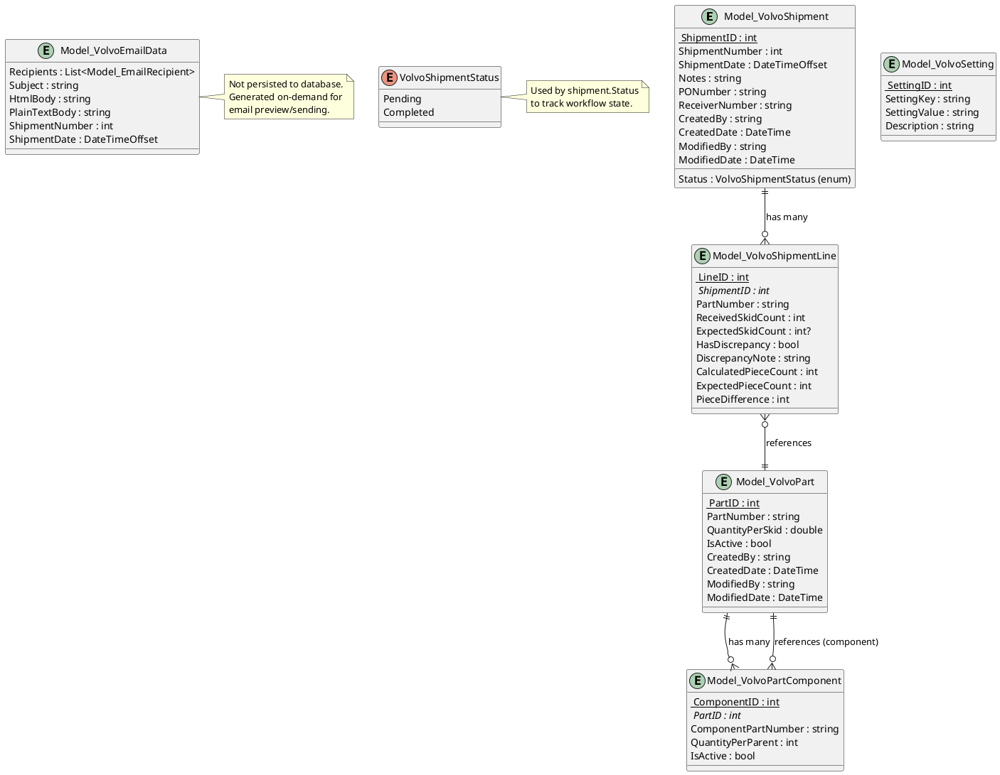

# Data Model: Module_Volvo CQRS Modernization

**Feature**: Module_Volvo CQRS Modernization  
**Branch**: `001-volvo-modernization`  
**Date**: January 16, 2026  
**Phase**: 1 - Data Model & Entity Design

## Overview

This document describes the data model for Module_Volvo CQRS modernization. **No database schema changes are permitted** per constitutional constraints. This model documents existing entities and their relationships, plus new request/response DTOs for CQRS handlers.

---

## Entity Relationship Diagram (PlantUML)



---

## Domain Entities (Existing - No Changes)

### Model_VolvoShipment

**Purpose**: Represents a Volvo shipment header record in the volvo_label_data table.

**Properties**:
| Property | Type | Required | Description |
|----------|------|----------|-------------|
| ShipmentID | int | Yes | Primary key (auto-increment) |
| ShipmentNumber | int | Yes | Sequential shipment number (unique per day) |
| ShipmentDate | DateTimeOffset | Yes | Date of shipment (cannot be future date) |
| Status | VolvoShipmentStatus | Yes | Workflow state (Pending/Completed) |
| Notes | string | No | Optional shipment notes |
| PONumber | string | No | Purchase order number |
| ReceiverNumber | string | No | Receiver transaction number |
| CreatedBy | string | Yes | Username who created shipment |
| CreatedDate | DateTime | Yes | Timestamp of creation |
| ModifiedBy | string | No | Username who last modified |
| ModifiedDate | DateTime | No | Timestamp of last modification |

**Validation Rules** (enforced by FluentValidation):
- ShipmentDate cannot be in the future
- At least one line item required for completion
- ShipmentNumber must be unique per ShipmentDate

**Database**: `mtm_receiving_application.volvo_label_data`

---

### Model_VolvoShipmentLine

**Purpose**: Represents individual parts in a shipment (volvo_label_parts_data table).

**Properties**:
| Property | Type | Required | Description |
|----------|------|----------|-------------|
| LineID | int | Yes | Primary key (auto-increment) |
| ShipmentID | int | Yes | Foreign key to Model_VolvoShipment |
| PartNumber | string | Yes | Volvo part number (must exist in master data) |
| ReceivedSkidCount | int | Yes | Number of skids actually received |
| ExpectedSkidCount | int? | No | Expected skids (required if HasDiscrepancy = true) |
| HasDiscrepancy | bool | No | Flag for quantity discrepancy |
| DiscrepancyNote | string | No | Explanation of discrepancy (required if HasDiscrepancy = true) |
| CalculatedPieceCount | int | Yes | ReceivedSkidCount × QuantityPerSkid (computed) |
| ExpectedPieceCount | int | No | ExpectedSkidCount × QuantityPerSkid (computed) |
| PieceDifference | int | No | CalculatedPieceCount - ExpectedPieceCount (computed) |

**Validation Rules**:
- PartNumber must exist in volvo_master_data
- ReceivedSkidCount > 0
- If HasDiscrepancy = true, then ExpectedSkidCount and DiscrepancyNote required
- No duplicate PartNumber within same ShipmentID

**Database**: `mtm_receiving_application.volvo_label_parts_data`

---

### Model_VolvoPart

**Purpose**: Master data for Volvo parts (volvo_master_data table).

**Properties**:
| Property | Type | Required | Description |
|----------|------|----------|-------------|
| PartID | int | Yes | Primary key (auto-increment) |
| PartNumber | string | Yes | Unique Volvo part number |
| QuantityPerSkid | double | Yes | Standard quantity per skid (must be > 0) |
| IsActive | bool | Yes | Active/inactive flag (default true) |
| CreatedBy | string | Yes | Username who created part |
| CreatedDate | DateTime | Yes | Timestamp of creation |
| ModifiedBy | string | No | Username who last modified |
| ModifiedDate | DateTime | No | Timestamp of last modification |

**Validation Rules**:
- PartNumber must be unique
- QuantityPerSkid > 0
- Cannot deactivate part if referenced by pending shipments

**Database**: `mtm_receiving_application.volvo_master_data`

---

### Model_VolvoPartComponent

**Purpose**: Bill-of-materials (BOM) components for parts (volvo_master_data_components table).

**Properties**:
| Property | Type | Required | Description |
|----------|------|----------|-------------|
| ComponentID | int | Yes | Primary key (auto-increment) |
| PartID | int | Yes | Foreign key to Model_VolvoPart (parent part) |
| ComponentPartNumber | string | Yes | Component part number |
| QuantityPerParent | int | Yes | Quantity of component per parent (must be > 0) |
| IsActive | bool | Yes | Active/inactive flag (default true) |

**Validation Rules**:
- PartID must exist in volvo_master_data
- QuantityPerParent > 0
- ComponentPartNumber + PartID must be unique (no duplicate components per part)

**Database**: `mtm_receiving_application.volvo_master_data_components`

---

### Model_VolvoEmailData

**Purpose**: Email notification data structure (not persisted to database).

**Properties**:
| Property | Type | Required | Description |
|----------|------|----------|-------------|
| Recipients | List<Model_EmailRecipient> | Yes | Email recipient list (from settings) |
| Subject | string | Yes | Email subject line |
| HtmlBody | string | Yes | HTML-formatted email body |
| PlainTextBody | string | Yes | Plain text email body |
| ShipmentNumber | int | Yes | Shipment number for reference |
| ShipmentDate | DateTimeOffset | Yes | Shipment date for reference |

**Generation**: Created by FormatEmailDataQuery handler from shipment data.

---

### VolvoShipmentStatus (Enum)

**Values**:
- `Pending` (0): Shipment is in progress, can be edited
- `Completed` (1): Shipment is finalized, generates labels and email

---

## CQRS Request/Response DTOs (New)

### Command DTOs

#### AddPartToShipmentCommand
```csharp
public record AddPartToShipmentCommand : IRequest<Model_Dao_Result>
{
    public string PartNumber { get; init; }
    public int ReceivedSkidCount { get; init; }
    public int? ExpectedSkidCount { get; init; }
    public bool HasDiscrepancy { get; init; }
    public string DiscrepancyNote { get; init; }
    public int? PendingShipmentId { get; init; } // Null for new shipment
}
```

#### CompleteShipmentCommand
```csharp
public record CompleteShipmentCommand : IRequest<Model_Dao_Result<int>>
{
    public DateTimeOffset ShipmentDate { get; init; }
    public int ShipmentNumber { get; init; }
    public string Notes { get; init; }
    public List<ShipmentLineDto> Parts { get; init; }
    public string PONumber { get; init; }
    public string ReceiverNumber { get; init; }
}

public record ShipmentLineDto
{
    public string PartNumber { get; init; }
    public int ReceivedSkidCount { get; init; }
    public int? ExpectedSkidCount { get; init; }
    public bool HasDiscrepancy { get; init; }
    public string DiscrepancyNote { get; init; }
}
```

#### SavePendingShipmentCommand
```csharp
public record SavePendingShipmentCommand : IRequest<Model_Dao_Result<int>>
{
    public int? ShipmentId { get; init; } // Null for new, populated for update
    public DateTimeOffset ShipmentDate { get; init; }
    public int ShipmentNumber { get; init; }
    public string Notes { get; init; }
    public List<ShipmentLineDto> Parts { get; init; }
}
```

#### UpdateShipmentCommand
```csharp
public record UpdateShipmentCommand : IRequest<Model_Dao_Result>
{
    public int ShipmentId { get; init; }
    public DateTimeOffset ShipmentDate { get; init; }
    public string Notes { get; init; }
    public string PONumber { get; init; }
    public string ReceiverNumber { get; init; }
    public List<ShipmentLineDto> Parts { get; init; }
}
```

#### AddVolvoPartCommand
```csharp
public record AddVolvoPartCommand : IRequest<Model_Dao_Result<int>>
{
    public string PartNumber { get; init; }
    public double QuantityPerSkid { get; init; }
}
```

#### UpdateVolvoPartCommand
```csharp
public record UpdateVolvoPartCommand : IRequest<Model_Dao_Result>
{
    public int PartId { get; init; }
    public string PartNumber { get; init; }
    public double QuantityPerSkid { get; init; }
}
```

#### DeactivateVolvoPartCommand
```csharp
public record DeactivateVolvoPartCommand : IRequest<Model_Dao_Result>
{
    public int PartId { get; init; }
}
```

#### ImportPartsCsvCommand
```csharp
public record ImportPartsCsvCommand : IRequest<Model_Dao_Result<ImportPartsCsvResult>>
{
    public string CsvFilePath { get; init; }
}

public record ImportPartsCsvResult
{
    public int SuccessCount { get; init; }
    public int FailureCount { get; init; }
    public List<string> Errors { get; init; }
}
```

---

### Query DTOs

#### GetInitialShipmentDataQuery
```csharp
public record GetInitialShipmentDataQuery : IRequest<Model_Dao_Result<InitialShipmentData>>
{
}

public record InitialShipmentData
{
    public DateTimeOffset CurrentDate { get; init; }
    public int NextShipmentNumber { get; init; }
}
```

#### GetPendingShipmentQuery
```csharp
public record GetPendingShipmentQuery : IRequest<Model_Dao_Result<Model_VolvoShipment>>
{
    public string UserName { get; init; }
}
```

#### SearchVolvoPartsQuery
```csharp
public record SearchVolvoPartsQuery : IRequest<Model_Dao_Result<List<Model_VolvoPart>>>
{
    public string SearchText { get; init; }
    public int MaxResults { get; init; } = 10;
}
```

#### GenerateLabelCsvQuery
```csharp
public record GenerateLabelCsvQuery : IRequest<Model_Dao_Result<string>>
{
    public int ShipmentId { get; init; }
}
```

#### FormatEmailDataQuery
```csharp
public record FormatEmailDataQuery : IRequest<Model_Dao_Result<Model_VolvoEmailData>>
{
    public int ShipmentId { get; init; }
}
```

#### GetRecentShipmentsQuery
```csharp
public record GetRecentShipmentsQuery : IRequest<Model_Dao_Result<List<Model_VolvoShipment>>>
{
    public int Days { get; init; } = 30;
}
```

#### GetShipmentHistoryQuery
```csharp
public record GetShipmentHistoryQuery : IRequest<Model_Dao_Result<List<Model_VolvoShipment>>>
{
    public DateTimeOffset? StartDate { get; init; }
    public DateTimeOffset? EndDate { get; init; }
    public VolvoShipmentStatus? StatusFilter { get; init; }
}
```

#### GetShipmentDetailQuery
```csharp
public record GetShipmentDetailQuery : IRequest<Model_Dao_Result<ShipmentDetail>>
{
    public int ShipmentId { get; init; }
}

public record ShipmentDetail
{
    public Model_VolvoShipment Shipment { get; init; }
    public List<Model_VolvoShipmentLine> Lines { get; init; }
}
```

#### GetAllVolvoPartsQuery
```csharp
public record GetAllVolvoPartsQuery : IRequest<Model_Dao_Result<List<Model_VolvoPart>>>
{
    public bool IncludeInactive { get; init; } = false;
}
```

#### GetPartComponentsQuery
```csharp
public record GetPartComponentsQuery : IRequest<Model_Dao_Result<List<Model_VolvoPartComponent>>>
{
    public int PartId { get; init; }
}
```

#### ExportPartsCsvQuery
```csharp
public record ExportPartsCsvQuery : IRequest<Model_Dao_Result<string>>
{
    public bool IncludeInactive { get; init; } = false;
}
```

#### ExportShipmentsQuery
```csharp
public record ExportShipmentsQuery : IRequest<Model_Dao_Result<string>>
{
    public List<int> ShipmentIds { get; init; }
}
```

---

## Data Flow Diagrams

### Shipment Completion Flow (CQRS)


---

## Migration Strategy

### Phase 1: Request/Response DTOs
1. Create `Module_Volvo/Requests/Commands/` folder
2. Create `Module_Volvo/Requests/Queries/` folder
3. Implement all command/query record classes
4. Unit test DTO serialization/deserialization

### Phase 2: Validators
1. Create `Module_Volvo/Validators/` folder
2. Implement AbstractValidator<TCommand> for each of 8 commands
3. Map existing validation rules from services/ViewModels
4. Unit test all validation rules with edge cases

### Phase 3: Handlers
1. Create `Module_Volvo/Handlers/Commands/` folder
2. Create `Module_Volvo/Handlers/Queries/` folder
3. Implement handlers delegating to legacy services initially
4. Unit test handlers with mocked services
5. Integration test full pipeline (handler → service → DAO → DB)

### Phase 4: ViewModel Refactoring
1. Inject `IMediator` instead of services
2. Replace service calls with `_mediator.Send(command/query)`
3. Keep legacy services with [Obsolete] attribute
4. Test ViewModel commands with mocked IMediator

### Phase 5: Service Deprecation
1. Move business logic from services to handlers
2. Mark Service_Volvo and Service_VolvoMasterData as [Obsolete]
3. Remove service registrations from App.xaml.cs (after full migration)

---

## Data Integrity Constraints

**Database Constraints** (enforced by stored procedures):
- `volvo_label_data.ShipmentNumber` + `ShipmentDate` = UNIQUE
- `volvo_master_data.PartNumber` = UNIQUE
- `volvo_label_parts_data.ShipmentID` + `PartNumber` = UNIQUE
- `volvo_master_data_components.PartID` + `ComponentPartNumber` = UNIQUE

**Application Constraints** (enforced by FluentValidation):
- ShipmentDate <= DateTimeOffset.Now
- ReceivedSkidCount > 0
- QuantityPerSkid > 0
- If HasDiscrepancy = true, then ExpectedSkidCount and DiscrepancyNote required
- Cannot deactivate part if referenced by pending shipments

**Referential Integrity** (enforced by stored procedures):
- ShipmentLine.PartNumber must exist in volvo_master_data
- PartComponent.PartID must exist in volvo_master_data

---

## Performance Considerations

**Query Optimization**:
- `GetAllVolvoPartsQuery`: Add index on `IsActive` column if not exists (verify with DBA)
- `SearchVolvoPartsQuery`: Use `LIKE 'searchText%'` (left-anchored) for index utilization
- `GetShipmentHistoryQuery`: Use date range indexes on `ShipmentDate`

**Caching Opportunities** (future enhancement):
- `GetAllVolvoPartsQuery`: Cache active parts for 5 minutes (IMemoryCache)
- `GetInitialShipmentDataQuery`: Cache next shipment number for 1 minute

---

## Compliance Verification

✅ **Principle II (Data Access Integrity)**:
- All database operations via stored procedures (sp_volvo_*)
- DAOs return Model_Dao_Result<T>
- No schema changes

✅ **Principle III (CQRS/MediatR)**:
- All read operations = Query handlers
- All write operations = Command handlers
- IRequest<Model_Dao_Result<T>> pattern

✅ **Principle V (Validation)**:
- FluentValidation validators for all commands
- ValidationBehavior executes automatically

✅ **Principle VII (Library-First)**:
- MediatR for CQRS
- FluentValidation for validation
- Mapster for DTO mapping (recommended)

---

**Data Model Status**: ✅ COMPLETE - Ready for contracts generation
