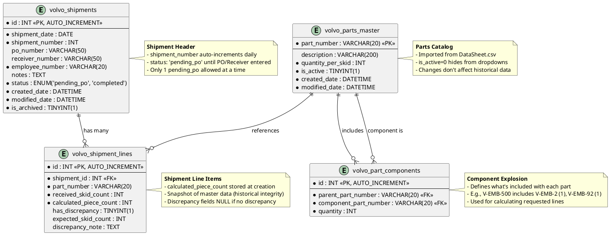

# Data Model: Volvo Dunnage Requisition Module

**Feature**: Volvo Dunnage Requisition Module  
**Database**: `mtm_receiving_application` (MySQL 8.x)  
**Compatibility**: MySQL 5.7.24+ (no JSON functions, CTEs, window functions, CHECK constraints)

## Entity Relationship Diagram



## Table Schemas

### volvo_shipments

**Purpose**: Header record for each Volvo dunnage shipment

```sql
CREATE TABLE volvo_shipments (
  id INT NOT NULL AUTO_INCREMENT,
  shipment_date DATE NOT NULL,
  shipment_number INT NOT NULL COMMENT 'Auto-increment within same day, resets daily',
  po_number VARCHAR(50) NULL COMMENT 'Filled after purchasing provides PO',
  receiver_number VARCHAR(50) NULL COMMENT 'Filled after Infor Visual receiving',
  employee_number VARCHAR(20) NOT NULL COMMENT 'From authentication context',
  notes TEXT NULL,
  status ENUM('pending_po', 'completed') NOT NULL DEFAULT 'pending_po',
  created_date DATETIME NOT NULL DEFAULT CURRENT_TIMESTAMP,
  modified_date DATETIME NOT NULL DEFAULT CURRENT_TIMESTAMP ON UPDATE CURRENT_TIMESTAMP,
  is_archived TINYINT(1) NOT NULL DEFAULT 0,
  
  PRIMARY KEY (id),
  UNIQUE KEY unique_shipment_per_day (shipment_date, shipment_number),
  INDEX idx_status (status),
  INDEX idx_shipment_date (shipment_date),
  INDEX idx_po_number (po_number)
) ENGINE=InnoDB DEFAULT CHARSET=utf8mb4 COMMENT='Volvo dunnage shipment headers';
```

**Key Fields**:
- `shipment_date + shipment_number`: Unique combination, e.g., "04/01/2025 Shipment #1"
- `status`: `pending_po` (awaiting PO from purchasing) or `completed` (PO/Receiver entered)
- `po_number` / `receiver_number`: NULL until user completes shipment after purchasing responds
- `is_archived`: Set to 1 when completed and moved to history

**Constraints**:
- Only 1 row with `status='pending_po'` allowed at a time (enforced in application logic, not DB constraint)
- `shipment_number` resets to 1 daily (calculated via stored procedure)

---

### volvo_shipment_lines

**Purpose**: Individual part line items within a shipment

```sql
CREATE TABLE volvo_shipment_lines (
  id INT NOT NULL AUTO_INCREMENT,
  shipment_id INT NOT NULL,
  part_number VARCHAR(20) NOT NULL COMMENT 'From volvo_parts_master',
  received_skid_count INT NOT NULL COMMENT 'User-entered actual count',
  calculated_piece_count INT NOT NULL COMMENT 'Stored snapshot from component explosion',
  has_discrepancy TINYINT(1) NOT NULL DEFAULT 0,
  expected_skid_count INT NULL COMMENT 'Volvo packlist quantity if discrepancy exists',
  discrepancy_note TEXT NULL,
  
  PRIMARY KEY (id),
  INDEX idx_shipment_id (shipment_id),
  INDEX idx_part_number (part_number),
  
  FOREIGN KEY (shipment_id) REFERENCES volvo_shipments(id) ON DELETE CASCADE,
  FOREIGN KEY (part_number) REFERENCES volvo_parts_master(part_number) ON DELETE RESTRICT
) ENGINE=InnoDB DEFAULT CHARSET=utf8mb4 COMMENT='Volvo shipment line items';
```

**Key Fields**:
- `received_skid_count`: Actual skids user counted
- `calculated_piece_count`: **Stored at creation time** from master data explosion (historical integrity - doesn't change if master data updates)
- `has_discrepancy`: If 1, `expected_skid_count` and `discrepancy_note` are populated
- `expected_skid_count`: What Volvo's packlist said vs. what was actually received

**Discrepancy Calculation**:
```
Difference = received_skid_count - expected_skid_count
```

Example:
- Volvo packlist: V-EMB-21 = 12 skids (expected_skid_count)
- Actually received: V-EMB-21 = 10 skids (received_skid_count)
- Difference: -2 skids (displayed in email)

---

### volvo_parts_master

**Purpose**: Catalog of Volvo dunnage parts with quantities per skid

```sql
CREATE TABLE volvo_parts_master (
  part_number VARCHAR(20) NOT NULL,
  description VARCHAR(200) NULL,
  quantity_per_skid INT NOT NULL COMMENT 'Pieces per skid for this part',
  is_active TINYINT(1) NOT NULL DEFAULT 1 COMMENT '0=deactivated, hidden from dropdowns',
  created_date DATETIME NOT NULL DEFAULT CURRENT_TIMESTAMP,
  modified_date DATETIME NOT NULL DEFAULT CURRENT_TIMESTAMP ON UPDATE CURRENT_TIMESTAMP,
  
  PRIMARY KEY (part_number)
) ENGINE=InnoDB DEFAULT CHARSET=utf8mb4 COMMENT='Volvo parts catalog (from DataSheet.csv)';
```

**Key Fields**:
- `part_number`: PK, e.g., V-EMB-2, V-EMB-500, V-EMB-750
- `quantity_per_skid`: How many pieces of this part come on one skid (e.g., V-EMB-2 = 20 pieces/skid)
- `is_active`: If 0, part is hidden from dropdown lists but still referenced in historical data

**Sample Data** (from DataSheet.csv):
```sql
INSERT INTO volvo_parts_master (part_number, description, quantity_per_skid) VALUES
('V-EMB-1', 'Skid', 1),
('V-EMB-2', NULL, 20),
('V-EMB-6', NULL, 90),
('V-EMB-9', NULL, 30),
('V-EMB-21', NULL, 50),
('V-EMB-26', NULL, 30),
('V-EMB-61', NULL, 70),
('V-EMB-71', NULL, 1),
('V-EMB-92', NULL, 25),
('V-EMB-116', NULL, 150),
('V-EMB-500', NULL, 88),
('V-EMB-750', NULL, 80),
('V-EMB-780', NULL, 50);
```

---

### volvo_part_components

**Purpose**: Defines which components are included with each parent part (component explosion)

```sql
CREATE TABLE volvo_part_components (
  id INT NOT NULL AUTO_INCREMENT,
  parent_part_number VARCHAR(20) NOT NULL,
  component_part_number VARCHAR(20) NOT NULL,
  quantity INT NOT NULL COMMENT 'How many of this component per parent skid',
  
  PRIMARY KEY (id),
  UNIQUE KEY unique_parent_component (parent_part_number, component_part_number),
  INDEX idx_parent (parent_part_number),
  INDEX idx_component (component_part_number),
  
  FOREIGN KEY (parent_part_number) REFERENCES volvo_parts_master(part_number) ON DELETE CASCADE,
  FOREIGN KEY (component_part_number) REFERENCES volvo_parts_master(part_number) ON DELETE RESTRICT
) ENGINE=InnoDB DEFAULT CHARSET=utf8mb4 COMMENT='Component explosion for Volvo parts';
```

**Key Fields**:
- `parent_part_number`: The main part (e.g., V-EMB-500)
- `component_part_number`: A component included with the parent (e.g., V-EMB-2)
- `quantity`: How many of the component come with each skid of the parent (usually 1)

**Sample Data** (from DataSheet.csv):
```sql
INSERT INTO volvo_part_components (parent_part_number, component_part_number, quantity) VALUES
('V-EMB-500', 'V-EMB-2', 1),
('V-EMB-500', 'V-EMB-92', 1),
('V-EMB-750', 'V-EMB-1', 1),
('V-EMB-750', 'V-EMB-6', 1),
('V-EMB-750', 'V-EMB-71', 1),
('V-EMB-780', 'V-EMB-9', 1),
('V-EMB-780', 'V-EMB-26', 3),
('V-EMB-116', 'V-EMB-1', 1),
('V-EMB-116', 'V-EMB-26', 3),
('V-EMB-116', 'V-EMB-71', 1);
```

**Component Explosion Example**:

User enters: V-EMB-500 (3 skids)

System calculates:
1. V-EMB-500: 3 skids × 88 pcs/skid = **264 pieces**
2. Components:
   - V-EMB-2: 3 skids × 1 = **3 pieces**
   - V-EMB-92: 3 skids × 1 = **3 pieces**

**Aggregation Example**:

User enters:
- V-EMB-500: 3 skids (includes 3× V-EMB-2, 3× V-EMB-92)
- V-EMB-600: 2 skids (includes 2× V-EMB-2, 2× V-EMB-92)

Requested lines in email:
```
V-EMB-500: 264 pcs
V-EMB-600: 88 pcs
V-EMB-2: 5 pcs (aggregated: 3+2)
V-EMB-92: 5 pcs (aggregated: 3+2)
```

---

## Stored Procedures

### sp_volvo_shipment_insert

**Purpose**: Insert new shipment header and auto-generate shipment_number

```sql
DELIMITER $$

CREATE PROCEDURE sp_volvo_shipment_insert(
  IN p_shipment_date DATE,
  IN p_employee_number VARCHAR(20),
  IN p_notes TEXT,
  OUT p_new_id INT,
  OUT p_shipment_number INT
)
BEGIN
  DECLARE v_next_number INT;
  
  -- Calculate next shipment number for this date
  SELECT COALESCE(MAX(shipment_number), 0) + 1 
  INTO v_next_number
  FROM volvo_shipments
  WHERE shipment_date = p_shipment_date;
  
  -- Insert shipment
  INSERT INTO volvo_shipments (
    shipment_date, shipment_number, employee_number, notes, status
  ) VALUES (
    p_shipment_date, v_next_number, p_employee_number, p_notes, 'pending_po'
  );
  
  SET p_new_id = LAST_INSERT_ID();
  SET p_shipment_number = v_next_number;
END$$

DELIMITER ;
```

---

### sp_volvo_shipment_line_insert

**Purpose**: Insert shipment line with calculated piece count

```sql
DELIMITER $$

CREATE PROCEDURE sp_volvo_shipment_line_insert(
  IN p_shipment_id INT,
  IN p_part_number VARCHAR(20),
  IN p_received_skid_count INT,
  IN p_calculated_piece_count INT,
  IN p_has_discrepancy TINYINT(1),
  IN p_expected_skid_count INT,
  IN p_discrepancy_note TEXT
)
BEGIN
  INSERT INTO volvo_shipment_lines (
    shipment_id, part_number, received_skid_count, calculated_piece_count,
    has_discrepancy, expected_skid_count, discrepancy_note
  ) VALUES (
    p_shipment_id, p_part_number, p_received_skid_count, p_calculated_piece_count,
    p_has_discrepancy, p_expected_skid_count, p_discrepancy_note
  );
END$$

DELIMITER ;
```

---

### sp_volvo_shipment_complete

**Purpose**: Mark shipment as completed with PO/Receiver numbers

```sql
DELIMITER $$

CREATE PROCEDURE sp_volvo_shipment_complete(
  IN p_shipment_id INT,
  IN p_po_number VARCHAR(50),
  IN p_receiver_number VARCHAR(50)
)
BEGIN
  UPDATE volvo_shipments
  SET 
    po_number = p_po_number,
    receiver_number = p_receiver_number,
    status = 'completed',
    is_archived = 1,
    modified_date = CURRENT_TIMESTAMP
  WHERE id = p_shipment_id;
END$$

DELIMITER ;
```

---

### sp_volvo_shipment_get_pending

**Purpose**: Get pending shipment if one exists

```sql
DELIMITER $$

CREATE PROCEDURE sp_volvo_shipment_get_pending()
BEGIN
  SELECT 
    id, shipment_date, shipment_number, employee_number, notes,
    status, created_date, modified_date
  FROM volvo_shipments
  WHERE status = 'pending_po' AND is_archived = 0
  LIMIT 1;
END$$

DELIMITER ;
```

---

### sp_volvo_shipment_history_get

**Purpose**: Get shipment history with filtering

```sql
DELIMITER $$

CREATE PROCEDURE sp_volvo_shipment_history_get(
  IN p_start_date DATE,
  IN p_end_date DATE,
  IN p_status VARCHAR(20) -- 'pending_po', 'completed', or 'all'
)
BEGIN
  SELECT 
    s.id, s.shipment_date, s.shipment_number, s.po_number, s.receiver_number,
    s.employee_number, s.notes, s.status, s.created_date, s.modified_date,
    COUNT(l.id) as part_count
  FROM volvo_shipments s
  LEFT JOIN volvo_shipment_lines l ON s.id = l.shipment_id
  WHERE s.shipment_date BETWEEN p_start_date AND p_end_date
    AND (p_status = 'all' OR s.status = p_status)
  GROUP BY s.id
  ORDER BY s.shipment_date DESC, s.shipment_number DESC;
END$$

DELIMITER ;
```

---

### sp_volvo_part_master_get_all

**Purpose**: Get all active Volvo parts for dropdown

```sql
DELIMITER $$

CREATE PROCEDURE sp_volvo_part_master_get_all(
  IN p_include_inactive TINYINT(1)
)
BEGIN
  SELECT part_number, description, quantity_per_skid, is_active
  FROM volvo_parts_master
  WHERE (p_include_inactive = 1 OR is_active = 1)
  ORDER BY part_number;
END$$

DELIMITER ;
```

---

### sp_volvo_part_component_get

**Purpose**: Get components for a parent part

```sql
DELIMITER $$

CREATE PROCEDURE sp_volvo_part_component_get(
  IN p_parent_part_number VARCHAR(20)
)
BEGIN
  SELECT 
    c.component_part_number,
    c.quantity,
    p.quantity_per_skid as component_quantity_per_skid
  FROM volvo_part_components c
  INNER JOIN volvo_parts_master p ON c.component_part_number = p.part_number
  WHERE c.parent_part_number = p_parent_part_number;
END$$

DELIMITER ;
```

---

## Views

### vw_volvo_shipments_history

**Purpose**: Flattened view for reporting with part details

```sql
CREATE OR REPLACE VIEW vw_volvo_shipments_history AS
SELECT 
  s.id as shipment_id,
  s.shipment_date,
  s.shipment_number,
  s.po_number,
  s.receiver_number,
  s.status,
  l.part_number,
  l.received_skid_count,
  l.calculated_piece_count,
  l.has_discrepancy,
  l.expected_skid_count,
  l.discrepancy_note
FROM volvo_shipments s
INNER JOIN volvo_shipment_lines l ON s.id = l.shipment_id
ORDER BY s.shipment_date DESC, s.shipment_number DESC, l.part_number;
```

---

## Migration Strategy

1. **Create tables** in this order (respect foreign keys):
   - `volvo_parts_master` (no dependencies)
   - `volvo_part_components` (depends on master)
   - `volvo_shipments` (no dependencies)
   - `volvo_shipment_lines` (depends on shipments and master)

2. **Load initial data**:
   - Import DataSheet.csv into `volvo_parts_master`
   - Import component relationships into `volvo_part_components`

3. **Create stored procedures** (all listed above)

4. **Create views** (`vw_volvo_shipments_history`)

5. **Test queries**:
   - Verify component explosion calculation
   - Verify shipment_number auto-increment
   - Verify only 1 pending_po can exist

---

## Sample Queries

### Component Explosion Query (Application Logic)

```sql
-- Get base part and all its components
SELECT 
  p.part_number,
  p.quantity_per_skid,
  c.component_part_number,
  c.quantity as component_qty,
  comp.quantity_per_skid as component_qty_per_skid
FROM volvo_parts_master p
LEFT JOIN volvo_part_components c ON p.part_number = c.parent_part_number
LEFT JOIN volvo_parts_master comp ON c.component_part_number = comp.part_number
WHERE p.part_number = 'V-EMB-500';

-- Result:
-- V-EMB-500 | 88 | V-EMB-2  | 1 | 20
-- V-EMB-500 | 88 | V-EMB-92 | 1 | 25
```

**Application Calculation** (C# example):
```csharp
// User enters: V-EMB-500, 3 skids
int skidCount = 3;
int qtyPerSkid = 88; // from master
int calculatedPieces = skidCount * qtyPerSkid; // 264

// Components:
// V-EMB-2: 3 skids × 1 = 3 pieces
// V-EMB-92: 3 skids × 1 = 3 pieces
```

---

### Aggregation Query (Requested Lines for Email)

```sql
-- After inserting all lines for a shipment, aggregate components
SELECT 
  part_number,
  SUM(calculated_piece_count) as total_pieces
FROM volvo_shipment_lines
WHERE shipment_id = 123
GROUP BY part_number
ORDER BY part_number;
```

---

## Data Integrity Rules

1. **Historical Integrity**: `calculated_piece_count` in `volvo_shipment_lines` is **stored at creation time** and never recalculated, even if `volvo_parts_master` changes later
2. **Pending PO Singleton**: Application enforces only 1 row with `status='pending_po'` at a time (not a DB constraint due to MySQL 5.7.24 limitation)
3. **Component Cascade**: Deleting a parent part from `volvo_parts_master` cascades to `volvo_part_components` (but cannot delete if referenced in shipment_lines)
4. **Soft Deletes**: Parts are deactivated (`is_active=0`) rather than deleted to preserve historical references
5. **CSV File Lifecycle**: CSV file exists during `pending_po` status, cleared (not deleted) when status changes to `completed`
