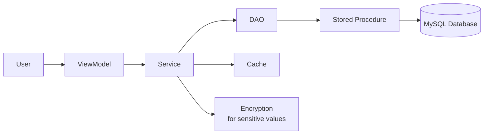

# Settings System - Developer Quick Start Guide

## 🎯 Goal

Implement the new database-driven settings system to replace hardcoded configuration values.

## 🏗️ Architecture at a Glance



## 🚦 Getting Started

### 1. Deploy Database Schema

```powershell
# Navigate to Database folder
cd Database\Schemas

# Deploy to MySQL (replace with your credentials)
mysql -h localhost -P 3306 -u root -p mtm_receiving_application < settings_system_schema.sql

# Deploy stored procedures
cd ..\StoredProcedures
mysql -h localhost -P 3306 -u root -p mtm_receiving_application < sp_SettingsSystem.sql

# Verify deployment
mysql -h localhost -P 3306 -u root -p mtm_receiving_application -e "SELECT COUNT(*) FROM system_settings;"
# Expected: 79 rows (or close to it)
```

### 2. Create Models

Location: `Module_Core/Models/Settings/`

Create these files:

- `Model_SystemSetting.cs`
- `Model_UserSetting.cs`
- `Model_SettingValue.cs`
- `Model_PackageTypeMapping.cs`
- `Model_PackageType.cs`
- `Model_RoutingRule.cs`
- `Model_ScheduledReport.cs`
- `Model_SettingsAuditLog.cs`
- `Model_ConnectionTestResult.cs` (for connection test modals)
- `Model_DatabaseTestResult.cs` (for database test modals)

See `SPECIFICATION.md` and `mockups/*.md` files for complete model code.

### 3. Create DAOs

Location: `Module_Core/Data/Settings/`

Create instance-based DAOs:

- `Dao_SystemSettings.cs`
- `Dao_UserSettings.cs`
- `Dao_PackageTypeMappings.cs`
- `Dao_PackageType.cs` (for package type CRUD with usage validation)
- `Dao_RoutingRule.cs` (for routing rules with pattern matching)
- `Dao_ScheduledReport.cs` (for scheduled reports)

**Pattern:**

```csharp
public class Dao_SystemSettings
{
    private readonly string _connectionString;

    public Dao_SystemSettings(string connectionString)
    {
        _connectionString = connectionString;
    }

    public async Task<Model_Dao_Result<List<Model_SystemSetting>>> GetAllAsync()
    {
        try
        {
            var parameters = new List<MySqlParameter>();
            var result = await Helper_Database_StoredProcedure
                .ExecuteStoredProcedureAsync(
                    _connectionString,
                    "sp_SystemSettings_GetAll",
                    parameters
                );

            if (!result.IsSuccess)
                return Model_Dao_Result<List<Model_SystemSetting>>.Failure(result.ErrorMessage);

            var settings = new List<Model_SystemSetting>();
            foreach (DataRow row in result.Data.Rows)
            {
                settings.Add(MapFromDataRow(row));
            }

            return Model_Dao_Result<List<Model_SystemSetting>>.Success(settings);
        }
        catch (Exception ex)
        {
            return Model_Dao_Result<List<Model_SystemSetting>>.Failure(
                $"Error retrieving system settings: {ex.Message}"
            );
        }
    }

    private Model_SystemSetting MapFromDataRow(DataRow row)
    {
        return new Model_SystemSetting
        {
            Id = Convert.ToInt32(row["id"]),
            Category = row["category"].ToString() ?? string.Empty,
            SettingKey = row["setting_key"].ToString() ?? string.Empty,
            // ... map all columns
        };
    }
}
```

### 4. Create Services

Location: `Module_Core/Services/Settings/`

Create:

- `IService_Settings.cs` (interface)
- `Service_Settings.cs` (implementation)
- `IService_SettingsCache.cs` (interface)
- `Service_SettingsCache.cs` (implementation)
- `IService_Encryption.cs` (for sensitive values)
- `Service_Encryption.cs` (AES-256 encryption with key rotation)
- `IService_InforVisual.cs` (connection testing, read-only queries)
- `Service_InforVisual.cs` (SQL Server connection with ApplicationIntent=ReadOnly)
- `IService_VolvoMasterData.cs` (synchronization with progress)
- `Service_VolvoMasterData.cs` (master data sync with IProgress<string>)

**Key Service Methods:**

```csharp
public class Service_Settings : IService_Settings
{
    private readonly Dao_SystemSettings _systemSettingsDao;
    private readonly Dao_UserSettings _userSettingsDao;
    private readonly IService_SettingsCache _cache;
    private readonly IService_LoggingUtility _logger;

    public async Task<Model_Dao_Result<Model_SettingValue>> GetSettingAsync(
        string category, 
        string key, 
        int? userId = null)
    {
        // Check cache first
        var cached = await _cache.GetCachedAsync(category, key, userId);
        if (cached != null)
            return Model_Dao_Result<Model_SettingValue>.Success(cached);

        // Load from database
        if (userId.HasValue)
        {
            var userResult = await _userSettingsDao.GetAsync(userId.Value, category, key);
            if (userResult.IsSuccess)
            {
                _cache.SetCached(category, key, userResult.Data, userId);
                return userResult;
            }
        }

        // Fallback to system setting
        var systemResult = await _systemSettingsDao.GetByKeyAsync(category, key);
        if (systemResult.IsSuccess)
        {
            var value = new Model_SettingValue 
            { 
                RawValue = systemResult.Data.SettingValue ?? string.Empty,
                DataType = systemResult.Data.DataType
            };
            _cache.SetCached(category, key, value, userId);
            return Model_Dao_Result<Model_SettingValue>.Success(value);
        }

        return Model_Dao_Result<Model_SettingValue>.Failure($"Setting not found: {category}.{key}");
    }

    public async Task<Model_Dao_Result> SaveSettingAsync(
        string category, 
        string key, 
        string value, 
        int userId, 
        bool isUserOverride = false)
    {
        // Get setting definition
        var settingResult = await _systemSettingsDao.GetByKeyAsync(category, key);
        if (!settingResult.IsSuccess)
            return Model_Dao_Result.Failure("Setting not found");

        var setting = settingResult.Data;

        // Validate value
        var validationResult = await ValidateSettingAsync(setting, value);
        if (!validationResult.IsSuccess)
            return validationResult;

        // Encrypt if sensitive
        var valueToStore = setting.IsSensitive ? EncryptSensitiveValue(value) : value;

        // Save based on scope
        Model_Dao_Result result;
        if (isUserOverride && setting.Scope == "user")
        {
            result = await _userSettingsDao.SetAsync(userId, setting.Id, valueToStore);
        }
        else
        {
            result = await _systemSettingsDao.UpdateValueAsync(
                setting.Id, 
                valueToStore, 
                userId, 
                "127.0.0.1", // Get actual IP
                Environment.MachineName
            );
        }

        // Invalidate cache
        if (result.IsSuccess)
        {
            _cache.InvalidateCache(category, key);
        }

        return result;
    }

    private async Task<Model_Dao_Result> ValidateSettingAsync(
        Model_SystemSetting setting, 
        string proposedValue)
    {
        if (string.IsNullOrEmpty(setting.ValidationRules))
            return Model_Dao_Result.Success();

        var rules = JsonSerializer.Deserialize<Dictionary<string, object>>(setting.ValidationRules);
        if (rules == null)
            return Model_Dao_Result.Success();

        // Validate based on data type
        switch (setting.DataType)
        {
            case "int":
                if (!int.TryParse(proposedValue, out var intValue))
                    return Model_Dao_Result.Failure("Value must be an integer");
                
                if (rules.ContainsKey("min") && intValue < Convert.ToInt32(rules["min"]))
                    return Model_Dao_Result.Failure($"Value must be >= {rules["min"]}");
                
                if (rules.ContainsKey("max") && intValue > Convert.ToInt32(rules["max"]))
                    return Model_Dao_Result.Failure($"Value must be <= {rules["max"]}");
                break;

            case "boolean":
                if (!bool.TryParse(proposedValue, out _))
                    return Model_Dao_Result.Failure("Value must be true or false");
                break;

            case "string":
                if (rules.ContainsKey("pattern"))
                {
                    var pattern = rules["pattern"].ToString();
                    if (!Regex.IsMatch(proposedValue, pattern ?? string.Empty))
                        return Model_Dao_Result.Failure($"Value must match pattern: {pattern}");
                }
                break;
        }

        return Model_Dao_Result.Success();
    }

    public string EncryptSensitiveValue(string plainText)
    {
        // Use Windows DPAPI for encryption
        var bytes = Encoding.UTF8.GetBytes(plainText);
        var encrypted = ProtectedData.Protect(bytes, null, DataProtectionScope.LocalMachine);
        return Convert.ToBase64String(encrypted);
    }

    public string DecryptSensitiveValue(string cipherText)
    {
        var bytes = Convert.FromBase64String(cipherText);
        var decrypted = ProtectedData.Unprotect(bytes, null, DataProtectionScope.LocalMachine);
        return Encoding.UTF8.GetString(decrypted);
    }
}
```

### 5. Register in DI Container

**`App.xaml.cs`:**

```csharp
private static IServiceProvider ConfigureServices()
{
    var services = new ServiceCollection();

    // Existing services...

    // Settings DAOs (Singletons)
    services.AddSingleton(sp => new Dao_SystemSettings(
        Helper_Database_Variables.GetConnectionString()));
    services.AddSingleton(sp => new Dao_UserSettings(
        Helper_Database_Variables.GetConnectionString()));
    services.AddSingleton(sp => new Dao_PackageTypeMappings(
        Helper_Database_Variables.GetConnectionString()));

    // Settings Services (Singletons)
    services.AddSingleton<IService_SettingsCache, Service_SettingsCache>();
    services.AddSingleton<IService_Settings, Service_Settings>();

    // Settings ViewModels (Transient)
    services.AddTransient<ViewModel_Settings_ModeSelection>();
    services.AddTransient<ViewModel_Settings_System>();
    services.AddTransient<ViewModel_Settings_Security>();
    services.AddTransient<ViewModel_Settings_ERP>();
    services.AddTransient<ViewModel_Settings_Receiving>();
    services.AddTransient<ViewModel_Settings_Dunnage>();
    services.AddTransient<ViewModel_Settings_Routing>();
    services.AddTransient<ViewModel_Settings_Volvo>();
    services.AddTransient<ViewModel_Settings_Reporting>();
    services.AddTransient<ViewModel_Settings_UserPreferences>();

    return services.BuildServiceProvider();
}
```

### 6. Create ViewModels

**Base ViewModel:**

```csharp
public abstract partial class ViewModel_Settings_Base : ViewModel_Shared_Base
{
    protected readonly IService_Settings _settingsService;
    protected readonly IService_UserSession _userSession;
    
    [ObservableProperty]
    private string _categoryTitle = string.Empty;
    
    [ObservableProperty]
    private string _categoryIcon = "Cog";
    
    [ObservableProperty]
    private string _searchText = string.Empty;
    
    [ObservableProperty]
    private bool _isSaving;
    
    [ObservableProperty]
    private ObservableCollection<Model_SystemSetting> _settings = new();
    
    protected ViewModel_Settings_Base(
        IService_Settings settingsService,
        IService_UserSession userSession,
        IService_ErrorHandler errorHandler,
        IService_LoggingUtility logger) : base(errorHandler, logger)
    {
        _settingsService = settingsService;
        _userSession = userSession;
    }

    protected abstract string SettingsCategory { get; }

    public async Task InitializeAsync()
    {
        await LoadSettingsAsync();
    }

    protected virtual async Task LoadSettingsAsync()
    {
        var result = await _settingsService.GetCategorySettingsAsync(
            SettingsCategory, 
            _userSession.CurrentUser?.Id
        );

        if (result.IsSuccess)
        {
            Settings.Clear();
            foreach (var setting in result.Data)
            {
                Settings.Add(setting);
            }
        }
    }

    protected async Task SaveSettingAsync(Model_SystemSetting setting, string newValue)
    {
        IsSaving = true;
        
        var result = await _settingsService.SaveSettingAsync(
            setting.Category,
            setting.SettingKey,
            newValue,
            _userSession.CurrentUser?.Id ?? 0,
            isUserOverride: setting.Scope == "user"
        );

        IsSaving = false;

        if (!result.IsSuccess)
        {
            _errorHandler.ShowUserError(result.ErrorMessage, "Save Failed", nameof(SaveSettingAsync));
        }
    }

    [RelayCommand]
    private void Back()
    {
        // Navigate back to mode selection
    }

    [RelayCommand]
    private async Task ResetToDefaultsAsync()
    {
        // Show confirmation dialog
        // Reset all settings in category
    }
}
```

**Category ViewModel Example:**

```csharp
public partial class ViewModel_Settings_System : ViewModel_Settings_Base
{
    protected override string SettingsCategory => "System";

    public ViewModel_Settings_System(
        IService_Settings settingsService,
        IService_UserSession userSession,
        IService_ErrorHandler errorHandler,
        IService_LoggingUtility logger) 
        : base(settingsService, userSession, errorHandler, logger)
    {
        CategoryTitle = "System Settings";
        CategoryIcon = "Cog";
    }

    // Property-specific helpers
    public async Task SaveMockDataSettingAsync(bool usesMockData)
    {
        var setting = Settings.FirstOrDefault(s => s.SettingKey == "UseInforVisualMockData");
        if (setting != null)
        {
            await SaveSettingAsync(setting, usesMockData.ToString().ToLower());
        }
    }
}
```

### 7. Update Views

Use the template in `templates/SettingsPageTemplate.xaml` as a starting point.

Customize for each category by:

1. Setting correct category title/icon
2. Binding to category-specific ViewModel
3. Adding category-specific controls (e.g., DataGrid for package mappings)

### 8. Replace Hardcoded Values

**Before:**

```csharp
// Hardcoded in code
private const int DEFAULT_TIMEOUT = 15;

// Or from appsettings.json
var timeout = _appSettings.Value.SharedTerminalTimeout;
```

**After:**

```csharp
// From settings service
var timeoutSetting = await _settingsService.GetSettingAsync("Security", "SharedTerminalTimeoutMinutes");
int timeout = timeoutSetting.Data.AsInt();
```

## 🧪 Testing

### Test Database Operations

```csharp
// Test DAO
var dao = new Dao_SystemSettings(connectionString);
var result = await dao.GetByCategoryAsync("System");
Assert.IsTrue(result.IsSuccess);
Assert.IsTrue(result.Data.Count > 0);

// Test Service
var service = new Service_Settings(systemDao, userDao, cache, logger);
var setting = await service.GetSettingAsync("Receiving", "DefaultReceivingMode", userId: 1);
Assert.AreEqual("guided", setting.Data.AsString());

// Test Save
var saveResult = await service.SaveSettingAsync("Routing", "CsvRetryMaxAttempts", "5", userId: 1);
Assert.IsTrue(saveResult.IsSuccess);
```

### Test UI

1. Launch application
2. Navigate to Settings
3. Click on a category card
4. Modify a setting value
5. Verify auto-save indicator appears
6. Verify value persists after reload
7. Check audit log in database

## 🔧 Troubleshooting

### "Setting not found" error

- Verify database was seeded with initial data
- Check `setting_key` matches exactly (case-sensitive)
- Ensure category is correct

### "Setting is locked" error

- Check `is_locked` flag in database
- Only Super Admin can unlock settings
- Use `sp_SystemSettings_SetLocked` to unlock

### Encryption errors

- Ensure running on same machine that encrypted the value
- DPAPI uses machine-specific key
- For multi-machine deployments, use shared secret instead

### Cache not invalidating

- Verify `InvalidateCache` is called after save
- Check cache TTL configuration
- Clear cache manually: `_cache.InvalidateAllForUser(userId)`

## 📚 Additional Resources

- **Full Specification**: `SPECIFICATION.md`
- **Database Schema**: `../../Database/Schemas/settings_system_schema.sql`
- **Stored Procedures**: `../../Database/StoredProcedures/sp_SettingsSystem.sql`
- **XAML Template**: `templates/SettingsPageTemplate.xaml`
- **UI Mockup**: `mockups/settings-mode-selection.svg`

## ✅ Checklist

- [ ] Database schema deployed
- [ ] Stored procedures deployed
- [ ] Models created
- [ ] DAOs created and registered in DI
- [ ] Services created and registered in DI
- [ ] ViewModels created and registered in DI
- [ ] Views created using template
- [ ] Mode selection page updated with 9 cards
- [ ] Hardcoded values replaced with service calls
- [ ] Unit tests written
- [ ] Integration tests passing
- [ ] UI manually tested

---

**Happy Coding!** 🚀
