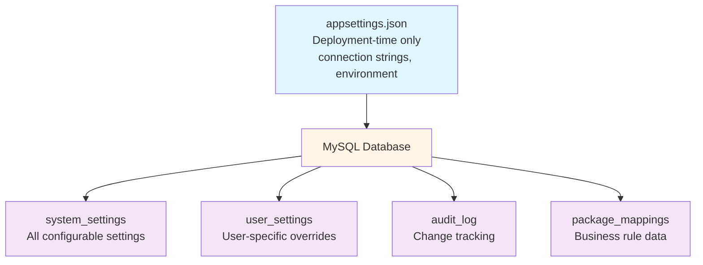

# Settings System Redesign - Comprehensive Specification

**Version:** 1.0  
**Date:** January 10, 2026  
**Status:** Planning / Design Phase

---

## Executive Summary

This specification outlines the complete redesign of the MTM Receiving Application's settings system. The redesign migrates from hardcoded values and `appsettings.json` to a database-driven, role-based configuration system with user preference overrides, audit logging, and a modern UI.

### Goals

1. **Centralize Configuration**: Move all settable objects from code/config into MySQL database
2. **Role-Based Access**: Implement permission levels (User, Operator, Admin, Developer, Super Admin)
3. **User Preferences**: Allow per-user overrides for applicable settings
4. **Audit Trail**: Track all configuration changes with who/what/when
5. **Modern UI**: Redesigned settings pages with auto-save, validation, and inline help
6. **Security**: Encrypt sensitive values (passwords, credentials)

---

## Architecture Overview

### Database-Driven Configuration



### Permission Levels

| Role | Access Level | Can Modify |
|------|-------------|------------|
| **User** | View own preferences | Own user settings only |
| **Operator** | View module settings | Own preferences + operational toggles |
| **Admin** | View/edit most settings | System settings (non-critical) |
| **Developer** | View/edit dev settings | Dev/test flags, retry logic |
| **Super Admin** | View/edit ALL settings | Everything including credentials |

---

## Database Schema

### Tables

#### 1. `system_settings`

Stores all system-wide configuration settings.

**Columns:**

- `id` (PK)
- `category` - Settings category (System, Security, Receiving, Dunnage, Routing, Volvo, Reporting, ERP, UserDefaults)
- `sub_category` - Optional hierarchical organization
- `setting_key` - Unique identifier
- `setting_name` - Display name
- `description` - Help text shown in UI
- `setting_value` - Current value
- `default_value` - Factory default
- `data_type` - ENUM('string', 'int', 'boolean', 'json', 'path', 'password', 'email')
- `scope` - ENUM('system', 'user')
- `permission_level` - ENUM('user', 'operator', 'admin', 'developer', 'superadmin')
- `is_locked` - Prevents modification
- `is_sensitive` - Encrypt value, mask in UI
- `validation_rules` - JSON with min/max/pattern/allowed_values
- `ui_control_type` - ENUM('textbox', 'numberbox', 'toggleswitch', 'combobox', 'passwordbox', 'folderpicker', 'datagrid')
- `ui_order` - Display order
- `created_at`, `updated_at`, `updated_by`

**Indexes:**

- `UNIQUE (category, setting_key)`
- `INDEX (category)`
- `INDEX (scope)`
- `INDEX (permission_level)`

#### 2. `user_settings`

User-specific overrides for settings where `scope='user'`.

**Columns:**

- `id` (PK)
- `user_id` (FK to users)
- `setting_id` (FK to system_settings)
- `setting_value` - Override value
- `created_at`, `updated_at`

**Constraints:**

- `UNIQUE (user_id, setting_id)`

#### 3. `settings_audit_log`

Tracks all changes to settings.

**Columns:**

- `id` (PK)
- `setting_id` (FK)
- `user_setting_id` (FK, nullable)
- `old_value`
- `new_value`
- `change_type` - ENUM('create', 'update', 'delete', 'lock', 'unlock', 'reset')
- `changed_by` (FK to users)
- `changed_at`
- `ip_address`
- `workstation_name`

#### 4. `package_type_mappings`

Business rules for part prefix → package type mapping.

**Columns:**

- `id` (PK)
- `part_prefix` - e.g., 'MCC', 'MMF'
- `package_type` - e.g., 'Coils', 'Sheets', 'Skids'
- `is_default` - Fallback when no match
- `display_order`
- `is_active`
- `created_at`, `updated_at`, `created_by`

#### 5. `package_types`

Master list of package types for CRUD operations (from Receiving Settings).

**Columns:**

- `id` (PK)
- `name` - Display name (e.g., 'Box', 'Pallet', 'Crate')
- `code` - Unique code (e.g., 'BOX', 'PLT', 'CRT')
- `is_active`
- `created_at`, `updated_at`

**Constraints:**
- `UNIQUE (name)`
- `UNIQUE (code)`

#### 6. `routing_rules`

Auto-routing rules with pattern matching (from Routing Settings).

**Columns:**

- `id` (PK)
- `match_type` - ENUM('Part Number', 'Vendor', 'PO Type', 'Part Category')
- `pattern` - Wildcard pattern (e.g., 'VOL-*', '*-BOLT')
- `destination_location` - Target location code
- `priority` - Lower = higher priority (1-100)
- `is_active`
- `created_at`, `updated_at`

**Constraints:**
- `UNIQUE (match_type, pattern)`
- `INDEX (priority)`

#### 7. `scheduled_reports`

Scheduled report configurations (from Reporting Settings).

**Columns:**

- `id` (PK)
- `report_type` - Report name
- `schedule` - Schedule string (e.g., 'Daily at 8:00 AM')
- `email_recipients` - Comma-separated email list
- `is_active`
- `next_run_date` - Calculated next run time
- `last_run_date` - Last execution time
- `created_at`, `updated_at`

**Constraints:**
- `INDEX (next_run_date)`
- `INDEX (is_active)`

---

## Data Models

### Module_Core/Models/Settings/

#### `Model_SystemSetting.cs`

```csharp
public partial class Model_SystemSetting : ObservableObject
{
    [ObservableProperty]
    private int _id;

    [ObservableProperty]
    private string _category = string.Empty;

    [ObservableProperty]
    private string? _subCategory;

    [ObservableProperty]
    private string _settingKey = string.Empty;

    [ObservableProperty]
    private string _settingName = string.Empty;

    [ObservableProperty]
    private string? _description;

    [ObservableProperty]
    private string? _settingValue;

    [ObservableProperty]
    private string? _defaultValue;

    [ObservableProperty]
    private string _dataType = "string";

    [ObservableProperty]
    private string _scope = "system";

    [ObservableProperty]
    private string _permissionLevel = "admin";

    [ObservableProperty]
    private bool _isLocked;

    [ObservableProperty]
    private bool _isSensitive;

    [ObservableProperty]
    private string? _validationRules; // JSON

    [ObservableProperty]
    private string _uiControlType = "textbox";

    [ObservableProperty]
    private int _uiOrder;

    [ObservableProperty]
    private DateTime _createdAt;

    [ObservableProperty]
    private DateTime _updatedAt;

    [ObservableProperty]
    private int? _updatedBy;
}
```

#### `Model_UserSetting.cs`

```csharp
public partial class Model_UserSetting : ObservableObject
{
    [ObservableProperty]
    private int _id;

    [ObservableProperty]
    private int _userId;

    [ObservableProperty]
    private int _settingId;

    [ObservableProperty]
    private string? _settingValue;

    [ObservableProperty]
    private DateTime _createdAt;

    [ObservableProperty]
    private DateTime _updatedAt;

    // Navigation property
    [ObservableProperty]
    private Model_SystemSetting? _systemSetting;
}
```

#### `Model_SettingValue.cs`

Helper model for working with typed values.

```csharp
public class Model_SettingValue
{
    public string RawValue { get; set; } = string.Empty;
    public string DataType { get; set; } = "string";

    public string AsString() => RawValue;
    public int AsInt() => int.TryParse(RawValue, out var val) ? val : 0;
    public bool AsBool() => bool.TryParse(RawValue, out var val) && val;
    public T? AsJson<T>() => JsonSerializer.Deserialize<T>(RawValue);
}
```

#### `Model_PackageTypeMapping.cs`

```csharp
public partial class Model_PackageTypeMapping : ObservableObject
{
    [ObservableProperty]
    private int _id;

    [ObservableProperty]
    private string _partPrefix = string.Empty;

    [ObservableProperty]
    private string _packageType = string.Empty;

    [ObservableProperty]
    private bool _isDefault;

    [ObservableProperty]
    private int _displayOrder;

    [ObservableProperty]
    private bool _isActive = true;

    [ObservableProperty]
    private DateTime _createdAt;

    [ObservableProperty]
    private DateTime _updatedAt;

    [ObservableProperty]
    private int? _createdBy;
}
```

---

## Data Access Layer (DAOs)

### Module_Core/Data/Settings/

#### `Dao_SystemSettings.cs`

Instance-based DAO for system settings CRUD operations.

**Methods:**

- `Task<Model_Dao_Result<List<Model_SystemSetting>>> GetAllAsync()`
- `Task<Model_Dao_Result<List<Model_SystemSetting>>> GetByCategoryAsync(string category)`
- `Task<Model_Dao_Result<Model_SystemSetting>> GetByKeyAsync(string category, string key)`
- `Task<Model_Dao_Result> UpdateValueAsync(int settingId, string newValue, int changedBy, string ipAddress, string workstation)`
- `Task<Model_Dao_Result> ResetToDefaultAsync(int settingId, int changedBy, string ipAddress, string workstation)`
- `Task<Model_Dao_Result> SetLockedAsync(int settingId, bool isLocked, int changedBy, string ipAddress, string workstation)`

#### `Dao_UserSettings.cs`

Instance-based DAO for user setting overrides.

**Methods:**

- `Task<Model_Dao_Result<Model_SettingValue>> GetAsync(int userId, string category, string key)`
- `Task<Model_Dao_Result<List<Model_UserSetting>>> GetAllForUserAsync(int userId)`
- `Task<Model_Dao_Result> SetAsync(int userId, int settingId, string value)`
- `Task<Model_Dao_Result> ResetAsync(int userId, int settingId)`
- `Task<Model_Dao_Result<int>> ResetAllAsync(int userId, int changedBy)`

#### `Dao_PackageTypeMappings.cs`

Instance-based DAO for package type mappings.

**Methods:**

- `Task<Model_Dao_Result<List<Model_PackageTypeMapping>>> GetAllAsync()`
- `Task<Model_Dao_Result<string>> GetByPrefixAsync(string partPrefix)`
- `Task<Model_Dao_Result<int>> InsertAsync(Model_PackageTypeMapping mapping, int createdBy)`
- `Task<Model_Dao_Result> UpdateAsync(Model_PackageTypeMapping mapping)`
- `Task<Model_Dao_Result> DeleteAsync(int id)`

---

## Service Layer

### Module_Core/Services/Settings/

#### `IService_Settings.cs` / `Service_Settings.cs`

Main settings service with business logic.

**Responsibilities:**

- Load settings with user overrides
- Validate setting values before save
- Encrypt/decrypt sensitive settings
- Auto-save with debounce (500ms)
- Cache frequently-accessed settings

**Methods:**

```csharp
Task<Model_Dao_Result<Model_SettingValue>> GetSettingAsync(string category, string key, int? userId = null);
Task<Model_Dao_Result<Dictionary<string, Model_SettingValue>>> GetCategorySettingsAsync(string category, int? userId = null);
Task<Model_Dao_Result> SaveSettingAsync(string category, string key, string value, int userId, bool isUserOverride = false);
Task<Model_Dao_Result> ResetSettingAsync(string category, string key, int userId, bool isUserOverride = false);
Task<Model_Dao_Result> ValidateSettingAsync(Model_SystemSetting setting, string proposedValue);
string EncryptSensitiveValue(string plainText);
string DecryptSensitiveValue(string cipherText);
```

#### `IService_SettingsCache.cs` / `Service_SettingsCache.cs`

In-memory cache for frequently-accessed settings.

**Methods:**

```csharp
Task<Model_SettingValue?> GetCachedAsync(string category, string key, int? userId = null);
void SetCached(string category, string key, Model_SettingValue value, int? userId = null);
void InvalidateCache(string category, string key);
void InvalidateAllForUser(int userId);
```

---

## ViewModels

### Module_Settings/ViewModels/

#### `ViewModel_Settings_ModeSelection.cs`

Updated for new 9-card layout.

**Commands:**

- `SelectSystemSettingsCommand`
- `SelectSecuritySettingsCommand`
- `SelectERPSettingsCommand`
- `SelectReceivingSettingsCommand`
- `SelectDunnageSettingsCommand`
- `SelectRoutingSettingsCommand`
- `SelectVolvoSettingsCommand`
- `SelectReportingSettingsCommand`
- `SelectUserPreferencesCommand`

#### `ViewModel_Settings_Base.cs`

Base class for all category settings pages.

**Properties:**

```csharp
[ObservableProperty] private string _categoryTitle = string.Empty;
[ObservableProperty] private string _categoryIcon = "Cog";
[ObservableProperty] private string _searchText = string.Empty;
[ObservableProperty] private bool _isSaving;
[ObservableProperty] private bool _showLockedMessage;
[ObservableProperty] private ObservableCollection<Model_SystemSetting> _settings = new();
[ObservableProperty] private ObservableCollection<Model_SystemSetting> _filteredSettings = new();
```

**Commands:**

```csharp
[RelayCommand] Task BackAsync();
[RelayCommand] Task ResetToDefaultsAsync();
[RelayCommand] Task BrowseFolderAsync(string settingKey);
[RelayCommand] Task TestConnectionAsync(string settingKey);
[RelayCommand] void CloseLockedMessage();
```

**Methods:**

```csharp
protected abstract Task LoadSettingsAsync();
protected async Task SaveSettingAsync(Model_SystemSetting setting, string newValue);
protected void FilterSettings();
```

#### Category-Specific ViewModels

##### `ViewModel_Settings_System.cs`

Settings: UseInforVisualMockData, DefaultMockPONumber, Environment, DatabaseMaxRetries, DatabaseRetryDelaysMs, NotificationAutoDismissMs

##### `ViewModel_Settings_Security.cs`

Settings: SharedTerminalTimeoutMinutes, PersonalWorkstationTimeoutMinutes, SessionMonitorIntervalSeconds, LoginMaxAttempts, PinLength, LockoutDelayMs

##### `ViewModel_Settings_ERP.cs`

Settings: InforVisualServer, InforVisualDatabase, InforVisualUserId, InforVisualPassword (encrypted), InforVisualSiteId, DefaultUnitOfMeasure

##### `ViewModel_Settings_Receiving.cs`

Settings: DefaultReceivingMode, MockAutoLoadDelayMs, ManualEntryGridSelectionDelayMs
Includes: Package Type Mappings DataGrid

##### `ViewModel_Settings_Dunnage.cs`

Settings: DefaultDunnageMode, ManualEntryGridSelectionDelayMs

##### `ViewModel_Settings_Routing.cs`

Settings: CsvExportPathNetwork, CsvExportPathLocal, DefaultMode, PersonalizationThreshold, QuickAddButtonCount, HistoryPageSize, EnableValidation, DuplicateDetectionHours, CsvRetryMaxAttempts, CsvRetryDelayMs

##### `ViewModel_Settings_Volvo.cs`

Settings: HistoryStatusOptions
Note: Email settings already in DB via `volvo_settings` table

##### `ViewModel_Settings_Reporting.cs`

Settings: ExportFolderPath, FileNameTemplate, TimestampFormat, CsvDateFormat

##### `ViewModel_Settings_UserPreferences.cs`

User-overridable settings: DefaultReceivingMode, DefaultDunnageMode, DefaultRoutingMode, EnableValidation

---

## Views (XAML)

### Module_Settings/Views/

#### `View_Settings_ModeSelection.xaml`

9-card grid layout (see mockup SVG).

Cards:

1. System Settings
2. Security & Session
3. ERP Integration
4. Receiving
5. Dunnage
6. Routing
7. Volvo
8. Reporting
9. User Preferences

#### Category Views

All inherit from template pattern (see `SettingsPageTemplate.xaml`).

- `View_Settings_System.xaml`
- `View_Settings_Security.xaml`
- `View_Settings_ERP.xaml`
- `View_Settings_Receiving.xaml` (includes DataGrid for package mappings)
- `View_Settings_Dunnage.xaml`
- `View_Settings_Routing.xaml`
- `View_Settings_Volvo.xaml`
- `View_Settings_Reporting.xaml`
- `View_Settings_UserPreferences.xaml`

#### Modal Dialogs (ContentDialogs)

All modals documented in `mockups/MODAL_INDEX.md` with complete implementation guides:

**CRUD Dialogs:**
- `PackageTypeDialog.xaml` - Add/edit package types with validation
- `RoutingRuleDialog.xaml` - Add/edit routing rules with pattern matching
- `ScheduleReportDialog.xaml` - Configure scheduled reports

**Confirmation Dialogs:**
- Standard delete confirmations (with usage validation)
- Reset preferences confirmation
- Encryption key rotation warning (critical operation)

**Informational Dialogs:**
- Database connection test results (MySQL)
- ERP connection test results (SQL Server with ApplicationIntent=ReadOnly)
- Manual sync progress with IProgress<T>

**WinUI 3 Controls Used:**
- `ContentDialog` - All modal dialogs
- `TextBox` - Text input with validation
- `NumberBox` - Numeric input with spin buttons and min/max
- `ToggleSwitch` - Boolean settings
- `ComboBox` - Dropdown selections
- `PasswordBox` - Encrypted credentials with show/hide
- `DataGrid` - Package type mappings, routing rules
- `InfoBar` - Warnings and notifications
- `ProgressRing` - Loading indicators
- `ProgressBar` - Sync operations

**Validation Patterns:**
- Required field validation
- Pattern validation (regex for codes, emails, wildcards)
- Range validation (min/max for NumberBox)
- Unique constraint validation (database lookups)
- Email list validation (comma-separated)
- Usage validation before deletion

**Service Implementations:**
- Connection testing with friendly error messages
- Encryption key rotation with re-encryption workflow  
- Master data synchronization with progress reporting
- Schedule parsing (daily/weekly/monthly patterns)
- Routing pattern matching (`*` wildcard support)
- Package type usage counting

**Error Handling:**
- SQL Server error code mapping (2, 4060, 18456, etc.)
- MySQL error code mapping (0, 1042, 1045, 1049, 2002, 2003)
- Friendly user messages for common errors
- InfoBar for warnings
- ContentDialog for validation errors
- `Model_Dao_Result<T>` pattern throughout

---

## Migration Strategy

### Phase 1: Database Setup (Week 1)

1. Create schema (`settings_system_schema.sql`)
2. Create stored procedures (`sp_SettingsSystem.sql`)
3. Seed initial data from current `appsettings.json`
4. Test all stored procedures

### Phase 2: Data Layer (Week 2)

1. Create models (`Model_SystemSetting`, `Model_UserSetting`, etc.)
2. Create DAOs (instance-based, using stored procedures)
3. Create services (`Service_Settings`, `Service_SettingsCache`)
4. Register in DI container (`App.xaml.cs`)
5. Unit tests for DAOs and services

### Phase 3: UI Development (Week 3-4)

1. Create base ViewModel (`ViewModel_Settings_Base`)
2. Redesign Mode Selection page (9 cards)
3. Create category-specific ViewModels
4. Create category-specific Views using template
5. Implement auto-save with debounce
6. Add validation and error handling

### Phase 4: Security & Encryption (Week 5)

1. Implement encryption for sensitive settings
2. Add role-based access checks
3. Create audit log viewer (Admin only)
4. Test permission levels

### Phase 5: Migration & Cleanup (Week 6)

1. Deprecate hardcoded values in code
2. Remove settings from `appsettings.json` (keep deployment-only)
3. Update all code references to use `Service_Settings`
4. Integration testing
5. User acceptance testing
6. Documentation

---

## Security Considerations

### Encryption

**Sensitive settings** (passwords, API keys) will be encrypted using:

- **AES-256** encryption
- **Machine-specific key** derived from DPAPI (Windows)
- Stored in database as base64-encoded ciphertext

### Access Control

- UI checks `permission_level` before showing settings
- Service layer validates user role before allowing modifications
- Database stored procedures enforce `is_locked` constraints

### Audit Trail

All changes logged to `settings_audit_log` with:

- Old/new values
- User who made change
- IP address and workstation
- Timestamp

---

## Validation Rules

Settings with `validation_rules` JSON column support:

```json
{
  "min": 1,
  "max": 100,
  "pattern": "^[A-Z0-9]+$",
  "allowed_values": ["option1", "option2"],
  "required": true,
  "path_must_exist": true
}
```

Validation enforced:

1. Client-side (ViewModel before save)
2. Service layer (before calling DAO)
3. Database (via JSON validation if needed)

---

## UI/UX Features

### Auto-Save

- Debounced 500ms after value change
- Visual "Saving..." indicator
- Success/error toast notifications

### Inline Help

- Info icon next to each setting
- Hover tooltip with description
- Validation rules shown under input

### Search/Filter

- Search box filters settings by name/description
- Real-time filtering as user types

### Locked Settings

- Greyed out controls
- Padlock icon
- Overlay message if user attempts to modify

### File/Folder Pickers

- Browse button launches native dialog
- Test connection button validates path accessibility
- Shows validation errors inline

---

## Testing Plan

### Unit Tests

- DAO operations (insert, update, delete)
- Service validation logic
- Encryption/decryption
- Permission checks

### Integration Tests

- End-to-end setting save/load
- User override behavior
- Audit log creation
- Migration from appsettings.json

### UI Tests

- Auto-save functionality
- Validation error display
- Search/filter
- Role-based visibility

---

## Performance Considerations

### Caching

- Cache frequently-accessed settings (e.g., timeouts, paths)
- Invalidate cache on save
- Cache TTL: 5 minutes

### Database Indexing

- Indexed on `category`, `setting_key`, `scope`, `permission_level`
- User settings indexed on `user_id`, `setting_id`

### Lazy Loading

- Load categories on-demand (not all at once)
- Paginate audit log

---

## Rollback Plan

If critical issues arise:

1. **Keep appsettings.json values** as fallback during migration
2. Feature flag to toggle old/new settings system
3. Export current settings to JSON before migration
4. Database restore point before schema deployment

---

## Success Criteria

✅ All 79 settable objects from SETTABLE_OBJECTS reports migrated to database  
✅ Zero hardcoded configuration values in code  
✅ Role-based access working correctly  
✅ Audit trail captures all changes  
✅ User preferences override system defaults  
✅ Auto-save functions without errors  
✅ Validation prevents invalid values  
✅ Sensitive settings encrypted  
✅ UI responsive and intuitive  
✅ Zero regressions in existing functionality  

---

## Dependencies & Prerequisites

### NuGet Packages

- `MySql.Data` (existing)
- `System.Text.Json` (existing)
- `CommunityToolkit.Mvvm` (existing)

### Database

- MySQL 8.x
- User with CREATE TABLE, CREATE PROCEDURE permissions
- Backup of production database before migration

### Development Environment

- .NET 8 SDK
- Visual Studio 2022 or VS Code
- MySQL Workbench (recommended)

---

## Appendices

### Appendix A: Complete Settings Inventory

See individual `SETTABLE_OBJECTS_REPORT.md` files in each module:

- `Module_Core/SETTABLE_OBJECTS_REPORT.md` (15 settings)
- `Module_Receiving/SETTABLE_OBJECTS_REPORT.md` (10 settings)
- `Module_Dunnage/SETTABLE_OBJECTS_REPORT.md` (3 settings)
- `Module_Routing/SETTABLE_OBJECTS_REPORT.md` (18 settings)
- `Module_Volvo/SETTABLE_OBJECTS_REPORT.md` (5 settings)
- `Module_Reporting/SETTABLE_OBJECTS_REPORT.md` (8 settings)
- `Module_Shared/SETTABLE_OBJECTS_REPORT.md` (3 settings)
- `Module_Settings/SETTABLE_OBJECTS_REPORT.md` (3 settings)

**Total: 79 settable objects**

### Appendix B: Mockups

- `mockups/settings-mode-selection.svg` - Redesigned mode selection with 9 cards
- `templates/SettingsPageTemplate.xaml` - Reusable settings page template

### Appendix C: Database Scripts

- `Database/Schemas/settings_system_schema.sql` - Table definitions + seed data
- `Database/StoredProcedures/sp_SettingsSystem.sql` - All stored procedures

---

**Document Prepared By:** GitHub Copilot (AI Assistant)  
**Approved By:** [Pending User Review]  
**Next Review Date:** [After Phase 1 Completion]
