# Settings System - Modal Dialogs & Views Index

This document provides a complete index of all modal dialogs (ContentDialogs) and special views used across the Settings System.

---

## Overview

**Total Modals**: 10  
**Total Development Views**: 1  
**Location**: `specs/005-settings-system-redesign/mockups/`  
**Format**: Each modal/view has an SVG mockup and detailed markdown documentation

---

## Development Tools

### Database Test View (10)

| File | Title | Purpose | Access |
|------|-------|---------|--------|
| `10-dev-database-test.svg` | Settings Database Test | Comprehensive database validation and testing | Development Mode Only |

**Features**:

- Real-time connection monitoring
- Automated table schema validation (7 tables)
- Stored procedure execution testing (25+ SPs)
- DAO CRUD operation verification (6 DAOs)
- Detailed error logging and reporting
- Export test results for documentation
- Tabbed interface for organized results
- Performance metrics (connection time, test duration)

**Implementation**:

- Window: `Views/Development/DatabaseTestWindow.xaml`
- ViewModel: `ViewModels/Development/DatabaseTestViewModel.cs`
- Models: `Model_ConnectionTestResult`, `Model_TableTestResult`, `Model_StoredProcedureTestResult`, `Model_DaoTestResult`
- Access: "Settings DB Test" button in MainWindow (visible only when `ASPNETCORE_ENVIRONMENT=Development`)

---

## Modal Dialog Inventory

### System Settings (01)

| File | Title | Purpose | Type |
|------|-------|---------|------|
| `01-system-modal-test-db.svg` | Database Connection Test | Display MySQL connection test results | Informational |

**Features**:

- Success/failure indicator with icon
- Connection details (host, database, timing)
- Friendly error messages for common MySQL errors

---

### Security & Session (02)

| File | Title | Purpose | Type |
|------|-------|---------|------|
| `02-security-modal-rotate-key.svg` | Confirm Key Rotation | Warning before rotating encryption key | Critical Confirmation |

**Features**:

- Warning banner with InfoBar
- Critical operation notice
- Cannot undo warning
- Danger button styling

---

### ERP Integration (03)

| File | Title | Purpose | Type |
|------|-------|---------|------|
| `03-erp-modal-test-connection.svg` | Connection Test | Display Infor Visual connection test results | Informational |

**Features**:

- Success/failure status
- Server/database details
- Connection timing
- Authentication mode display
- Friendly SQL Server error messages

---

### Receiving Settings (04)

| File | Title | Purpose | Type |
|------|-------|---------|------|
| `04-receiving-modal-add-type.svg` | Add Package Type | Create new package type | CRUD Dialog |
| `04-receiving-modal-delete-confirm.svg` | Delete Package Type | Confirm package type deletion | Confirmation |

**Features (Add)**:

- Name input with validation
- Code input (uppercase enforced)
- Active toggle
- Unique constraint validation

**Features (Delete)**:

- Usage check before deletion
- Cannot undo warning
- Displays item being deleted

---

### Dunnage Settings (05)

**No modals required** - Settings are managed directly on page. Material types managed in main Dunnage module.

---

### Routing Settings (06)

| File | Title | Purpose | Type |
|------|-------|---------|------|
| `06-routing-modal-add-rule.svg` | Add Routing Rule | Create automatic routing rule | CRUD Dialog |

**Features**:

- Match type selection (Part Number, Vendor, etc.)
- Pattern with wildcard support
- Destination location dropdown
- Priority number box
- Pattern validation

---

### Volvo Integration (07)

| File | Title | Purpose | Type |
|------|-------|---------|------|
| `07-volvo-modal-sync.svg` | Trigger Manual Sync | Confirm manual master data sync | Confirmation + Progress |

**Features**:

- Info banner
- Operation description
- Time estimate warning
- Progress tracking after confirmation

---

### Reporting Settings (08)

| File | Title | Purpose | Type |
|------|-------|---------|------|
| `08-reporting-modal-schedule.svg` | Schedule Report | Configure scheduled report | CRUD Dialog |

**Features**:

- Report type selection
- Schedule frequency dropdown
- Email recipients input
- Active toggle
- Email validation

---

### User Preferences (09)

| File | Title | Purpose | Type |
|------|-------|---------|------|
| `09-preferences-modal-reset.svg` | Reset Preferences | Confirm reset to defaults | Confirmation |

**Features**:

- Clear description of what will reset
- Default values restoration
- Immediate effect notice

---

## WinUI 3 Control Patterns

### Standard Confirmation Dialog

```xml
<ContentDialog
    Title="Confirm Action"
    Content="Are you sure?"
    PrimaryButtonText="Confirm"
    CloseButtonText="Cancel"
    DefaultButton="Close"/>
```

### CRUD Dialog (Add/Edit)

```xml
<ContentDialog
    Title="Add/Edit Item"
    PrimaryButtonText="Save"
    CloseButtonText="Cancel"
    DefaultButton="Primary">
    <StackPanel Spacing="16">
        <!-- Input fields -->
    </StackPanel>
</ContentDialog>
```

### Informational Dialog

```xml
<ContentDialog
    Title="Information"
    CloseButtonText="OK"
    DefaultButton="Close">
    <StackPanel Spacing="12">
        <!-- Status and details -->
    </StackPanel>
</ContentDialog>
```

### Critical/Warning Dialog

```xml
<ContentDialog
    Title="Warning"
    PrimaryButtonText="Proceed"
    CloseButtonText="Cancel"
    DefaultButton="Close"
    PrimaryButtonStyle="{StaticResource DangerButtonStyle}">
    <StackPanel Spacing="12">
        <InfoBar Severity="Warning" IsOpen="True"/>
        <!-- Warning content -->
    </StackPanel>
</ContentDialog>
```

---

## Common Modal Components

### Success/Failure Indicator

```xml
<Grid ColumnDefinitions="Auto,*">
    <FontIcon 
        Glyph="{x:Bind IsSuccess, Converter={StaticResource BoolToGlyphConverter}}"
        Foreground="{x:Bind IsSuccess, Converter={StaticResource BoolToColorConverter}}"/>
    <TextBlock Text="{x:Bind StatusMessage}"/>
</Grid>
```

### Warning Banner

```xml
<InfoBar 
    Severity="Warning"
    IsOpen="True"
    IsClosable="False"
    Title="Warning message"/>
```

### Error Display

```xml
<Border Background="#fff4e5" BorderBrush="#f0ad4e" Padding="12">
    <TextBlock Text="{x:Bind ErrorMessage}" TextWrapping="Wrap"/>
</Border>
```

---

## Validation Patterns

### Required Field Validation

```csharp
if (string.IsNullOrWhiteSpace(Model.Name))
{
    args.Cancel = true;
    ShowValidationError("Name is required");
    return;
}
```

### Pattern Validation

```csharp
if (!Regex.IsMatch(Model.Code, @"^[A-Z0-9]+$"))
{
    args.Cancel = true;
    ShowValidationError("Code must be uppercase letters/numbers");
    return;
}
```

### Email Validation

```csharp
var emails = value.Split(',').Select(e => e.Trim());
foreach (var email in emails)
{
    if (!Regex.IsMatch(email, @"^[^@\s]+@[^@\s]+\.[^@\s]+$"))
    {
        ShowValidationError($"Invalid email: {email}");
        return;
    }
}
```

---

## Button Styles

### Danger Button

```xml
<Style x:Key="DangerButtonStyle" TargetType="Button" BasedOn="{StaticResource AccentButtonStyle}">
    <Setter Property="Background" Value="{ThemeResource SystemFillColorCriticalBrush}"/>
    <Setter Property="Foreground" Value="White"/>
</Style>
```

### Standard Primary Button

```xml
<Button 
    Content="Save"
    Style="{StaticResource AccentButtonStyle}"/>
```

### Cancel/Secondary Button

```xml
<Button 
    Content="Cancel"
    BorderBrush="{ThemeResource CardStrokeColorDefaultBrush}"/>
```

---

## Usage in ViewModels

### Show Simple Confirmation

```csharp
var confirm = new ContentDialog
{
    Title = "Confirm Action",
    Content = "Are you sure?",
    PrimaryButtonText = "Yes",
    CloseButtonText = "No",
    XamlRoot = _xamlRoot
};

if (await confirm.ShowAsync() == ContentDialogResult.Primary)
{
    // Proceed with action
}
```

### Show CRUD Dialog

```csharp
var dialog = new AddItemDialog
{
    XamlRoot = _xamlRoot
};

var result = await dialog.ShowAsync();

if (result == ContentDialogResult.Primary)
{
    await SaveItemAsync(dialog.Item);
}
```

### Show Result with Custom Content

```csharp
var result = new Model_TestResult { /* ... */ };

var dialog = new ContentDialog
{
    Title = "Test Results",
    Content = new TestResultView(result),
    CloseButtonText = "OK",
    XamlRoot = _xamlRoot
};

await dialog.ShowAsync();
```

---

## Accessibility

All modals include:

- **AutomationProperties.Name** on dialog and inputs
- **AutomationProperties.IsRequiredForForm** on required fields
- **AutomationProperties.HelpText** for complex interactions
- Proper keyboard navigation (Tab, Enter, Escape)
- Screen reader announcements for validation errors

---

## Testing Checklist

For each modal:

- [ ] Opens correctly via button/command
- [ ] Validation prevents invalid submissions
- [ ] Cancel button closes without changes
- [ ] Primary button validates and saves
- [ ] Escape key closes dialog
- [ ] Enter key triggers primary button (when focused)
- [ ] Tab navigation works correctly
- [ ] Screen reader announces all content
- [ ] Error messages are clear and actionable
- [ ] XamlRoot is set correctly

---

## File Naming Convention

**Pattern**: `{page-number}-{page-name}-modal-{modal-name}.{ext}`

**Examples**:

- `04-receiving-modal-add-type.svg`
- `02-security-modal-rotate-key.md`
- `08-reporting-modal-schedule.svg`

---

## Complete File List

```mermaid
graph TD
    Root[mockups/]
    
    Root --> S01[01-system-modal-test-db]
    Root --> S02[02-security-modal-rotate-key]
    Root --> S03[03-erp-modal-test-connection]
    Root --> S04A[04-receiving-modal-add-type]
    Root --> S04B[04-receiving-modal-delete-confirm]
    Root --> S06[06-routing-modal-add-rule]
    Root --> S07[07-volvo-modal-sync]
    Root --> S08[08-reporting-modal-schedule]
    Root --> S09[09-preferences-modal-reset]
    
    S01 --> S01_SVG[.svg]
    S01 --> S01_MD[.md]
    
    S02 --> S02_SVG[.svg]
    S02 --> S02_MD[.md]
    
    S03 --> S03_SVG[.svg]
    S03 --> S03_MD[.md]
    
    S04A --> S04A_SVG[.svg]
    S04A --> S04A_MD[.md]
    
    S04B --> S04B_SVG[.svg]
    S04B --> S04B_MD[.md]
    
    S06 --> S06_SVG[.svg]
    S06 --> S06_MD[.md]
    
    S07 --> S07_SVG[.svg]
    S07 --> S07_MD[.md]
    
    S08 --> S08_SVG[.svg]
    S08 --> S08_MD[.md]
    
    S09 --> S09_SVG[.svg]
    S09 --> S09_MD[.md]
    
    style Root fill:#e1f5ff
    style S01_SVG fill:#ffe1e1
    style S02_SVG fill:#ffe1e1
    style S03_SVG fill:#ffe1e1
    style S04A_SVG fill:#ffe1e1
    style S04B_SVG fill:#ffe1e1
    style S06_SVG fill:#ffe1e1
    style S07_SVG fill:#ffe1e1
    style S08_SVG fill:#ffe1e1
    style S09_SVG fill:#ffe1e1
    
    style S01_MD fill:#e1ffe1
    style S02_MD fill:#e1ffe1
    style S03_MD fill:#e1ffe1
    style S04A_MD fill:#e1ffe1
    style S04B_MD fill:#e1ffe1
    style S06_MD fill:#e1ffe1
    style S07_MD fill:#e1ffe1
    style S08_MD fill:#e1ffe1
    style S09_MD fill:#e1ffe1
```



**Total Files**: 18 (10 SVGs + 8 MD documents)

---

## References

- [WinUI 3 ContentDialog](https://learn.microsoft.com/en-us/windows/windows-app-sdk/api/winrt/microsoft.ui.xaml.controls.contentdialog)
- [Dialog Design Guidance](https://learn.microsoft.com/en-us/windows/apps/design/controls/dialogs-and-flyouts/dialogs)
- [Validation Patterns](https://learn.microsoft.com/en-us/windows/apps/design/input/input-validation)
