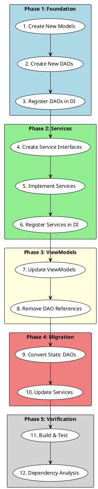

# Architecture Compliance Refactoring - Developer Quickstart Guide

**Feature**: 007-architecture-compliance  
**Date**: 2025-12-27  
**Phase**: 1 - Implementation Guide

## Overview

This quickstart guide provides step-by-step instructions for implementing the Architecture Compliance Refactoring. Follow this guide to convert static DAOs to instance-based pattern, create new service layers, and fix constitutional violations.

**Estimated Time**: 8-12 workdays (1 sprint)

---

## Prerequisites

Before starting, ensure you have:

- [ ] Read [Constitution v1.2.0](.specify/memory/constitution.md) - Principles I, II, III, X
- [ ] Read [research.md](./research.md) - Understand DI pattern decisions
- [ ] Read [data-model.md](./data-model.md) - Understand entity structures
- [ ] VS Code with C# extension and PlantUML extension installed
- [ ] MySQL Workbench or CLI access to mtm_receiving_application database
- [ ] SQL Server Management Studio or Azure Data Studio for Infor Visual (read-only)
- [ ] Build succeeds: `dotnet build`
- [ ] Tests pass: `dotnet test`

---

## Implementation Roadmap



---

## Phase 1: Create Foundation Components

### Step 1: Create New Data Models

**Files to Create**:
- `Models/InforVisual/Model_InforVisualPO.cs`
- `Models/InforVisual/Model_InforVisualPart.cs`
- `Models/Receiving/Model_PackageTypePreference.cs` (if doesn't exist)

**Template** (Model_InforVisualPO.cs):
```csharp
using CommunityToolkit.Mvvm.ComponentModel;

namespace MTM_Receiving_Application.Models.InforVisual;

public partial class Model_InforVisualPO : ObservableObject
{
    [ObservableProperty]
    private string _poNumber = string.Empty;
    
    [ObservableProperty]
    private int _poLine;
    
    [ObservableProperty]
    private string _partNumber = string.Empty;
    
    [ObservableProperty]
    private string _partDescription = string.Empty;
    
    [ObservableProperty]
    private decimal _orderedQty;
    
    [ObservableProperty]
    private decimal _receivedQty;
    
    [ObservableProperty]
    private decimal _remainingQty;
    
    [ObservableProperty]
    private string _unitOfMeasure = "EA";
    
    [ObservableProperty]
    private DateTime? _dueDate;
    
    [ObservableProperty]
    private string _vendorCode = string.Empty;
    
    [ObservableProperty]
    private string _vendorName = string.Empty;
    
    [ObservableProperty]
    private string _poStatus = string.Empty;
    
    [ObservableProperty]
    private string _siteId = "002";
}
```

**Verify**: Build succeeds - `dotnet build`

---

### Step 2: Create New DAOs (Instance-Based)

**Files to Create**:
- `Data/Receiving/Dao_ReceivingLoad.cs`
- `Data/Receiving/Dao_PackageTypePreference.cs`
- `Data/InforVisual/Dao_InforVisualPO.cs` (new directory)
- `Data/InforVisual/Dao_InforVisualPart.cs`

**Template** (Dao_ReceivingLoad.cs):
```csharp
using MTM_Receiving_Application.Helpers.Database;
using MTM_Receiving_Application.Models.Core;
using MTM_Receiving_Application.Models.Receiving;
using MySql.Data.MySqlClient;

namespace MTM_Receiving_Application.Data.Receiving;

public class Dao_ReceivingLoad
{
    private readonly string _connectionString;
    
    public Dao_ReceivingLoad(string connectionString)
    {
        _connectionString = connectionString ?? throw new ArgumentNullException(nameof(connectionString));
    }
    
    public async Task<Model_Dao_Result<List<Model_ReceivingLoad>>> GetAllAsync()
    {
        try
        {
            var parameters = new Dictionary<string, object>();
            
            return await Helper_Database_StoredProcedure.ExecuteStoredProcedureAsync<Model_ReceivingLoad>(
                _connectionString,
                "sp_receiving_loads_get_all",
                parameters);
        }
        catch (Exception ex)
        {
            return DaoResultFactory.Failure<List<Model_ReceivingLoad>>(
                $"Error retrieving receiving loads: {ex.Message}",
                ex);
        }
    }
    
    // ... other methods (see contracts/Dao_ReceivingLoad.md)
}
```

**Template** (Dao_InforVisualPO.cs - READ-ONLY):
```csharp
using Microsoft.Data.SqlClient;
using MTM_Receiving_Application.Models.Core;
using MTM_Receiving_Application.Models.InforVisual;

namespace MTM_Receiving_Application.Data.InforVisual;

public class Dao_InforVisualPO
{
    private readonly string _connectionString;
    
    public Dao_InforVisualPO(string inforVisualConnectionString)
    {
        ValidateReadOnlyConnection(inforVisualConnectionString);
        _connectionString = inforVisualConnectionString;
    }
    
    private static void ValidateReadOnlyConnection(string connectionString)
    {
        if (string.IsNullOrWhiteSpace(connectionString))
            throw new ArgumentNullException(nameof(connectionString));
        
        try
        {
            var builder = new SqlConnectionStringBuilder(connectionString);
            
            if (builder.ApplicationIntent != ApplicationIntent.ReadOnly)
            {
                throw new InvalidOperationException(
                    $"CONSTITUTIONAL VIOLATION: Infor Visual DAO requires ApplicationIntent=ReadOnly. " +
                    $"Current ApplicationIntent: {builder.ApplicationIntent}. " +
                    $"Writing to Infor Visual ERP database is STRICTLY PROHIBITED. " +
                    "See Constitution Principle X: Infor Visual DAO Architecture.");
            }
        }
        catch (ArgumentException ex)
        {
            throw new InvalidOperationException(
                $"Invalid Infor Visual connection string format: {ex.Message}", ex);
        }
    }
    
    // ... methods (see contracts/Dao_InforVisualPO.md)
}
```

**Verify**: Build succeeds - `dotnet build`

---

### Step 3: Register DAOs in Dependency Injection

**File to Modify**: `App.xaml.cs`

**Location**: Find the `ConfigureServices` method

**Add Registration Code**:
```csharp
private void ConfigureServices(HostBuilderContext context, IServiceCollection services)
{
    // ... existing registrations ...
    
    // Get connection strings
    var mySqlConnectionString = Helper_Database_Variables.GetConnectionString();
    var inforVisualConnectionString = Helper_Database_Variables.GetInforVisualConnectionString();
    
    // Register NEW MySQL DAOs (Singleton - stateless data access)
    services.AddSingleton(sp => new Dao_ReceivingLoad(mySqlConnectionString));
    services.AddSingleton(sp => new Dao_PackageTypePreference(mySqlConnectionString));
    
    // Register NEW Infor Visual DAOs (READ-ONLY)
    services.AddSingleton(sp => new Dao_InforVisualPO(inforVisualConnectionString));
    services.AddSingleton(sp => new Dao_InforVisualPart(inforVisualConnectionString));
    
    // ... rest of registrations ...
}
```

**Verify**: Application starts without DI errors - Run app and check for startup exceptions

---

## Phase 2: Create Service Layer

### Step 4: Create Service Interfaces

**Files to Create**:
- `Contracts/Services/IService_UserPreferences.cs`
- `Contracts/Services/IService_MySQL_ReceivingLine.cs`

**Template** (IService_UserPreferences.cs):
```csharp
using MTM_Receiving_Application.Models.Core;
using MTM_Receiving_Application.Models.Systems;

namespace MTM_Receiving_Application.Contracts.Services;

public interface IService_UserPreferences
{
    Task<Model_Dao_Result<Model_UserPreference>> GetLatestUserPreferenceAsync(string username);
    Task<Model_Dao_Result> UpdateDefaultModeAsync(string username, string defaultMode);
}
```

**Verify**: Build succeeds

---

### Step 5: Implement Service Classes

**Files to Create**:
- `Services/Database/Service_UserPreferences.cs`
- `Services/Receiving/Service_MySQL_ReceivingLine.cs`

**Template** (Service_UserPreferences.cs):
```csharp
using MTM_Receiving_Application.Contracts.Services;
using MTM_Receiving_Application.Data.Authentication;
using MTM_Receiving_Application.Helpers.Database;
using MTM_Receiving_Application.Models.Core;
using MTM_Receiving_Application.Models.Enums;
using MTM_Receiving_Application.Models.Systems;

namespace MTM_Receiving_Application.Services.Database;

public class Service_UserPreferences : IService_UserPreferences
{
    private readonly Dao_User _userDao;
    private readonly ILoggingService _logger;
    private readonly IService_ErrorHandler _errorHandler;
    
    public Service_UserPreferences(
        Dao_User userDao,
        ILoggingService logger,
        IService_ErrorHandler errorHandler)
    {
        _userDao = userDao;
        _logger = logger;
        _errorHandler = errorHandler;
    }
    
    public async Task<Model_Dao_Result<Model_UserPreference>> GetLatestUserPreferenceAsync(string username)
    {
        try
        {
            // BUSINESS RULE: Username normalization
            var normalizedUsername = username?.Trim().ToUpperInvariant();
            if (string.IsNullOrWhiteSpace(normalizedUsername))
            {
                return DaoResultFactory.Failure<Model_UserPreference>(
                    "Username cannot be empty",
                    Enum_ErrorSeverity.Medium);
            }
            
            // DELEGATE TO DAO
            var result = await _userDao.GetLatestPreferenceAsync(normalizedUsername);
            
            // LOGGING
            if (result.IsSuccess)
            {
                await _logger.LogInfoAsync(
                    "UserPreferences",
                    $"Retrieved preference for user {normalizedUsername}");
            }
            else
            {
                await _logger.LogErrorAsync(
                    "UserPreferences",
                    $"Failed to retrieve preference: {result.ErrorMessage}");
            }
            
            return result;
        }
        catch (Exception ex)
        {
            _errorHandler.HandleException(ex, Enum_ErrorSeverity.High, 
                nameof(GetLatestUserPreferenceAsync), nameof(Service_UserPreferences));
            
            return DaoResultFactory.Failure<Model_UserPreference>(
                "An error occurred while retrieving user preferences.", ex);
        }
    }
    
    public async Task<Model_Dao_Result> UpdateDefaultModeAsync(string username, string defaultMode)
    {
        try
        {
            // BUSINESS VALIDATION
            var normalizedUsername = username?.Trim().ToUpperInvariant();
            if (string.IsNullOrWhiteSpace(normalizedUsername))
            {
                return DaoResultFactory.Failure("Username cannot be empty");
            }
            
            if (defaultMode != "Package" && defaultMode != "Pallet")
            {
                return DaoResultFactory.Failure(
                    $"Invalid default mode '{defaultMode}'. Must be 'Package' or 'Pallet'.");
            }
            
            // DELEGATE TO DAO
            var result = await _userDao.UpdateDefaultModeAsync(normalizedUsername, defaultMode);
            
            // LOGGING
            if (result.IsSuccess)
            {
                await _logger.LogInfoAsync(
                    "UserPreferences",
                    $"Updated preference for {normalizedUsername}: {defaultMode}");
            }
            
            return result;
        }
        catch (Exception ex)
        {
            _errorHandler.HandleException(ex, Enum_ErrorSeverity.High, 
                nameof(UpdateDefaultModeAsync), nameof(Service_UserPreferences));
            
            return DaoResultFactory.Failure("An error occurred while updating preference.", ex);
        }
    }
}
```

**Verify**: Build succeeds

---

### Step 6: Register Services in DI

**File to Modify**: `App.xaml.cs`

**Add to ConfigureServices**:
```csharp
// Register NEW Service Interfaces (Transient - new instance per request)
services.AddTransient<IService_UserPreferences, Service_UserPreferences>();
services.AddTransient<IService_MySQL_ReceivingLine, Service_MySQL_ReceivingLine>();
```

**Verify**: Application starts without errors

---

## Phase 3: Fix ViewModel Violations

### Step 7: Update ReceivingModeSelectionViewModel

**File to Modify**: `ViewModels/Receiving/ReceivingModeSelectionViewModel.cs`

**BEFORE** (Constitutional Violation):
```csharp
// ❌ FORBIDDEN - Direct DAO access
using MTM_Receiving_Application.Data.Authentication;

private async Task SavePreferenceAsync()
{
    var dao = new Dao_User();
    await dao.UpdateDefaultModeAsync(username, selectedMode);
}
```

**AFTER** (Constitutional Compliance):
```csharp
// ✅ CORRECT - Service layer access
using MTM_Receiving_Application.Contracts.Services;

private readonly IService_UserPreferences _userPreferencesService;

public ReceivingModeSelectionViewModel(
    IService_UserPreferences userPreferencesService,
    IService_ErrorHandler errorHandler,
    ILoggingService logger) : base(errorHandler, logger)
{
    _userPreferencesService = userPreferencesService;
}

[RelayCommand]
private async Task SavePreferenceAsync()
{
    var result = await _userPreferencesService.UpdateDefaultModeAsync(
        CurrentUsername, 
        SelectedMode);
    
    if (!result.IsSuccess)
    {
        _errorHandler.ShowUserError(
            result.ErrorMessage, 
            "Save Preference Error", 
            nameof(SavePreferenceAsync));
    }
}
```

**Verify**:
- [ ] No `using MTM_Receiving_Application.Data.*` statements
- [ ] Constructor injects `IService_UserPreferences`
- [ ] Build succeeds
- [ ] ViewModel registered in App.xaml.cs DI

---

### Step 8: Update ReceivingLabelViewModel

**File to Modify**: `ViewModels/Receiving/ReceivingLabelViewModel.cs`

**BEFORE**:
```csharp
// ❌ FORBIDDEN
using MTM_Receiving_Application.Data.Receiving;

await Dao_ReceivingLine.InsertReceivingLineAsync(newLine);
```

**AFTER**:
```csharp
// ✅ CORRECT
using MTM_Receiving_Application.Contracts.Services;

private readonly IService_MySQL_ReceivingLine _receivingLineService;

public ReceivingLabelViewModel(
    IService_MySQL_ReceivingLine receivingLineService,
    IService_ErrorHandler errorHandler,
    ILoggingService logger) : base(errorHandler, logger)
{
    _receivingLineService = receivingLineService;
}

[RelayCommand]
private async Task SaveLineAsync()
{
    var result = await _receivingLineService.InsertReceivingLineAsync(newLine);
    
    if (!result.IsSuccess)
    {
        _errorHandler.ShowUserError(result.ErrorMessage, "Save Error", nameof(SaveLineAsync));
    }
}
```

**Verify**:
- [ ] No DAO references
- [ ] Build succeeds
- [ ] ViewModels run correctly (test manually)

---

## Phase 4: Convert Static DAOs to Instance-Based

### Step 9: Convert Dao_DunnageLoad (Example)

**File to Modify**: `Data/Dunnage/Dao_DunnageLoad.cs`

**BEFORE** (Static):
```csharp
public static class Dao_DunnageLoad
{
    private static string ConnectionString => Helper_Database_Variables.GetConnectionString();
    
    public static async Task<Model_Dao_Result<List<Model_DunnageLoad>>> GetAllAsync()
    {
        return await Helper_Database_StoredProcedure.ExecuteStoredProcedureAsync<Model_DunnageLoad>(
            ConnectionString,
            "sp_dunnage_loads_get_all",
            new Dictionary<string, object>());
    }
}
```

**AFTER** (Instance-Based):
```csharp
public class Dao_DunnageLoad
{
    private readonly string _connectionString;
    
    public Dao_DunnageLoad(string connectionString)
    {
        _connectionString = connectionString ?? throw new ArgumentNullException(nameof(connectionString));
    }
    
    public async Task<Model_Dao_Result<List<Model_DunnageLoad>>> GetAllAsync()
    {
        try
        {
            return await Helper_Database_StoredProcedure.ExecuteStoredProcedureAsync<Model_DunnageLoad>(
                _connectionString,
                "sp_dunnage_loads_get_all",
                new Dictionary<string, object>());
        }
        catch (Exception ex)
        {
            return DaoResultFactory.Failure<List<Model_DunnageLoad>>(
                $"Error retrieving dunnage loads: {ex.Message}",
                ex);
        }
    }
}
```

**Register in App.xaml.cs**:
```csharp
services.AddSingleton(sp => new Dao_DunnageLoad(mySqlConnectionString));
services.AddSingleton(sp => new Dao_DunnageType(mySqlConnectionString));
services.AddSingleton(sp => new Dao_DunnagePart(mySqlConnectionString));
services.AddSingleton(sp => new Dao_DunnageSpec(mySqlConnectionString));
services.AddSingleton(sp => new Dao_InventoriedDunnage(mySqlConnectionString));
```

**Repeat for**:
- Dao_DunnageType
- Dao_DunnagePart
- Dao_DunnageSpec
- Dao_InventoriedDunnage

**Verify**: Build succeeds after each DAO conversion

---

### Step 10: Update Services to Inject DAOs

**File to Modify**: `Services/Database/Service_MySQL_Dunnage.cs`

**BEFORE**:
```csharp
public async Task<Model_Dao_Result<List<Model_DunnageLoad>>> GetLoadsAsync()
{
    return await Dao_DunnageLoad.GetAllAsync(); // Static call
}
```

**AFTER**:
```csharp
private readonly Dao_DunnageLoad _dunnageLoadDao;
private readonly Dao_DunnageType _dunnageTypeDao;

public Service_MySQL_Dunnage(
    Dao_DunnageLoad dunnageLoadDao,
    Dao_DunnageType dunnageTypeDao,
    ILoggingService logger,
    IService_ErrorHandler errorHandler)
{
    _dunnageLoadDao = dunnageLoadDao;
    _dunnageTypeDao = dunnageTypeDao;
    // ... other DAOs
}

public async Task<Model_Dao_Result<List<Model_DunnageLoad>>> GetLoadsAsync()
{
    return await _dunnageLoadDao.GetAllAsync(); // Instance method
}
```

**Verify**: All tests pass - `dotnet test`

---

## Phase 5: Verification & Validation

### Step 11: Build & Test

**Commands**:
```powershell
# Clean build
dotnet clean
dotnet build

# Expected: 0 errors, 0 warnings

# Run tests
dotnet test

# Expected: All tests pass
```

**Manual Testing**:
- [ ] Application starts without DI errors
- [ ] ReceivingModeSelectionView loads and saves preferences
- [ ] ReceivingLabelView creates receiving lines
- [ ] No exceptions in ApplicationErrorLog.csv

---

### Step 12: Dependency Analysis

**Install Extension** (if not installed):
```
VS Code → Extensions → Search "C# Dependency Graph" → Install
```

**Run Analysis**:
1. Right-click on `MTM_Receiving_Application.csproj`
2. Select "Generate Dependency Graph"
3. Review generated `class-dependency-graph.dot` file

**Verify Constitutional Compliance**:
```
✅ NO ViewModel → DAO edges (only ViewModel → Service edges)
✅ NO Service → Database edges (only Service → DAO edges)
✅ NO circular dependencies
```

**Example Valid Path**:
```
ReceivingModeSelectionViewModel → IService_UserPreferences → Dao_User → MySQL
```

**Example Invalid Path** (should NOT exist):
```
❌ ReceivingModeSelectionViewModel → Dao_User → MySQL
```

---

## Common Issues & Solutions

### Issue: DI Resolution Error on Startup

**Error**:
```
Unable to resolve service for type 'IService_UserPreferences' while attempting to activate 'ReceivingModeSelectionViewModel'
```

**Solution**:
1. Verify service registered in App.xaml.cs:
   ```csharp
   services.AddTransient<IService_UserPreferences, Service_UserPreferences>();
   ```
2. Verify ViewModel registered:
   ```csharp
   services.AddTransient<ReceivingModeSelectionViewModel>();
   ```
3. Restart application

---

### Issue: Constructor ArgumentNullException in DAO

**Error**:
```
System.ArgumentNullException: Value cannot be null. (Parameter 'connectionString')
```

**Solution**:
1. Verify Helper_Database_Variables.GetConnectionString() returns valid connection string
2. Check App.xaml.cs registration uses correct connection string variable
3. Ensure connection string is not null at startup

---

### Issue: Infor Visual DAO Throws InvalidOperationException

**Error**:
```
CONSTITUTIONAL VIOLATION: Infor Visual DAO requires ApplicationIntent=ReadOnly
```

**Solution**:
1. Verify Helper_Database_Variables.GetInforVisualConnectionString() includes:
   ```
   Server=VISUAL;Database=MTMFG;ApplicationIntent=ReadOnly;...
   ```
2. If missing, add ApplicationIntent=ReadOnly to connection string
3. Restart application

---

### Issue: Static DAO Methods Still Called

**Error**:
```
CS0176: Member 'Dao_DunnageLoad.GetAllAsync()' cannot be accessed with an instance reference
```

**Solution**:
1. DAO class converted but service still uses static call
2. Update service to inject DAO instance via constructor
3. Change static call `Dao_DunnageLoad.GetAllAsync()` to instance call `_dunnageLoadDao.GetAllAsync()`

---

## Checklist: Ready for Code Review

Before submitting PR, verify:

- [ ] All 4 new DAOs created (ReceivingLoad, PackageTypePreference, InforVisualPO, InforVisualPart)
- [ ] All 5 static DAOs converted to instance-based (Dunnage domain)
- [ ] All 2 ViewModels updated (ReceivingModeSelection, ReceivingLabel)
- [ ] All new services created (UserPreferences, MySQL_ReceivingLine)
- [ ] All DI registrations added to App.xaml.cs
- [ ] Build succeeds: `dotnet build` (0 errors, 0 warnings)
- [ ] Tests pass: `dotnet test` (100% pass rate)
- [ ] Dependency graph shows no ViewModel→DAO violations
- [ ] Application runs and core receiving workflow works
- [ ] No `using MTM_Receiving_Application.Data.*` in ViewModels/
- [ ] Infor Visual DAOs enforce ApplicationIntent=ReadOnly

---

## Next Steps After Refactoring

1. **Create Documentation** (Constitution Amendment 9 requirement):
   - `.github/instructions/architecture-refactoring-guide.instructions.md`
   - `.github/instructions/service-dao-pattern.instructions.md`
   - `.github/instructions/dependency-analysis.instructions.md`
   - `.github/instructions/dao-instance-pattern.instructions.md`

2. **Update Existing Documentation**:
   - `.github/instructions/mvvm-pattern.instructions.md` - Add ViewModel→Service→DAO diagram
   - `.github/instructions/dao-pattern.instructions.md` - Deprecate static pattern

3. **Run Comprehensive Tests**:
   - Integration tests with real databases
   - Manual end-to-end workflow testing
   - Performance benchmarks (ensure <200ms DAO operations)

4. **Update Specification**:
   - Mark tasks complete in `specs/007-architecture-compliance/tasks.md`
   - Document any deviations from original plan
   - Update success criteria in `spec.md`

---

## Support & Resources

- **Spec Documents**: `specs/007-architecture-compliance/`
- **Constitution**: `.specify/memory/constitution.md`
- **Contracts**: `specs/007-architecture-compliance/contracts/*.md`
- **Research Decisions**: `specs/007-architecture-compliance/research.md`
- **Data Model**: `specs/007-architecture-compliance/data-model.md`

**Questions?** Refer to constitutional principles and research decisions first. If unclear, consult with tech lead before proceeding.
