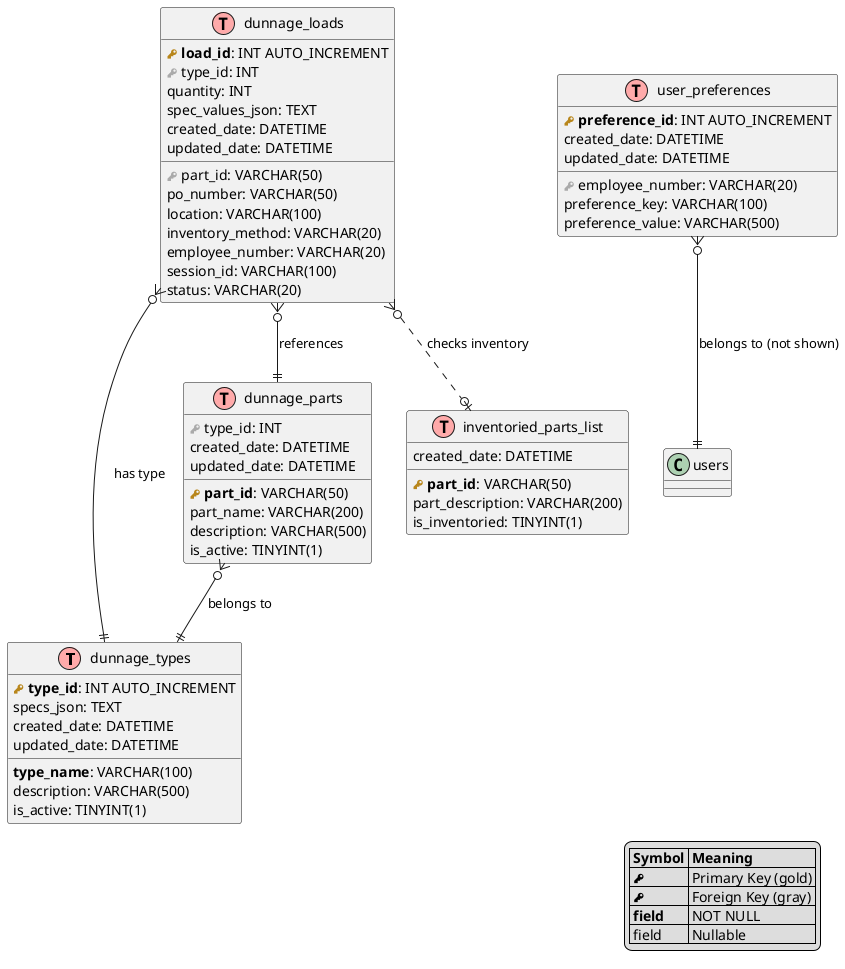
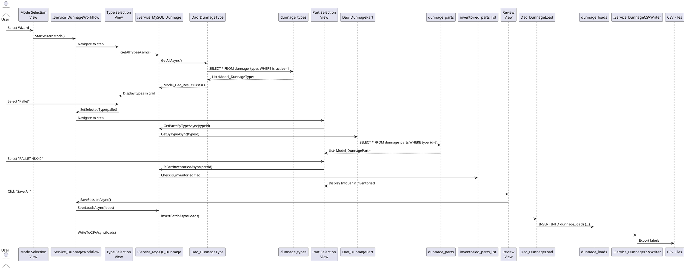

# Data Model: Dunnage Wizard Workflow UI

**Feature**: `008-dunnage-ui`  
**Date**: December 27, 2025  
**Status**: Complete (No New Schema)

## Overview

This feature is **UI-only** and does NOT introduce new database schema. All database tables, relationships, and stored procedures were created in feature `007-architecture-compliance` (Dunnage Services Layer).

This document describes the **existing** data model that the UI will interact with via Services and DAOs.

---

## Existing Database Schema (Reference Only)

### Entity Relationship Diagram



### Table Descriptions

#### `dunnage_types`
Defines dunnage types (e.g., Pallet, Crate, Tote) with dynamic specification schemas.

**Key Fields:**
- `type_id`: Unique identifier
- `type_name`: Display name (e.g., "Pallet", "Crate")
- `specs_json`: JSON string defining dynamic spec schema
  - Example: `[{"name": "Width", "data_type": "number", "unit": "inches", "default_value": 48}, {"name": "IsInventoriedToVisual", "data_type": "boolean", "default_value": false}]`
- `is_active`: Flag for soft deletion

**Usage in UI**: Type Selection view loads all active types, displays in paginated 3x3 grid.

---

#### `dunnage_parts`
Defines specific dunnage parts within each type (e.g., "PALLET-48X40", "CRATE-LARGE").

**Key Fields:**
- `part_id`: Unique part identifier (VARCHAR, user-defined)
- `type_id`: Foreign key to `dunnage_types`
- `part_name`: Display name
- `is_active`: Flag for soft deletion

**Usage in UI**: Part Selection view loads parts filtered by selected type from Type Selection.

---

#### `dunnage_loads`
Stores individual dunnage receiving transactions created via wizard or manual entry.

**Key Fields:**
- `load_id`: Unique identifier for each load
- `type_id`, `part_id`: References to type and part
- `quantity`: Number of units received
- `po_number`: Purchase order (optional, affects inventory method)
- `location`: Storage location (optional)
- `spec_values_json`: JSON string storing dynamic spec values
  - Example: `{"Width": 48, "Height": 40, "Depth": 6, "IsInventoriedToVisual": true}`
- `inventory_method`: "Adjust In" or "Receive In" (determined by PO presence for inventoried parts)
- `session_id`: Groups loads from same wizard session for batch operations
- `status`: "Completed", "In Progress" (for history saves)
- `employee_number`: User who created the load
- `created_date`: Timestamp of creation

**Usage in UI**:
- Review view displays all loads in current session
- Manual Entry view allows bulk editing of loads
- Edit Mode view loads historical loads by date range

---

#### `inventoried_parts_list`
Lookup table identifying which parts require Visual ERP inventory tracking.

**Key Fields:**
- `part_id`: Part identifier (matches `dunnage_parts.part_id`)
- `is_inventoried`: Boolean flag indicating Visual inventory requirement

**Usage in UI**: Part Selection checks this table to display InfoBar notification ("This part requires inventory in Visual. Method: {method}").

---

#### `user_preferences`
Stores per-user preferences including default dunnage mode selection.

**Key Fields:**
- `employee_number`: User identifier
- `preference_key`: Preference name (e.g., "DefaultDunnageMode")
- `preference_value`: Preference value (e.g., "Guided", "Manual", "Edit")

**Usage in UI**: Mode Selection saves/loads default mode preference to skip mode selection on future launches.

---

## Data Flow Through UI



---

## Stored Procedures (Existing - Reference Only)

All stored procedures already exist from feature `007-architecture-compliance`. UI calls them via DAOs.

### Type Operations
- `sp_dunnage_types_get_all` - Retrieve all active types
- `sp_dunnage_types_get_by_id` - Retrieve single type
- `sp_dunnage_types_insert` - Create new type (Admin UI only, not wizard)
- `sp_dunnage_types_update` - Update type (Admin UI only)

### Part Operations
- `sp_dunnage_parts_get_all` - Retrieve all active parts
- `sp_dunnage_parts_get_by_type` - Retrieve parts filtered by type
- `sp_dunnage_parts_get_by_id` - Retrieve single part
- `sp_dunnage_parts_insert` - Create new part (Quick Add dialog)
- `sp_dunnage_parts_update` - Update part (Edit mode)

### Load Operations
- `sp_dunnage_loads_insert` - Insert single load
- `sp_dunnage_loads_insert_batch` - Insert multiple loads (wizard "Save All")
- `sp_dunnage_loads_get_by_session` - Retrieve loads by session_id
- `sp_dunnage_loads_get_by_date_range` - Retrieve loads by created_date (Edit Mode)
- `sp_dunnage_loads_update` - Update existing load (Edit Mode)
- `sp_dunnage_loads_delete` - Soft delete load (Edit Mode)

### Inventory Check
- `sp_inventoried_parts_check` - Check if part is inventoried

### Preferences
- `sp_user_preferences_get` - Retrieve preference by key
- `sp_user_preferences_set` - Insert or update preference
- `sp_user_preferences_delete` - Delete preference

---

## Models (Existing - Reference Only)

All models already exist in `Models/Dunnage/` folder.

### `Model_DunnageType`
```csharp
public partial class Model_DunnageType : ObservableObject
{
    [ObservableProperty]
    private int _typeId;

    [ObservableProperty]
    private string _typeName = string.Empty;

    [ObservableProperty]
    private string _description = string.Empty;

    [ObservableProperty]
    private string _specsJson = string.Empty; // JSON string

    [ObservableProperty]
    private bool _isActive = true;

    [ObservableProperty]
    private DateTime _createdDate = DateTime.Now;

    [ObservableProperty]
    private DateTime _updatedDate = DateTime.Now;

    // Computed property for UI (deserialize SpecsJson)
    public List<SpecDefinition> ParsedSpecs => 
        string.IsNullOrEmpty(SpecsJson) 
            ? new List<SpecDefinition>() 
            : JsonSerializer.Deserialize<List<SpecDefinition>>(SpecsJson);
}

public class SpecDefinition
{
    public string Name { get; set; }
    public string DataType { get; set; } // "text", "number", "boolean"
    public string Unit { get; set; }
    public object DefaultValue { get; set; }
}
```

### `Model_DunnagePart`
```csharp
public partial class Model_DunnagePart : ObservableObject
{
    [ObservableProperty]
    private string _partId = string.Empty;

    [ObservableProperty]
    private int _typeId;

    [ObservableProperty]
    private string _partName = string.Empty;

    [ObservableProperty]
    private string _description = string.Empty;

    [ObservableProperty]
    private bool _isActive = true;

    [ObservableProperty]
    private DateTime _createdDate = DateTime.Now;

    [ObservableProperty]
    private DateTime _updatedDate = DateTime.Now;

    // Navigation property
    [ObservableProperty]
    private Model_DunnageType _type = new();
}
```

### `Model_DunnageLoad`
```csharp
public partial class Model_DunnageLoad : ObservableObject
{
    [ObservableProperty]
    private int _loadId;

    [ObservableProperty]
    private int _typeId;

    [ObservableProperty]
    private string _partId = string.Empty;

    [ObservableProperty]
    private int _quantity = 1;

    [ObservableProperty]
    private string _poNumber = string.Empty;

    [ObservableProperty]
    private string _location = string.Empty;

    [ObservableProperty]
    private string _specValuesJson = string.Empty; // JSON string

    [ObservableProperty]
    private string _inventoryMethod = "Adjust In";

    [ObservableProperty]
    private string _employeeNumber = string.Empty;

    [ObservableProperty]
    private string _sessionId = string.Empty;

    [ObservableProperty]
    private string _status = "Completed";

    [ObservableProperty]
    private DateTime _createdDate = DateTime.Now;

    [ObservableProperty]
    private DateTime _updatedDate = DateTime.Now;

    // Navigation properties
    [ObservableProperty]
    private Model_DunnageType _type = new();

    [ObservableProperty]
    private Model_DunnagePart _part = new();

    // Computed property for UI
    public Dictionary<string, object> ParsedSpecValues => 
        string.IsNullOrEmpty(SpecValuesJson) 
            ? new Dictionary<string, object>() 
            : JsonSerializer.Deserialize<Dictionary<string, object>>(SpecValuesJson);
}
```

---

## Validation Rules (Enforced by UI)

### Type Selection
- At least 1 type must be active in database to enable wizard
- Type selection is REQUIRED before advancing to Part Selection

### Part Selection
- Parts filtered by selected type (WHERE type_id = @SelectedTypeId)
- Part selection is REQUIRED before advancing to Quantity Entry

### Quantity Entry
- Quantity > 0 (validation in ViewModel before Next)
- Default value: 1

### Details Entry
- PO Number: Optional (VARCHAR 50)
- Location: Optional (VARCHAR 100)
- Dynamic specs: Validated based on data_type
  - "number": Must be numeric
  - "text": Max 200 characters
  - "boolean": true/false only
- Required specs (from spec schema) must be filled before advancing

### Review & Save
- All loads in session must pass validation
- Session ID must be unique (GUID generated by workflow service)
- Employee number must be set from current session
- Minimum 1 load required to save

---

## MySQL 5.7.24 Compatibility Notes

**No New Schema Changes Required** - All tables were created in feature `007-architecture-compliance` with MySQL 5.7.24 compatibility:

- ✅ NO JSON data type (using TEXT with manual serialization/deserialization in C#)
- ✅ NO CTEs (Common Table Expressions)
- ✅ NO window functions (ROW_NUMBER, RANK, etc.)
- ✅ NO CHECK constraints (validation in application layer)
- ✅ Uses TINYINT(1) for boolean flags instead of BOOLEAN
- ✅ Uses VARCHAR instead of JSON for schema storage
- ✅ All date filtering uses >= and <= operators, not date functions

---

## Summary

This feature is **purely UI/UX** and introduces:
- ❌ Zero new database tables
- ❌ Zero new stored procedures
- ❌ Zero new models
- ✅ Uses 100% existing data structures from `007-architecture-compliance`

All data interactions go through:
1. **ViewModel** → 2. **IService_MySQL_Dunnage** → 3. **Dao_Dunnage**** → 4. **MySQL stored procedures** → 5. **Database tables**

Following strict MVVM + Service→DAO delegation pattern per Constitution v1.2.1.
