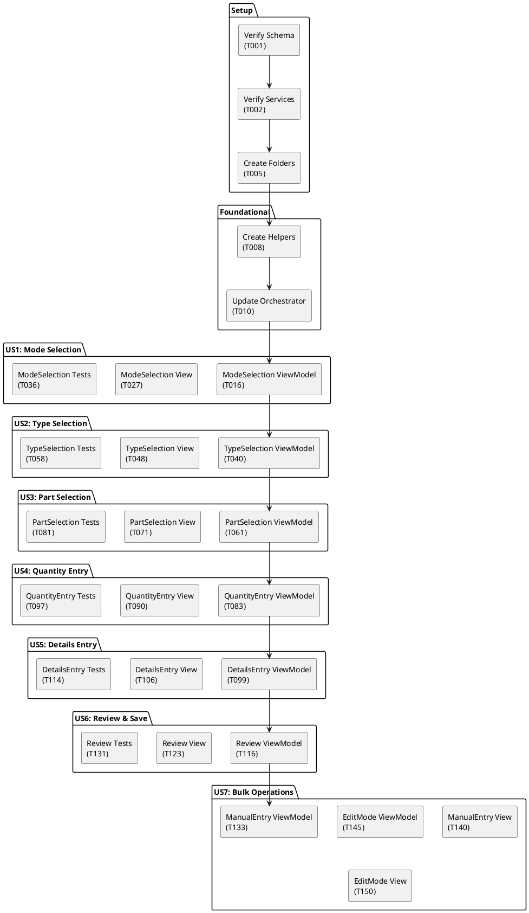

# Implementation Tasks: Dunnage Wizard Workflow UI

**Feature**: `008-dunnage-ui`  
**Branch**: `008-dunnage-ui`  
**Spec**: [spec.md](spec.md) | **Plan**: [plan.md](plan.md)  
**Generated**: December 27, 2025

---

## Task Overview

**Total Tasks**: 65  
**P1 User Stories**: 6 (Mode Selection, Type Selection, Part Selection, Quantity, Details, Review)  
**P2 User Stories**: 1 (Bulk Operations)  
**Estimated Completion**: 10-12 days (assuming 1 developer)

**MVP Scope**: User Stories 1-6 (all P1 tasks) = ~55 tasks  
**Full Feature**: Include User Story 7 (P2 bulk operations) = 65 tasks

---

## Implementation Strategy

**Incremental Delivery**:
1. **MVP**: Wizard workflow only (US1-US6) - enables guided receiving
2. **Enhancement**: Manual Entry mode (partial US7) - enables bulk entry
3. **Complete**: Edit Mode + Bulk utilities (full US7) - enables historical editing

**Parallel Development Opportunities**:
- ViewModels can be implemented in parallel (different developers)
- Views can be implemented after ViewModel contracts are complete
- Unit tests can be written alongside ViewModel implementation

**Critical Path**: Setup → Mode Selection → Type Selection → Part Selection → Quantity → Details → Review (linear wizard flow)

---

## Phase 1: Setup & Infrastructure

**Goal**: Prepare environment, register dependencies, verify existing services

### Tasks

- [x] T001 Verify database schema and seed data exist in `mtm_receiving_application` database
- [x] T002 Verify existing services are functional: IService_DunnageWorkflow, IService_MySQL_Dunnage, IService_DunnageCSVWriter in Services/ folder
- [x] T003 Verify existing DAOs are instance-based: Dao_DunnageType, Dao_DunnagePart, Dao_DunnageLoad in Data/Dunnage/ folder
- [x] T004 Verify existing models exist: Model_DunnageType, Model_DunnagePart, Model_DunnageLoad in Models/Dunnage/ folder
- [x] T005 Create ViewModels/Dunnage/ folder if not exists
- [x] T006 Create Views/Dunnage/ folder if not exists
- [x] T007 Create MTM_Receiving_Application.Tests/Unit/ViewModels/Dunnage/ folder for unit tests

**Completion Criteria**:
- [ ] All folders exist
- [ ] Existing services compile without errors
- [ ] Database has at least 3 seed types and 5 seed parts
- [ ] `dotnet build` succeeds with no errors

---

## Phase 2: Foundational Components

**Goal**: Create shared helpers and update orchestrator before implementing user stories

### Tasks

- [x] T008 Create SpecInputViewModel helper class in ViewModels/Dunnage/Helpers/SpecInputViewModel.cs with properties: SpecName, DataType, Value, Unit, IsRequired
- [x] T009 Create SpecInputTemplateSelector in Views/Dunnage/Helpers/SpecInputTemplateSelector.cs with TextTemplate, NumberTemplate, BooleanTemplate
- [x] T010 Update Main_DunnageLabelViewModel in ViewModels/Main/Main_DunnageLabelViewModel.cs to add step visibility properties: IsModeSelectionVisible, IsTypeSelectionVisible, IsPartSelectionVisible, IsQuantityEntryVisible, IsDetailsEntryVisible, IsReviewVisible, IsManualEntryVisible, IsEditModeVisible
- [x] T011 Update Main_DunnageLabelViewModel.cs to subscribe to IService_DunnageWorkflow.StepChanged event in constructor
- [x] T012 Update Main_DunnageLabelViewModel.cs to implement OnWorkflowStepChanged method that sets visibility flags based on Enum_DunnageWorkflowStep
- [x] T013 Update Main_DunnageLabelViewModel.cs to add ReturnToModeSelectionCommand that calls _workflowService.ClearSession() and GoToStep(ModeSelection)
- [x] T014 Update Main_DunnageLabelPage.xaml in Views/Main/ to add xmlns:dunnageViews for Views.Dunnage namespace
- [x] T015 Update Main_DunnageLabelPage.xaml to add InfoBar at top with IsOpen, Message, Severity bindings to ViewModel status properties

**Completion Criteria**:
- [x] Orchestrator ViewModel compiles
- [x] StepChanged event wiring works (verify with breakpoint)
- [x] Visibility properties toggle correctly

---

## Phase 3: User Story 1 - Wizard Orchestration & Mode Selection (P1)

**Goal**: Enable mode selection with default preference persistence

**Independent Test Criteria**:
- Mode selection view displays with 3 cards (Guided, Manual, Edit)
- Clicking each mode navigates to correct workflow
- "Set as default" checkbox saves preference to database
- Default mode auto-navigates on page load when preference exists
- "Return to Mode Selection" button shows mode selection from any workflow

### Tasks

- [x] T016 [P] [US1] Create Dunnage_ModeSelectionViewModel.cs in ViewModels/Dunnage/ with properties: IsGuidedModeDefault, IsManualModeDefault, IsEditModeDefault
- [x] T017 [P] [US1] Add SelectGuidedModeCommand, SelectManualModeCommand, SelectEditModeCommand to Dunnage_ModeSelectionViewModel.cs
- [x] T018 [P] [US1] Add SetGuidedAsDefaultCommand, SetManualAsDefaultCommand, SetEditAsDefaultCommand to Dunnage_ModeSelectionViewModel.cs
- [x] T019 [US1] Implement SelectGuidedModeCommand in Dunnage_ModeSelectionViewModel.cs to call _workflowService.GoToStep(Enum_DunnageWorkflowStep.TypeSelection)
- [x] T020 [US1] Implement SelectManualModeCommand in Dunnage_ModeSelectionViewModel.cs to call _workflowService.GoToStep(Enum_DunnageWorkflowStep.ManualEntry)
- [x] T021 [US1] Implement SelectEditModeCommand in Dunnage_ModeSelectionViewModel.cs to call _workflowService.GoToStep(Enum_DunnageWorkflowStep.EditMode)
- [x] T022 [US1] Implement SetGuidedAsDefaultCommand in Dunnage_ModeSelectionViewModel.cs to call _userPreferences.SetPreferenceAsync(employeeNumber, "DefaultDunnageMode", "Guided")
- [x] T023 [US1] Implement SetManualAsDefaultCommand in Dunnage_ModeSelectionViewModel.cs to call _userPreferences.SetPreferenceAsync(employeeNumber, "DefaultDunnageMode", "Manual")
- [x] T024 [US1] Implement SetEditAsDefaultCommand in Dunnage_ModeSelectionViewModel.cs to call _userPreferences.SetPreferenceAsync(employeeNumber, "DefaultDunnageMode", "Edit")
- [x] T025 [US1] Add InitializeAsync method to Dunnage_ModeSelectionViewModel.cs to check default mode preference and auto-navigate if set
- [x] T026 [US1] Register Dunnage_ModeSelectionViewModel as Transient in App.xaml.cs ConfigureServices method
- [x] T027 [P] [US1] Create Dunnage_ModeSelectionView.xaml in Views/Dunnage/ with Grid layout containing 3 mode selection cards
- [x] T028 [P] [US1] Style mode cards in Dunnage_ModeSelectionView.xaml with CardBackgroundFillColorDefaultBrush, CardStrokeColorDefaultBrush, CornerRadius="8"
- [x] T029 [P] [US1] Add "Guided Wizard" card in Dunnage_ModeSelectionView.xaml with icon, title, description, and "Set as default" CheckBox
- [x] T030 [P] [US1] Add "Manual Entry" card in Dunnage_ModeSelectionView.xaml with icon, title, description, and "Set as default" CheckBox
- [x] T031 [P] [US1] Add "Edit Mode" card in Dunnage_ModeSelectionView.xaml with icon, title, description, and "Set as default" CheckBox
- [x] T032 [US1] Bind card buttons in Dunnage_ModeSelectionView.xaml to SelectGuidedModeCommand, SelectManualModeCommand, SelectEditModeCommand
- [x] T033 [US1] Bind checkboxes in Dunnage_ModeSelectionView.xaml to IsGuidedModeDefault, IsManualModeDefault, IsEditModeDefault properties with SetAsDefaultCommands
- [x] T034 [P] [US1] Create Dunnage_ModeSelectionView.xaml.cs code-behind with ViewModel property and InitializeComponent()
- [x] T035 [US1] Update Main_DunnageLabelPage.xaml to add Dunnage_ModeSelectionView with Visibility binding to IsModeSelectionVisible
- [x] T036 [P] [US1] Create Dunnage_ModeSelectionViewModel_Tests.cs in Tests/Unit/ViewModels/Dunnage/ with mock services
- [x] T037 [P] [US1] Add test SelectGuidedModeCommand_ShouldNavigateToTypeSelection in Dunnage_ModeSelectionViewModel_Tests.cs
- [x] T038 [P] [US1] Add test SetGuidedAsDefaultCommand_ShouldSavePreference in Dunnage_ModeSelectionViewModel_Tests.cs
- [x] T039 [P] [US1] Add test InitializeAsync_WithDefaultMode_ShouldAutoNavigate in Dunnage_ModeSelectionViewModel_Tests.cs

**Completion Criteria**:
- [ ] Mode selection view displays on Dunnage page load
- [ ] All 3 modes navigate correctly
- [ ] Default mode preference persists and auto-navigates
- [ ] Unit tests pass: `dotnet test --filter Dunnage_ModeSelectionViewModel`

---

## Phase 4: User Story 2 - Dynamic Type Selection with Pagination (P1)

**Goal**: Display types in 3x3 paginated grid with selection

**Independent Test Criteria**:
- Type grid displays 9 types per page in 3x3 layout
- Pagination controls show "Page X of Y" and enable/disable correctly
- Next/Previous buttons paginate through types
- Clicking type selects it and navigates to Part Selection
- Quick Add button opens dialog without losing wizard state

### Tasks

- [x] T040 [P] [US2] Create Dunnage_TypeSelectionViewModel.cs in ViewModels/Dunnage/ with properties: DisplayedTypes, SelectedType, CurrentPage, TotalPages, CanGoNext, CanGoPrevious
- [x] T041 [P] [US2] Add LoadTypesCommand to Dunnage_TypeSelectionViewModel.cs to call _dunnageService.GetAllTypesAsync()
- [x] T042 [US2] Implement LoadTypesCommand in Dunnage_TypeSelectionViewModel.cs to populate _allTypes collection and call _paginationService.SetItems with itemsPerPage=9
- [x] T043 [US2] Add UpdatePageDisplay method in Dunnage_TypeSelectionViewModel.cs to set DisplayedTypes from _paginationService.GetCurrentPage()
- [x] T044 [P] [US2] Add NextPageCommand, PreviousPageCommand to Dunnage_TypeSelectionViewModel.cs with CanExecute logic from _paginationService
- [x] T045 [US2] Add SelectTypeCommand to Dunnage_TypeSelectionViewModel.cs to call _workflowService.SetSelectedType() and GoToStep(PartSelection)
- [x] T046 [US2] Add QuickAddTypeCommand to Dunnage_TypeSelectionViewModel.cs (placeholder - opens dialog in future enhancement)
- [x] T047 [US2] Register Dunnage_TypeSelectionViewModel as Transient in App.xaml.cs
- [x] T048 [P] [US2] Create Dunnage_TypeSelectionView.xaml in Views/Dunnage/ with GridView or ItemsRepeater for 3x3 type button grid
- [x] T049 [P] [US2] Style type buttons in Dunnage_TypeSelectionView.xaml as cards with CardBackgroundFillColorDefaultBrush, MinWidth=200, MinHeight=150
- [x] T050 [US2] Bind ItemsSource in Dunnage_TypeSelectionView.xaml to ViewModel.DisplayedTypes
- [x] T051 [US2] Add pagination controls in Dunnage_TypeSelectionView.xaml: Previous button, "Page X of Y" TextBlock, Next button
- [x] T052 [US2] Bind pagination buttons in Dunnage_TypeSelectionView.xaml to NextPageCommand, PreviousPageCommand with IsEnabled bindings
- [x] T053 [US2] Bind page indicator TextBlock in Dunnage_TypeSelectionView.xaml to display CurrentPage and TotalPages
- [x] T054 [US2] Add "+ Add New Type" button in Dunnage_TypeSelectionView.xaml bound to QuickAddTypeCommand
- [x] T055 [P] [US2] Create Dunnage_TypeSelectionView.xaml.cs code-behind with ViewModel property
- [x] T056 [US2] Add Loaded event handler in Dunnage_TypeSelectionView.xaml.cs to call ViewModel.LoadTypesCommand.ExecuteAsync()
- [x] T057 [US2] Update Main_DunnageLabelPage.xaml to add Dunnage_TypeSelectionView with Visibility binding
- [x] T058 [P] [US2] Create Dunnage_TypeSelectionViewModel_Tests.cs with test LoadTypesCommand_ShouldPopulate9TypesOnPage1
- [x] T059 [P] [US2] Add test NextPageCommand_ShouldAdvanceToPage2 in Dunnage_TypeSelectionViewModel_Tests.cs
- [x] T060 [P] [US2] Add test SelectTypeCommand_ShouldNavigateToPartSelection in Dunnage_TypeSelectionViewModel_Tests.cs

**Completion Criteria**:
- [ ] Type grid displays with correct pagination
- [ ] Pagination controls work correctly
- [ ] Type selection navigates to Part Selection
- [ ] Unit tests pass: `dotnet test --filter Dunnage_TypeSelectionViewModel`

---

## Phase 5: User Story 3 - Part Selection with Inventory Notification (P1)

**Goal**: Select part with inventory check and notification

**Independent Test Criteria**:
- Part dropdown filtered by selected type
- InfoBar displays for inventoried parts with correct method
- Inventory method shows "Adjust In" initially (no PO yet)
- Quick Add button opens dialog with type pre-selected
- Part selection navigates to Quantity Entry

### Tasks

- [x] T061 [P] [US3] Create Dunnage_PartSelectionViewModel.cs in ViewModels/Dunnage/ with properties: AvailableParts, SelectedPart, IsInventoryNotificationVisible, InventoryNotificationMessage, InventoryMethod
- [x] T062 [P] [US3] Add LoadPartsCommand to Dunnage_PartSelectionViewModel.cs to call _dunnageService.GetPartsByTypeAsync(selectedTypeId)
- [x] T063 [US3] Implement LoadPartsCommand in Dunnage_PartSelectionViewModel.cs to populate AvailableParts collection
- [x] T064 [US3] Add SelectPartCommand to Dunnage_PartSelectionViewModel.cs to call _dunnageService.IsPartInventoriedAsync(partId)
- [x] T065 [US3] Implement SelectPartCommand in Dunnage_PartSelectionViewModel.cs to set IsInventoryNotificationVisible=true if inventoried, InventoryMethod="Adjust In"
- [x] T066 [US3] Implement UpdateInventoryMessage method in Dunnage_PartSelectionViewModel.cs to set message: "⚠️ This part requires inventory in Visual. Method: {InventoryMethod}"
- [x] T067 [US3] Add OnSelectedPartChanged partial method in Dunnage_PartSelectionViewModel.cs to trigger inventory check
- [x] T068 [US3] Add GoBackCommand in Dunnage_PartSelectionViewModel.cs to call _workflowService.GoBack()
- [x] T069 [US3] Add QuickAddPartCommand to Dunnage_PartSelectionViewModel.cs (placeholder)
- [x] T070 [US3] Register Dunnage_PartSelectionViewModel as Transient in App.xaml.cs
- [x] T071 [P] [US3] Create Dunnage_PartSelectionView.xaml in Views/Dunnage/ with ComboBox or AutoSuggestBox for part selection
- [x] T072 [US3] Add InfoBar in Dunnage_PartSelectionView.xaml with IsOpen binding to IsInventoryNotificationVisible, Severity="Informational"
- [x] T073 [US3] Bind InfoBar Message in Dunnage_PartSelectionView.xaml to InventoryNotificationMessage
- [x] T074 [US3] Bind ComboBox ItemsSource in Dunnage_PartSelectionView.xaml to AvailableParts, SelectedItem to SelectedPart
- [x] T075 [US3] Add part details panel in Dunnage_PartSelectionView.xaml showing Type, specs, inventory status
- [x] T076 [US3] Add "+ Add New Part" button in Dunnage_PartSelectionView.xaml bound to QuickAddPartCommand
- [x] T077 [US3] Add Back and Next buttons in Dunnage_PartSelectionView.xaml bound to GoBackCommand and SelectPartCommand
- [x] T078 [P] [US3] Create Dunnage_PartSelectionView.xaml.cs code-behind with ViewModel property
- [x] T079 [US3] Add initialization in Dunnage_PartSelectionView.xaml.cs to call LoadPartsCommand when view loads
- [x] T080 [US3] Update Main_DunnageLabelPage.xaml to add Dunnage_PartSelectionView with Visibility binding
- [x] T081 [P] [US3] Create Dunnage_PartSelectionViewModel_Tests.cs with test LoadPartsCommand_ShouldFilterByType
- [x] T082 [P] [US3] Add test SelectPartCommand_WithInventoriedPart_ShouldShowInfoBar in Dunnage_PartSelectionViewModel_Tests.cs

**Completion Criteria**:
- [ ] Part dropdown displays filtered parts
- [ ] InfoBar shows for inventoried parts
- [ ] Inventory method displays correctly
- [ ] Unit tests pass: `dotnet test --filter Dunnage_PartSelectionViewModel`

---

## Phase 6: User Story 4 - Quantity Entry (P1)

**Goal**: Capture and validate quantity input

**Independent Test Criteria**:
- NumberBox defaults to 1
- Validation prevents Quantity ≤ 0
- Next button disabled until valid quantity
- Back returns to Part Selection with data intact
- Next navigates to Details Entry

### Tasks

- [x] T083 [P] [US4] Create Dunnage_QuantityEntryViewModel.cs in ViewModels/Dunnage/ with properties: Quantity=1, SelectedTypeName, SelectedPartName, IsQuantityValid, ValidationMessage
- [x] T084 [P] [US4] Add GoNextCommand to Dunnage_QuantityEntryViewModel.cs with CanExecute=IsValid() to call _workflowService.SetQuantity() and GoToStep(DetailsEntry)
- [x] T085 [US4] Add GoBackCommand to Dunnage_QuantityEntryViewModel.cs to call _workflowService.GoBack()
- [x] T086 [US4] Add IsValid() validation method in Dunnage_QuantityEntryViewModel.cs to check Quantity > 0
- [x] T087 [US4] Add OnQuantityChanged partial method in Dunnage_QuantityEntryViewModel.cs to call GoNextCommand.NotifyCanExecuteChanged()
- [x] T088 [US4] Add LoadContextData method in Dunnage_QuantityEntryViewModel.cs to populate SelectedTypeName, SelectedPartName from workflow service
- [x] T089 [US4] Register Dunnage_QuantityEntryViewModel as Transient in App.xaml.cs
- [x] T090 [P] [US4] Create Dunnage_QuantityEntryView.xaml in Views/Dunnage/ with NumberBox for quantity input
- [x] T091 [US4] Add context header in Dunnage_QuantityEntryView.xaml with AccentFillColorDefaultBrush background showing Type and Part name
- [x] T092 [US4] Bind NumberBox Value in Dunnage_QuantityEntryView.xaml to Quantity with Mode=TwoWay, Minimum=1
- [x] T093 [US4] Add TextBlock in Dunnage_QuantityEntryView.xaml for ValidationMessage with error styling
- [x] T094 [US4] Add Back and Next buttons in Dunnage_QuantityEntryView.xaml bound to GoBackCommand and GoNextCommand
- [x] T095 [P] [US4] Create Dunnage_QuantityEntryView.xaml.cs code-behind with ViewModel property
- [x] T096 [US4] Update Main_DunnageLabelPage.xaml to add Dunnage_QuantityEntryView with Visibility binding
- [x] T097 [P] [US4] Create Dunnage_QuantityEntryViewModel_Tests.cs with test GoNextCommand_WithZeroQuantity_ShouldBeDisabled
- [x] T098 [P] [US4] Add test GoNextCommand_WithValidQuantity_ShouldNavigateToDetails in Dunnage_QuantityEntryViewModel_Tests.cs

**Completion Criteria**:
- [ ] Quantity input validates correctly
- [ ] Next button enabled/disabled based on validation
- [ ] Navigation works bidirectionally
- [ ] Unit tests pass: `dotnet test --filter Dunnage_QuantityEntryViewModel`

---

## Phase 7: User Story 5 - Dynamic Details Entry with Spec Inputs (P1)

**Goal**: Capture PO, location, and dynamic spec inputs

**Independent Test Criteria**:
- PO and Location fields display
- Spec inputs generated dynamically from type schema
- NumberBox for "number" specs, CheckBox for "boolean", TextBox for "text"
- Inventory method updates to "Receive In" when PO entered
- Inventory method reverts to "Adjust In" when PO cleared
- Next navigates to Review

### Tasks

- [x] T099 [P] [US5] Create Dunnage_DetailsEntryViewModel.cs in ViewModels/Dunnage/ with properties: PoNumber, Location, SpecInputs, IsInventoryNotificationVisible, InventoryNotificationMessage, InventoryMethod
- [x] T100 [US5] Add LoadSpecsForSelectedPart method in Dunnage_DetailsEntryViewModel.cs to deserialize type.SpecsJson and populate SpecInputs collection
- [x] T101 [US5] Add OnPoNumberChanged partial method in Dunnage_DetailsEntryViewModel.cs to set InventoryMethod = string.IsNullOrWhiteSpace(value) ? "Adjust In" : "Receive In"
- [x] T102 [US5] Add UpdateInventoryMessage method in Dunnage_DetailsEntryViewModel.cs to update InfoBar message
- [x] T103 [P] [US5] Add GoNextCommand to Dunnage_DetailsEntryViewModel.cs to validate required specs and call _workflowService.SetDetails() and GoToStep(Review)
- [x] T104 [US5] Add GoBackCommand to Dunnage_DetailsEntryViewModel.cs to call _workflowService.GoBack()
- [x] T105 [US5] Register Dunnage_DetailsEntryViewModel as Transient in App.xaml.cs
- [x] T106 [P] [US5] Create Dunnage_DetailsEntryView.xaml in Views/Dunnage/ with TextBox for PO Number and Location
- [x] T107 [US5] Add InfoBar in Dunnage_DetailsEntryView.xaml with IsOpen binding for inventory notification, Severity="Informational"
- [x] T108 [US5] Add ItemsRepeater in Dunnage_DetailsEntryView.xaml with ItemsSource binding to SpecInputs, ItemTemplate using SpecInputTemplateSelector
- [x] T109 [US5] Configure SpecInputTemplateSelector in Dunnage_DetailsEntryView.xaml with TextTemplate (TextBox), NumberTemplate (NumberBox + unit), BooleanTemplate (CheckBox)
- [x] T110 [US5] Add Back and Next buttons in Dunnage_DetailsEntryView.xaml bound to GoBackCommand and GoNextCommand
- [x] T111 [P] [US5] Create Dunnage_DetailsEntryView.xaml.cs code-behind with ViewModel property
- [x] T112 [US5] Add initialization in Dunnage_DetailsEntryView.xaml.cs to call LoadSpecsForSelectedPart when view loads
- [x] T113 [US5] Update Main_DunnageLabelPage.xaml to add Dunnage_DetailsEntryView with Visibility binding
- [x] T114 [P] [US5] Create Dunnage_DetailsEntryViewModel_Tests.cs with test OnPoNumberChanged_ShouldUpdateInventoryMethod
- [x] T115 [P] [US5] Add test LoadSpecsForSelectedPart_ShouldGenerateControls in Dunnage_DetailsEntryViewModel_Tests.cs

**Completion Criteria**:
- [ ] PO and Location inputs display
- [ ] Dynamic spec controls generated correctly
- [ ] Inventory method updates on PO change
- [ ] Unit tests pass: `dotnet test --filter Dunnage_DetailsEntryViewModel`

---

## Phase 8: User Story 6 - Review & Save with Add Another (P1)

**Goal**: Review session loads and save to database with CSV export

**Independent Test Criteria**:
- DataGrid displays all loads in session with all columns
- Add Another returns to Type Selection without clearing session
- Save All inserts to database and exports CSV
- Success message displays with load count
- Session clears after save, returns to Mode Selection

### Tasks

- [x] T116 [P] [US6] Create Dunnage_ReviewViewModel.cs in ViewModels/Dunnage/ with properties: SessionLoads, LoadCount, CanSave
- [x] T117 [US6] Add LoadSessionLoads method in Dunnage_ReviewViewModel.cs to bind to _workflowService.CurrentSession.Loads
- [x] T118 [P] [US6] Add AddAnotherCommand to Dunnage_ReviewViewModel.cs to call _workflowService.GoToStep(TypeSelection) without clearing session
- [x] T119 [P] [US6] Add SaveAllCommand to Dunnage_ReviewViewModel.cs to call _dunnageService.SaveLoadsAsync() and _csvWriter.WriteToCSVAsync()
- [x] T120 [US6] Implement SaveAllCommand in Dunnage_ReviewViewModel.cs to show success InfoBar with load count and call _workflowService.ClearSession()
- [x] T121 [US6] Add CancelCommand to Dunnage_ReviewViewModel.cs to call _workflowService.ClearSession() and GoToStep(ModeSelection)
- [x] T122 [US6] Register Dunnage_ReviewViewModel as Transient in App.xaml.cs
- [x] T123 [P] [US6] Create Dunnage_ReviewView.xaml in Views/Dunnage/ with DataGrid for session loads
- [x] T124 [US6] Configure DataGrid columns in Dunnage_ReviewView.xaml: Type, PartID, Qty, PO, Location, Method with bindings
- [x] T125 [US6] Style DataGrid container in Dunnage_ReviewView.xaml with CardBackgroundFillColorDefaultBrush, CardStrokeColorDefaultBrush, CornerRadius="8"
- [x] T126 [US6] Add "Add Another", "Save All", "Cancel" buttons in Dunnage_ReviewView.xaml bound to respective commands
- [x] T127 [US6] Bind Save All button IsEnabled in Dunnage_ReviewView.xaml to CanSave property
- [x] T128 [P] [US6] Create Dunnage_ReviewView.xaml.cs code-behind with ViewModel property
- [x] T129 [US6] Add initialization in Dunnage_ReviewView.xaml.cs to call LoadSessionLoads when view loads
- [x] T130 [US6] Update Main_DunnageLabelPage.xaml to add Dunnage_ReviewView with Visibility binding
- [x] T131 [P] [US6] Create Dunnage_ReviewViewModel_Tests.cs with test AddAnotherCommand_ShouldPreserveSession
- [x] T132 [P] [US6] Add test SaveAllCommand_ShouldInsertAndExportCSV in Dunnage_ReviewViewModel_Tests.cs

**Completion Criteria**:
- [ ] DataGrid displays session loads correctly
- [ ] Add Another preserves session
- [ ] Save All persists to database and exports CSV
- [ ] Success message displays
- [ ] Unit tests pass: `dotnet test --filter Dunnage_ReviewViewModel`

---

## Phase 9: User Story 7 - Bulk Operations & Data Utilities (P2)

**Goal**: Enable manual entry and edit modes with bulk utilities

**Independent Test Criteria**:
- Manual Entry grid allows bulk data entry
- Fill Blank Spaces auto-fills from last row (PO, Location, specs only)
- Sort for Printing reorders by Part ID → PO → Type
- Save to History persists with "In Progress" status
- Edit Mode loads historical data by date range
- Pagination works in Edit Mode (50 rows per page)

### Tasks

- [x] T133 [P] [US7] Create Dunnage_ManualEntryViewModel.cs in ViewModels/Dunnage/ with properties: Loads, SelectedLoad, CanSave
- [x] T134 [P] [US7] Add AddRowCommand, AddMultipleCommand, RemoveRowCommand to Dunnage_ManualEntryViewModel.cs
- [x] T135 [P] [US7] Add AutoFillCommand, SaveAllCommand, FillBlankSpacesCommand, SortForPrintingCommand, SaveToHistoryCommand to Dunnage_ManualEntryViewModel.cs
- [x] T136 [US7] Implement FillBlankSpacesCommand in Dunnage_ManualEntryViewModel.cs to copy PO, Location, specs from last row to empty fields
- [x] T137 [US7] Implement SortForPrintingCommand in Dunnage_ManualEntryViewModel.cs to sort by PartId (asc), PoNumber (asc), TypeName (asc)
- [x] T138 [US7] Implement SaveToHistoryCommand in Dunnage_ManualEntryViewModel.cs to call _dunnageService.SaveLoadsAsync()
- [x] T139 [US7] Register Dunnage_ManualEntryViewModel as Transient in App.xaml.cs
- [x] T140 [P] [US7] Create Dunnage_ManualEntryView.xaml in Views/Dunnage/ with Grid (3 rows: Toolbar, DataGrid, Navigation) matching Receiving_ManualEntryView.xaml pattern
- [x] T140a [US7] Add xmlns:controls="using:CommunityToolkit.WinUI.UI.Controls" and xmlns:converters="using:MTM_Receiving_Application.Converters" to Dunnage_ManualEntryView.xaml
- [x] T140b [US7] Add Converter_DecimalToString resource to Dunnage_ManualEntryView.xaml UserControl.Resources
- [x] T141 [US7] Add toolbar (Grid.Row="0") in Dunnage_ManualEntryView.xaml with left column (operations) and right column ("Mode Selection" button)
- [x] T141a [US7] Add operations buttons: Add Row (AccentButtonStyle), Add Multiple, Remove Row, Auto-Fill, Fill Blank Spaces, Sort buttons in toolbar left column
- [x] T141b [US7] Add "Mode Selection" button in toolbar right column bound to ReturnToModeSelectionCommand with transparent background and accent border
- [x] T142 [US7] Configure CommunityToolkit DataGrid (Grid.Row="1") in Dunnage_ManualEntryView.xaml with x:Name="ManualEntryDataGrid"
- [x] T142a [US7] Add DataGrid event handlers: KeyDown="ManualEntryDataGrid_KeyDown", CurrentCellChanged="ManualEntryDataGrid_CurrentCellChanged", Tapped="ManualEntryDataGrid_Tapped"
- [x] T142b [US7] Add DataGrid columns: LoadNumber (ReadOnly), Type (ComboBox), PartID (ComboBox), Quantity, Weight/Qty (with DecimalToStringConverter), Heat/Lot, PO, Location
- [x] T142c [US7] Set DataGrid properties: AutoGenerateColumns="False", IsReadOnly="False", CanUserSortColumns="True", GridLinesVisibility="All", SelectionMode="Single"
- [x] T143 [US7] Add navigation footer (Grid.Row="2") in Dunnage_ManualEntryView.xaml with right-aligned "Save & Finish" button bound to SaveCommand
- [x] T144 [P] [US7] Create Dunnage_ManualEntryView.xaml.cs code-behind with ViewModel property, InitializeComponent, and Loads.CollectionChanged event subscription
- [x] T144a [US7] Implement Loads_CollectionChanged in Dunnage_ManualEntryView.xaml.cs to auto-select and focus first editable cell of new row
- [x] T144b [US7] Implement ManualEntryDataGrid_CurrentCellChanged in Dunnage_ManualEntryView.xaml.cs to call BeginEdit() on non-readonly columns
- [x] T144c [US7] Implement ManualEntryDataGrid_KeyDown in Dunnage_ManualEntryView.xaml.cs for keyboard navigation (Tab, Enter, Escape)
- [x] T144d [US7] Implement ManualEntryDataGrid_Tapped in Dunnage_ManualEntryView.xaml.cs for cell selection
- [x] T144e [US7] Implement SelectFirstEditableCell helper method in Dunnage_ManualEntryView.xaml.cs to focus first editable column
- [x] T145 [US7] Update Main_DunnageLabelPage.xaml to add Dunnage_ManualEntryView with Visibility binding to IsManualEntryVisible
- [x] T145 [P] [US7] Create Dunnage_EditModeViewModel.cs in ViewModels/Dunnage/ with properties: FilteredLoads, FromDate, ToDate, CurrentPage, TotalPages
- [x] T146 [P] [US7] Add LoadFromHistoryCommand, SelectAllCommand, RemoveRowCommand, SaveAllCommand, pagination commands to Dunnage_EditModeViewModel.cs
- [x] T147 [US7] Implement LoadFromHistoryCommand in Dunnage_EditModeViewModel.cs to call _dunnageService.GetLoadsByDateRangeAsync()
- [x] T148 [US7] Implement pagination in Dunnage_EditModeViewModel.cs using _paginationService with PageSize=50
- [x] T149 [US7] Register Dunnage_EditModeViewModel as Transient in App.xaml.cs
- [x] T150 [P] [US7] Create Dunnage_EditModeView.xaml in Views/Dunnage/ with Grid (4 rows: Toolbar, Date Filter, DataGrid, Footer) matching Receiving_EditModeView.xaml pattern
- [x] T150a [US7] Add xmlns:controls and xmlns:converters to Dunnage_EditModeView.xaml
- [x] T150b [US7] Add Converter_DecimalToString resource to Dunnage_EditModeView.xaml
- [x] T151 [US7] Add toolbar (Grid.Row="0") in Dunnage_EditModeView.xaml with "Load Data From:" section (left) and "Mode Selection" button (right)
- [x] T151a [US7] Add load buttons in toolbar: Load from Current Memory, Load from Current Labels, Load from History, separated by Rectangle divider
- [x] T151b [US7] Add edit action buttons in toolbar: Select All, Remove Row
- [x] T152 [US7] Add date filter toolbar (Grid.Row="1") in Dunnage_EditModeView.xaml with CalendarDatePickers for start/end dates
- [x] T152a [US7] Add quick filter buttons in date toolbar: Today, This Week, This Month (dynamic text), This Quarter (dynamic text)
- [x] T153 [US7] Configure CommunityToolkit DataGrid (Grid.Row="2") in Dunnage_EditModeView.xaml with x:Name="EditModeDataGrid" and same event handlers as Manual Entry
- [x] T153a [US7] Add DataGrid columns: IsSelected (CheckBox), LoadNumber (ReadOnly), Type, PartID, Quantity, Weight/Qty, Heat/Lot, PO, Location, CreatedDate (ReadOnly), CreatedBy (ReadOnly), Status (ReadOnly)
- [x] T154 [US7] Add footer (Grid.Row="3") in Dunnage_EditModeView.xaml with pagination controls (left) and Save/Export buttons (right)
- [x] T154a [US7] Add pagination controls: First/Previous/Next/Last buttons with page indicator TextBlock and "Go to Page" NumberBox
- [x] T154b [US7] Bind pagination buttons to FirstPageCommand, PreviousPageCommand, NextPageCommand, LastPageCommand, GotoPageCommand with IsEnabled bindings
- [x] T155 [P] [US7] Create Dunnage_EditModeView.xaml.cs code-behind with ViewModel property and same DataGrid event handlers as Manual Entry
- [x] T155a [US7] Implement EditModeDataGrid_CurrentCellChanged, EditModeDataGrid_KeyDown, EditModeDataGrid_Tapped in Dunnage_EditModeView.xaml.cs
- [x] T156 [US7] Update Main_DunnageLabelPage.xaml to add Dunnage_EditModeView with Visibility binding to IsEditModeVisible
- [x] T155 [P] [US7] Create Dunnage_ManualEntryViewModel_Tests.cs with test FillBlankSpacesCommand_ShouldCopyFromLastRow
- [x] T156 [P] [US7] Add test SortForPrintingCommand_ShouldSortByPartIdThenPO in Dunnage_ManualEntryViewModel_Tests.cs
- [x] T157 [P] [US7] Create Dunnage_EditModeViewModel_Tests.cs with test LoadFromHistoryCommand_ShouldFilterByDateRange

**Completion Criteria**:
- [ ] Manual Entry allows bulk data entry
- [ ] Fill Blank Spaces auto-fills correctly
- [ ] Sort for Printing reorders loads
- [ ] Edit Mode loads and paginates historical data
- [ ] Unit tests pass: `dotnet test --filter "Dunnage_ManualEntryViewModel|Dunnage_EditModeViewModel"`

---

## Phase 10: Integration Testing & Polish

**Goal**: Verify end-to-end workflow and fix any integration issues

### Tasks

- [ ] T158 Run full wizard workflow from Mode Selection → Type → Part → Quantity → Details → Review → Save
- [ ] T159 Verify database records inserted correctly with all fields populated
- [ ] T160 Verify CSV export to C:\MTM_Receiving\Labels\Dunnage\ with correct columns
- [ ] T161 Test default mode preference persistence across application restarts
- [ ] T162 Test Add Another workflow with multiple loads in session
- [ ] T163 Test Back navigation preserves entered data at each step
- [ ] T164 Test Manual Entry grid with 10+ rows
- [ ] T165 Test Edit Mode with date range filtering and pagination
- [ ] T166 Run all unit tests: `dotnet test`
- [ ] T167 Fix any failing tests or integration issues
- [ ] T168 Verify color consistency with existing Receiving views (theme resources only)
- [ ] T169 Test on different screen sizes (1920x1080, 1366x768)
- [ ] T170 Test with light and dark Windows themes
- [ ] T171 Update Documentation/README.md with Dunnage wizard user guide
- [ ] T172 Create PR with all changes for code review

**Completion Criteria**:
- [ ] All unit tests pass
- [ ] Full wizard workflow completes successfully
- [ ] Database and CSV exports validated
- [ ] UI matches Receiving workflow visual style
- [ ] Documentation updated

---

## Dependencies

**Critical Path**: T001→T002→T005→T008→T010→T016→T040→T061→T083→T099→T116 (wizard flow)  
**Parallel Tracks**: Manual Entry (T133) and Edit Mode (T145) can be developed after Mode Selection (T016)

---

## Parallel Execution Examples

### Sprint 1 (Setup + US1-US2)
**Developer 1**: T001-T015 (Setup + Foundational)  
**Developer 2**: T016-T039 (Mode Selection ViewModel + View + Tests)  
**Developer 3**: T040-T060 (Type Selection ViewModel + View + Tests)

### Sprint 2 (US3-US4)
**Developer 1**: T061-T082 (Part Selection)  
**Developer 2**: T083-T098 (Quantity Entry)  
**Developer 3**: Integration testing of US1-US2

### Sprint 3 (US5-US6)
**Developer 1**: T099-T115 (Details Entry)  
**Developer 2**: T116-T132 (Review & Save)  
**Developer 3**: End-to-end wizard testing

### Sprint 4 (US7 - Optional)
**Developer 1**: T133-T144 (Manual Entry)  
**Developer 2**: T145-T154 (Edit Mode)  
**Developer 3**: Bulk operations testing

---

## Format Validation

✅ **All tasks follow strict checklist format**:
- Checkbox: `- [ ]`
- Task ID: Sequential (T001-T172)
- [P] marker: Parallelizable tasks marked
- [Story] label: US1-US7 labels on user story tasks
- Description: Clear action with file path

**Example**:  
`- [ ] T016 [P] [US1] Create Dunnage_ModeSelectionViewModel.cs in ViewModels/Dunnage/ with properties: IsGuidedModeDefault, IsManualModeDefault, IsEditModeDefault`

---

## Summary

**MVP Delivery** (US1-US6): Tasks T001-T132 = Guided Wizard fully functional  
**Full Feature** (US1-US7): Tasks T001-T172 = All 3 modes (Wizard, Manual, Edit) complete

**Estimated Timeline**:
- MVP: 8-10 days (1 developer) or 4-5 days (2 developers)
- Full Feature: 12-15 days (1 developer) or 6-8 days (2 developers)

**Ready for implementation!** All tasks are specific, testable, and include file paths for immediate execution.
