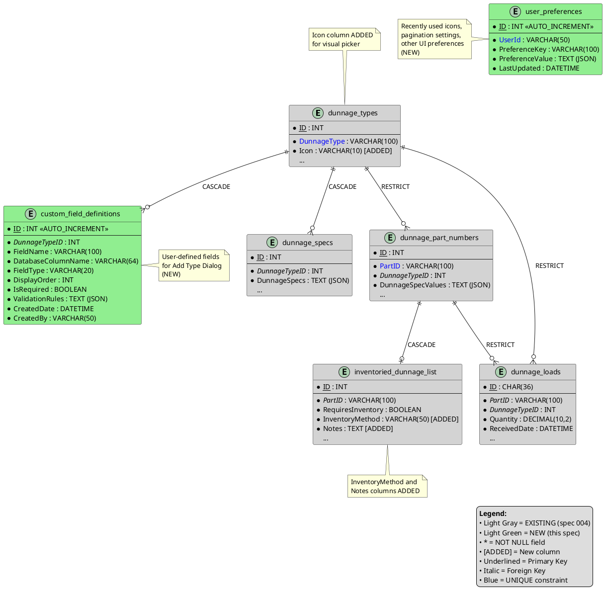

# Data Model: Dunnage Receiving System Extensions

**Feature**: Dunnage Complete Implementation  
**Date**: 2025-12-29  
**Version**: 1.0 (Extends spec 004-database-foundation)

## Overview

This data model defines **extensions** to the existing dunnage database schema (from spec 004) to support Manual Entry, Edit Mode, Admin UI, and Add New Type Dialog functionality. The foundation tables (`dunnage_types`, `dunnage_specs`, `dunnage_part_numbers`, `dunnage_loads`, `inventoried_dunnage_list`) already exist and are **NOT modified**. This spec adds:

1. **custom_field_definitions** table - Stores user-defined fields for Add Type Dialog
2. **user_preferences** table extension - Recently used icons for icon picker
3. **New stored procedures** - CRUD operations, filtering, impact analysis
4. **New indexes** - Performance optimization for searches and filtering

## Extended Entity Relationship Diagram



## Table Modifications (Existing Tables)

### 1. dunnage_types - ADD Icon Column

**Purpose**: Store icon glyph for visual picker in Add Type Dialog

**Migration**:
```sql
ALTER TABLE dunnage_types 
ADD COLUMN Icon VARCHAR(10) DEFAULT '&#xE7B8;' AFTER DunnageType;
```

**Schema Addition**:

| Column | Data Type | Constraints | Description |
|--------|-----------|-------------|-------------|
| Icon | VARCHAR(10) | NOT NULL, DEFAULT '&#xE7B8;' | Unicode glyph for Segoe Fluent Icons (e.g., '&#xE7B8;' = Box) |

**Indexes**: No new indexes required

**Backward Compatibility**: Default value '&#xE7B8;' (Box icon) applied to existing rows

---

### 2. inventoried_dunnage_list - ADD Columns for Method and Notes

**Purpose**: Support admin interface for managing inventoried parts list

**Migration**:
```sql
ALTER TABLE inventoried_dunnage_list
ADD COLUMN InventoryMethod VARCHAR(50) DEFAULT 'Both' AFTER RequiresInventory,
ADD COLUMN Notes TEXT NULL AFTER InventoryMethod;
```

**Schema Additions**:

| Column | Data Type | Constraints | Description |
|--------|-----------|-------------|-------------|
| InventoryMethod | VARCHAR(50) | NOT NULL, DEFAULT 'Both' | Method for Visual ERP inventory tracking: 'Adjust In', 'Receive In', 'Both' |
| Notes | TEXT | NULL | Optional notes about why part requires inventory tracking |

**Indexes**: No new indexes required

**Backward Compatibility**: Default value 'Both' applied to existing rows

---

## New Tables

### 3. custom_field_definitions (NEW)

**Purpose**: Stores user-defined custom fields for dunnage types (Add Type Dialog feature)

**Schema**:

| Column | Data Type | Constraints | Description |
|--------|-----------|-------------|-------------|
| ID | INT | PRIMARY KEY, AUTO_INCREMENT | Unique identifier for each custom field |
| DunnageTypeID | INT | FOREIGN KEY → dunnage_types.ID, NOT NULL | References the dunnage type |
| FieldName | VARCHAR(100) | NOT NULL | Display name of the field (e.g., "Weight (lbs)") |
| DatabaseColumnName | VARCHAR(64) | NOT NULL | Sanitized column name for database (e.g., "weight_lbs") |
| FieldType | VARCHAR(20) | NOT NULL | Field type: 'Text', 'Number', 'Date', 'Boolean' |
| DisplayOrder | INT | NOT NULL | Order of field in UI (1, 2, 3, ...) |
| IsRequired | BOOLEAN | NOT NULL, DEFAULT FALSE | Whether field is mandatory during data entry |
| ValidationRules | TEXT | NULL | JSON validation rules (e.g., `{"min": 1, "max": 9999, "decimals": 2}`) |
| CreatedDate | DATETIME | NOT NULL | Timestamp when field was created |
| CreatedBy | VARCHAR(50) | NOT NULL | Username of person who created the field |

**Foreign Keys**:
- `DunnageTypeID` → `dunnage_types.ID` (ON DELETE CASCADE)

**Indexes**:
- PRIMARY KEY on `ID`
- INDEX on `DunnageTypeID` (IDX-CUSTOM-001)
- UNIQUE INDEX on `(DunnageTypeID, DatabaseColumnName)` (IDX-CUSTOM-002) - Prevents duplicate columns per type

**Constraints**:
- `FieldType` CHECK (MySQL 5.7.24 doesn't support CHECK - enforced in application layer): 'Text', 'Number', 'Date', 'Boolean'
- `DisplayOrder` must be > 0 (enforced in application layer)
- `DatabaseColumnName` must match pattern `^[a-z][a-z0-9_]*$` (enforced in application layer)

**Validation Rules JSON Example**:
```json
{
  "min": 1,
  "max": 9999,
  "decimals": 2,
  "pattern": "^PALLET-\\d+$",
  "maxLength": 50
}
```

**Notes**:
- Maximum 25 custom fields per type (enforced in application layer)
- DisplayOrder determines tab order in UI and column order in DataGrid
- Sanitization logic converts FieldName to DatabaseColumnName (see research.md)

---

### 4. user_preferences (NEW)

**Purpose**: Stores per-user UI preferences (recently used icons, pagination settings, etc.)

**Schema**:

| Column | Data Type | Constraints | Description |
|--------|-----------|-------------|-------------|
| ID | INT | PRIMARY KEY, AUTO_INCREMENT | Unique identifier for each preference record |
| UserId | VARCHAR(50) | NOT NULL | Windows username or employee number |
| PreferenceKey | VARCHAR(100) | NOT NULL | Preference identifier (e.g., 'icon_usage_history', 'pagination_size') |
| PreferenceValue | TEXT | NOT NULL | JSON value for the preference |
| LastUpdated | DATETIME | NOT NULL | Timestamp of last update |

**Indexes**:
- PRIMARY KEY on `ID`
- UNIQUE INDEX on `(UserId, PreferenceKey)` (IDX-PREF-001) - One value per user per key

**Preference Keys**:
- `icon_usage_history`: Recently used icons (JSON array)
- `pagination_size_admin`: Admin grid pagination size (JSON number)
- `pagination_size_edit`: Edit mode pagination size (JSON number)

**Preference Value JSON Examples**:
```json
// icon_usage_history
[
  {"glyph": "&#xE7B8;", "count": 15, "lastUsed": "2025-12-20T14:32:00Z"},
  {"glyph": "&#xE74E;", "count": 8, "lastUsed": "2025-12-19T10:15:00Z"}
]

// pagination_size_admin
20

// pagination_size_edit
50
```

---

## New Stored Procedures

### CRUD Operations

#### sp_dunnage_types_update
**Purpose**: Update existing dunnage type name and icon

**Parameters**:
- `p_id` INT - Type ID to update
- `p_type_name` VARCHAR(100) - New type name
- `p_icon` VARCHAR(10) - New icon glyph
- `p_user` VARCHAR(50) - Username for audit

**Returns**: Standard status result (p_status, p_error_msg)

**Logic**:
1. Check if type_name already exists (excluding current ID)
2. Update DunnageType, Icon, AlterDate, AlterUser
3. Return success/failure status

---

#### sp_custom_fields_insert
**Purpose**: Insert custom field definition for dunnage type

**Parameters**:
- `p_dunnage_type_id` INT
- `p_field_name` VARCHAR(100)
- `p_database_column_name` VARCHAR(64)
- `p_field_type` VARCHAR(20)
- `p_display_order` INT
- `p_is_required` BOOLEAN
- `p_validation_rules` TEXT (JSON)
- `p_user` VARCHAR(50)

**Returns**: p_new_id INT (output parameter), status result

**Logic**:
1. Check for duplicate DatabaseColumnName for same type
2. Insert record
3. Return new ID

---

#### sp_custom_fields_get_by_type
**Purpose**: Retrieve all custom fields for a dunnage type, ordered by DisplayOrder

**Parameters**:
- `p_dunnage_type_id` INT

**Returns**: ResultSet with all columns

**Logic**: SELECT * FROM custom_field_definitions WHERE DunnageTypeID = p_dunnage_type_id ORDER BY DisplayOrder

---

### Search and Filtering

#### sp_dunnage_parts_get_by_type
**Purpose**: Retrieve all parts for a specific dunnage type (for filtering in admin UI)

**Parameters**:
- `p_dunnage_type_id` INT

**Returns**: ResultSet with part details

**Logic**: SELECT * FROM dunnage_part_numbers WHERE DunnageTypeID = p_dunnage_type_id

---

#### sp_dunnage_loads_get_by_date_range
**Purpose**: Retrieve loads within date range for Edit Mode history loading

**Parameters**:
- `p_start_date` DATE
- `p_end_date` DATE
- `p_user_id` VARCHAR(50) - Optional, filter by user

**Returns**: ResultSet with load details

**Logic**: 
```sql
SELECT * FROM dunnage_loads 
WHERE ReceivedDate BETWEEN p_start_date AND p_end_date
AND (p_user_id IS NULL OR UserId = p_user_id)
ORDER BY ReceivedDate DESC
```

---

#### sp_dunnage_loads_update
**Purpose**: Update existing load record (Edit Mode save changes)

**Parameters**:
- `p_id` CHAR(36) - UUID of load
- `p_quantity` DECIMAL(10,2)
- `p_po_number` VARCHAR(50)
- `p_location` VARCHAR(100)
- ... other editable fields ...

**Returns**: Standard status result

**Logic**: UPDATE dunnage_loads SET ... WHERE ID = p_id

---

### Impact Analysis

#### sp_dunnage_types_get_part_count
**Purpose**: Get count of parts using a dunnage type (for delete confirmation)

**Parameters**:
- `p_type_id` INT

**Returns**: COUNT(*)

**Logic**: SELECT COUNT(*) FROM dunnage_part_numbers WHERE DunnageTypeID = p_type_id

---

#### sp_dunnage_types_get_transaction_count
**Purpose**: Get count of transaction records referencing a dunnage type

**Parameters**:
- `p_type_id` INT

**Returns**: COUNT(*)

**Logic**: SELECT COUNT(*) FROM dunnage_loads WHERE DunnageTypeID = p_type_id

---

#### sp_dunnage_parts_get_transaction_count
**Purpose**: Get count of transaction records referencing a part

**Parameters**:
- `p_part_id` VARCHAR(100)

**Returns**: COUNT(*)

**Logic**: SELECT COUNT(*) FROM dunnage_loads WHERE PartID = p_part_id

---

### CSV Export Support

#### sp_dunnage_specs_get_all_keys
**Purpose**: Get union of all unique spec keys across all types (for dynamic CSV columns)

**Parameters**: None

**Returns**: ResultSet with SpecKey column

**Logic**:
```sql
SELECT DISTINCT 
    JSON_UNQUOTE(JSON_EXTRACT(DunnageSpecs, CONCAT('$."', key_name, '"'))) AS SpecKey
FROM (
    -- Manual JSON key extraction for MySQL 5.7.24 compatibility
    -- Uses temporary table with key iteration
) AS keys
ORDER BY SpecKey
```

**Note**: MySQL 5.7.24 doesn't have JSON_TABLE. Implementation uses SUBSTRING_INDEX and iterative key extraction.

---

### User Preferences

#### sp_user_preferences_upsert
**Purpose**: Insert or update user preference (for icon usage tracking)

**Parameters**:
- `p_user_id` VARCHAR(50)
- `p_preference_key` VARCHAR(100)
- `p_preference_value` TEXT (JSON)

**Returns**: Standard status result

**Logic**: 
```sql
INSERT INTO user_preferences (UserId, PreferenceKey, PreferenceValue, LastUpdated)
VALUES (p_user_id, p_preference_key, p_preference_value, NOW())
ON DUPLICATE KEY UPDATE 
    PreferenceValue = VALUES(PreferenceValue),
    LastUpdated = NOW()
```

---

#### sp_inventoried_dunnage_update
**Purpose**: Update inventory method and notes for part

**Parameters**:
- `p_id` INT
- `p_inventory_method` VARCHAR(50)
- `p_notes` TEXT

**Returns**: Standard status result

**Logic**: UPDATE inventoried_dunnage_list SET InventoryMethod = ..., Notes = ... WHERE ID = p_id

---

#### sp_inventoried_dunnage_delete
**Purpose**: Remove part from inventoried list

**Parameters**:
- `p_id` INT

**Returns**: Standard status result

**Logic**: DELETE FROM inventoried_dunnage_list WHERE ID = p_id

---

## Indexes Summary

### New Indexes

| Table | Index Name | Columns | Type | Purpose |
|-------|------------|---------|------|---------|
| custom_field_definitions | IDX-CUSTOM-001 | DunnageTypeID | INDEX | FK lookup performance |
| custom_field_definitions | IDX-CUSTOM-002 | (DunnageTypeID, DatabaseColumnName) | UNIQUE | Prevent duplicate columns |
| user_preferences | IDX-PREF-001 | (UserId, PreferenceKey) | UNIQUE | One value per user per key |
| dunnage_loads | IDX-LOADS-DATE | ReceivedDate | INDEX | Edit Mode date filtering |
| dunnage_loads | IDX-LOADS-USER | UserId | INDEX | Edit Mode user filtering |

---

## Data Migration Script

```sql
-- ============================================
-- Dunnage Complete Implementation - Schema Extensions
-- Version: 1.0
-- Date: 2025-12-29
-- Dependencies: Spec 004 database foundation
-- ============================================

USE mtm_receiving_application;

-- 1. Modify existing tables
ALTER TABLE dunnage_types 
ADD COLUMN Icon VARCHAR(10) NOT NULL DEFAULT '&#xE7B8;' AFTER DunnageType;

ALTER TABLE inventoried_dunnage_list
ADD COLUMN InventoryMethod VARCHAR(50) NOT NULL DEFAULT 'Both' AFTER RequiresInventory,
ADD COLUMN Notes TEXT NULL AFTER InventoryMethod;

-- 2. Create new tables
CREATE TABLE IF NOT EXISTS custom_field_definitions (
    ID INT AUTO_INCREMENT PRIMARY KEY,
    DunnageTypeID INT NOT NULL,
    FieldName VARCHAR(100) NOT NULL,
    DatabaseColumnName VARCHAR(64) NOT NULL,
    FieldType VARCHAR(20) NOT NULL,
    DisplayOrder INT NOT NULL,
    IsRequired BOOLEAN NOT NULL DEFAULT FALSE,
    ValidationRules TEXT NULL,
    CreatedDate DATETIME NOT NULL DEFAULT CURRENT_TIMESTAMP,
    CreatedBy VARCHAR(50) NOT NULL,
    FOREIGN KEY (DunnageTypeID) REFERENCES dunnage_types(ID) ON DELETE CASCADE,
    UNIQUE KEY IDX_CUSTOM_002 (DunnageTypeID, DatabaseColumnName),
    KEY IDX_CUSTOM_001 (DunnageTypeID)
) ENGINE=InnoDB DEFAULT CHARSET=utf8mb4;

CREATE TABLE IF NOT EXISTS user_preferences (
    ID INT AUTO_INCREMENT PRIMARY KEY,
    UserId VARCHAR(50) NOT NULL,
    PreferenceKey VARCHAR(100) NOT NULL,
    PreferenceValue TEXT NOT NULL,
    LastUpdated DATETIME NOT NULL DEFAULT CURRENT_TIMESTAMP ON UPDATE CURRENT_TIMESTAMP,
    UNIQUE KEY IDX_PREF_001 (UserId, PreferenceKey)
) ENGINE=InnoDB DEFAULT CHARSET=utf8mb4;

-- 3. Add performance indexes
CREATE INDEX IDX_LOADS_DATE ON dunnage_loads(ReceivedDate);
CREATE INDEX IDX_LOADS_USER ON dunnage_loads(UserId);

-- 4. Insert default user preferences (optional)
-- INSERT INTO user_preferences (UserId, PreferenceKey, PreferenceValue) 
-- VALUES ('DEFAULT', 'pagination_size_admin', '20'),
--        ('DEFAULT', 'pagination_size_edit', '50');

COMMIT;
```

---

## Backward Compatibility

**Schema Changes**:
- ✅ dunnage_types.Icon - Default value ensures existing rows valid
- ✅ inventoried_dunnage_list.InventoryMethod - Default 'Both' maintains current behavior
- ✅ inventoried_dunnage_list.Notes - Nullable, no impact on existing data

**Stored Procedures**:
- ✅ New procedures - No breaking changes to existing procedures
- ✅ Existing procedures - No modifications required

**Application Code**:
- ✅ Existing wizard workflow - No changes required
- ✅ Existing DAOs - Extension methods added, no breaking changes
- ✅ Existing services - Extension methods added, no breaking changes

---

## Testing Data

### Sample Custom Field Definitions

```sql
INSERT INTO custom_field_definitions (DunnageTypeID, FieldName, DatabaseColumnName, FieldType, DisplayOrder, IsRequired, ValidationRules, CreatedBy)
VALUES 
(1, 'Weight (lbs)', 'weight_lbs', 'Number', 1, TRUE, '{"min": 1, "max": 9999, "decimals": 2}', 'ADMIN'),
(1, 'Material', 'material', 'Text', 2, FALSE, '{"maxLength": 50}', 'ADMIN'),
(1, 'Color', 'color', 'Text', 3, FALSE, '{"maxLength": 30}', 'ADMIN');
```

### Sample User Preferences

```sql
INSERT INTO user_preferences (UserId, PreferenceKey, PreferenceValue)
VALUES 
('JDOE', 'icon_usage_history', '[{"glyph":"&#xE7B8;","count":10,"lastUsed":"2025-12-20T14:32:00Z"},{"glyph":"&#xE74E;","count":5,"lastUsed":"2025-12-19T10:15:00Z"}]'),
('JDOE', 'pagination_size_admin', '20'),
('JDOE', 'pagination_size_edit', '50');
```

---

## References

- [MTM Receiving Application Constitution v1.2.2](.specify/memory/constitution.md)
- [Spec 004: Database Foundation](../../CompletedSpecs/004-database-foundation/data-model.md)
- [MySQL 5.7 JSON Functions](https://dev.mysql.com/doc/refman/5.7/en/json-functions.html)
- [MySQL 5.7 Column Naming Rules](https://dev.mysql.com/doc/refman/5.7/en/identifiers.html)

---

**Phase 1 Data Model Complete** - Database extensions defined. Ready for contract generation and quickstart documentation.
