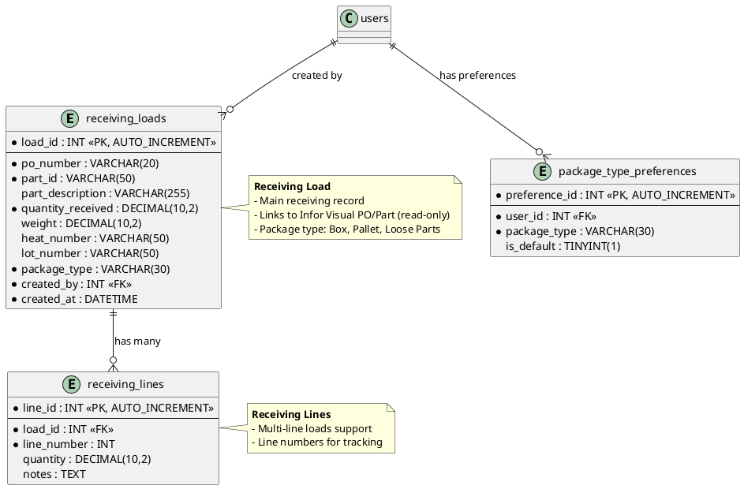

# Data Model: Receiving Module

**Feature**: Receiving Module  
**Database**: `mtm_receiving_application` (MySQL 8.x)  
**Compatibility**: MySQL 5.7.24+ (no JSON functions, CTEs, window functions, CHECK constraints)

## Entity Relationship Diagram



## Table Schemas

### receiving_loads

**Purpose**: Main receiving load records

```sql
CREATE TABLE receiving_loads (
  load_id INT NOT NULL AUTO_INCREMENT,
  po_number VARCHAR(20) NOT NULL COMMENT 'Formatted as PO-063150',
  part_id VARCHAR(50) NOT NULL COMMENT 'From Infor Visual',
  part_description VARCHAR(255) NULL,
  quantity_received DECIMAL(10,2) NOT NULL,
  weight DECIMAL(10,2) NULL,
  heat_number VARCHAR(50) NULL,
  lot_number VARCHAR(50) NULL,
  package_type VARCHAR(30) NOT NULL COMMENT 'Box, Pallet, Loose Parts',
  created_by INT NOT NULL COMMENT 'FK to users.user_id',
  created_at DATETIME NOT NULL DEFAULT CURRENT_TIMESTAMP,
  
  PRIMARY KEY (load_id),
  INDEX idx_po_number (po_number),
  INDEX idx_part_id (part_id),
  INDEX idx_created_at (created_at),
  INDEX idx_created_by (created_by),
  
  FOREIGN KEY (created_by) REFERENCES users(user_id)
) ENGINE=InnoDB DEFAULT CHARSET=utf8mb4 COMMENT='Receiving load records';
```

### receiving_lines

**Purpose**: Line items within a load (for multi-line loads)

```sql
CREATE TABLE receiving_lines (
  line_id INT NOT NULL AUTO_INCREMENT,
  load_id INT NOT NULL,
  line_number INT NOT NULL,
  quantity DECIMAL(10,2) NULL,
  notes TEXT NULL,
  
  PRIMARY KEY (line_id),
  INDEX idx_load_id (load_id),
  
  FOREIGN KEY (load_id) REFERENCES receiving_loads(load_id) ON DELETE CASCADE
) ENGINE=InnoDB DEFAULT CHARSET=utf8mb4 COMMENT='Receiving line items';
```

### package_type_preferences

**Purpose**: User preferences for default package type

```sql
CREATE TABLE package_type_preferences (
  preference_id INT NOT NULL AUTO_INCREMENT,
  user_id INT NOT NULL,
  package_type VARCHAR(30) NOT NULL,
  is_default TINYINT(1) NOT NULL DEFAULT 0,
  
  PRIMARY KEY (preference_id),
  UNIQUE KEY unique_user_package (user_id, package_type),
  INDEX idx_user_id (user_id),
  
  FOREIGN KEY (user_id) REFERENCES users(user_id)
) ENGINE=InnoDB DEFAULT CHARSET=utf8mb4 COMMENT='User package type preferences';
```

## Stored Procedures

### sp_receiving_load_insert

**Purpose**: Insert new receiving load

```sql
DELIMITER $$

CREATE PROCEDURE sp_receiving_load_insert(
  IN p_po_number VARCHAR(20),
  IN p_part_id VARCHAR(50),
  IN p_part_description VARCHAR(255),
  IN p_quantity_received DECIMAL(10,2),
  IN p_weight DECIMAL(10,2),
  IN p_heat_number VARCHAR(50),
  IN p_lot_number VARCHAR(50),
  IN p_package_type VARCHAR(30),
  IN p_created_by INT,
  OUT p_new_load_id INT
)
BEGIN
  INSERT INTO receiving_loads (
    po_number, part_id, part_description, quantity_received,
    weight, heat_number, lot_number, package_type, created_by
  ) VALUES (
    p_po_number, p_part_id, p_part_description, p_quantity_received,
    p_weight, p_heat_number, p_lot_number, p_package_type, p_created_by
  );
  
  SET p_new_load_id = LAST_INSERT_ID();
END$$

DELIMITER ;
```

### sp_receiving_load_get_by_date_range

**Purpose**: Get receiving loads filtered by date range

```sql
DELIMITER $$

CREATE PROCEDURE sp_receiving_load_get_by_date_range(
  IN p_start_date DATE,
  IN p_end_date DATE
)
BEGIN
  SELECT 
    load_id, po_number, part_id, part_description,
    quantity_received, weight, heat_number, lot_number,
    package_type, created_by, created_at
  FROM receiving_loads
  WHERE DATE(created_at) BETWEEN p_start_date AND p_end_date
  ORDER BY created_at DESC;
END$$

DELIMITER ;
```

## Views

### vw_receiving_history

**Purpose**: Flattened view for reporting

```sql
CREATE OR REPLACE VIEW vw_receiving_history AS
SELECT 
  load_id as id,
  po_number,
  part_id as part_number,
  part_description,
  quantity_received as quantity,
  weight as weight_lbs,
  CONCAT_WS('/', heat_number, lot_number) as heat_lot_number,
  DATE(created_at) as created_date,
  'Receiving' as source_module
FROM receiving_loads
ORDER BY created_at DESC;
```

## Migration Strategy

1. **Create tables** in this order (respect foreign keys):
   - `receiving_loads` (depends on users)
   - `receiving_lines` (depends on receiving_loads)
   - `package_type_preferences` (depends on users)

2. **Create stored procedures** (all listed above)

3. **Create views** (`vw_receiving_history`)

4. **Test queries**: Verify data insertion and retrieval

---

**Reference**: See [../011-module-reimplementation/data-model.md](../011-module-reimplementation/data-model.md) for complete data model context

