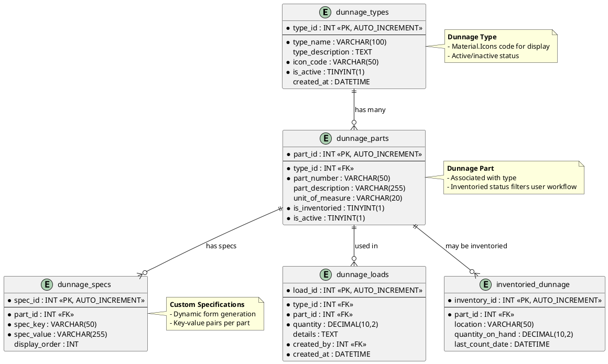

# Data Model: Dunnage Module

**Feature**: Dunnage Module  
**Database**: `mtm_receiving_application` (MySQL 8.x)  
**Compatibility**: MySQL 5.7.24+ (no JSON functions, CTEs, window functions, CHECK constraints)

## Entity Relationship Diagram



## Table Schemas

### dunnage_types

**Purpose**: Dunnage type definitions with Material.Icons

```sql
CREATE TABLE dunnage_types (
  type_id INT NOT NULL AUTO_INCREMENT,
  type_name VARCHAR(100) NOT NULL,
  type_description TEXT NULL,
  icon_code VARCHAR(50) NOT NULL COMMENT 'Material.Icons code',
  is_active TINYINT(1) NOT NULL DEFAULT 1,
  created_at DATETIME NOT NULL DEFAULT CURRENT_TIMESTAMP,
  
  PRIMARY KEY (type_id),
  UNIQUE KEY unique_type_name (type_name),
  INDEX idx_is_active (is_active)
) ENGINE=InnoDB DEFAULT CHARSET=utf8mb4 COMMENT='Dunnage type definitions';
```

### dunnage_parts

**Purpose**: Parts associated with types

```sql
CREATE TABLE dunnage_parts (
  part_id INT NOT NULL AUTO_INCREMENT,
  type_id INT NOT NULL,
  part_number VARCHAR(50) NOT NULL,
  part_description VARCHAR(255) NULL,
  unit_of_measure VARCHAR(20) NULL,
  is_inventoried TINYINT(1) NOT NULL DEFAULT 0,
  is_active TINYINT(1) NOT NULL DEFAULT 1,
  
  PRIMARY KEY (part_id),
  INDEX idx_type_id (type_id),
  INDEX idx_is_inventoried (is_inventoried),
  
  FOREIGN KEY (type_id) REFERENCES dunnage_types(type_id)
) ENGINE=InnoDB DEFAULT CHARSET=utf8mb4 COMMENT='Dunnage parts';
```

### dunnage_loads

**Purpose**: Generated dunnage load records

```sql
CREATE TABLE dunnage_loads (
  load_id INT NOT NULL AUTO_INCREMENT,
  type_id INT NOT NULL,
  part_id INT NOT NULL,
  quantity DECIMAL(10,2) NOT NULL,
  details TEXT NULL COMMENT 'JSON or concatenated spec values',
  created_by INT NOT NULL COMMENT 'FK to users.user_id',
  created_at DATETIME NOT NULL DEFAULT CURRENT_TIMESTAMP,
  
  PRIMARY KEY (load_id),
  INDEX idx_type_id (type_id),
  INDEX idx_part_id (part_id),
  INDEX idx_created_at (created_at),
  
  FOREIGN KEY (type_id) REFERENCES dunnage_types(type_id),
  FOREIGN KEY (part_id) REFERENCES dunnage_parts(part_id),
  FOREIGN KEY (created_by) REFERENCES users(user_id)
) ENGINE=InnoDB DEFAULT CHARSET=utf8mb4 COMMENT='Dunnage load records';
```

### dunnage_specs

**Purpose**: Custom specifications for dynamic form generation

```sql
CREATE TABLE dunnage_specs (
  spec_id INT NOT NULL AUTO_INCREMENT,
  part_id INT NOT NULL,
  spec_key VARCHAR(50) NOT NULL,
  spec_value VARCHAR(255) NOT NULL,
  display_order INT NULL,
  
  PRIMARY KEY (spec_id),
  INDEX idx_part_id (part_id),
  
  FOREIGN KEY (part_id) REFERENCES dunnage_parts(part_id) ON DELETE CASCADE
) ENGINE=InnoDB DEFAULT CHARSET=utf8mb4 COMMENT='Custom specifications per part';
```

### inventoried_dunnage

**Purpose**: Parts marked as inventoried (filters user workflow)

```sql
CREATE TABLE inventoried_dunnage (
  inventory_id INT NOT NULL AUTO_INCREMENT,
  part_id INT NOT NULL,
  location VARCHAR(50) NULL,
  quantity_on_hand DECIMAL(10,2) NULL,
  last_count_date DATETIME NULL,
  
  PRIMARY KEY (inventory_id),
  UNIQUE KEY unique_part_id (part_id),
  
  FOREIGN KEY (part_id) REFERENCES dunnage_parts(part_id) ON DELETE CASCADE
) ENGINE=InnoDB DEFAULT CHARSET=utf8mb4 COMMENT='Inventoried dunnage parts';
```

## Stored Procedures

### sp_dunnage_type_insert

**Purpose**: Insert new dunnage type

```sql
DELIMITER $$

CREATE PROCEDURE sp_dunnage_type_insert(
  IN p_type_name VARCHAR(100),
  IN p_type_description TEXT,
  IN p_icon_code VARCHAR(50),
  OUT p_new_type_id INT
)
BEGIN
  INSERT INTO dunnage_types (type_name, type_description, icon_code)
  VALUES (p_type_name, p_type_description, p_icon_code);
  
  SET p_new_type_id = LAST_INSERT_ID();
END$$

DELIMITER ;
```

### sp_dunnage_part_get_by_type

**Purpose**: Get parts for a type (filtered by inventoried status)

```sql
DELIMITER $$

CREATE PROCEDURE sp_dunnage_part_get_by_type(
  IN p_type_id INT,
  IN p_include_inventoried_only TINYINT(1)
)
BEGIN
  SELECT 
    part_id, type_id, part_number, part_description,
    unit_of_measure, is_inventoried, is_active
  FROM dunnage_parts
  WHERE type_id = p_type_id
    AND is_active = 1
    AND (p_include_inventoried_only = 0 OR is_inventoried = 1)
  ORDER BY part_number;
END$$

DELIMITER ;
```

## Views

### vw_dunnage_history

**Purpose**: Flattened view for reporting

```sql
CREATE OR REPLACE VIEW vw_dunnage_history AS
SELECT 
  dl.load_id as id,
  dt.type_name as dunnage_type,
  dp.part_number as part_number,
  GROUP_CONCAT(CONCAT(ds.spec_key, ':', ds.spec_value) ORDER BY ds.display_order SEPARATOR ', ') as specs_combined,
  dl.quantity,
  DATE(dl.created_at) as created_date,
  'Dunnage' as source_module
FROM dunnage_loads dl
INNER JOIN dunnage_types dt ON dl.type_id = dt.type_id
INNER JOIN dunnage_parts dp ON dl.part_id = dp.part_id
LEFT JOIN dunnage_specs ds ON dp.part_id = ds.part_id
GROUP BY dl.load_id
ORDER BY dl.created_at DESC;
```

## Migration Strategy

1. **Create tables** in this order (respect foreign keys):
   - `dunnage_types` (no dependencies)
   - `dunnage_parts` (depends on dunnage_types)
   - `dunnage_loads` (depends on dunnage_types and dunnage_parts)
   - `dunnage_specs` (depends on dunnage_parts)
   - `inventoried_dunnage` (depends on dunnage_parts)

2. **Create stored procedures** (all listed above)

3. **Create views** (`vw_dunnage_history`)

4. **Test queries**: Verify data insertion and retrieval

---

**Reference**: See [../011-module-reimplementation/data-model.md](../011-module-reimplementation/data-model.md) for complete data model context

