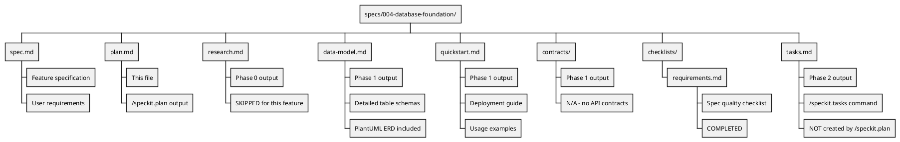

# Implementation Plan: Dunnage Database Foundation

**Branch**: `004-database-foundation` | **Date**: 2025-12-26 | **Spec**: [spec.md](spec.md)
**Input**: Feature specification from `/specs/004-database-foundation/spec.md`

**Note**: This template is filled in by the `/speckit.plan` command. See `.specify/templates/commands/plan.md` for the execution workflow.

## Summary

Establish the foundational database schema for the Dunnage receiving application by creating 5 new MySQL tables (`dunnage_types`, `dunnage_specs`, `dunnage_part_numbers`, `dunnage_loads`, `inventoried_dunnage_list`) and removing the legacy `label_table_dunnage` table. This clean-slate implementation replaces the Google Sheets-based legacy system with a modern Type/Part/Specs architecture using JSON for flexible specification storage. The implementation includes schema migration scripts, seed data for 11 default dunnage types, and complete removal of legacy references from all schema files.

## Technical Context

**Language/Version**: SQL (MySQL 5.7.24 compatible dialect)  
**Primary Dependencies**: MySQL Server 5.7.24+, mysql client tools  
**Storage**: MySQL database `mtm_receiving_application`  
**Testing**: Manual SQL script execution validation, constraint testing via INSERT/DELETE operations  
**Target Platform**: Windows Server / Windows 10+ development environment  
**Project Type**: Database schema migration (DDL scripts only)  
**Performance Goals**: Migration completion <5 seconds for empty database, sub-second query performance with 100K+ transaction records  
**Constraints**: MySQL 5.7.24 compatibility (no CHECK constraints, CTEs, window functions, or JSON functions), idempotent scripts, no data migration from legacy table  
**Scale/Scope**: 5 tables, 11 seed dunnage types, 9 indexes, UTF-8 Unicode support (utf8mb4_unicode_ci)

## Constitution Check

*GATE: Must pass before Phase 0 research. Re-check after Phase 1 design.*

Verify alignment with [MTM Receiving Application Constitution](../../.specify/memory/constitution.md) v1.1.0.

### Core Principles Alignment

- [x] **I. MVVM Architecture**: N/A - Database schema only, no ViewModels/Views/Services in this feature
- [x] **II. Database Layer**: Uses MySQL for application data, no DAO layer in this feature (pure DDL)
- [x] **III. Dependency Injection**: N/A - No services to register (database schema only)
- [x] **IV. Error Handling & Logging**: N/A - SQL scripts don't use error handlers (manual validation)
- [x] **V. Security & Authentication**: Uses EntryUser/AlterUser/AddedBy fields for audit trail
- [x] **VI. WinUI 3 Modern Practices**: N/A - Database schema only, no UI components
- [x] **VII. Specification-Driven**: This plan follows Speckit workflow structure

### Technology Constraints

- [x] **Platform**: Windows 10/11 for development environment, MySQL 5.7.24+ compatible
- [x] **Database**: MySQL for app data (`mtm_receiving_application`), no Infor Visual interaction
- [x] **MySQL 5.7.24 Compatible**: Aware of limitations (CK-001 constraint cannot be enforced at DB level)
- [x] **Required Packages**: N/A - Database schema only, no C# packages needed for this feature

### Critical Constraints

- [x] **Infor Visual READ ONLY**: Not applicable - this feature creates new MySQL tables only
- [x] **Forbidden Practices**: No direct SQL in C# code (future DAO implementations will use stored procedures), no constraint violations

### Justification for Violations

**MySQL 5.7.24 CHECK Constraint Limitation**: The specification requires `CK-001: dunnage_loads.Quantity MUST be > 0`. MySQL 5.7.24 does not support CHECK constraints at the database level. This will be enforced in the application layer when DAOs and services are implemented in future features.

**Rationale**: This is an environmental limitation, not a design choice. The specification correctly documents this in the Assumptions section and notes that application-layer validation is required. Future DAO implementations will validate quantity > 0 before INSERT/UPDATE operations.

## Project Structure

### Documentation (this feature)

### Source Code (repository root)

```plantuml
@startuml Database Directory Structure

package "Database/" {
  folder "Schemas/" {
    file "01_create_receiving_tables.sql" as f01 #yellow
    note right of f01
      [MODIFIED]
      Remove label_table_dunnage
      definition
    end note
    
    file "02_create_authentication_tables.sql" as f02
    file "03_create_receiving_tables.sql" as f03
    file "..." as fmore
    
    file "06_create_dunnage_tables.sql" as f06 #lightgreen
    note right of f06
      [NEW]
      Dunnage schema migration
      DROP + CREATE statements
    end note
    
    file "06_seed_dunnage_data.sql" as f06seed #lightgreen
    note right of f06seed
      [NEW]
      Seed 11 default types
      with spec schemas
    end note
  }
  
  folder "StoredProcedures/" {
    note "Future: CRUD stored procedures\nfor dunnage tables" as spNote
  }
  
  folder "TestData/" {
    note "Future: Additional test\ndunnage data beyond\nseed defaults" as tdNote
  }
  
  folder "Deploy/" {
    file "Deploy-Database.ps1" as deploy
    note right of deploy
      [UNCHANGED]
      Existing deployment script
    end note
  }
}

@enduml
```

**Structure Decision**: Single project (database schema) with new migration scripts in `Database/Schemas/` directory following the existing numbered file convention (06_*). The legacy table definition will be removed from `01_create_receiving_tables.sql`, and two new files will be created for the dunnage schema and seed data.

## Complexity Tracking

> **No constitutional violations requiring justification**

This feature is a pure database schema implementation with no application layer components. All constitutional principles either align (audit fields, MySQL usage) or are not applicable (MVVM, DI, error handling) since this feature only creates DDL scripts.
