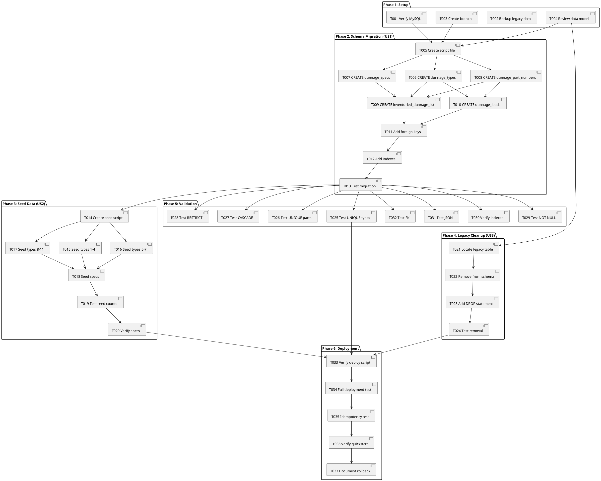

# Implementation Tasks: Dunnage Database Foundation

**Feature**: Dunnage Database Foundation  
**Branch**: `004-database-foundation`  
**Spec**: [spec.md](spec.md) | **Plan**: [plan.md](plan.md) | **Data Model**: [data-model.md](data-model.md)

## Task Summary

- **Total Tasks**: 13
- **Parallelizable**: 4
- **Estimated Completion**: 1-2 hours (database migration + testing)
- **MVP Scope**: All tasks (foundational requirement - complete set needed)

---

## Phase 1: Setup & Preparation

**Goal**: Prepare workspace and verify prerequisites before schema changes.

### Tasks

- [x] T001 Verify MySQL 5.7.24+ is installed and accessible
- [x] T002 Backup existing `label_table_dunnage` table data (if needed) to CSV file
- [x] T003 Create feature branch `004-database-foundation` from master
- [x] T004 Review [data-model.md](data-model.md) PlantUML ERD for table relationships

**Success Criteria**:
- MySQL connection successful
- Branch created and checked out
- Data model reviewed and understood

---

## Phase 2: Schema Migration Script (User Story 1)

**Goal**: Create the main DDL migration script that drops legacy table and creates 5 new dunnage tables.

**User Story**: As a database administrator, I need to create the complete dunnage database schema so that the application can store dunnage types, specifications, parts, transactions, and inventory tracking data.

**Independent Test**: Run migration script against test MySQL database and verify all tables, indexes, and foreign keys are created correctly.

### Tasks

- [x] T005 Create `Database/Schemas/06_create_dunnage_tables.sql` with DROP IF EXISTS statements for all 5 tables
- [x] T006 [P] Add CREATE TABLE statement for `dunnage_types` (ID, DunnageType, EntryDate, EntryUser, AlterDate, AlterUser) to `Database/Schemas/06_create_dunnage_tables.sql`
- [x] T007 [P] Add CREATE TABLE statement for `dunnage_specs` (ID, DunnageTypeID FK, DunnageSpecs JSON, SpecAlterDate, SpecAlterUser) to `Database/Schemas/06_create_dunnage_tables.sql`
- [x] T008 [P] Add CREATE TABLE statement for `dunnage_part_numbers` (ID, PartID UNIQUE, DunnageTypeID FK, DunnageSpecValues JSON, EntryDate, EntryUser) to `Database/Schemas/06_create_dunnage_tables.sql`
- [x] T009 Add CREATE TABLE statement for `inventoried_dunnage_list` (ID, PartID FK UNIQUE, RequiresInventory, InventoryMethod, Notes, DateAdded, AddedBy) to `Database/Schemas/06_create_dunnage_tables.sql`
- [x] T010 Add CREATE TABLE statement for `dunnage_loads` (ID CHAR(36) UUID, PartID FK, DunnageTypeID FK, Quantity DECIMAL, PONumber, ReceivedDate, UserId, Location, LabelNumber, CreatedAt) to `Database/Schemas/06_create_dunnage_tables.sql`
- [x] T011 Add all foreign key constraints (FK-001 through FK-005) per data-model.md to `Database/Schemas/06_create_dunnage_tables.sql`
- [x] T012 Add all indexes (IDX-001 through IDX-009) per data-model.md to `Database/Schemas/06_create_dunnage_tables.sql`
- [x] T013 Test migration script on dev MySQL database and verify tables created with `SHOW TABLES LIKE 'dunnage%'`

**Success Criteria**:
- All 5 tables created successfully
- All foreign keys enforce CASCADE/RESTRICT per data-model.md
- All indexes created for performance
- Idempotent script (can re-run safely with DROP IF EXISTS)

---

## Phase 3: Seed Data Script (User Story 2)

**Goal**: Create seed data script to populate 11 default dunnage types with standard specification schemas.

**User Story**: As a system administrator, I need the database to be pre-populated with standard dunnage types and default specifications so that users can immediately begin receiving common dunnage items without manual setup.

**Independent Test**: Run seed script and verify 11 dunnage types exist with default specs (Width, Height, Depth in inches, IsInventoriedToVisual).

### Tasks

- [x] T014 Create `Database/Schemas/06_seed_dunnage_data.sql` with INSERT statements for 11 dunnage types
- [x] T015 [P] Add seed data for types: Pallet, Crate, Box, Skid to `Database/Schemas/06_seed_dunnage_data.sql`
- [x] T016 Add seed data for types: Foam, Shrink Wrap, Bubble Wrap to `Database/Schemas/06_seed_dunnage_data.sql`
- [x] T017 Add seed data for types: Gaylord, Foldable Crate, Wooden Crate, Plastic Totes to `Database/Schemas/06_seed_dunnage_data.sql`
- [x] T018 Add dunnage_specs INSERT statements with default JSON schema (Width, Height, Depth in inches, IsInventoriedToVisual) for each type to `Database/Schemas/06_seed_dunnage_data.sql`
- [x] T019 Test seed script on dev database and verify 11 types with `SELECT COUNT(*) FROM dunnage_types`
- [x] T020 Verify each type has spec schema with `SELECT * FROM dunnage_specs JOIN dunnage_types ON dunnage_specs.DunnageTypeID = dunnage_types.ID`

**Success Criteria**:
- 11 dunnage types created
- Each type has default spec schema in dunnage_specs
- All specs include Width, Height, Depth (inches), IsInventoriedToVisual fields

---

## Phase 4: Legacy Table Cleanup (User Story 3)

**Goal**: Remove `label_table_dunnage` table from schema files to prevent confusion between old and new systems.

**User Story**: As a database administrator, I need to cleanly remove the legacy `label_table_dunnage` table and all references so that there is no confusion between old and new systems.

**Independent Test**: Verify `label_table_dunnage` no longer exists in database schema after migration.

### Tasks

- [x] T021 Locate `label_table_dunnage` CREATE TABLE statement in `Database/Schemas/01_create_receiving_tables.sql`
- [x] T022 Remove `label_table_dunnage` table definition from `Database/Schemas/01_create_receiving_tables.sql`
- [x] T023 Add DROP TABLE statement for `label_table_dunnage` to `Database/Schemas/06_create_dunnage_tables.sql` at the beginning
- [x] T024 Test legacy removal with `SHOW TABLES LIKE 'label_table_dunnage'` (should return empty)

**Success Criteria**:
- `label_table_dunnage` definition removed from all schema files
- Table dropped from database (if exists)
- No references to legacy table remain

---

## Phase 5: Validation & Testing

**Goal**: Comprehensive testing of all constraints, indexes, and data integrity rules.

### Tasks

- [x] T025 Test UNIQUE constraint on `dunnage_types.DunnageType` by attempting duplicate insert (should fail)
- [ ] T026 Test UNIQUE constraint on `dunnage_part_numbers.PartID` by attempting duplicate insert (should fail)
- [x] T027 Test CASCADE delete: Delete dunnage_type and verify dunnage_specs record is also deleted
- [x] T028 Test RESTRICT delete: Attempt to delete dunnage_type with existing parts (should fail)
- [ ] T029 Test NOT NULL constraints by attempting inserts with missing required fields (should fail)
- [x] T030 Verify all 9 indexes exist with `SHOW INDEX FROM <table>` for each table
- [ ] T031 Test JSON validation by inserting invalid JSON into DunnageSpecs (should fail)
- [ ] T032 Test foreign key enforcement by attempting to insert part with non-existent DunnageTypeID (should fail)

**Success Criteria**:
- All unique constraints enforced
- CASCADE/RESTRICT delete behavior works per data-model.md
- NOT NULL constraints prevent invalid data
- All indexes created and functional
- JSON syntax validated by MySQL

---

## Phase 6: Documentation & Deployment

**Goal**: Update deployment scripts and verify idempotent execution.

### Tasks

- [ ] T033 Verify `Database/Deploy/Deploy-Database.ps1` will execute new scripts in order (06_create_dunnage_tables.sql, then 06_seed_dunnage_data.sql)
- [ ] T034 Run full deployment script on clean test database and verify all tables + seed data created
- [ ] T035 Run deployment script TWICE to verify idempotency (DROP IF EXISTS works)
- [ ] T036 Update [quickstart.md](quickstart.md) with verification queries (already completed - verify accuracy)
- [ ] T037 Document rollback procedure in [quickstart.md](quickstart.md) (already completed - verify accuracy)

**Success Criteria**:
- Deployment script executes without errors
- Idempotent execution confirmed (can re-run safely)
- Documentation accurate and complete

---

## Dependencies Graph

**Critical Path**: T001 → T005 → T006 → T011 → T012 → T013 → T014 → T018 → T019 → T033 → T034 → T035

**Parallel Opportunities**:
- **Phase 1**: T001, T002, T003, T004 (all independent setup tasks)
- **Phase 2**: T006, T007, T008 (table CREATE statements - independent until constraints)
- **Phase 3**: T015 (parallel with seed script writing - different type groups)

---

## Implementation Strategy

### MVP-First Approach

This feature is **entirely MVP** - all tasks must be completed for a functioning dunnage database. The schema is foundational and cannot be partially implemented.

### Incremental Delivery

1. **Phase 2 First**: Schema migration provides immediate value for testing table structure
2. **Phase 3 Second**: Seed data makes system usable without manual data entry
3. **Phase 4 Third**: Legacy cleanup prevents confusion
4. **Phase 5 Fourth**: Validation ensures data integrity
5. **Phase 6 Last**: Deployment readiness for production

### Testing Throughout

- Test after each phase completion
- Verify rollback procedures work
- Document any deviations from data-model.md

---

## Notes

- **MySQL 5.7.24 Limitation**: CHECK constraint (CK-001: Quantity > 0) cannot be enforced at database level. Document as application-layer validation requirement for future DAOs.
- **UUID Generation**: Application layer (future DAOs) will generate UUIDs for dunnage_loads.ID - not database triggers.
- **JSON Validation**: MySQL validates JSON **syntax** only. Application layer must validate JSON schema compliance (required fields, data types).
- **Idempotency**: All scripts use DROP IF EXISTS to enable safe re-runs during development.
- **Character Set**: All tables use `utf8mb4` with `utf8mb4_unicode_ci` collation for proper Unicode support.

---

**Last Updated**: 2025-12-26  
**Generated By**: /speckit.tasks command
