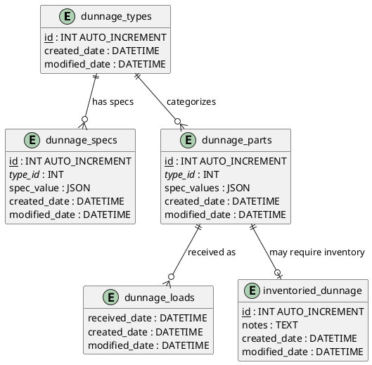

# Data Model: Dunnage Stored Procedures

**Feature**: 005-dunnage-stored-procedures  
**Date**: 2025-12-26  
**Purpose**: Define database schema, relationships, and constraints for dunnage receiving system

## Entity Relationship Diagram



## Entity Descriptions

### dunnage_types

**Purpose**: Type categorization for dunnage (e.g., "Pallet", "Container", "Wrapper")

**Columns**:
- `id` (INT, PK, AUTO_INCREMENT): Unique identifier
- `type_name` (VARCHAR(100), UNIQUE, NOT NULL): Display name for the type
- `created_by` (VARCHAR(50), NOT NULL): Employee number who created the record
- `created_date` (DATETIME, NOT NULL): Timestamp of creation
- `modified_by` (VARCHAR(50)): Employee number who last modified the record
- `modified_date` (DATETIME): Timestamp of last modification

**Constraints**:
- Primary Key: `id`
- Unique Key: `type_name` (prevent duplicate type names)
- NOT NULL: `type_name`, `created_by`, `created_date`

**Relationships**:
- One-to-many with `dunnage_specs` (FK: type_id)
- One-to-many with `dunnage_parts` (FK: type_id)

**Business Rules**:
- Type name must be unique (case-insensitive in application layer)
- Cannot delete type if associated parts exist (RESTRICT)
- Cannot delete type if associated specs exist (RESTRICT)

---

### dunnage_specs

**Purpose**: Dynamic schema definition for each dunnage type (e.g., "Dimensions", "Material", "MaxWeight")

**Columns**:
- `id` (INT, PK, AUTO_INCREMENT): Unique identifier
- `type_id` (INT, FK, NOT NULL): References dunnage_types.id
- `spec_key` (VARCHAR(100), NOT NULL): Specification field name (e.g., "length", "material")
- `spec_value` (JSON, NOT NULL): JSON schema definition for this spec (type, validation rules, etc.)
- `created_by` (VARCHAR(50), NOT NULL): Employee number who created the record
- `created_date` (DATETIME, NOT NULL): Timestamp of creation
- `modified_by` (VARCHAR(50)): Employee number who last modified the record
- `modified_date` (DATETIME): Timestamp of last modification

**Constraints**:
- Primary Key: `id`
- Foreign Key: `type_id` REFERENCES `dunnage_types(id)` ON DELETE RESTRICT
- Unique Key: `(type_id, spec_key)` (one spec key per type)
- NOT NULL: `type_id`, `spec_key`, `spec_value`, `created_by`, `created_date`

**Relationships**:
- Many-to-one with `dunnage_types` (FK: type_id)

**Business Rules**:
- Each type can have multiple specs, but each spec_key is unique within a type
- JSON validation enforced in stored procedures using JSON_VALID()
- Deleting a type cascades to delete all associated specs (or RESTRICT - TBD in implementation)
- Cannot delete a spec if parts are using that spec field (impact analysis via count procedure)

**Example spec_value JSON**:
```json
{
  "data_type": "decimal",
  "unit": "inches",
  "required": true,
  "min_value": 0,
  "max_value": 999.99
}
```

---

### dunnage_parts

**Purpose**: Master data for individual dunnage parts (e.g., "PALLET-48X40-WOOD", "CONTAINER-GAYLORD-001")

**Columns**:
- `id` (INT, PK, AUTO_INCREMENT): Unique identifier
- `part_id` (VARCHAR(50), UNIQUE, NOT NULL): Business key (user-facing identifier)
- `type_id` (INT, FK, NOT NULL): References dunnage_types.id
- `spec_values` (JSON, NOT NULL): JSON object with actual values for this part's specs
- `created_by` (VARCHAR(50), NOT NULL): Employee number who created the record
- `created_date` (DATETIME, NOT NULL): Timestamp of creation
- `modified_by` (VARCHAR(50)): Employee number who last modified the record
- `modified_date` (DATETIME): Timestamp of last modification

**Constraints**:
- Primary Key: `id`
- Foreign Key: `type_id` REFERENCES `dunnage_types(id)` ON DELETE RESTRICT
- Unique Key: `part_id` (business key uniqueness)
- NOT NULL: `part_id`, `type_id`, `spec_values`, `created_by`, `created_date`

**Relationships**:
- Many-to-one with `dunnage_types` (FK: type_id)
- One-to-many with `dunnage_loads` (FK: part_id)
- One-to-one (optional) with `inventoried_dunnage` (FK: part_id)

**Business Rules**:
- Part ID must be unique across all types
- Spec values JSON must conform to the schema defined in dunnage_specs for this type
- Cannot delete part if transaction records (loads) exist (RESTRICT)
- Cannot change type_id after creation (validated in stored procedure)

**Example spec_values JSON**:
```json
{
  "length": 48.0,
  "width": 40.0,
  "material": "Wood",
  "max_weight": 2500.0
}
```

---

### dunnage_loads

**Purpose**: Transaction records of received dunnage (immutable receiving history)

**Columns**:
- `load_uuid` (CHAR(36), PK): UUID for globally unique load identifier
- `part_id` (VARCHAR(50), FK, NOT NULL): References dunnage_parts.part_id
- `quantity` (DECIMAL(10,2), NOT NULL): Quantity received (must be > 0)
- `received_date` (DATETIME, NOT NULL): Timestamp when dunnage was received
- `created_by` (VARCHAR(50), NOT NULL): Employee number who created the record
- `created_date` (DATETIME, NOT NULL): Timestamp of record creation (same as received_date typically)
- `modified_by` (VARCHAR(50)): Employee number who last modified the record (corrections only)
- `modified_date` (DATETIME): Timestamp of last modification

**Constraints**:
- Primary Key: `load_uuid`
- Foreign Key: `part_id` REFERENCES `dunnage_parts(part_id)` ON DELETE RESTRICT
- NOT NULL: `load_uuid`, `part_id`, `quantity`, `received_date`, `created_by`, `created_date`
- CHECK (quantity > 0) - Note: Not enforced in MySQL 5.7.24, validated in stored procedure

**Relationships**:
- Many-to-one with `dunnage_parts` (FK: part_id)

**Business Rules**:
- UUID generated in application layer before insert
- Quantity must be greater than 0 (validated in stored procedure)
- Hard delete policy (no soft deletes) - permanent removal allowed
- Received date defaults to NOW() if not provided
- Updates allowed for corrections (e.g., fixing quantity errors)

---

### inventoried_dunnage

**Purpose**: List of parts requiring Visual ERP inventory notifications (metadata, not transactional)

**Columns**:
- `id` (INT, PK, AUTO_INCREMENT): Unique identifier
- `part_id` (VARCHAR(50), FK, UNIQUE, NOT NULL): References dunnage_parts.part_id
- `inventory_method` (VARCHAR(100), NOT NULL): How to notify Visual (e.g., "Manual Entry", "API Call")
- `notes` (TEXT): Additional instructions for inventory management
- `created_by` (VARCHAR(50), NOT NULL): Employee number who created the record
- `created_date` (DATETIME, NOT NULL): Timestamp of creation
- `modified_by` (VARCHAR(50)): Employee number who last modified the record
- `modified_date` (DATETIME): Timestamp of last modification

**Constraints**:
- Primary Key: `id`
- Foreign Key: `part_id` REFERENCES `dunnage_parts(part_id)` ON DELETE CASCADE
- Unique Key: `part_id` (one inventory record per part)
- NOT NULL: `part_id`, `inventory_method`, `created_by`, `created_date`

**Relationships**:
- One-to-one with `dunnage_parts` (FK: part_id)

**Business Rules**:
- Optional - only parts requiring inventory notification are in this table
- Deleting a part cascades to delete inventory record (cleanup)
- Presence of record triggers UI notification workflow after receiving
- Inventory method determines which notification mechanism to use

---

## Indexes

### Performance Indexes

```sql
-- dunnage_types
CREATE UNIQUE INDEX idx_dunnage_types_type_name ON dunnage_types(type_name);

-- dunnage_specs
CREATE INDEX idx_dunnage_specs_type_id ON dunnage_specs(type_id);
CREATE UNIQUE INDEX idx_dunnage_specs_type_key ON dunnage_specs(type_id, spec_key);

-- dunnage_parts
CREATE UNIQUE INDEX idx_dunnage_parts_part_id ON dunnage_parts(part_id);
CREATE INDEX idx_dunnage_parts_type_id ON dunnage_parts(type_id);

-- dunnage_loads
CREATE INDEX idx_dunnage_loads_part_id ON dunnage_loads(part_id);
CREATE INDEX idx_dunnage_loads_received_date ON dunnage_loads(received_date);

-- inventoried_dunnage
CREATE UNIQUE INDEX idx_inventoried_dunnage_part_id ON inventoried_dunnage(part_id);
```

**Rationale**:
- Unique indexes enforce business key constraints (type_name, part_id)
- Foreign key indexes optimize JOIN operations and cascade checks
- received_date index enables fast date range filtering for reporting
- type_id indexes support filtering by type in get_by_type operations

---

## Data Types & Size Considerations

### String Lengths

- `type_name`: VARCHAR(100) - Accommodates descriptive type names
- `part_id`: VARCHAR(50) - Business-defined identifier with room for prefixes/suffixes
- `spec_key`: VARCHAR(100) - Specification field names (e.g., "max_weight_pounds")
- `inventory_method`: VARCHAR(100) - Method descriptions
- `created_by`, `modified_by`: VARCHAR(50) - Employee numbers or usernames

### Numeric Types

- `id`: INT - Auto-increment, supports up to 2.1 billion records
- `quantity`: DECIMAL(10,2) - Up to 99,999,999.99 with 2 decimal places
- `type_id`, foreign keys to INT - Match primary key types

### Date/Time

- All timestamps: DATETIME - Stores date and time, no timezone (local time assumed)

### JSON

- `spec_value`: JSON - Schema definitions (typically < 1KB per spec)
- `spec_values`: JSON - Part attribute values (typically < 5KB per part)

---

## Migration & Versioning

### Initial Schema Creation

Schema creation scripts will be placed in:
- `Database/Schemas/04_create_dunnage_tables.sql`

**Dependencies**:
- No dependencies on other feature schemas
- Uses existing `mtm_receiving_application` database

### Backward Compatibility

- New tables - no impact on existing functionality
- Foreign key constraints use RESTRICT to prevent data corruption
- Audit trail columns follow existing naming conventions

---

## Testing Data Requirements

### Minimal Test Dataset

**dunnage_types**:
- 3 types: "Pallet", "Container", "Wrapper"

**dunnage_specs** (for "Pallet"):
- length (decimal, inches)
- width (decimal, inches)
- material (string)
- max_weight (decimal, pounds)

**dunnage_parts**:
- PALLET-48X40-WOOD (type: Pallet)
- PALLET-48X48-PLASTIC (type: Pallet)
- CONTAINER-GAYLORD-001 (type: Container)

**dunnage_loads**:
- 5 load records across different parts and dates

**inventoried_dunnage**:
- PALLET-48X40-WOOD (requires inventory notification)

### Edge Case Test Data

- Part with empty spec_values JSON: `{}`
- Part with complex nested JSON specs
- Load with maximum quantity: 99999999.99
- Type with no parts (for delete testing)
- Type with parts but no specs

---

## Security Considerations

### Audit Trail

All tables include:
- `created_by`, `created_date` - Immutable creation metadata
- `modified_by`, `modified_date` - Modification tracking

### Data Integrity

- Foreign key constraints prevent orphaned records
- Unique constraints prevent duplicate business keys
- JSON validation prevents malformed data
- Stored procedures enforce all business rules

### Access Control

- All operations through stored procedures (no direct table access)
- DAO layer enforces Model_Dao_Result pattern
- User parameter passed from authenticated session
- No database-level user differentiation (application-level only)

---

## Future Considerations

### Potential Enhancements

1. **Soft Deletes**: Add `is_deleted` flag and `deleted_date` columns
2. **Full Audit Trail**: Separate audit tables capturing all changes
3. **Spec Validation**: Add validation rules table for spec constraints
4. **Part History**: Track spec_values changes over time
5. **Load Attachments**: Link photos or documents to loads

### MySQL 8.0 Migration Opportunities

If upgraded to MySQL 8.0:
- Use CHECK constraints instead of stored procedure validation
- Use JSON_TABLE for batch operations
- Use CTEs for complex queries
- Add generated columns for frequently accessed JSON fields

---

## References

- [MySQL 5.7 JSON Data Type](https://dev.mysql.com/doc/refman/5.7/en/json.html)
- [MySQL 5.7 Foreign Keys](https://dev.mysql.com/doc/refman/5.7/en/create-table-foreign-keys.html)
- Existing Schema: `Database/Schemas/01_create_receiving_tables.sql`
- Constitution: `.specify/memory/constitution.md` - Database Layer Consistency
