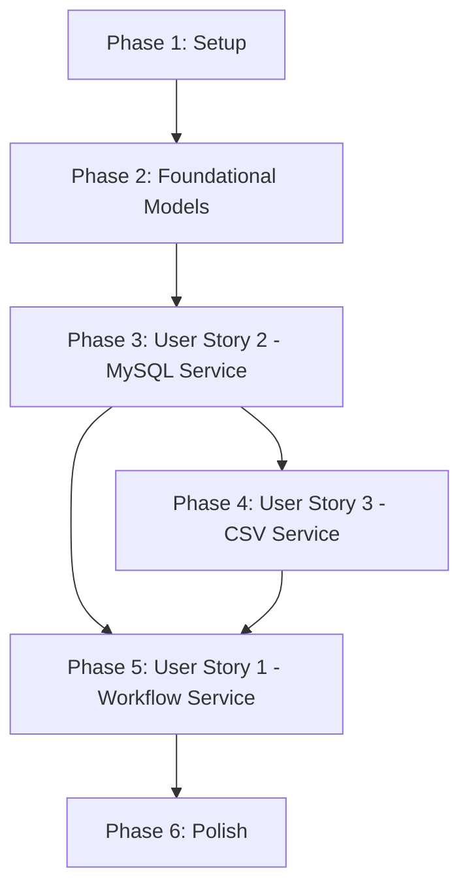

# Tasks: Dunnage Services Layer

**Branch**: `006-dunnage-services` | **Spec**: [spec.md](spec.md) | **Plan**: [plan.md](plan.md)

## Phase 1: Setup & Infrastructure

*Goal: Initialize project structure and verify dependencies*

- [x] T001 Verify CsvHelper package is referenced in MTM_Receiving_Application.csproj
- [x] T002 Verify System.Text.Json package is available in MTM_Receiving_Application.csproj

## Phase 2: Foundational Models

*Goal: Create enums and result models required by all services*

- [x] T003 Create Enum_DunnageWorkflowStep in Models/Enums/Enum_DunnageWorkflowStep.cs
- [x] T004 Create Model_WorkflowStepResult in Models/Receiving/Model_WorkflowStepResult.cs
- [x] T005 Create Model_SaveResult in Models/Receiving/Model_SaveResult.cs
- [x] T006 Create Model_CSVWriteResult in Models/Receiving/Model_CSVWriteResult.cs

## Phase 3: User Story 2 - MySQL Dunnage Service (P1)

*Goal: Implement database operations service with validation and error handling*

**Independent Test Criteria**: Service methods can be called with mocked DAOs, validation logic executes before DAO calls, error messages are user-friendly, impact analysis returns accurate counts.

### Interface & Skeleton

- [x] T007 [US2] Create IService_MySQL_Dunnage interface in Contracts/Services/IService_MySQL_Dunnage.cs
- [x] T008 [US2] Create Service_MySQL_Dunnage class skeleton with constructor injection in Services/Database/Service_MySQL_Dunnage.cs

### Type Operations (5 methods)

- [x] T009 [P] [US2] Implement GetAllTypesAsync in Services/Database/Service_MySQL_Dunnage.cs
- [x] T010 [P] [US2] Implement GetTypeByIdAsync in Services/Database/Service_MySQL_Dunnage.cs
- [x] T011 [P] [US2] Implement InsertTypeAsync with validation in Services/Database/Service_MySQL_Dunnage.cs
- [x] T012 [P] [US2] Implement UpdateTypeAsync with validation in Services/Database/Service_MySQL_Dunnage.cs
- [x] T013 [US2] Implement DeleteTypeAsync with impact analysis check in Services/Database/Service_MySQL_Dunnage.cs

### Spec Operations (6 methods)

- [x] T014 [P] [US2] Implement GetSpecsForTypeAsync in Services/Database/Service_MySQL_Dunnage.cs
- [x] T015 [P] [US2] Implement InsertSpecAsync with JSON validation in Services/Database/Service_MySQL_Dunnage.cs
- [x] T016 [P] [US2] Implement UpdateSpecAsync with JSON validation in Services/Database/Service_MySQL_Dunnage.cs
- [x] T017 [P] [US2] Implement DeleteSpecAsync with impact check in Services/Database/Service_MySQL_Dunnage.cs
- [x] T018 [P] [US2] Implement DeleteSpecsByTypeIdAsync in Services/Database/Service_MySQL_Dunnage.cs
- [x] T019 [US2] Implement GetAllSpecKeysAsync with JSON parsing and deduplication in Services/Database/Service_MySQL_Dunnage.cs

### Part Operations (7 methods)

- [x] T020 [P] [US2] Implement GetAllPartsAsync in Services/Database/Service_MySQL_Dunnage.cs
- [x] T021 [P] [US2] Implement GetPartsByTypeAsync in Services/Database/Service_MySQL_Dunnage.cs
- [x] T022 [P] [US2] Implement GetPartByIdAsync in Services/Database/Service_MySQL_Dunnage.cs
- [x] T023 [P] [US2] Implement InsertPartAsync with validation in Services/Database/Service_MySQL_Dunnage.cs
- [x] T024 [P] [US2] Implement UpdatePartAsync with validation in Services/Database/Service_MySQL_Dunnage.cs
- [x] T025 [US2] Implement DeletePartAsync with transaction count check in Services/Database/Service_MySQL_Dunnage.cs
- [x] T026 [P] [US2] Implement SearchPartsAsync with wildcard support in Services/Database/Service_MySQL_Dunnage.cs

### Load Operations (6 methods)

- [x] T027 [P] [US2] Implement SaveLoadsAsync with batch validation in Services/Database/Service_MySQL_Dunnage.cs
- [x] T028 [P] [US2] Implement GetLoadsByDateRangeAsync in Services/Database/Service_MySQL_Dunnage.cs
- [x] T029 [P] [US2] Implement GetAllLoadsAsync in Services/Database/Service_MySQL_Dunnage.cs
- [x] T030 [P] [US2] Implement GetLoadByIdAsync in Services/Database/Service_MySQL_Dunnage.cs
- [x] T031 [P] [US2] Implement UpdateLoadAsync in Services/Database/Service_MySQL_Dunnage.cs
- [x] T032 [P] [US2] Implement DeleteLoadAsync in Services/Database/Service_MySQL_Dunnage.cs

### Inventory Operations (6 methods)

- [x] T033 [P] [US2] Implement IsPartInventoriedAsync in Services/Database/Service_MySQL_Dunnage.cs
- [x] T034 [P] [US2] Implement GetInventoryDetailsAsync in Services/Database/Service_MySQL_Dunnage.cs
- [x] T035 [P] [US2] Implement GetAllInventoriedPartsAsync in Services/Database/Service_MySQL_Dunnage.cs
- [x] T036 [P] [US2] Implement AddToInventoriedListAsync in Services/Database/Service_MySQL_Dunnage.cs
- [x] T037 [P] [US2] Implement RemoveFromInventoriedListAsync in Services/Database/Service_MySQL_Dunnage.cs
- [x] T038 [P] [US2] Implement UpdateInventoriedPartAsync in Services/Database/Service_MySQL_Dunnage.cs

### Impact Analysis (4 methods)

- [x] T039 [P] [US2] Implement GetPartCountByTypeIdAsync in Services/Database/Service_MySQL_Dunnage.cs
- [x] T040 [P] [US2] Implement GetTransactionCountByPartIdAsync in Services/Database/Service_MySQL_Dunnage.cs
- [x] T041 [P] [US2] Implement GetTransactionCountByTypeIdAsync in Services/Database/Service_MySQL_Dunnage.cs
- [x] T042 [P] [US2] Implement GetPartCountBySpecKeyAsync in Services/Database/Service_MySQL_Dunnage.cs

### Registration & Tests

- [x] T043 [US2] Register IService_MySQL_Dunnage as Transient in App.xaml.cs ConfigureServices
- [x] T044 [US2] Create unit tests in MTM_Receiving_Application.Tests/Unit/Services/Service_MySQL_Dunnage_Tests.cs

## Phase 4: User Story 3 - CSV Export Service (P1)

*Goal: Implement CSV export functionality with dynamic columns and dual-write strategy*

**Independent Test Criteria**: CSV files created at correct paths, headers include fixed + dynamic columns, special characters properly escaped, network failure doesn't prevent local success.

**Dependencies**: Requires US2 (specifically GetAllSpecKeysAsync for dynamic headers)

- [x] T045 [US3] Create IService_DunnageCSVWriter interface in Contracts/Services/IService_DunnageCSVWriter.cs
- [x] T046 [US3] Create Service_DunnageCSVWriter class skeleton with constructor injection in Services/Receiving/Service_DunnageCSVWriter.cs
- [x] T047 [US3] Implement GetLocalPath helper method in Services/Receiving/Service_DunnageCSVWriter.cs
- [x] T048 [US3] Implement GetNetworkPath helper method with username resolution in Services/Receiving/Service_DunnageCSVWriter.cs
- [x] T049 [US3] Implement WriteToCSVAsync with dynamic spec column generation in Services/Receiving/Service_DunnageCSVWriter.cs
- [x] T050 [US3] Implement WriteCsvFileAsync helper using CsvHelper in Services/Receiving/Service_DunnageCSVWriter.cs
- [x] T051 [US3] Implement dual-write logic (local MUST succeed, network best-effort) in Services/Receiving/Service_DunnageCSVWriter.cs
- [x] T052 [US3] Register IService_DunnageCSVWriter as Transient in App.xaml.cs ConfigureServices
- [x] T053 [US3] Create unit tests in MTM_Receiving_Application.Tests/Unit/Services/Service_DunnageCSVWriter_Tests.cs

## Phase 5: User Story 1 - Dunnage Workflow Service (P1)

*Goal: Implement wizard state machine with step validation and session orchestration*

**Independent Test Criteria**: Step transitions occur correctly, validation prevents invalid advances, session data persists across steps, events fire on transitions, SaveSessionAsync integrates database + CSV.

**Dependencies**: Requires US2 (SaveLoadsAsync) and US3 (WriteToCSVAsync)

### Interface & Skeleton

- [x] T054 [US1] Create IService_DunnageWorkflow interface in Contracts/Services/IService_DunnageWorkflow.cs
- [x] T055 [US1] Create Service_DunnageWorkflow class skeleton with constructor injection in Services/Receiving/Service_DunnageWorkflow.cs

### State Machine Implementation

- [x] T056 [US1] Implement CurrentStep and CurrentSession properties in Services/Receiving/Service_DunnageWorkflow.cs
- [x] T057 [US1] Implement StepChanged and StatusMessageRaised events in Services/Receiving/Service_DunnageWorkflow.cs
- [x] T058 [US1] Implement StartWorkflowAsync method in Services/Receiving/Service_DunnageWorkflow.cs
- [x] T059 [US1] Implement GoToStep method in Services/Receiving/Service_DunnageWorkflow.cs
- [x] T060 [US1] Implement ClearSession method in Services/Receiving/Service_DunnageWorkflow.cs

### Step Advancement Logic

- [x] T061 [US1] Implement AdvanceToNextStepAsync with step-specific validation in Services/Receiving/Service_DunnageWorkflow.cs
- [x] T062 [US1] Implement validation rules for TypeSelection step in Services/Receiving/Service_DunnageWorkflow.cs
- [x] T063 [US1] Implement validation rules for PartSelection step in Services/Receiving/Service_DunnageWorkflow.cs
- [x] T064 [US1] Implement validation rules for QuantityEntry step in Services/Receiving/Service_DunnageWorkflow.cs
- [x] T065 [US1] Implement validation rules for DetailsEntry step in Services/Receiving/Service_DunnageWorkflow.cs

### Save Orchestration

- [x] T066 [US1] Implement SaveSessionAsync integrating IService_MySQL_Dunnage.SaveLoadsAsync in Services/Receiving/Service_DunnageWorkflow.cs
- [x] T067 [US1] Implement SaveSessionAsync integrating IService_DunnageCSVWriter.WriteToCSVAsync in Services/Receiving/Service_DunnageWorkflow.cs
- [x] T068 [US1] Implement error aggregation and result composition in SaveSessionAsync in Services/Receiving/Service_DunnageWorkflow.cs

### Registration & Tests

- [x] T069 [US1] Register IService_DunnageWorkflow as Singleton in App.xaml.cs ConfigureServices
- [x] T070 [US1] Create unit tests in MTM_Receiving_Application.Tests/Unit/Services/Service_DunnageWorkflow_Tests.cs

## Phase 6: Polish & Cross-Cutting Concerns

*Goal: Final verification and documentation*

- [x] T071 Verify all services are registered correctly in App.xaml.cs ConfigureServices
- [x] T072 Add XML documentation comments to all public service methods
- [x] T073 Run all unit tests and verify 100% pass rate
- [x] T074 Build solution and verify no errors or warnings

## Dependencies

### User Story Completion Order

1. **US2 (MySQL Service)** - Independent, foundational data access
2. **US3 (CSV Service)** - Depends on US2 for GetAllSpecKeysAsync
3. **US1 (Workflow Service)** - Depends on US2 and US3 for SaveSessionAsync

### Parallel Execution Opportunities

**Within US2 (MySQL Service)**:
- Tasks T009-T012 (Type operations) can be done in parallel
- Tasks T014-T018 (Spec operations) can be done in parallel
- Tasks T020-T024 (Part read operations) can be done in parallel
- Tasks T027-T032 (Load operations) can be done in parallel
- Tasks T033-T038 (Inventory operations) can be done in parallel
- Tasks T039-T042 (Impact analysis) can be done in parallel

**Within US3 (CSV Service)**:
- Tasks T047-T048 (path helpers) can be done in parallel

**Within US1 (Workflow Service)**:
- Tasks T062-T065 (validation rules) can be done in parallel after T061 is complete

## Implementation Strategy

### MVP Scope (Minimum Viable Product)
Focus on **User Story 2 (MySQL Service)** first as it's the foundation. This enables:
- Data access for admin UIs
- Testing of DAO integration
- Validation of business logic patterns

### Incremental Delivery
1. **Sprint 1**: US2 (MySQL Service) - All CRUD operations functional
2. **Sprint 2**: US3 (CSV Service) - Export capability added
3. **Sprint 3**: US1 (Workflow Service) - Wizard orchestration complete

### Testing Strategy
- Unit tests for each service (mock dependencies)
- Each user story is independently testable:
  - **US2**: Mock DAOs, verify validation and error handling
  - **US3**: Mock MySQL service, verify CSV format and dual-write
  - **US1**: Mock MySQL and CSV services, verify state machine transitions

## Task Summary

- **Total Tasks**: 74
- **Phase 1 (Setup)**: 2 tasks
- **Phase 2 (Foundational)**: 4 tasks
- **Phase 3 (US2 - MySQL Service)**: 38 tasks (34 methods + registration + tests)
- **Phase 4 (US3 - CSV Service)**: 9 tasks
- **Phase 5 (US1 - Workflow Service)**: 17 tasks
- **Phase 6 (Polish)**: 4 tasks

**Parallelizable Tasks**: 35 tasks marked with [P] can be executed in parallel with other tasks in the same phase

**Estimated Effort**: 
- US2: ~5-7 days (34 service methods with validation)
- US3: ~2-3 days (CSV generation with dynamic columns)
- US1: ~3-4 days (state machine with validation logic)
- Total: ~10-14 days for one developer
