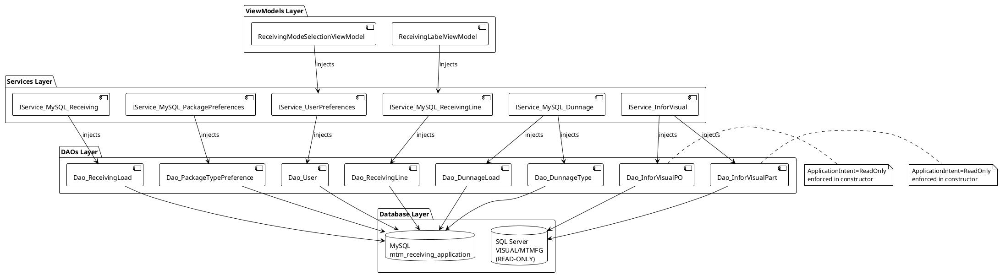

# Architecture Compliance Data Model

**Feature**: 007-architecture-compliance  
**Date**: 2025-12-27  
**Phase**: 1 - Design & Contracts

## Overview

This document defines the data models and DAO contracts required for the Architecture Compliance Refactoring. The refactoring creates 4 new DAOs and converts 5 existing static DAOs to instance-based pattern.

---

## New Data Models

### Model_InforVisualPO

Represents a Purchase Order record from Infor Visual ERP system (READ-ONLY access).

**Source**: SQL Server database VISUAL/MTMFG, tables: `po` (purchase order header), `po_line` (line items)

```csharp
public class Model_InforVisualPO
{
    /// <summary>Purchase Order Number (e.g., "PO-2025-001234")</summary>
    public string PoNumber { get; set; } = string.Empty;
    
    /// <summary>PO Line Number (1, 2, 3, etc.)</summary>
    public int PoLine { get; set; }
    
    /// <summary>Part Number (e.g., "PART-12345")</summary>
    public string PartNumber { get; set; } = string.Empty;
    
    /// <summary>Part Description from Infor Visual</summary>
    public string PartDescription { get; set; } = string.Empty;
    
    /// <summary>Ordered Quantity</summary>
    public decimal OrderedQty { get; set; }
    
    /// <summary>Received Quantity (from Infor Visual tracking)</summary>
    public decimal ReceivedQty { get; set; }
    
    /// <summary>Remaining Quantity to Receive (OrderedQty - ReceivedQty)</summary>
    public decimal RemainingQty { get; set; }
    
    /// <summary>Unit of Measure (EA, LB, FT, etc.)</summary>
    public string UnitOfMeasure { get; set; } = "EA";
    
    /// <summary>Expected Due Date</summary>
    public DateTime? DueDate { get; set; }
    
    /// <summary>Vendor ID/Code</summary>
    public string VendorCode { get; set; } = string.Empty;
    
    /// <summary>Vendor Name</summary>
    public string VendorName { get; set; } = string.Empty;
    
    /// <summary>PO Status (OPEN, CLOSED, PARTIAL, etc.)</summary>
    public string PoStatus { get; set; } = string.Empty;
    
    /// <summary>Warehouse/Site Code (002 = MTM default)</summary>
    public string SiteId { get; set; } = "002";
}
```

**Validation Rules**:
- PoNumber: Required, non-empty
- PoLine: Required, must be > 0
- PartNumber: Required, non-empty
- OrderedQty: Must be >= 0
- ReceivedQty: Must be >= 0, cannot exceed OrderedQty
- RemainingQty: Calculated as (OrderedQty - ReceivedQty)

**Usage**: Loaded by Dao_InforVisualPO.GetByPoNumberAsync() for PO validation during receiving workflow.

---

### Model_InforVisualPart

Represents a Part Master record from Infor Visual ERP system (READ-ONLY access).

**Source**: SQL Server database VISUAL/MTMFG, table: `part_master`

```csharp
public class Model_InforVisualPart
{
    /// <summary>Part Number (unique identifier)</summary>
    public string PartNumber { get; set; } = string.Empty;
    
    /// <summary>Part Description</summary>
    public string Description { get; set; } = string.Empty;
    
    /// <summary>Part Type (PURCHASED, MANUFACTURED, etc.)</summary>
    public string PartType { get; set; } = string.Empty;
    
    /// <summary>Standard Unit Cost</summary>
    public decimal UnitCost { get; set; }
    
    /// <summary>Primary Unit of Measure</summary>
    public string PrimaryUom { get; set; } = "EA";
    
    /// <summary>On-Hand Quantity at Warehouse 002</summary>
    public decimal OnHandQty { get; set; }
    
    /// <summary>Allocated Quantity (reserved for orders)</summary>
    public decimal AllocatedQty { get; set; }
    
    /// <summary>Available Quantity (OnHandQty - AllocatedQty)</summary>
    public decimal AvailableQty { get; set; }
    
    /// <summary>Default Warehouse/Site</summary>
    public string DefaultSite { get; set; } = "002";
    
    /// <summary>Part Status (ACTIVE, OBSOLETE, etc.)</summary>
    public string PartStatus { get; set; } = "ACTIVE";
    
    /// <summary>Product Line/Category</summary>
    public string ProductLine { get; set; } = string.Empty;
}
```

**Validation Rules**:
- PartNumber: Required, non-empty
- Description: Required, non-empty
- UnitCost: Must be >= 0
- OnHandQty: Must be >= 0
- AllocatedQty: Must be >= 0, cannot exceed OnHandQty
- AvailableQty: Calculated as (OnHandQty - AllocatedQty)

**Usage**: Loaded by Dao_InforVisualPart.GetByPartNumberAsync() for part validation and description lookups.

---

### Model_PackageTypePreference

Represents a user's preferred package type setting (stored in MySQL mtm_receiving_application database).

**Source**: MySQL table `package_type_preferences`

**Note**: This model may already exist. If it does, verify schema matches this specification.

```csharp
public partial class Model_PackageTypePreference : ObservableObject
{
    /// <summary>Unique identifier (auto-increment)</summary>
    [ObservableProperty]
    private int _preferenceId;
    
    /// <summary>Username (Windows username or PIN-authenticated user)</summary>
    [ObservableProperty]
    private string _username = string.Empty;
    
    /// <summary>Preferred package type: "Package" or "Pallet"</summary>
    [ObservableProperty]
    private string _preferredPackageType = "Package";
    
    /// <summary>Timestamp when preference was last updated</summary>
    [ObservableProperty]
    private DateTime _lastUpdated;
    
    /// <summary>Workstation identifier (for shared terminals)</summary>
    [ObservableProperty]
    private string _workstation = string.Empty;
}
```

**Database Schema** (MySQL):
```sql
CREATE TABLE IF NOT EXISTS package_type_preferences (
    preference_id INT AUTO_INCREMENT PRIMARY KEY,
    username VARCHAR(100) NOT NULL,
    preferred_package_type VARCHAR(20) NOT NULL DEFAULT 'Package',
    last_updated DATETIME NOT NULL DEFAULT CURRENT_TIMESTAMP ON UPDATE CURRENT_TIMESTAMP,
    workstation VARCHAR(100),
    UNIQUE KEY unique_user_preference (username)
) ENGINE=InnoDB DEFAULT CHARSET=utf8mb4;
```

**Validation Rules**:
- Username: Required, non-empty, max 100 characters
- PreferredPackageType: Must be "Package" or "Pallet"
- LastUpdated: Automatically set by database on INSERT/UPDATE
- Workstation: Optional, max 100 characters

**Usage**: Loaded by Service_MySQL_PackagePreferences.GetPackageTypePreferenceAsync() to determine user's default package type mode.

---

## Existing Models (Unchanged)

The following models already exist and do not require modification:

- **Model_ReceivingLoad**: Represents a receiving load (already exists in Models/Receiving/)
- **Model_ReceivingLine**: Represents a receiving line item (already exists in Models/Receiving/)
- **Model_User**: Represents authenticated user with preferences (already exists in Models/Systems/)
- **Model_UserPreference**: User's default receiving mode preference (verify existence)
- **Model_DunnageLoad**: Dunnage load record (already exists in Models/Dunnage/)
- **Model_DunnageType**: Dunnage type classification (already exists in Models/Dunnage/)
- **Model_DunnagePart**: Dunnage part details (already exists in Models/Dunnage/)
- **Model_DunnageSpec**: Dunnage specification (already exists in Models/Dunnage/)
- **Model_InventoriedDunnage**: Inventoried dunnage record (already exists in Models/Dunnage/)

---

## DAO Contracts

### Dao_ReceivingLoad (NEW - Instance-Based)

**Purpose**: Data access for MySQL `receiving_loads` table.

**Constructor**:
```csharp
public Dao_ReceivingLoad(string connectionString)
```

**Methods**:

#### GetAllAsync
```csharp
public async Task<Model_Dao_Result<List<Model_ReceivingLoad>>> GetAllAsync()
```
- **Stored Procedure**: `sp_receiving_loads_get_all`
- **Parameters**: None
- **Returns**: List of all receiving loads (sorted by date descending)

#### GetByDateRangeAsync
```csharp
public async Task<Model_Dao_Result<List<Model_ReceivingLoad>>> GetByDateRangeAsync(
    DateTime startDate, 
    DateTime endDate)
```
- **Stored Procedure**: `sp_receiving_loads_get_by_date_range`
- **Parameters**: `start_date`, `end_date`
- **Returns**: Receiving loads within date range

#### GetByIdAsync
```csharp
public async Task<Model_Dao_Result<Model_ReceivingLoad>> GetByIdAsync(int loadId)
```
- **Stored Procedure**: `sp_receiving_loads_get_by_id`
- **Parameters**: `load_id`
- **Returns**: Single receiving load or null if not found

#### InsertAsync
```csharp
public async Task<Model_Dao_Result<int>> InsertAsync(Model_ReceivingLoad load)
```
- **Stored Procedure**: `sp_receiving_loads_insert`
- **Parameters**: `po_number`, `vendor`, `received_date`, `user_id`, etc.
- **Returns**: New load_id (auto-increment primary key)

#### UpdateAsync
```csharp
public async Task<Model_Dao_Result> UpdateAsync(Model_ReceivingLoad load)
```
- **Stored Procedure**: `sp_receiving_loads_update`
- **Parameters**: `load_id`, `po_number`, `status`, etc.
- **Returns**: Success/failure with affected row count

---

### Dao_PackageTypePreference (NEW - Instance-Based)

**Purpose**: Data access for MySQL `package_type_preferences` table.

**Constructor**:
```csharp
public Dao_PackageTypePreference(string connectionString)
```

**Methods**:

#### GetByUserAsync
```csharp
public async Task<Model_Dao_Result<Model_PackageTypePreference>> GetByUserAsync(string username)
```
- **Stored Procedure**: `sp_package_preferences_get_by_user`
- **Parameters**: `username`
- **Returns**: User's package type preference or null if not found

#### UpsertAsync
```csharp
public async Task<Model_Dao_Result> UpsertAsync(Model_PackageTypePreference preference)
```
- **Stored Procedure**: `sp_package_preferences_upsert`
- **Parameters**: `username`, `preferred_package_type`, `workstation`
- **Returns**: Success/failure (INSERT or UPDATE depending on existing record)
- **Note**: Uses MySQL `ON DUPLICATE KEY UPDATE` pattern

---

### Dao_InforVisualPO (NEW - Instance-Based, READ-ONLY)

**Purpose**: READ-ONLY data access for Infor Visual purchase orders (SQL Server).

**Constructor**:
```csharp
public Dao_InforVisualPO(string inforVisualConnectionString)
```
- **Validation**: Throws InvalidOperationException if connection string does not contain `ApplicationIntent=ReadOnly`

**Methods**:

#### GetByPoNumberAsync
```csharp
public async Task<Model_Dao_Result<List<Model_InforVisualPO>>> GetByPoNumberAsync(string poNumber)
```
- **Query Type**: Direct SQL SELECT (not stored procedure - per constitution allowance for Infor Visual)
- **SQL**:
  ```sql
  SELECT 
      po.po_num AS PoNumber,
      pol.po_line AS PoLine,
      pol.part AS PartNumber,
      p.description AS PartDescription,
      pol.qty_ordered AS OrderedQty,
      pol.qty_received AS ReceivedQty,
      (pol.qty_ordered - pol.qty_received) AS RemainingQty,
      pol.u_m AS UnitOfMeasure,
      pol.due_date AS DueDate,
      po.vend_id AS VendorCode,
      v.name AS VendorName,
      po.stat AS PoStatus,
      po.site_id AS SiteId
  FROM po
  INNER JOIN po_line pol ON po.po_num = pol.po_num
  INNER JOIN part p ON pol.part = p.part_id
  LEFT JOIN vendor v ON po.vend_id = v.vend_id
  WHERE po.po_num = @PoNumber
  AND po.site_id = '002'
  ORDER BY pol.po_line
  ```
- **Parameters**: `@PoNumber`
- **Returns**: List of PO line items for the given PO number

#### ValidatePoNumberAsync
```csharp
public async Task<Model_Dao_Result<bool>> ValidatePoNumberAsync(string poNumber)
```
- **Query Type**: Direct SQL SELECT
- **SQL**: `SELECT COUNT(*) FROM po WHERE po_num = @PoNumber AND site_id = '002'`
- **Parameters**: `@PoNumber`
- **Returns**: True if PO exists, False otherwise

---

### Dao_InforVisualPart (NEW - Instance-Based, READ-ONLY)

**Purpose**: READ-ONLY data access for Infor Visual part master (SQL Server).

**Constructor**:
```csharp
public Dao_InforVisualPart(string inforVisualConnectionString)
```
- **Validation**: Throws InvalidOperationException if connection string does not contain `ApplicationIntent=ReadOnly`

**Methods**:

#### GetByPartNumberAsync
```csharp
public async Task<Model_Dao_Result<Model_InforVisualPart>> GetByPartNumberAsync(string partNumber)
```
- **Query Type**: Direct SQL SELECT
- **SQL**:
  ```sql
  SELECT 
      p.part_id AS PartNumber,
      p.description AS Description,
      p.part_type AS PartType,
      p.unit_cost AS UnitCost,
      p.u_m AS PrimaryUom,
      COALESCE(inv.on_hand, 0) AS OnHandQty,
      COALESCE(inv.allocated, 0) AS AllocatedQty,
      (COALESCE(inv.on_hand, 0) - COALESCE(inv.allocated, 0)) AS AvailableQty,
      p.site_id AS DefaultSite,
      p.stat AS PartStatus,
      p.prod_line AS ProductLine
  FROM part p
  LEFT JOIN inventory inv ON p.part_id = inv.part_id AND inv.site_id = '002'
  WHERE p.part_id = @PartNumber
  ```
- **Parameters**: `@PartNumber`
- **Returns**: Part master record or null if not found

#### SearchPartsByDescriptionAsync
```csharp
public async Task<Model_Dao_Result<List<Model_InforVisualPart>>> SearchPartsByDescriptionAsync(
    string searchTerm, 
    int maxResults = 50)
```
- **Query Type**: Direct SQL SELECT with LIKE
- **SQL**: `SELECT TOP @MaxResults ... FROM part WHERE description LIKE @SearchTerm + '%' ORDER BY part_id`
- **Parameters**: `@SearchTerm`, `@MaxResults`
- **Returns**: List of parts matching description search (up to maxResults)

---

### Existing DAOs to Convert (Static → Instance-Based)

The following DAOs will be converted from static classes to instance-based pattern:

#### Dao_DunnageLoad
- **Current**: Static class with static methods
- **Target**: Instance-based with constructor injection
- **Methods**: Preserve all existing method signatures (GetAllAsync, InsertAsync, etc.)
- **Impact**: Service_MySQL_Dunnage must inject Dao_DunnageLoad instance

#### Dao_DunnageType
- **Current**: Static class
- **Target**: Instance-based
- **Impact**: Service_MySQL_Dunnage must inject Dao_DunnageType instance

#### Dao_DunnagePart
- **Current**: Static class
- **Target**: Instance-based
- **Impact**: Service_MySQL_Dunnage must inject Dao_DunnagePart instance

#### Dao_DunnageSpec
- **Current**: Static class
- **Target**: Instance-based
- **Impact**: Service_MySQL_Dunnage must inject Dao_DunnageSpec instance

#### Dao_InventoriedDunnage
- **Current**: Static class
- **Target**: Instance-based
- **Impact**: Service_MySQL_Dunnage must inject Dao_InventoriedDunnage instance

**Conversion Pattern** (applies to all 5 DAOs):
```csharp
// BEFORE (static)
public static class Dao_DunnageLoad
{
    private static string ConnectionString => Helper_Database_Variables.GetConnectionString();
    
    public static async Task<Model_Dao_Result<List<Model_DunnageLoad>>> GetAllAsync() { ... }
}

// AFTER (instance-based)
public class Dao_DunnageLoad
{
    private readonly string _connectionString;
    
    public Dao_DunnageLoad(string connectionString)
    {
        _connectionString = connectionString ?? throw new ArgumentNullException(nameof(connectionString));
    }
    
    public async Task<Model_Dao_Result<List<Model_DunnageLoad>>> GetAllAsync() { ... }
}
```

---

## Service Contracts

### IService_UserPreferences (NEW)

**Purpose**: Abstraction layer for ViewModel access to user preference data.

```csharp
public interface IService_UserPreferences
{
    /// <summary>Get user's latest receiving mode preference</summary>
    Task<Model_Dao_Result<Model_UserPreference>> GetLatestUserPreferenceAsync(string username);
    
    /// <summary>Update user's default receiving mode</summary>
    Task<Model_Dao_Result> UpdateDefaultModeAsync(string username, string defaultMode);
}
```

**Implementation**: Service_UserPreferences delegates to Dao_User instance.

---

### IService_MySQL_ReceivingLine (NEW)

**Purpose**: Abstraction layer for ViewModel access to receiving line data.

```csharp
public interface IService_MySQL_ReceivingLine
{
    /// <summary>Insert a new receiving line</summary>
    Task<Model_Dao_Result<int>> InsertReceivingLineAsync(Model_ReceivingLine line);
    
    /// <summary>Get all receiving lines for a specific load</summary>
    Task<Model_Dao_Result<List<Model_ReceivingLine>>> GetLinesByLoadIdAsync(int loadId);
    
    /// <summary>Update an existing receiving line</summary>
    Task<Model_Dao_Result> UpdateReceivingLineAsync(Model_ReceivingLine line);
}
```

**Implementation**: Service_MySQL_ReceivingLine delegates to Dao_ReceivingLine instance.

---

## Dependency Graph



**Constitutional Compliance**:
- ✅ No ViewModel→DAO edges (all go through Service layer)
- ✅ No Service→Database edges (all go through DAO layer)
- ✅ Clean three-tier architecture: ViewModel → Service → DAO → Database

---

## MySQL Stored Procedures Required

The following stored procedures must exist or be created for the new DAOs:

### Receiving Load Procedures
- `sp_receiving_loads_get_all` - Get all receiving loads
- `sp_receiving_loads_get_by_date_range` - Get loads within date range
- `sp_receiving_loads_get_by_id` - Get single load by ID
- `sp_receiving_loads_insert` - Insert new load
- `sp_receiving_loads_update` - Update existing load

### Package Preference Procedures
- `sp_package_preferences_get_by_user` - Get user's preference
- `sp_package_preferences_upsert` - Insert or update preference

**Note**: Verify if these stored procedures already exist in Database/StoredProcedures/ folder. If missing, create them per MySQL 5.7.24 compatibility requirements.

---

## Next Steps

1. Create contracts/ folder with .md documentation files (NOT .cs files)
2. Create quickstart.md with developer implementation guide
3. Verify existing stored procedures in Database/StoredProcedures/
4. Update agent context with new patterns and decisions
