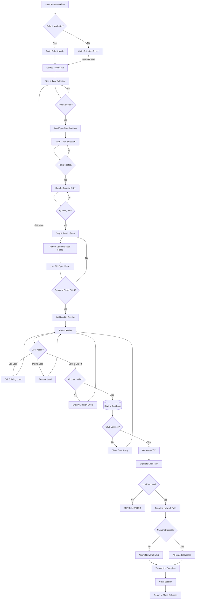
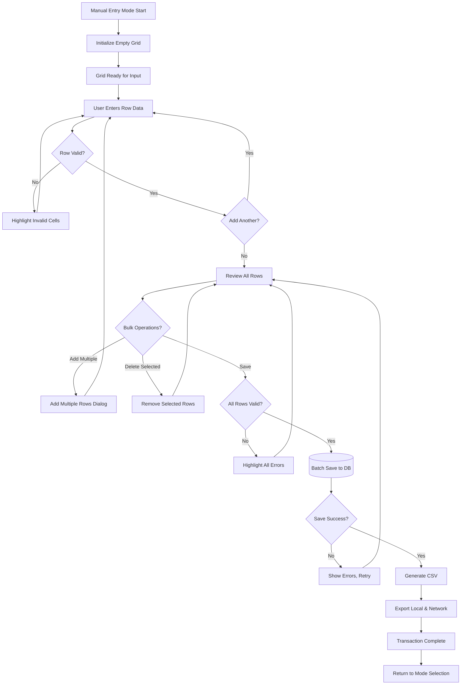
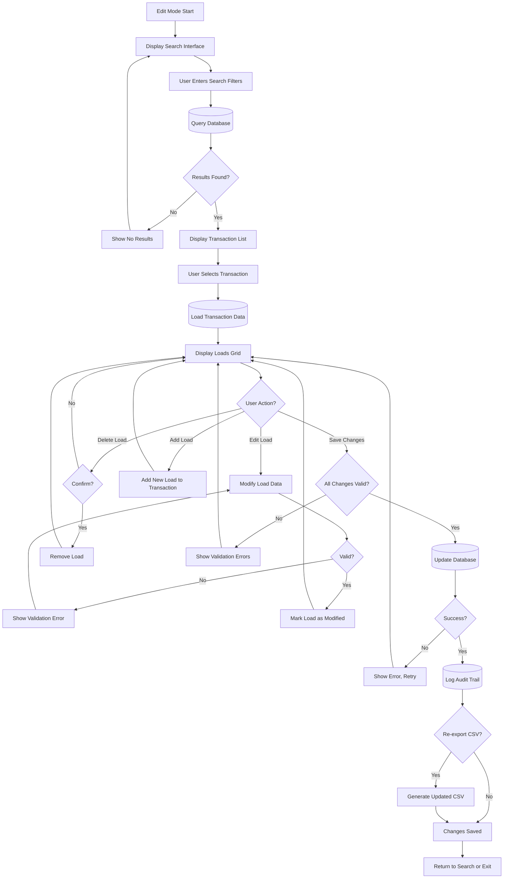
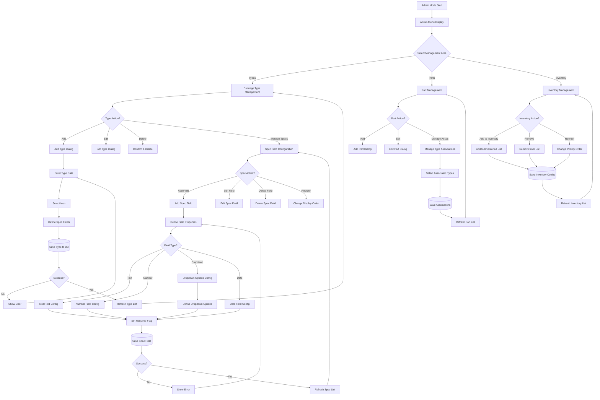
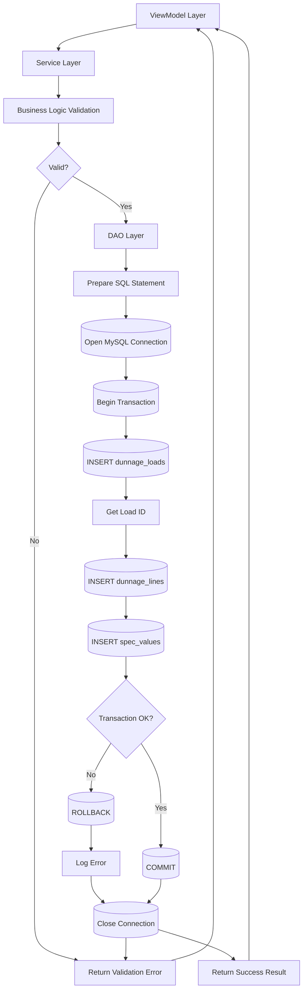
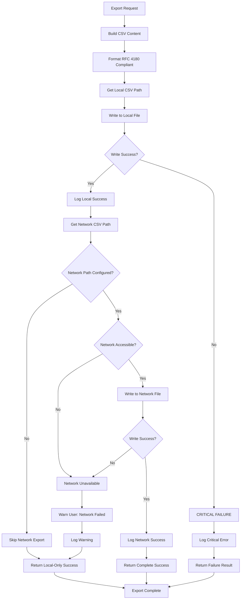
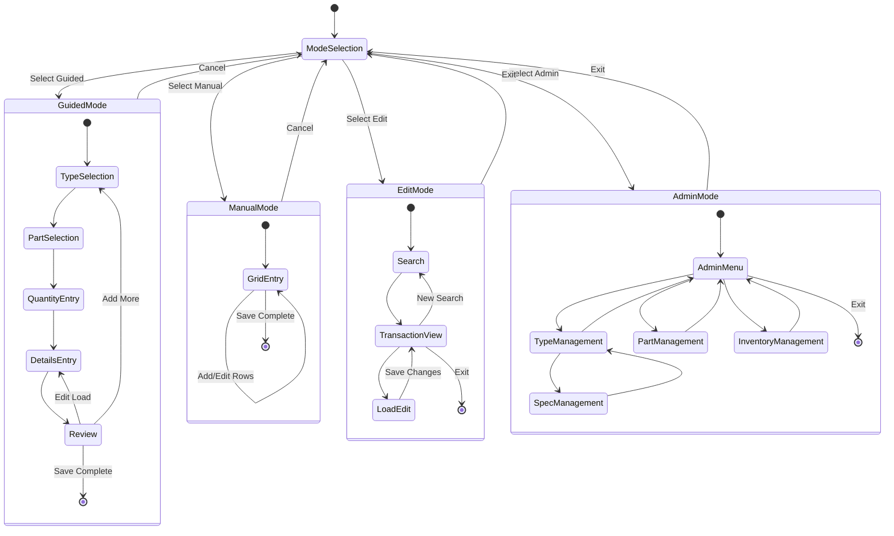
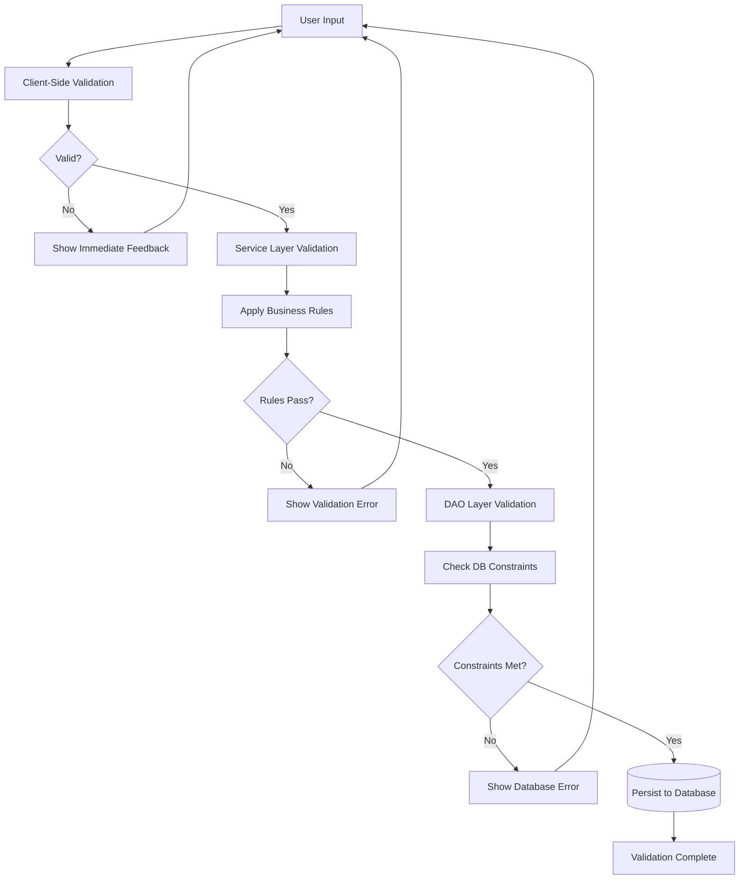
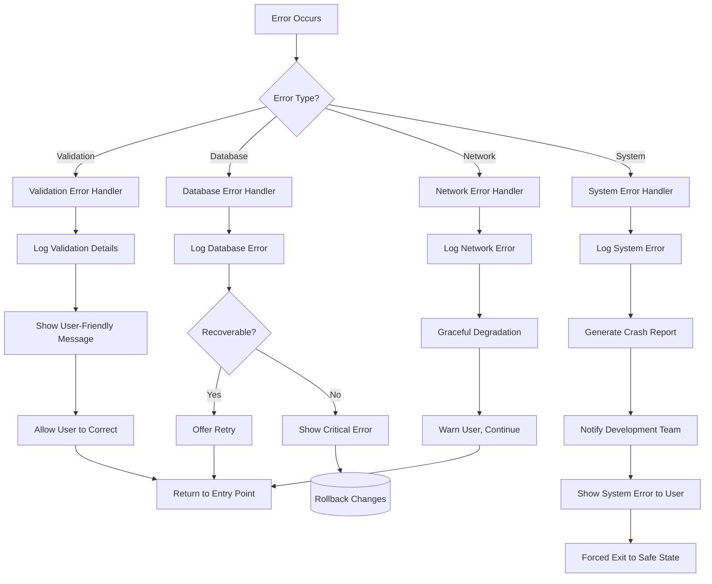
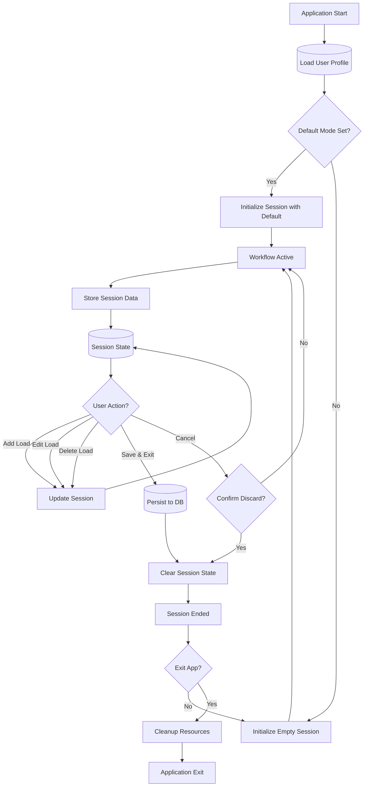

# Module_Dunnage - Data Flow

**Category**: Core Specification  
**Last Updated**: 2026-01-25  
**Related Documents**: [Purpose and Overview](./purpose-and-overview.md), [Workflow Modes](../../02-Workflow-Modes/)

---

## Overview

This document details the complete data flow through Module_Dunnage, from user input through processing, validation, persistence, and CSV export. The module supports three primary workflow modes (Guided, Manual, Edit) plus an Admin mode for configuration.

---

## Guided Mode Data Flow

### Complete Transaction Flow

---

## Manual Entry Mode Data Flow

### Grid-Based Entry Flow

---

## Edit Mode Data Flow

### Historical Transaction Modification Flow

---

## Admin Mode Data Flow

### Configuration Management Flow

---

## Database Persistence Layer

### Data Storage Flow

---

## CSV Export Flow

### Dual-Path Export with Graceful Degradation

---

## State Transitions

### Workflow State Machine

---

## Validation Points

### Data Validation Flow

**Validation Points by Layer:**

**Client-Side (ViewModel):**
- Required field presence
- Data type correctness
- Format validation (e.g., numeric range)
- Field length limits

**Service Layer:**
- Business rule enforcement
- Cross-field validation
- State consistency checks
- Permission validation

**DAO Layer:**
- Foreign key integrity
- Unique constraint checks
- Database-specific constraints
- Transaction integrity

---

## Error Handling Flow

### Comprehensive Error Management

---

## Session Management

### User Session Lifecycle

---

## Integration Points

### External System Integration

**MySQL Database:**
- Connection pooling for performance
- Transaction management for data integrity
- Error handling with retry logic
- Connection string from configuration

**CSV Export System:**
- RFC 4180 compliant formatting
- UTF-8 encoding with BOM
- CRLF line endings
- Dual-path export (local + network)

**Module_Core Services:**
- Error Handler: Centralized error management
- Logger: Structured logging
- Session Manager: User session state
- Settings Service: Configuration retrieval

**Module_Settings.Dunnage:**
- Type configuration retrieval
- Spec field definitions
- Part-type associations
- User preferences

---

## Performance Considerations

### Data Flow Optimizations

**Caching Strategy:**
- Type definitions cached on app startup
- Spec fields loaded on-demand per type
- Part associations cached per type
- Inventory list cached globally

**Lazy Loading:**
- Historical transactions loaded on search only
- Large result sets paginated
- Grid rows virtualized for 100+ loads

**Batch Operations:**
- Multiple loads saved in single transaction
- Bulk CSV write vs multiple file operations
- Batch validation for grid entries

**Async Operations:**
- All database operations async
- CSV export non-blocking
- UI remains responsive during saves

---

## Related Documentation

- [Purpose and Overview](./purpose-and-overview.md) - Module overview
- [Guided Mode Specification](../../02-Workflow-Modes/001-guided-mode-specification.md) - Detailed workflow
- [Dynamic Specification Fields](../../01-Business-Rules/dynamic-specification-fields.md) - Spec field system
- [CSV Export Paths](../../01-Business-Rules/csv-export-paths.md) - Export configuration

---

**Document Version:** 1.0  
**Last Updated:** 2026-01-25  
**Status:** Complete
