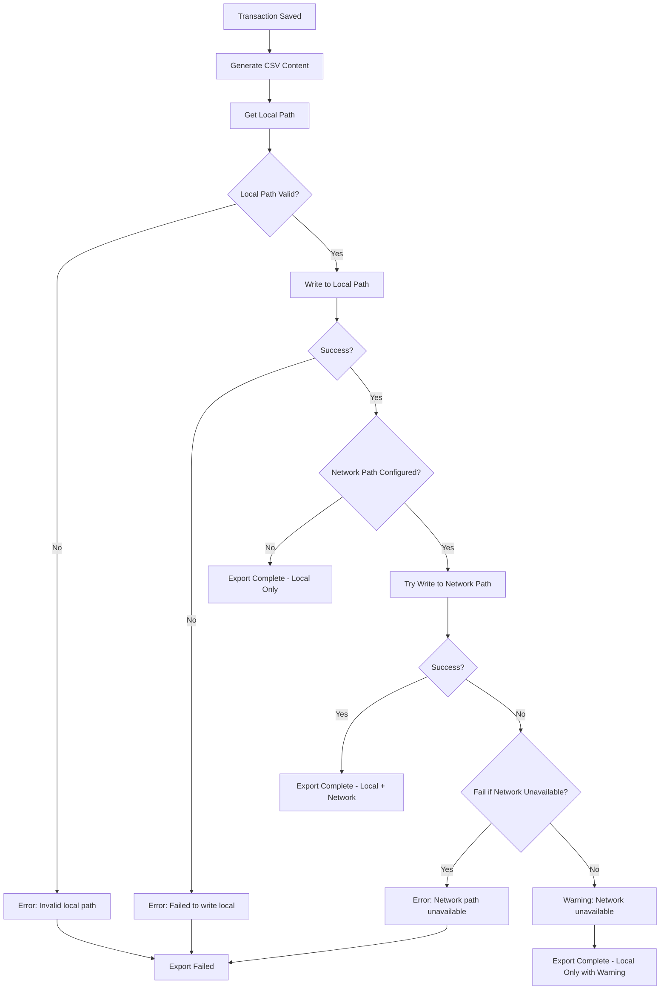

# CSV Export Paths Configuration

**Category**: Business Rules  
**Last Updated**: 2026-01-25  
**Related Documents**: [Data Flow](../00-Core/data-flow.md), [Advanced Settings](../../Module_Settings.Dunnage/01-Settings-Categories/advanced-settings.md)

---

## Rule Definition

CSV Export Paths Configuration defines where dunnage CSV files are exported after transaction completion. The system supports dual export (local + network) with graceful degradation if network is unavailable.

---

## Export Path Rules

### Rule 1: Local Path (Required)

**Definition**: Local CSV export path must be configured and accessible.

**Default Path**: `C:\AppData\Dunnage\`

**Validation**:
```
If local path is empty OR NULL:
    Error: "Local CSV path is required"
    Action: Block save in Advanced Settings

If local path does not exist:
    Prompt: "Create directory [path]? [Yes] [No]"
    Yes: Create directory structure
    No: Return error
    
If local path is not writable:
    Error: "Local CSV path is not writable. Check permissions."
    Action: Block CSV export
```

---

### Rule 2: Network Path (Optional)

**Definition**: Network CSV export path is optional. If configured, system attempts export but degrades gracefully on failure.

**Default Path**: Empty (not configured)

**Example Network Paths**:
- `\\server\share\dunnage\`
- `\\fileserver\receiving\csv\`
- `Z:\Dunnage\` (mapped drive)

**Validation**:
```
If network path is configured AND NOT empty:
    On CSV export:
        Try export to network path
        
        If network path exists AND writable:
            Success: Export CSV
            Log: "CSV exported to network path"
            
        If network path NOT accessible:
            If fail_if_network_unavailable = TRUE:
                Error: "Network path unavailable. Export failed."
                Action: Block transaction save
            Else:
                Warning: "Network path unavailable. Exported to local only."
                Action: Log warning, continue with local export only
```

---

### Rule 3: Path Validation

**Definition**: Paths must be valid Windows file system paths.

**Validation**:
```
Path format rules:
- Must be absolute path (not relative)
- Can be UNC path (\\server\share\)
- Can be mapped drive (Z:\folder\)
- Must end with backslash (\)
- Cannot contain invalid characters: < > : " | ? *

Examples:
✅ Valid:
  - C:\AppData\Dunnage\
  - \\server\share\dunnage\
  - Z:\CSV\Exports\

❌ Invalid:
  - relative\path (not absolute)
  - C:\AppData\Dunnage (missing trailing backslash)
  - C:\Invalid<>Path\ (invalid characters)
```

---

## CSV Filename Generation

### Filename Pattern

**Default Pattern**: `dunnage_{TransactionID}.csv`

**Example**: `dunnage_12345.csv`

**With Timestamp (Optional)**:
- Pattern: `dunnage_{TransactionID}_{Timestamp}.csv`
- Example: `dunnage_12345_20260125_103045.csv`
- Enabled via: Export options dialog checkbox

---

### Filename Uniqueness

**Rule**: If file already exists, append incremental suffix.

**Logic**:
```
Target filename: dunnage_12345.csv

If file exists:
    Try: dunnage_12345_1.csv
    If exists: dunnage_12345_2.csv
    If exists: dunnage_12345_3.csv
    ...
    Until unique filename found
```

**Rationale**: Prevents accidental file overwrite during re-export.

---

## Export Process Flow



---

## Configuration UI

### Advanced Settings → CSV Export Paths

```
┌───────────────────────────────────────────────────────┐
│ CSV Export Paths                                      │
│ ─────────────────────────────────────────────────────│
│                                                        │
│ Local CSV Path *                                      │
│ ┌─────────────────────────────────────────────────┐  │
│ │ C:\AppData\Dunnage\                  [Browse]   │  │
│ └─────────────────────────────────────────────────┘  │
│ ☑ Create directory if it doesn't exist              │
│                                                        │
│ Network CSV Path (Optional)                           │
│ ┌─────────────────────────────────────────────────┐  │
│ │ \\server\share\dunnage\              [Browse]   │  │
│ └─────────────────────────────────────────────────┘  │
│ ☑ Fail if network path unavailable                  │
│   (Uncheck for graceful degradation)                 │
│                                                        │
│ [Test Paths]  [Cancel]  [Save]                       │
└───────────────────────────────────────────────────────┘
```

**Test Paths Button**:
- Validates both paths
- Attempts to write test file
- Shows success/failure for each path
- Does not save configuration

---

## Error Handling

### Local Path Errors

**Error: Path Does Not Exist**
```
❌ Local CSV path does not exist: C:\AppData\Dunnage\

Create this directory? [Yes] [No]
```

**Error: Path Not Writable**
```
❌ Cannot write to local CSV path: C:\AppData\Dunnage\

Possible causes:
  • Insufficient permissions
  • Drive full
  • Path is read-only

Action: Check permissions and try again.
```

---

### Network Path Errors

**Warning: Network Path Unavailable (Graceful Mode)**
```
⚠ Network path unavailable: \\server\share\dunnage\

CSV exported to local path only.
Transaction saved successfully.

[OK]
```

**Error: Network Path Unavailable (Strict Mode)**
```
❌ Network path unavailable: \\server\share\dunnage\

Export failed. Transaction NOT saved.

Disable "Fail if network unavailable" in Advanced Settings
to continue with local-only export.

[Retry] [Cancel]
```

---

## Code Implementation

```csharp
public class Service_CSVExport
{
    private readonly IService_Config _config;
    
    public async Task<ExportResult> ExportAsync(string csvContent, int transactionId)
    {
        var localPath = _config.GetLocalCSVPath();
        var networkPath = _config.GetNetworkCSVPath();
        
        // Validate local path
        if (string.IsNullOrEmpty(localPath))
            return ExportResult.Failure("Local CSV path not configured");
        
        if (!Directory.Exists(localPath))
        {
            try
            {
                Directory.CreateDirectory(localPath);
            }
            catch (Exception ex)
            {
                return ExportResult.Failure($"Cannot create local path: {ex.Message}");
            }
        }
        
        // Export to local
        var localFile = Path.Combine(localPath, $"dunnage_{transactionId}.csv");
        localFile = GetUniqueFilename(localFile);
        
        try
        {
            await File.WriteAllTextAsync(localFile, csvContent);
        }
        catch (Exception ex)
        {
            return ExportResult.Failure($"Failed to write to local path: {ex.Message}");
        }
        
        // Export to network (optional)
        if (!string.IsNullOrEmpty(networkPath))
        {
            var networkFile = Path.Combine(networkPath, $"dunnage_{transactionId}.csv");
            networkFile = GetUniqueFilename(networkFile);
            
            try
            {
                await File.WriteAllTextAsync(networkFile, csvContent);
                return ExportResult.Success(localFile, networkFile);
            }
            catch (Exception ex)
            {
                if (_config.FailIfNetworkUnavailable)
                {
                    return ExportResult.Failure($"Network path unavailable: {ex.Message}");
                }
                else
                {
                    return ExportResult.SuccessWithWarning(
                        localFile, 
                        $"Network path unavailable. Local only. {ex.Message}");
                }
            }
        }
        
        return ExportResult.Success(localFile);
    }
    
    private string GetUniqueFilename(string basePath)
    {
        if (!File.Exists(basePath))
            return basePath;
        
        var directory = Path.GetDirectoryName(basePath);
        var filenameWithoutExt = Path.GetFileNameWithoutExtension(basePath);
        var extension = Path.GetExtension(basePath);
        
        int counter = 1;
        string newPath;
        do
        {
            newPath = Path.Combine(directory, $"{filenameWithoutExt}_{counter}{extension}");
            counter++;
        } while (File.Exists(newPath));
        
        return newPath;
    }
}
```

---

## Database Storage

```sql
-- Store paths in settings table
CREATE TABLE system_settings (
    setting_key VARCHAR(100) PRIMARY KEY,
    setting_value TEXT,
    updated_date DATETIME,
    updated_by INT
);

-- Example rows
INSERT INTO system_settings VALUES 
  ('csv_local_path', 'C:\AppData\Dunnage\', NOW(), 1),
  ('csv_network_path', '\\server\share\dunnage\', NOW(), 1),
  ('csv_fail_if_network_unavailable', 'false', NOW(), 1);
```

---

## Related Documentation

- [Data Flow](../00-Core/data-flow.md) - CSV export process
- [Advanced Settings](../../Module_Settings.Dunnage/01-Settings-Categories/advanced-settings.md) - UI configuration

---

**Document Version:** 1.0  
**Last Updated:** 2026-01-25  
**Status:** Complete
