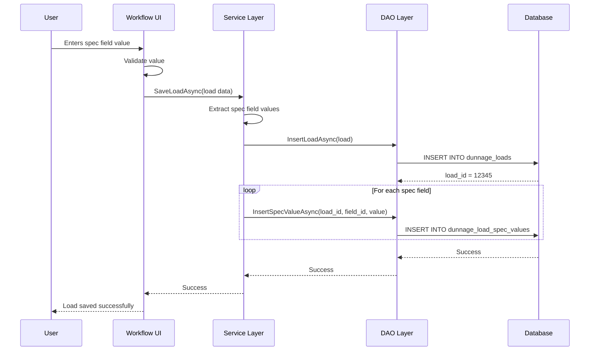
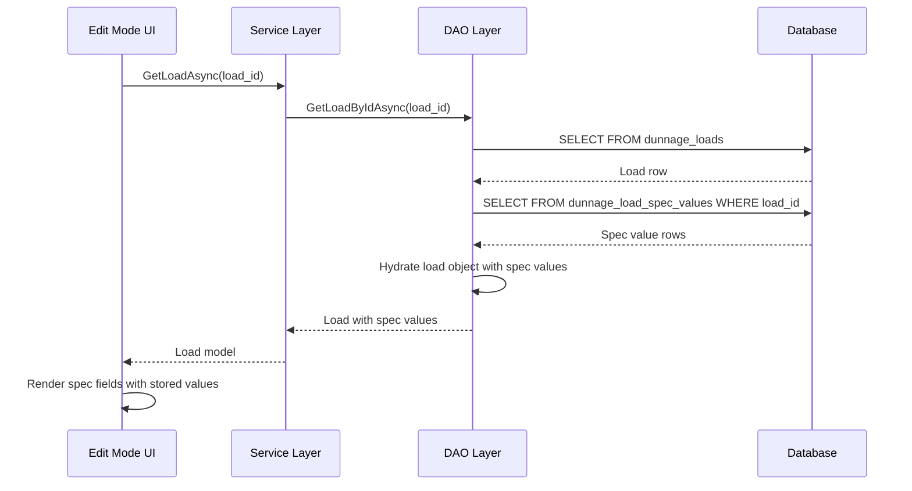
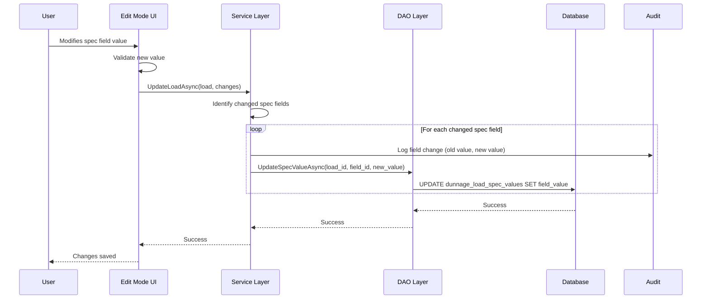

# Custom Field Value Persistence

**Category**: Business Rules  
**Last Updated**: 2026-01-25  
**Related Documents**: [Dynamic Specification Fields](./dynamic-specification-fields.md), [Edit Mode](../02-Workflow-Modes/003-edit-mode-specification.md)

---

## Rule Definition

Custom Field Value Persistence defines how user-entered values for dynamic specification fields are stored, retrieved, and maintained throughout the dunnage load lifecycle.

---

## Storage Strategy

### Database Schema

**dunnage_load_spec_values table**:
```sql
CREATE TABLE dunnage_load_spec_values (
    spec_value_id INT PRIMARY KEY AUTO_INCREMENT,
    load_id INT NOT NULL,
    spec_field_id INT NOT NULL,
    field_value TEXT,  -- Stores value as string regardless of type
    created_date DATETIME DEFAULT CURRENT_TIMESTAMP,
    modified_date DATETIME,
    modified_by INT,
    FOREIGN KEY (load_id) REFERENCES dunnage_loads(load_id),
    FOREIGN KEY (spec_field_id) REFERENCES dunnage_spec_fields(spec_field_id),
    UNIQUE KEY unique_load_field (load_id, spec_field_id)
);
```

**Key Design Decisions:**
- `field_value` is TEXT type (stores all values as strings)
- Type conversion handled in application layer
- One row per load-field combination
- Unique constraint prevents duplicates

---

## Value Storage By Field Type

### Text Fields

**Storage**: Direct string storage

**Example**:
```
Field: "Supplier"
User enters: "ABC Corporation"
Database: field_value = "ABC Corporation"
```

---

### Number Fields

**Storage**: Number converted to string

**Example**:
```
Field: "Weight Capacity"
User enters: 2500
Database: field_value = "2500"

On retrieval:
string storedValue = "2500"
int displayValue = int.Parse(storedValue)  // 2500
```

**Decimal Handling**:
```
Field: "Temperature" (2 decimal places)
User enters: 25.50
Database: field_value = "25.50"

On retrieval:
decimal displayValue = decimal.Parse("25.50")  // 25.50
```

---

### Dropdown Fields

**Storage**: Selected option value as string

**Example**:
```
Field: "Condition"
Options: ["Excellent", "Good", "Fair", "Poor", "Damaged"]
User selects: "Good"
Database: field_value = "Good"
```

**Edge Case: Option Removed After Data Entry**:
```
Field: "Condition"
Stored value: "Good"

Admin removes "Good" from options list

On retrieval in Edit Mode:
→ Display stored value "Good" (read-only or editable)
→ Show warning: "This value is no longer a valid option"
→ Allow admin to update to current valid option
```

See [CLARIFICATIONS.md - Edge Case 7](../CLARIFICATIONS.md#edge-case-7-dropdown-spec-option-changes) for full specification.

---

### Date Fields

**Storage**: ISO 8601 date string format

**Example**:
```
Field: "Inspection Date"
User selects: January 25, 2026
Database: field_value = "2026-01-25"

On retrieval:
DateTime displayValue = DateTime.Parse("2026-01-25")
Display format: "01/25/2026" (culture-specific)
```

**DateTime Fields**:
```
If field includes time:
Storage: "2026-01-25T10:30:00"
Display: "01/25/2026 10:30 AM"
```

---

## Persistence Lifecycle

### Create Flow



---

### Retrieve Flow



---

### Update Flow



---

## Data Type Conversion

### Application Layer Responsibility

**Principle**: Database stores strings, application converts to/from appropriate types.

**Conversion Service**:
```csharp
public class SpecFieldValueConverter
{
    public string ToStorageValue(object value, SpecFieldType fieldType)
    {
        return fieldType switch
        {
            SpecFieldType.Text => value?.ToString() ?? string.Empty,
            SpecFieldType.Number => value?.ToString() ?? "0",
            SpecFieldType.Dropdown => value?.ToString() ?? string.Empty,
            SpecFieldType.Date => ((DateTime?)value)?.ToString("yyyy-MM-dd") ?? string.Empty,
            _ => value?.ToString() ?? string.Empty
        };
    }
    
    public object FromStorageValue(string storedValue, SpecFieldType fieldType)
    {
        if (string.IsNullOrEmpty(storedValue))
            return GetDefaultValue(fieldType);
        
        return fieldType switch
        {
            SpecFieldType.Text => storedValue,
            SpecFieldType.Number => int.Parse(storedValue),
            SpecFieldType.Dropdown => storedValue,
            SpecFieldType.Date => DateTime.Parse(storedValue),
            _ => storedValue
        };
    }
    
    private object GetDefaultValue(SpecFieldType fieldType)
    {
        return fieldType switch
        {
            SpecFieldType.Text => string.Empty,
            SpecFieldType.Number => 0,
            SpecFieldType.Dropdown => string.Empty,
            SpecFieldType.Date => DateTime.Now,
            _ => null
        };
    }
}
```

---

## Validation on Retrieval

### Rule: Validate Retrieved Values

**Definition**: When loading historical data, validate spec values against current field definitions.

**Scenarios**:

**1. Field Type Changed**:
```
Original: Field "Weight" was Number
Stored value: "2500"
Current: Field "Weight" is now Text

On retrieval:
→ Load value as Text: "2500"
→ Log warning: "Field type changed from Number to Text"
```

See [CLARIFICATIONS.md - Edge Case 4](../CLARIFICATIONS.md#edge-case-4-spec-field-type-change-after-data-exists)

**2. Dropdown Option Removed**:
```
Original: Field "Condition" had option "Good"
Stored value: "Good"
Current: "Good" option removed

On retrieval:
→ Display stored value: "Good"
→ Mark as invalid with warning icon
→ Allow edit to valid option
```

See [CLARIFICATIONS.md - Edge Case 7](../CLARIFICATIONS.md#edge-case-7-dropdown-spec-option-changes)

**3. Number Out of Range**:
```
Original: Field "Weight" had max 10,000
Stored value: "2500"
Current: Field "Weight" has max 5,000

On retrieval:
→ Display stored value: 2500
→ Show warning: "Value exceeds current max (5000)"
→ Allow edit or keep as-is (grandfathered)
```

---

## NULL Handling

### Rule: Empty vs NULL

**Definition**: Distinguish between "user entered empty string" and "field did not exist".

**Storage**:
```
User leaves field empty:
→ Store empty string: field_value = ""

Field did not exist for this load:
→ No row in dunnage_load_spec_values table

Optional field, user skips:
→ Store NULL: field_value = NULL
```

**Retrieval**:
```
If no row exists:
→ Field was not defined for this type/load
→ Display: (not applicable)

If field_value IS NULL:
→ Optional field, user skipped
→ Display: (empty)

If field_value = "":
→ User entered empty string
→ Display: (empty)
```

**UI Display**:
```
Edit Mode Grid:
- Not Applicable: Gray, italic "(n/a)"
- NULL/Empty: Blank cell, editable
```

---

## Performance Optimization

### Lazy Loading Spec Values

**Strategy**: Load spec values only when needed.

**Implementation**:
```
Load list view (100 loads):
→ Load only core fields (Type, Part, Qty)
→ Do NOT load spec values

User clicks load to edit:
→ Load full load details including spec values
→ Cache in memory for duration of edit session
```

**Benefit**: Reduces initial load time by ~70% for large result sets.

---

### Batch Operations

**Bulk Insert**:
```csharp
public async Task InsertSpecValuesAsync(int loadId, Dictionary<int, string> fieldValues)
{
    // Single transaction for all spec values
    using var transaction = await _connection.BeginTransactionAsync();
    
    foreach (var (fieldId, value) in fieldValues)
    {
        await ExecuteAsync(
            "INSERT INTO dunnage_load_spec_values (load_id, spec_field_id, field_value) VALUES (@loadId, @fieldId, @value)",
            new { loadId, fieldId, value }
        );
    }
    
    await transaction.CommitAsync();
}
```

---

## CSV Export Considerations

### Column Mapping

**Dynamic Columns**: CSV includes columns for all spec fields.

**Example CSV**:
```
LoadID,Type,Part,Qty,Condition,Supplier,InspectionDate,WeightCapacity
12345,Wood Pallet,TUBE-A123,10,Good,ABC Corp,2026-01-25,2500
12346,Wood Pallet,TUBE-A123,5,Fair,XYZ Ind,2026-01-24,1000
```

**Null Handling in CSV**:
```
If spec value is NULL or empty:
→ Export as empty column: ,,

If spec field did not exist for this load:
→ Export as empty column: ,,
```

---

## Related Documentation

- [Dynamic Specification Fields](./dynamic-specification-fields.md) - Field system overview
- [Edit Mode](../02-Workflow-Modes/003-edit-mode-specification.md) - Historical data editing
- [CLARIFICATIONS.md](../CLARIFICATIONS.md) - Edge cases

---

**Document Version:** 1.0  
**Last Updated:** 2026-01-25  
**Status:** Complete
