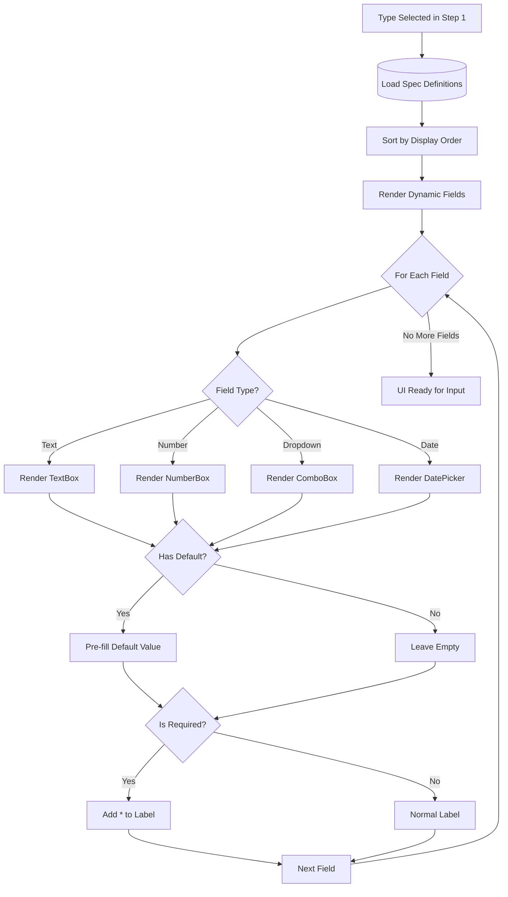

# Dynamic Specification Fields

**Category**: Business Rules  
**Last Updated**: 2026-01-25  
**Related Documents**: [Dunnage Type Configuration](./dunnage-type-configuration.md), [Custom Field Persistence](./custom-field-persistence.md)

---

## Overview

Dynamic Specification Fields enable each dunnage type to have custom, configurable data fields that users must fill when receiving that type of dunnage. This system allows unlimited flexibility in capturing type-specific information without requiring code changes.

---

## Concept

**Dynamic Spec System:**
- Each dunnage type defines its own specification fields
- Fields are configured by administrators in Admin Mode
- Fields render dynamically in Details Entry step based on selected type
- Field values are validated and persisted per load

**Example:**
- **Wood Pallet** type might have fields: Condition (dropdown), Supplier (text), Date Received (date)
- **Plastic Tote** type might have fields: Size (dropdown), Color (dropdown), Quantity (number)
- **Metal Rack** type might have fields: Height (number), Weight Capacity (number), Inspection Date (date)

---

## Supported Field Types

### 1. Text Field

**Purpose**: Free-form text entry

**Properties**:
- Field Name (string)
- Required (bool)
- Default Value (string, optional)
- Max Length (int, default: 255)
- Validation Pattern (regex, optional)

**UI Component**: TextBox

**Example Configuration**:
```
Field Name: Supplier
Type: Text
Required: Yes
Default Value: (empty)
Max Length: 100
Validation: (none)
```

**Example UI**:
```
┌──────────────────────────────────┐
│ Supplier *                       │
│ ┌──────────────────────────────┐│
│ │ ABC Manufacturing Co.        ││
│ └──────────────────────────────┘│
└──────────────────────────────────┘
```

---

### 2. Number Field

**Purpose**: Numeric values (integer or decimal)

**Properties**:
- Field Name (string)
- Required (bool)
- Default Value (number, optional)
- Min Value (number, optional)
- Max Value (number, optional)
- Decimal Places (int, default: 0)

**UI Component**: NumberBox

**Example Configuration**:
```
Field Name: Weight Capacity
Type: Number
Required: Yes
Default Value: 1000
Min Value: 0
Max Value: 10000
Decimal Places: 0
```

**Example UI**:
```
┌──────────────────────────────────┐
│ Weight Capacity (lbs) *          │
│ ┌──────────────────────────────┐│
│ │ 2500                      ▲▼││
│ └──────────────────────────────┘│
│ Range: 0 - 10,000                │
└──────────────────────────────────┘
```

---

### 3. Dropdown Field

**Purpose**: Selection from predefined options

**Properties**:
- Field Name (string)
- Required (bool)
- Default Value (string, optional - must be in options)
- Options (list of strings)
- Allow Custom (bool, default: false)

**UI Component**: ComboBox

**Example Configuration**:
```
Field Name: Condition
Type: Dropdown
Required: Yes
Default Value: Good
Options: [Excellent, Good, Fair, Poor, Damaged]
Allow Custom: No
```

**Example UI**:
```
┌──────────────────────────────────┐
│ Condition *                      │
│ ┌──────────────────────────────┐│
│ │ Good                      ▼ ││
│ └──────────────────────────────┘│
│ Options:                         │
│   • Excellent                    │
│   • Good                         │
│   • Fair                         │
│   • Poor                         │
│   • Damaged                      │
└──────────────────────────────────┘
```

---

### 4. Date Field

**Purpose**: Date selection

**Properties**:
- Field Name (string)
- Required (bool)
- Default Value (string: "Today", "Tomorrow", or specific date)
- Min Date (date, optional)
- Max Date (date, optional)

**UI Component**: CalendarDatePicker

**Example Configuration**:
```
Field Name: Inspection Date
Type: Date
Required: No
Default Value: Today
Min Date: (today - 30 days)
Max Date: (today)
```

**Example UI**:
```
┌──────────────────────────────────┐
│ Inspection Date                  │
│ ┌──────────────────────────────┐│
│ │ 01/25/2026                📅││
│ └──────────────────────────────┘│
└──────────────────────────────────┘
```

---

## Field Configuration Rules

### Naming Conventions

**Valid Field Names:**
- Must be unique within a dunnage type
- 1-50 characters
- Letters, numbers, spaces, hyphens, underscores
- Cannot start with number or special character

**Examples:**
- ✅ "Supplier"
- ✅ "Weight Capacity"
- ✅ "Inspection-Date"
- ✅ "Size_Category"
- ❌ "123Field" (starts with number)
- ❌ "Supplier!!" (invalid characters)
- ❌ "" (empty name)

---

### Required Field Enforcement

**Required Field Behavior:**
- Marked with asterisk (*) in UI
- Validation error if left blank
- Blocks save until filled
- Applies to all workflow modes (Guided, Manual, Edit)

**Validation Error Message**:
```
"[Field Name] is required. Please provide a value."
Example: "Condition is required. Please provide a value."
```

---

### Default Value Application

**When Default Values Apply:**
- New load creation in Guided Mode (pre-populates field)
- New row in Manual Entry Mode (if row created via "Add" button)
- NOT applied in Edit Mode (preserves historical values)

**Default Value Examples:**
```
Text Field:
  Default: "ABC Corp" → Field pre-filled with "ABC Corp"

Number Field:
  Default: 1000 → Field pre-filled with 1000

Dropdown Field:
  Default: "Good" → Dropdown pre-selected to "Good"

Date Field:
  Default: "Today" → Field pre-filled with current date
  Default: "2026-01-25" → Field pre-filled with specific date
```

---

### Display Order

**Purpose**: Control order in which fields appear in Details Entry UI

**Rules:**
- Display Order is integer (0-999)
- Fields sorted ascending by Display Order
- Ties broken by Field Name alphabetically
- Admin can drag-and-drop to reorder in settings

**Example**:
```
Display Order: 0 → Condition
Display Order: 1 → Supplier
Display Order: 2 → Inspection Date
Display Order: 3 → Weight Capacity
```

---

## Dynamic Rendering in Workflow

### Guided Mode - Details Entry Step

**Rendering Flow:**


**Example Rendered UI:**
```
┌─────────────────────────────────────────────────────┐
│ Step 4: Details Entry                               │
│ ───────────────────────────────────────────────────│
│                                                      │
│ Type: Wood Pallet 48x40                             │
│ Part: Tube Assembly A123                            │
│ Quantity: 10                                         │
│                                                      │
│ ═══════════════════════════════════════════════════│
│ DUNNAGE SPECIFICATIONS                              │
│ ───────────────────────────────────────────────────│
│                                                      │
│ Condition *                                         │
│ ┌─────────────────────────────────────────────────┐│
│ │ Good                                         ▼ ││
│ └─────────────────────────────────────────────────┘│
│                                                      │
│ Supplier *                                          │
│ ┌─────────────────────────────────────────────────┐│
│ │ ABC Manufacturing Co.                           ││
│ └─────────────────────────────────────────────────┘│
│                                                      │
│ Inspection Date                                      │
│ ┌─────────────────────────────────────────────────┐│
│ │ 01/25/2026                               📅   ││
│ └─────────────────────────────────────────────────┘│
│                                                      │
│ Weight Capacity (lbs) *                             │
│ ┌─────────────────────────────────────────────────┐│
│ │ 2500                                       ▲▼  ││
│ └─────────────────────────────────────────────────┘│
│                                                      │
│                     [Back]  [Next: Review]          │
└─────────────────────────────────────────────────────┘
```

---

### Manual Entry Mode - Grid Columns

**Grid Rendering:**
- Dynamic columns created per type
- Each spec field becomes a grid column
- Column type matches field type (TextBox, NumberBox, ComboBox, DatePicker)
- Required fields marked in column header with *

**Example Grid**:
```
┌──────┬────────────────┬──────────┬───────────┬────────────────┬──────────────┬──────────────────┐
│ Type │ Part           │ Quantity │ Condition │ Supplier       │ Inspect Date │ Weight Capacity  │
│      │                │          │           │                │              │ (lbs)            │
├──────┼────────────────┼──────────┼───────────┼────────────────┼──────────────┼──────────────────┤
│ Wood │ Tube Assy A123 │ 10       │ Good ▼   │ ABC Corp       │ 01/25/26 📅 │ 2500          ▲▼│
│ Wood │ Tube Assy A123 │ 5        │ Fair ▼   │ XYZ Industries │ 01/24/26 📅 │ 1000          ▲▼│
│ Wood │ Frame Assy B456│ 8        │ Good ▼   │ ABC Corp       │ 01/25/26 📅 │ 3000          ▲▼│
└──────┴────────────────┴──────────┴───────────┴────────────────┴──────────────┴──────────────────┘
```

---

## Validation Rules

### Client-Side Validation

**Performed On:**
- Field blur (user exits field)
- Form submission (Next button in Guided Mode)
- Grid row validation (Manual Mode)

**Validation Checks:**

**Text Fields:**
- Not empty if required
- Max length not exceeded
- Regex pattern match (if specified)

**Number Fields:**
- Not empty if required
- Valid numeric format
- Within min/max range (if specified)
- Correct decimal places

**Dropdown Fields:**
- Not empty if required
- Selected value in options list (if Allow Custom = false)

**Date Fields:**
- Not empty if required
- Valid date format
- Within min/max date range (if specified)

---

### Validation Error Display

**Guided Mode:**
```
┌─────────────────────────────────────────────────────┐
│ Step 4: Details Entry                               │
│ ───────────────────────────────────────────────────│
│                                                      │
│ ⚠ Please correct the following errors:             │
│   • Condition is required                           │
│   • Weight Capacity must be between 0 and 10,000   │
│                                                      │
│ Condition *                                         │
│ ┌─────────────────────────────────────────────────┐│
│ │ [Empty - Please select]                      ▼ ││ ← Red border
│ └─────────────────────────────────────────────────┘│
│ ⚠ Required field                                    │
│                                                      │
│ Weight Capacity (lbs) *                             │
│ ┌─────────────────────────────────────────────────┐│
│ │ 25000                                      ▲▼  ││ ← Red border
│ └─────────────────────────────────────────────────┘│
│ ⚠ Must be between 0 and 10,000                      │
└─────────────────────────────────────────────────────┘
```

**Manual Mode:**
- Invalid cells highlighted with red border
- Error icon in cell with tooltip showing error message

---

## Data Persistence

### Storage Format

**Database Table**: `dunnage_lines`

**Spec Values Column**: JSON or structured format

**Example JSON Storage**:
```json
{
  "Condition": "Good",
  "Supplier": "ABC Manufacturing Co.",
  "Inspection Date": "2026-01-25",
  "Weight Capacity": 2500
}
```

**Alternative Normalized Storage**: `dunnage_spec_values` table
```
load_id | spec_field_id | value_text | value_number | value_date
--------+---------------+------------+--------------+------------
101     | 1             | NULL       | NULL         | NULL       
101     | 2             | Good       | NULL         | NULL       
101     | 3             | ABC Corp   | NULL         | NULL       
101     | 4             | NULL       | NULL         | 2026-01-25 
101     | 5             | NULL       | 2500         | NULL       
```

---

## Settings Integration

### Spec Field Configuration (Admin Mode)

**Access Path:**
```
Admin Mode → Type Management → Select Type → Manage Specifications
```

**Configuration UI**:
```
┌─────────────────────────────────────────────────────┐
│ Manage Specifications: Wood Pallet 48x40            │
│ ───────────────────────────────────────────────────│
│                                                      │
│ Current Specifications:                             │
│                                                      │
│ ┌────────────────────────────────────────────────┐ │
│ │ Order│ Field Name        │ Type    │ Req │ ... ││
│ │──────┼──────────────────┼────────┼─────┼────││
│ │  1   │ Condition         │ Dropdown│ ✓   │Edit││
│ │  2   │ Supplier          │ Text    │ ✓   │Edit││
│ │  3   │ Inspection Date   │ Date    │     │Edit││
│ │  4   │ Weight Capacity   │ Number  │ ✓   │Edit││
│ └────────────────────────────────────────────────┘ │
│                                                      │
│ [➕ Add Specification]  [⬆⬇ Reorder]               │
└─────────────────────────────────────────────────────┘
```

**Add/Edit Specification Dialog**:
```
┌─────────────────────────────────────────────────────┐
│ Add Specification Field                             │
│ ───────────────────────────────────────────────────│
│                                                      │
│ Field Name *                                        │
│ ┌─────────────────────────────────────────────────┐│
│ │ Color                                           ││
│ └─────────────────────────────────────────────────┘│
│                                                      │
│ Field Type *                                        │
│ ┌─────────────────────────────────────────────────┐│
│ │ Dropdown                                     ▼ ││
│ └─────────────────────────────────────────────────┘│
│                                                      │
│ ☑ Required Field                                    │
│                                                      │
│ Default Value                                        │
│ ┌─────────────────────────────────────────────────┐│
│ │ Blue                                            ││
│ └─────────────────────────────────────────────────┘│
│                                                      │
│ Dropdown Options (one per line)                     │
│ ┌─────────────────────────────────────────────────┐│
│ │ Red                                             ││
│ │ Blue                                            ││
│ │ Green                                           ││
│ │ Yellow                                          ││
│ │ White                                           ││
│ └─────────────────────────────────────────────────┘│
│                                                      │
│                      [Cancel]  [Save]               │
└─────────────────────────────────────────────────────┘
```

---

## Edge Cases

### Field Type Change After Data Exists

**Scenario**: Admin changes "Weight Capacity" from Text to Number

**Handling**:
- **Option A** (Recommended): Block type change if data exists
- **Option B**: Soft delete old field, create new field with new type
- **Option C**: Attempt data migration with validation warnings

**See**: [CLARIFICATIONS.md - Edge Case 4](../CLARIFICATIONS.md#edge-case-4-spec-field-type-change-after-data-exists)

---

### Required Field Becomes Optional (or Vice Versa)

**Scenario**: Admin changes "Supplier" from Optional to Required

**Handling**:
- **Forward-only**: Only new transactions validated with new requirement
- **Edit Mode**: Historical data shows warning but can still save
- **No retroactive validation** on historical data

**See**: [CLARIFICATIONS.md - Edge Case 5](../CLARIFICATIONS.md#edge-case-5-required-spec-field-becomes-optional-or-vice-versa)

---

### Dropdown Option Removal

**Scenario**: Admin removes "Damaged" from Condition dropdown

**Handling**:
- **Soft removal**: Option marked inactive but preserved for historical data
- **Display in Edit Mode**: Old value shown as read-only
- **Validation**: New transactions cannot select removed option

**See**: [CLARIFICATIONS.md - Edge Case 7](../CLARIFICATIONS.md#edge-case-7-dropdown-spec-option-changes)

---

## Related Documentation

- [Dunnage Type Configuration](./dunnage-type-configuration.md) - Type management rules
- [Custom Field Persistence](./custom-field-persistence.md) - Data storage format
- [Specification Field Configuration](../../Module_Settings.Dunnage/01-Settings-Categories/specification-field-configuration.md) - Admin UI

---

**Document Version:** 1.0  
**Last Updated:** 2026-01-25  
**Status:** Complete
