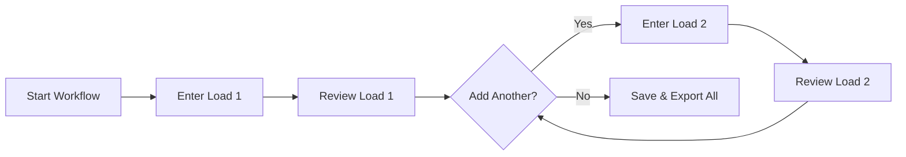

# Multi-Load Entry Workflow

**Category**: Business Rules  
**Last Updated**: 2026-01-25  
**Related Documents**: [Guided Mode](../02-Workflow-Modes/001-guided-mode-specification.md), [Manual Entry Mode](../02-Workflow-Modes/002-manual-entry-mode-specification.md)

---

## Rule Definition

Multi-Load Entry Workflow defines how users can enter multiple dunnage loads in a single transaction, supporting both sequential (Guided Mode) and bulk (Manual Entry Mode) entry patterns.

---

## Entry Patterns

### Pattern 1: Sequential Entry (Guided Mode)

**Flow**: User completes one load at a time through 5-step wizard, then repeats for additional loads.



**User Actions**:
1. Complete Step 1-5 for first load
2. Step 5 Review: Click "Add Another Load"
3. Return to Step 1 for next load
4. Repeat until all loads entered
5. Step 5 Review: Click "Save & Export" to finish

---

### Pattern 2: Bulk Entry (Manual Entry Mode)

**Flow**: User enters all loads in grid simultaneously.


**User Actions**:
1. Add rows to grid (one per load)
2. Fill in Type, Part, Qty, Spec fields for each row
3. Review all rows for errors
4. Click "Save & Export CSV"

---

## Business Rules

### Rule 1: Transaction Grouping

**Definition**: All loads entered in a single session are grouped into one transaction.

**Behavior**:
```
Transaction = Collection of Loads

All loads in transaction:
- Share same transaction_id
- Share same created_date
- Share same created_by user
- Exported to single CSV file
```

**Example**:
```
Transaction #12345:
  Load #101: Wood Pallet, TUBE-A123, Qty 10
  Load #102: Wood Pallet, TUBE-A123, Qty 5
  Load #103: Cardboard Box, FRAME-B456, Qty 8
  
All exported to: dunnage_12345.csv
```

---

### Rule 2: Minimum Load Count

**Definition**: Transaction must contain at least 1 load.

**Validation**:
```
If load count = 0:
    Error: "No loads to save. Please enter at least one load."
    Action: Block save
```

**Guided Mode**:
- Cannot reach Step 5 (Review) without completing at least one load
- "Add Another Load" enabled only after first load complete

**Manual Entry Mode**:
- "Save & Export" button disabled if grid is empty
- Shows message: "Add at least one row to continue"

---

### Rule 3: Maximum Load Count (Soft Limit)

**Definition**: Warn if load count exceeds reasonable threshold.

**Default Limit**: 100 loads per transaction (configurable)

**Validation**:
```
If load count > 100:
    Warning: "Large transaction detected: {count} loads.
              Consider splitting into multiple transactions for better performance.
              Continue?"
    Severity: Warning (allows save with confirmation)
```

**Rationale**: 
- Performance optimization for CSV export
- Easier auditing and error correction
- Prevents accidental bulk entry errors

---

### Rule 4: Load Independence

**Definition**: Each load within a transaction is independent; validation applied per load.

**Behavior**:
```
Load #101 validation errors do NOT block Load #102 entry

However:
Transaction save is blocked if ANY load has validation errors
```

**Example**:
```
Transaction with 3 loads:
  Load #101: ✓ Valid
  Load #102: ✗ Invalid (missing required field)
  Load #103: ✓ Valid

Action:
- Allow user to continue entering Load #103
- Block save until Load #102 is fixed
- Show error: "1 load has validation errors"
```

---

### Rule 5: Same-Type Optimization (Guided Mode)

**Definition**: When adding another load, offer to copy fields from previous load if same type.

**UI Prompt (Step 5 Review)**:
```
┌─────────────────────────────────────────────────────┐
│ Add Another Load                                    │
│ ───────────────────────────────────────────────────│
│                                                      │
│ ☐ Copy type and part from previous load            │
│   (Wood Pallet 48x40, TUBE-A123)                   │
│                                                      │
│ ☐ Copy all fields from previous load               │
│   (Type, Part, Qty, and specification fields)      │
│                                                      │
│                      [Cancel]  [Add Load]           │
└─────────────────────────────────────────────────────┘
```

**Behavior**:
```
Option 1: Copy type and part
→ Pre-fill Step 1 (Type) and Step 2 (Part)
→ User enters new Qty and Specs

Option 2: Copy all fields
→ Pre-fill Steps 1-4 with previous load's values
→ User can modify any field
→ Useful for receiving multiple loads with minor differences
```

**Example Use Case**:
```
Receiving 10 loads of Wood Pallets with TUBE-A123:
1. Enter first load completely
2. Click "Add Another Load"
3. Check "Copy all fields from previous load"
4. Modify Qty (e.g., change from 10 to 5)
5. Click "Add to Transaction"
6. Repeat for remaining 8 loads
```

---

### Rule 6: Duplicate Detection (Optional Warning)

**Definition**: Warn if user enters identical loads (same Type, Part, Qty, and all spec fields).

**Validation**:
```
When user adds load to transaction:
Compare new load to existing loads in transaction

If exact match found:
    Warning: "This load appears to be a duplicate of Load #{id}.
              • Type: {type}
              • Part: {part}
              • Qty: {qty}
              
              Continue anyway? [Yes] [No]"
```

**Severity**: Warning (allows user to proceed - may be intentional)

**Rationale**: Catch accidental double-entry, but allow intentional duplicates.

---

## Load Management

### Adding Loads

**Guided Mode**:
```
Step 5 (Review) → [Add Another Load] button

Options:
- Start fresh (all fields empty)
- Copy type & part from previous
- Copy all fields from previous
```

**Manual Entry Mode**:
```
Toolbar → [➕ Add Row] button

Or:
Press Enter at last column of last row → Auto-creates new row
```

---

### Removing Loads

**Guided Mode**:
```
Step 5 (Review) → Load list → [Remove] button per load

Confirmation:
"Remove Load #{id} from transaction? This cannot be undone."
[Cancel] [Remove]
```

**Manual Entry Mode**:
```
Select row(s) via checkbox
Toolbar → [🗑️ Delete Selected] button

Confirmation:
"Delete {count} selected rows? This cannot be undone."
[Cancel] [Delete]
```

---

### Editing Loads (Before Save)

**Guided Mode**:
```
Step 5 (Review) → Load list → [Edit] button per load

Action:
- Return to Step 1 with that load's data pre-filled
- User makes changes
- Click "Update Load" to save changes
- Return to Step 5 (Review)
```

**Manual Entry Mode**:
```
Click any cell in grid → Edit in place
Changes reflected immediately in grid
```

---

## Transaction Review

### Pre-Save Summary (Guided Mode Step 5)

**Display**:
```
┌─────────────────────────────────────────────────────┐
│ Review Transaction (3 loads)                        │
│ ───────────────────────────────────────────────────│
│                                                      │
│ Load #1:                                            │
│   Type: Wood Pallet 48x40                          │
│   Part: TUBE-A123 - Tube Assembly A123             │
│   Qty: 10                                           │
│   Condition: Good                                   │
│   [Edit] [Remove]                                   │
│                                                      │
│ Load #2:                                            │
│   Type: Wood Pallet 48x40                          │
│   Part: TUBE-A123 - Tube Assembly A123             │
│   Qty: 5                                            │
│   Condition: Fair                                   │
│   [Edit] [Remove]                                   │
│                                                      │
│ Load #3:                                            │
│   Type: Cardboard Box - Large                      │
│   Part: FRAME-B456 - Frame Assembly B456           │
│   Qty: 8                                            │
│   Size: Large                                       │
│   [Edit] [Remove]                                   │
│                                                      │
│ Total Loads: 3                                      │
│                                                      │
│ [Add Another Load]  [Cancel]  [Save & Export CSV]   │
└─────────────────────────────────────────────────────┘
```

---

### Pre-Save Validation (Manual Entry Mode)

**Grid Summary Bar**:
```
Total Rows: 25  │  Valid: 23  │  Invalid: 2
```

**Validation Errors**:
```
⚠ 2 rows have validation errors:

Row 5:
  • Quantity is required
  
Row 12:
  • Weight Capacity must be between 0 and 10,000
  
[View Errors in Grid] (scrolls to first error)
```

---

## Performance Considerations

### Guided Mode (Sequential Entry)

**Performance Impact**: Minimal
- One load at a time
- UI only renders current step
- Session data held in memory
- Database write only on final save

**Recommended For**:
- Up to 20 loads comfortably
- 20-50 loads acceptable
- 50+ loads consider Manual Entry Mode

---

### Manual Entry Mode (Bulk Entry)

**Performance Impact**: Variable based on load count

**Performance Tiers**:
```
1-50 loads:   Optimal (< 1 second render)
51-100 loads: Good (1-2 seconds render)
101-500 loads: Acceptable (3-5 seconds render)
501+ loads:   Warning (pagination/virtualization recommended)
```

**Optimizations**:
- Row virtualization (render only visible rows)
- Debounced validation (delay 300ms after cell edit)
- Batch database insert (single transaction)

---

## CSV Export Multi-Load

### Single CSV File Per Transaction

**Rule**: All loads in transaction exported to one CSV file.

**Format**:
```csv
LoadID,Type,Part,Qty,Condition,Supplier,InspectionDate,WeightCapacity
101,Wood Pallet 48x40,TUBE-A123,10,Good,ABC Corp,2026-01-25,2500
102,Wood Pallet 48x40,TUBE-A123,5,Fair,XYZ Ind,2026-01-24,1000
103,Cardboard Box,FRAME-B456,8,Good,ABC Corp,2026-01-25,
```

**File Naming**: `dunnage_{transaction_id}.csv`

**Export Paths**: Both local and network (if configured)

---

## Related Documentation

- [Guided Mode](../02-Workflow-Modes/001-guided-mode-specification.md) - Sequential entry workflow
- [Manual Entry Mode](../02-Workflow-Modes/002-manual-entry-mode-specification.md) - Bulk entry workflow
- [Data Flow](../00-Core/data-flow.md) - Transaction structure

---

**Document Version:** 1.0  
**Last Updated:** 2026-01-25  
**Status:** Complete
