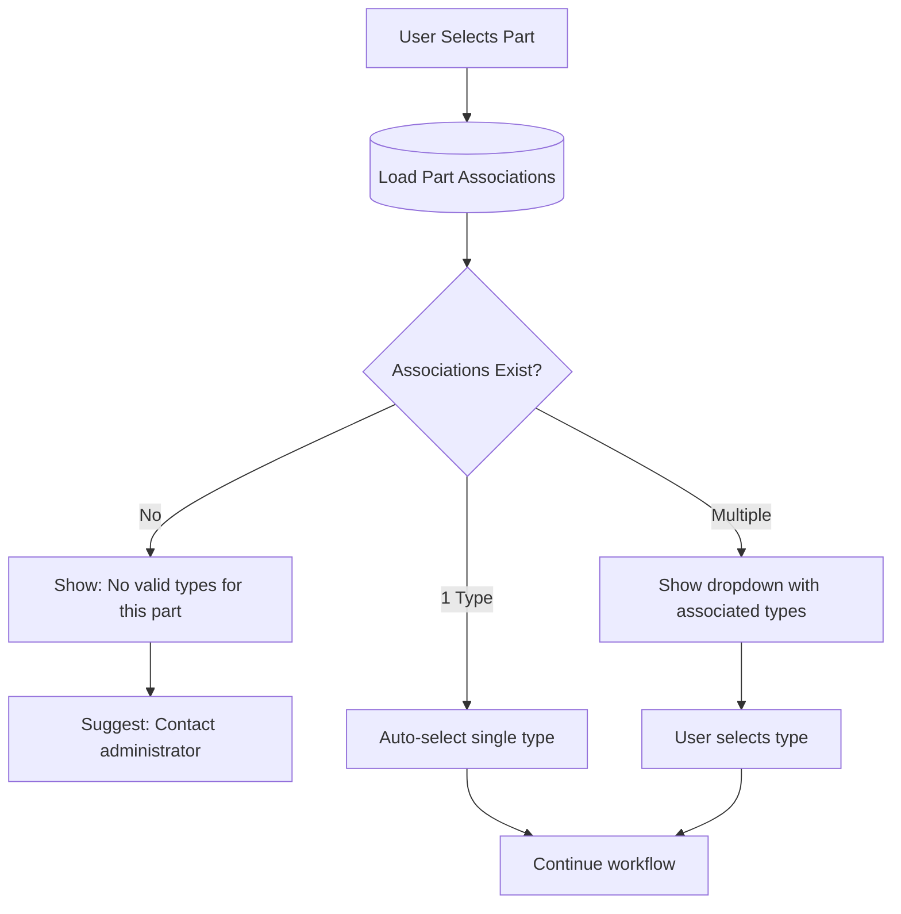

# Part-Type Associations

**Category**: Business Rules  
**Last Updated**: 2026-01-25  
**Related Documents**: [Type Configuration](./dunnage-type-configuration.md), [Part Management](../../Module_Settings.Dunnage/01-Settings-Categories/part-management.md)

---

## Rule Definition

Part-Type Associations define which dunnage types are valid for each part. This many-to-many relationship ensures users only see appropriate dunnage options when receiving specific parts.

---

## Business Rule

### Rule: Part-Type Association Validation

**Definition**: When a user selects a part, only dunnage types associated with that part are available for selection.

**Flow:**


**Behavior Examples:**

**Scenario 1: Part with 3 Associated Types**
```
User selects: TUBE-A123
System loads associations: Wood Pallet, Cardboard Box, Metal Rack
UI shows: Dropdown with 3 options
User selects: Wood Pallet
```

**Scenario 2: Part with 1 Associated Type**
```
User selects: PANEL-D012
System loads associations: Metal Rack (only)
UI auto-selects: Metal Rack
User continues to: Quantity entry
```

**Scenario 3: Part with 0 Associated Types**
```
User selects: NEW-PART-001
System loads associations: None
UI shows: Error message
Message: "No dunnage types configured for this part. Contact administrator."
Action: Block workflow progression
```

---

## Association Management

### Admin Configuration

**Location**: Admin Mode → Part Management → Select Part → "Manage Associations"

**Interface**:
```
Part: TUBE-A123
Associated Types (3):
  ☑ Wood Pallet 48x40
  ☑ Cardboard Box - Large
  ☑ Metal Rack - Standard
  ☐ Plastic Tote
  ☐ Plastic Crate
```

**Validation**:
- At least 1 type should be associated (warning if 0)
- No duplicate associations
- Changes apply immediately to new transactions

---

## Database Schema

```sql
CREATE TABLE part_type_associations (
    association_id INT PRIMARY KEY AUTO_INCREMENT,
    part_id INT NOT NULL,
    type_id INT NOT NULL,
    created_date DATETIME DEFAULT CURRENT_TIMESTAMP,
    created_by INT,
    FOREIGN KEY (part_id) REFERENCES parts(part_id),
    FOREIGN KEY (type_id) REFERENCES dunnage_types(type_id),
    UNIQUE KEY unique_part_type (part_id, type_id)
);
```

---

## Related Documentation

- [Type Configuration](./dunnage-type-configuration.md)
- [Admin Mode Specification](../02-Workflow-Modes/004-admin-mode-specification.md)

---

**Document Version:** 1.0  
**Last Updated:** 2026-01-25  
**Status:** Complete
