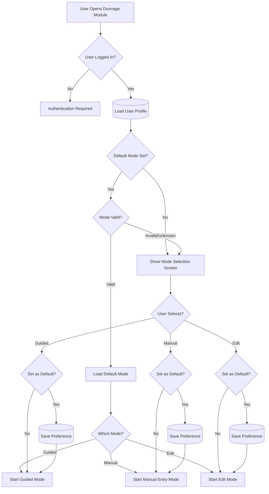
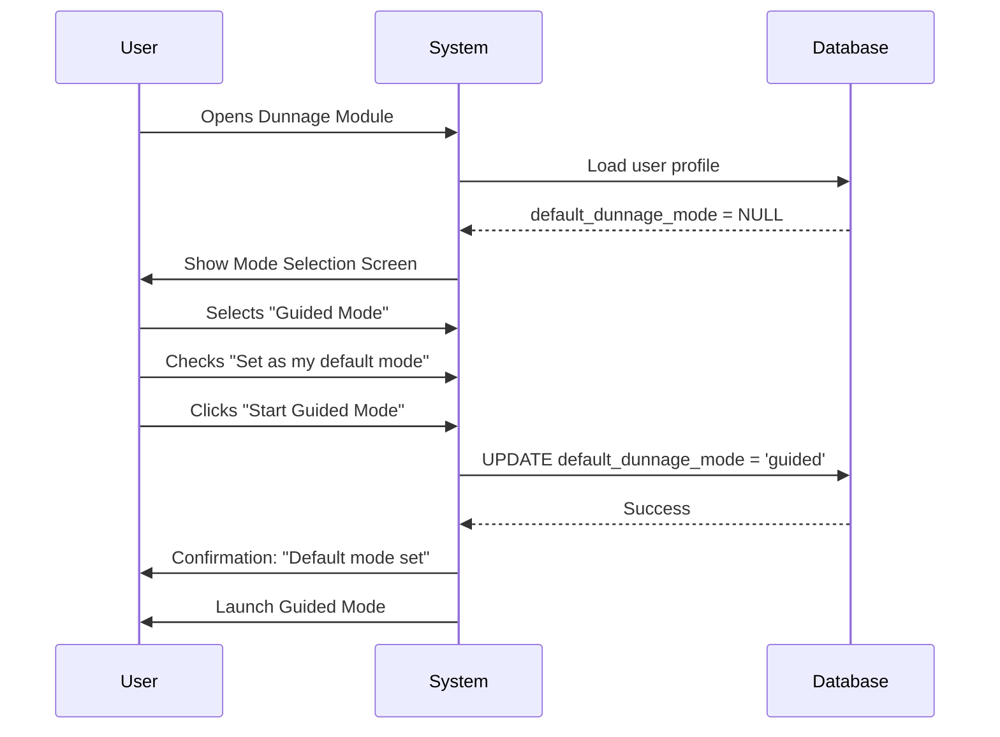
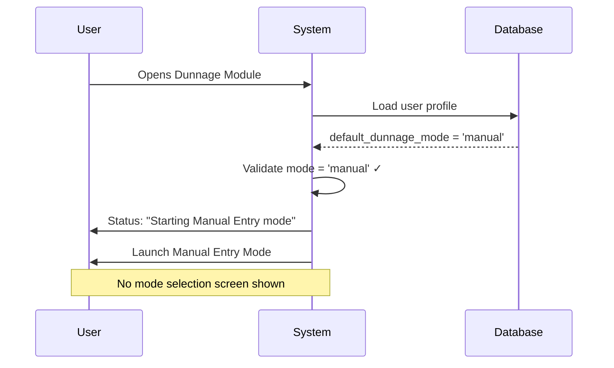
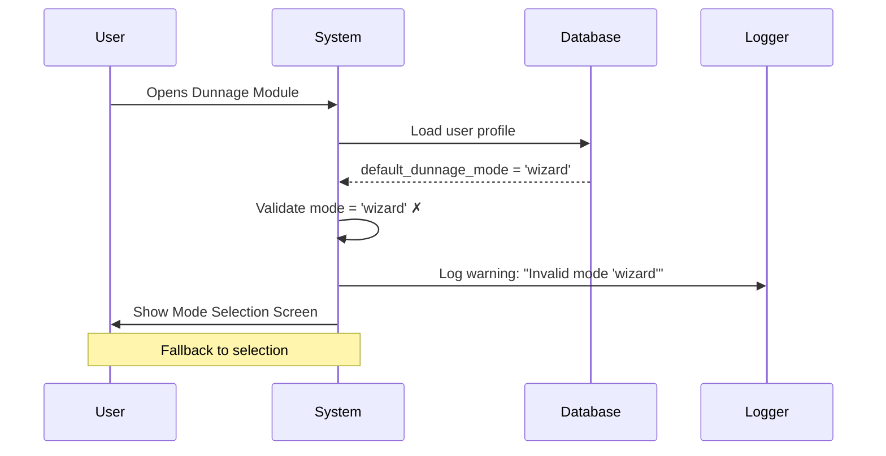

# Workflow Mode Selection

**Category**: Business Rules  
**Last Updated**: 2026-01-25  
**Related Documents**: [Workflow Preferences Settings](../../Module_Settings.Dunnage/01-Settings-Categories/workflow-preferences.md), [Data Flow](../00-Core/data-flow.md)

---

## Overview

Workflow Mode Selection determines which workflow mode (Guided, Manual, or Edit) a user enters when starting the Dunnage module. The selection can be automatic (based on user preferences) or manual (via mode selection screen).

---

## Workflow Modes Available

### 1. Guided Mode
- **Purpose**: Step-by-step wizard for standard dunnage receiving
- **Best For**: New users, occasional receiving, quality-critical data entry
- **Steps**: Type → Part → Quantity → Details → Review
- **See**: [Guided Mode Specification](../../02-Workflow-Modes/001-guided-mode-specification.md)

### 2. Manual Entry Mode
- **Purpose**: Grid-based bulk entry for high-volume receiving
- **Best For**: Power users, 50+ loads per transaction
- **Interface**: Spreadsheet-style grid
- **See**: [Manual Entry Mode Specification](../../02-Workflow-Modes/002-manual-entry-mode-specification.md)

### 3. Edit Mode
- **Purpose**: Search and modify historical dunnage transactions
- **Best For**: Supervisors, data correction, auditing
- **Interface**: Search → Load → Edit → Re-export
- **See**: [Edit Mode Specification](../../02-Workflow-Modes/003-edit-mode-specification.md)

---

## Mode Selection Logic

### Decision Flow



---

## Business Rules

### Rule 1: Default Mode Preference

**Definition**: Users can set a default workflow mode to skip mode selection screen.

**Behavior**:
```
If user.DefaultDunnageMode is NOT NULL and NOT EMPTY:
    - Validate mode value is valid ("guided", "manual", "edit")
    - If valid: Go directly to that mode
    - If invalid: Show mode selection screen (fallback)
Else:
    - Show mode selection screen
```

**Valid Values**:
- `"guided"` (case-insensitive)
- `"manual"` (case-insensitive)
- `"edit"` (case-insensitive)
- `NULL` or empty string = no default (show selection)

**Storage**:
- Database: `users.default_dunnage_mode` column (VARCHAR(20))
- Model: `Model_User.DefaultDunnageMode` property

**Code Implementation**:
```csharp
// Service_DunnageWorkflow.StartWorkflowAsync()
public Task<bool> StartWorkflowAsync()
{
    ClearSession();
    
    var currentUser = _sessionManager.CurrentSession?.User;
    if (currentUser != null && !string.IsNullOrEmpty(currentUser.DefaultDunnageMode))
    {
        switch (currentUser.DefaultDunnageMode.ToLower())
        {
            case "guided":
                GoToStep(Enum_DunnageWorkflowStep.TypeSelection);
                StatusMessageRaised?.Invoke(this, "Starting Guided Wizard mode");
                break;
            case "manual":
                GoToStep(Enum_DunnageWorkflowStep.ManualEntry);
                StatusMessageRaised?.Invoke(this, "Starting Manual Entry mode");
                break;
            case "edit":
                GoToStep(Enum_DunnageWorkflowStep.EditMode);
                StatusMessageRaised?.Invoke(this, "Starting Edit mode");
                break;
            default:
                // Invalid default, show mode selection
                GoToStep(Enum_DunnageWorkflowStep.ModeSelection);
                StatusMessageRaised?.Invoke(this, "Workflow started");
                break;
        }
    }
    else
    {
        // No default mode, show mode selection
        GoToStep(Enum_DunnageWorkflowStep.ModeSelection);
        StatusMessageRaised?.Invoke(this, "Workflow started");
    }
    
    return Task.FromResult(true);
}
```

---

### Rule 2: Mode Selection Screen Display

**Definition**: When no default mode is set or default is invalid, show mode selection screen.

**UI Layout**:
```
┌─────────────────────────────────────────────────────┐
│ Select Workflow Mode                                │
│ ═══════════════════════════════════════════════════│
│                                                      │
│ Choose how you want to work with dunnage:           │
│                                                      │
│ ┌──────────────────────────────────────────────────┐│
│ │  🧙 GUIDED MODE (Wizard)                         ││
│ │                                                   ││
│ │  Step-by-step workflow for receiving dunnage     ││
│ │  ✓ Best for new users                           ││
│ │  ✓ Ensures data completeness                    ││
│ │  ✓ 5 simple steps                               ││
│ │                                                   ││
│ │  ☐ Set as my default mode                       ││
│ │                        [Start Guided Mode]       ││
│ └──────────────────────────────────────────────────┘│
│                                                      │
│ ┌──────────────────────────────────────────────────┐│
│ │  ⚡ MANUAL ENTRY MODE (Grid)                     ││
│ │                                                   ││
│ │  Spreadsheet-style bulk entry                    ││
│ │  ✓ Best for power users                         ││
│ │  ✓ High-volume receiving (50+ loads)            ││
│ │  ✓ Keyboard shortcuts                           ││
│ │                                                   ││
│ │  ☐ Set as my default mode                       ││
│ │                        [Start Manual Mode]       ││
│ └──────────────────────────────────────────────────┘│
│                                                      │
│ ┌──────────────────────────────────────────────────┐│
│ │  ✏️ EDIT MODE (Search & Modify)                  ││
│ │                                                   ││
│ │  Edit historical dunnage transactions            ││
│ │  ✓ Best for supervisors                         ││
│ │  ✓ Data correction and auditing                 ││
│ │  ✓ Re-export capability                         ││
│ │                                                   ││
│ │  ☐ Set as my default mode                       ││
│ │                        [Start Edit Mode]         ││
│ └──────────────────────────────────────────────────┘│
│                                                      │
│                                    [Exit]            │
└─────────────────────────────────────────────────────┘
```

**Behavior**:
- Three mode cards displayed vertically
- Checkbox per mode: "Set as my default mode"
- User clicks "Start [Mode Name]" button
- If checkbox checked: Save preference to user profile
- Launch selected mode

---

### Rule 3: Setting Default Mode Preference

**Definition**: Users can set their default mode from mode selection screen or from settings.

**From Mode Selection Screen**:
```
When user clicks "Start [Mode]" button:
1. Check if "Set as my default mode" checkbox is checked
2. If checked:
   a. Save mode value to user profile
   b. Show confirmation: "Default mode set to [Mode Name]"
3. Launch selected mode
```

**From User Settings** (if implemented):
```
User Settings → Workflow Preferences → Default Dunnage Mode
- Dropdown: [None/Guided Mode/Manual Entry Mode/Edit Mode]
- Save button
- Clear button (removes default)
```

**Database Update**:
```sql
UPDATE users 
SET default_dunnage_mode = 'guided' -- or 'manual' or 'edit'
WHERE user_id = {current_user_id};
```

---

### Rule 4: Clearing Default Mode Preference

**Definition**: Users can clear their default mode preference to always see mode selection.

**Method 1: From Settings**:
```
User Settings → Workflow Preferences → Default Dunnage Mode
- Click "Clear Default" button
- Confirmation: "Default mode cleared. You will see mode selection on next start."
- Set default_dunnage_mode = NULL
```

**Method 2: From Mode Selection Screen**:
```
Mode Selection Screen → Settings Icon → "Clear my default mode"
- Set default_dunnage_mode = NULL
- Confirmation: "Default mode cleared."
```

---

### Rule 5: Mode Switching Mid-Workflow

**Definition**: Determines if users can switch modes during an active workflow.

**Current Behavior**: NOT ALLOWED (blocking)

**Rationale**:
- Prevents data loss
- Maintains workflow integrity
- Simplifies state management

**Implementation**:
```
If user has active workflow session:
- Mode selection button disabled/hidden
- Must complete or cancel current workflow
- Cancel prompts: "Discard current work and return to mode selection?"
```

**Future Enhancement**: See [CLARIFICATIONS.md - Edge Case 11](../CLARIFICATIONS.md#edge-case-11-workflow-mode-switching-mid-session) for potential mode switching with data migration.

---

### Rule 6: Mode Validation on Startup

**Definition**: Default mode value is validated before launching.

**Validation Rules**:
```
Valid modes (case-insensitive):
- "guided"
- "manual"
- "edit"

Invalid modes (fallback to selection screen):
- NULL
- Empty string
- Unknown value (e.g., "wizard", "bulk", "modify")
- Value with typo (e.g., "guidd", "manaul")
```

**Fallback Behavior**:
```
If default_dunnage_mode is invalid:
1. Log warning: "Invalid default mode '{value}' for user {username}"
2. Show mode selection screen
3. Do NOT auto-correct value (preserve for diagnostics)
```

---

## User Experience

### First-Time User Flow



---

### Returning User Flow (With Default)



---

### Returning User Flow (Invalid Default)



---

## Integration Points

### User Profile Model

```csharp
public class Model_User
{
    public int UserId { get; set; }
    public string Username { get; set; }
    public string? DefaultDunnageMode { get; set; } // "guided", "manual", "edit", or NULL
    // ... other properties
}
```

---

### Service Layer

**Interface**: `IService_UserSessionManager`

```csharp
public interface IService_UserSessionManager
{
    Model_UserSession? CurrentSession { get; }
    Task<Model_Dao_Result> SaveUserPreferenceAsync(string preferenceKey, string preferenceValue);
}
```

**Usage Example**:
```csharp
// Save default mode preference
await _sessionManager.SaveUserPreferenceAsync(
    "DefaultDunnageMode", 
    "guided"
);
```

---

### ViewModel Implementation

**ViewModel_Dunnage_ModeSelectionViewModel**:

```csharp
public partial class ViewModel_Dunnage_ModeSelectionViewModel : ViewModel_Shared_Base
{
    [ObservableProperty]
    private bool _setGuidedAsDefault;
    
    [ObservableProperty]
    private bool _setManualAsDefault;
    
    [ObservableProperty]
    private bool _setEditAsDefault;
    
    [RelayCommand]
    private async Task StartGuidedModeAsync()
    {
        if (SetGuidedAsDefault)
        {
            await SaveDefaultModeAsync("guided");
        }
        _workflowService.GoToStep(Enum_DunnageWorkflowStep.TypeSelection);
    }
    
    [RelayCommand]
    private async Task StartManualModeAsync()
    {
        if (SetManualAsDefault)
        {
            await SaveDefaultModeAsync("manual");
        }
        _workflowService.GoToStep(Enum_DunnageWorkflowStep.ManualEntry);
    }
    
    [RelayCommand]
    private async Task StartEditModeAsync()
    {
        if (SetEditAsDefault)
        {
            await SaveDefaultModeAsync("edit");
        }
        _workflowService.GoToStep(Enum_DunnageWorkflowStep.EditMode);
    }
    
    private async Task SaveDefaultModeAsync(string mode)
    {
        var result = await _sessionManager.SaveUserPreferenceAsync("DefaultDunnageMode", mode);
        if (result.IsSuccess)
        {
            StatusMessage = $"Default mode set to {mode}";
            _logger.LogInfo($"User set default dunnage mode to {mode}");
        }
        else
        {
            _errorHandler.ShowUserError(
                "Failed to save default mode preference",
                "Settings Error",
                nameof(SaveDefaultModeAsync)
            );
        }
    }
}
```

---

## Settings Integration

### User Settings UI (Optional Enhancement)

**Location**: User Settings → Workflow Preferences

**UI Layout**:
```
┌─────────────────────────────────────────────────────┐
│ Workflow Preferences                                │
│ ═══════════════════════════════════════════════════│
│                                                      │
│ Default Dunnage Workflow Mode                       │
│ ┌─────────────────────────────────────────────────┐│
│ │ Manual Entry Mode                            ▼ ││
│ └─────────────────────────────────────────────────┘│
│ Options:                                            │
│   • None (always show mode selection)              │
│   • Guided Mode (step-by-step wizard)              │
│   • Manual Entry Mode (grid-based entry)           │
│   • Edit Mode (search and modify)                  │
│                                                      │
│ [Clear Default]                    [Save]           │
└─────────────────────────────────────────────────────┘
```

---

## Related Documentation

- [Guided Mode Specification](../../02-Workflow-Modes/001-guided-mode-specification.md)
- [Manual Entry Mode Specification](../../02-Workflow-Modes/002-manual-entry-mode-specification.md)
- [Edit Mode Specification](../../02-Workflow-Modes/003-edit-mode-specification.md)
- [Workflow Preferences Settings](../../Module_Settings.Dunnage/01-Settings-Categories/workflow-preferences.md)
- [Data Flow](../00-Core/data-flow.md)

---

**Document Version:** 1.0  
**Last Updated:** 2026-01-25  
**Status:** Complete
