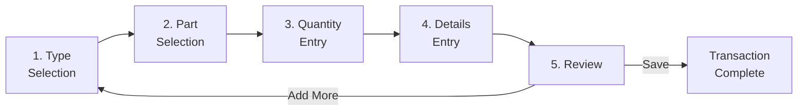

# Guided Mode - Workflow Specification

**Category**: Workflow Mode  
**Last Updated**: 2026-01-25  
**Related Documents**: [Purpose and Overview](../00-Core/purpose-and-overview.md), [Data Flow](../00-Core/data-flow.md)

---

## Purpose

Guided Mode provides a step-by-step workflow for receiving dunnage materials. It is optimized for clarity, ease of use, and accuracy, making it ideal for new users, occasional receiving tasks, and ensuring proper data collection for each dunnage type.

**When to Use Guided Mode:**
- New or occasional users
- Complex dunnage types with many specifications
- Quality-critical receiving requiring step validation
- Training scenarios
- When data accuracy is prioritized over speed

---

## Workflow Steps Overview

Guided Mode consists of **5 distinct steps** that guide the user from type selection to final review and save:



**Linear Navigation:**
- Users proceed forward through steps sequentially
- Back button available to return to previous step
- Cannot skip steps (enforces data completeness)
- Can add multiple loads by returning from Review to Step 1

---

## Step 1: Type Selection

### Purpose
Select the dunnage type being received (pallet, box, rack, crate, etc.)

### UI Layout

```
┌─────────────────────────────────────────────────────┐
│ Step 1 of 5: Select Dunnage Type                    │
│ ═══════════════════════════════════════════════════│
│                                                      │
│ Select the type of dunnage you are receiving:       │
│                                                      │
│ ┌────────────┬────────────┬────────────┬───────────┐│
│ │   🪵       │    📦      │    🏗️     │    📋    ││
│ │            │            │            │           ││
│ │ Wood Pallet│ Cardboard  │ Metal Rack │  Plastic  ││
│ │  48x40     │    Box     │            │   Tote    ││
│ │            │            │            │           ││
│ │  [Select]  │  [Select]  │  [Select]  │ [Select]  ││
│ └────────────┴────────────┴────────────┴───────────┘│
│                                                      │
│ ┌────────────┬────────────┬────────────┬───────────┐│
│ │   📦       │    🏗️     │    ➕      │           ││
│ │            │            │            │           ││
│ │  Plastic   │   Wooden   │  Add New   │           ││
│ │   Crate    │   Skid     │    Type    │           ││
│ │            │            │            │           ││
│ │  [Select]  │  [Select]  │  (Admin)   │           ││
│ └────────────┴────────────┴────────────┴───────────┘│
│                                                      │
│ 🔍 Search: [___________________________]            │
│                                                      │
│                     [Cancel]          [Next]         │
└─────────────────────────────────────────────────────┘
```

### Behavior

**Type Display:**
- Grid layout with icon and name per type
- Active types only (inactive types hidden)
- Sorted by display order (configurable in Admin Mode)
- Search box filters types by name

**Selection:**
- Click "Select" button or click card to select
- Selected type highlighted with border/background
- Type icon and name carried forward to subsequent steps

**Validation:**
- Next button disabled until type selected
- Error message if user attempts Next without selection: "Please select a dunnage type"

**Navigation:**
- Cancel: Returns to Mode Selection (confirms if data exists)
- Next: Proceeds to Step 2 (Part Selection)

---

## Step 2: Part Selection

### Purpose
Select the part/component associated with the received dunnage

### UI Layout

```
┌─────────────────────────────────────────────────────┐
│ Step 2 of 5: Select Part                            │
│ ═══════════════════════════════════════════════════│
│                                                      │
│ Selected Type: 🪵 Wood Pallet 48x40                │
│                                                      │
│ Select the part this dunnage is for:                 │
│                                                      │
│ 🔍 Search Part: [_______________________________]   │
│                                                      │
│ ┌────────────────────────────────────────────────┐ │
│ │ Part Number    │ Description                   ││
│ │────────────────┼───────────────────────────────││
│ │ TUBE-A123      │ Tube Assembly A123    [Select]││
│ │ FRAME-B456     │ Frame Assembly B456   [Select]││
│ │ BRACKET-C789   │ Bracket Assembly C789 [Select]││
│ │ PANEL-D012     │ Panel Assembly D012   [Select]││
│ │ ...                                             ││
│ └────────────────────────────────────────────────┘ │
│                                                      │
│ ──────────── OR ────────────                        │
│                                                      │
│ ☐ No Part Association (General Dunnage)            │
│                                                      │
│ ➕ [Quick Add Part] (Creates new part association) │
│                                                      │
│              [Back]  [Cancel]          [Next]       │
└─────────────────────────────────────────────────────┘
```

### Behavior

**Part List:**
- Shows parts associated with selected dunnage type
- If no associations exist, shows all parts with warning
- Search box filters by part number or description (real-time)
- Sorted alphabetically by part number

**Selection:**
- Click "Select" button or double-click row
- Selected part highlighted
- Part number and description displayed in header of subsequent steps

**No Part Association:**
- Checkbox allows proceeding without part selection
- Useful for general dunnage not tied to specific part
- If checked, part selection disabled

**Quick Add Part:**
- Opens dialog to create new part and associate with current type
- Saves time for new parts not yet configured
- Requires Admin permission (optional)

**Validation:**
- Next button disabled until part selected OR "No Part Association" checked
- Error message: "Please select a part or check 'No Part Association'"

**Navigation:**
- Back: Returns to Step 1 (preserves type selection)
- Cancel: Returns to Mode Selection (confirms if data exists)
- Next: Proceeds to Step 3 (Quantity Entry)

---

## Step 3: Quantity Entry

### Purpose
Enter the quantity of dunnage loads being received

### UI Layout

```
┌─────────────────────────────────────────────────────┐
│ Step 3 of 5: Enter Quantity                         │
│ ═══════════════════════════════════════════════════│
│                                                      │
│ Type: 🪵 Wood Pallet 48x40                         │
│ Part: TUBE-A123 - Tube Assembly A123                │
│                                                      │
│ How many loads are you receiving?                    │
│                                                      │
│ ┌────────────────────────────────────────────────┐ │
│ │                                                 ││
│ │         Quantity: [   10   ] ▲▼                ││
│ │                                                 ││
│ └────────────────────────────────────────────────┘ │
│                                                      │
│ ℹ Note: You will fill specifications for 10 loads  │
│   in the next step, or you can add them           │
│   individually from the Review screen.             │
│                                                      │
│                                                      │
│              [Back]  [Cancel]          [Next]       │
└─────────────────────────────────────────────────────┘
```

### Behavior

**Quantity Input:**
- NumberBox with up/down arrows
- Default value: 1
- Min value: 1
- Max value: 9999 (practical limit)
- Auto-select value on focus for quick replacement

**Validation:**
- Must be positive integer (> 0)
- Real-time validation on input
- Error message if invalid: "Quantity must be greater than zero"

**Next Step Preview:**
- Informs user they will enter specs for all loads in next step
- If quantity > 1, user can choose to:
  - Fill specs once and apply to all (default)
  - Fill specs individually in Review step

**Navigation:**
- Back: Returns to Step 2 (preserves part selection)
- Cancel: Returns to Mode Selection
- Next: Proceeds to Step 4 (Details Entry)

---

## Step 4: Details Entry

### Purpose
Fill dynamic specification fields for the selected dunnage type

### UI Layout

```
┌─────────────────────────────────────────────────────┐
│ Step 4 of 5: Enter Details                          │
│ ═══════════════════════════════════════════════════│
│                                                      │
│ Type: 🪵 Wood Pallet 48x40                         │
│ Part: TUBE-A123 - Tube Assembly A123                │
│ Quantity: 10 loads                                   │
│                                                      │
│ ───────────────────────────────────────────────────│
│ DUNNAGE SPECIFICATIONS                              │
│ ───────────────────────────────────────────────────│
│                                                      │
│ Condition *                                         │
│ ┌─────────────────────────────────────────────────┐│
│ │ Good                                         ▼ ││
│ └─────────────────────────────────────────────────┘│
│ Options: Excellent, Good, Fair, Poor, Damaged       │
│                                                      │
│ Supplier *                                          │
│ ┌─────────────────────────────────────────────────┐│
│ │ ABC Manufacturing Co.                           ││
│ └─────────────────────────────────────────────────┘│
│                                                      │
│ Inspection Date                                      │
│ ┌─────────────────────────────────────────────────┐│
│ │ 01/25/2026                               📅   ││
│ └─────────────────────────────────────────────────┘│
│                                                      │
│ Weight Capacity (lbs) *                             │
│ ┌─────────────────────────────────────────────────┐│
│ │ 2500                                       ▲▼  ││
│ └─────────────────────────────────────────────────┘│
│ Range: 0 - 10,000 lbs                               │
│                                                      │
│ ☑ Apply these values to all 10 loads               │
│                                                      │
│              [Back]  [Cancel]     [Next: Review]    │
└─────────────────────────────────────────────────────┘
```

### Behavior

**Dynamic Field Rendering:**
- Fields loaded from spec definitions for selected type
- Sorted by Display Order (configured in Admin Mode)
- Field type determines UI control (TextBox, NumberBox, ComboBox, DatePicker)
- Required fields marked with asterisk (*)
- Default values pre-populated if configured

**Apply to All Loads:**
- Checkbox enabled if Quantity > 1
- When checked: Entered values applied to all loads
- When unchecked: User will fill specs individually in Review step
- Checked by default for convenience

**Field Validation:**
- Real-time validation on field blur
- Required fields cannot be empty
- Number fields validate range and format
- Dropdown fields validate against options
- Date fields validate format and range

**Validation Error Display:**
- Error message panel at top
- Invalid fields highlighted with red border
- Specific error message below each invalid field

**Navigation:**
- Back: Returns to Step 3 (preserves quantity)
- Cancel: Returns to Mode Selection
- Next: Proceeds to Step 5 (Review) - only enabled when all required fields valid

---

## Step 5: Review

### Purpose
Review all entered loads, make edits, add more loads, and save/export

### UI Layout

```
┌──────────────────────────────────────────────────────────────────────────────────────┐
│ Step 5 of 5: Review & Save                                                           │
│ ══════════════════════════════════════════════════════════════════════════════════  │
│                                                                                       │
│ Review the dunnage loads below. You can edit, delete, or add more loads before saving│
│                                                                                       │
│ ┌─────┬────────────────┬─────────────────┬────┬───────────┬────────────┬──────────┐│
│ │     │ Type           │ Part            │ Qty│ Condition │ Supplier   │ Weight   ││
│ │     │                │                 │    │           │            │ Capacity ││
│ ├─────┼────────────────┼─────────────────┼────┼───────────┼────────────┼──────────┤│
│ │ [Edit]│ Wood Pallet  │ TUBE-A123       │ 10 │ Good      │ ABC Corp   │ 2500 lbs ││
│ │ [Del] │ 48x40        │ Tube Assy A123  │    │           │            │          ││
│ └─────┴────────────────┴─────────────────┴────┴───────────┴────────────┴──────────┘│
│                                                                                       │
│ Total Loads: 10                                                                      │
│                                                                                       │
│ ┌──────────────────────────────────────────────────────────────────────────────────┐│
│ │ [➕ Add More Loads]   [🗑️ Clear All]                                             ││
│ └──────────────────────────────────────────────────────────────────────────────────┘│
│                                                                                       │
│                    [Back]  [Cancel]          [Save & Export CSV]                     │
└──────────────────────────────────────────────────────────────────────────────────────┘
```

### Behavior

**Load Display Grid:**
- Shows all loads in session
- Columns adapt to spec fields configured for types
- Summary row shows totals (if applicable)

**Edit Load:**
- Click "Edit" button opens dialog with all load details
- User can modify any field
- Validation applied on save
- Grid updates with edited values

**Delete Load:**
- Click "Del" button prompts confirmation: "Delete this load?"
- On confirm, load removed from session
- Total count updated

**Add More Loads:**
- Returns user to Step 1 (Type Selection)
- Previous loads preserved in session
- Can add different type/part combinations
- Builds multi-line transaction

**Clear All:**
- Prompts confirmation: "Delete all loads and start over?"
- On confirm, clears entire session
- Returns to Step 1

**Save & Export CSV:**
- Validates all loads
- If validation fails, shows errors and blocks save
- If validation passes:
  1. Saves loads to database (transaction)
  2. Generates CSV file
  3. Exports to local path (required)
  4. Exports to network path (optional, graceful failure)
  5. Shows success message
  6. Clears session
  7. Returns to Mode Selection

**Navigation:**
- Back: Returns to Step 4 (last completed step)
- Cancel: Returns to Mode Selection (confirms data loss)

---

## Success Criteria

**Workflow is considered successful when:**
- User completes all 5 steps without errors
- All required spec fields filled for all loads
- Database save succeeds
- CSV export to local path succeeds
- Session cleared and user returned to Mode Selection

**Performance Targets:**
- 5-load transaction completed in < 3 minutes
- Step navigation smooth (< 500ms transition)
- Validation feedback immediate (< 200ms)

---

## Error Handling

### Step-Level Errors

**Type Selection Errors:**
- No types configured: "No dunnage types available. Contact administrator."
- Type inactive mid-workflow: "Selected type no longer available. Please select different type."

**Part Selection Errors:**
- No parts associated: Warning shown, allows "No Part Association"
- Part deactivated mid-workflow: "Selected part no longer available. Please select different part."

**Quantity Entry Errors:**
- Invalid quantity: "Quantity must be a positive number greater than zero."
- Extremely large quantity: Warning "Quantity {qty} is unusually large. Confirm?"

**Details Entry Errors:**
- Required field empty: "{Field Name} is required."
- Number out of range: "{Field Name} must be between {min} and {max}."
- Invalid dropdown value: "{Field Name} must be one of: {options}."

**Review & Save Errors:**
- Database save failure: "Failed to save transaction. Please try again. Error: {error}"
- CSV export failure (local): "CRITICAL: Failed to export CSV locally. Transaction NOT saved."
- CSV export failure (network): "Warning: Network CSV export failed. Local export succeeded."

---

## State Management

### Session State

**Stored in Model_DunnageSession:**
```csharp
public class Model_DunnageSession
{
    public int SelectedTypeId { get; set; }
    public string SelectedTypeName { get; set; }
    public string SelectedTypeIcon { get; set; }
    
    public Model_DunnagePart? SelectedPart { get; set; }
    public bool NoPartAssociation { get; set; }
    
    public int Quantity { get; set; }
    
    public List<Model_DunnageLoad> Loads { get; set; } = new();
    
    public Enum_DunnageWorkflowStep CurrentStep { get; set; }
}
```

**Session Lifecycle:**
- Created on workflow start
- Preserved during workflow navigation
- Cleared on successful save or cancel
- Not persisted between app sessions

---

## Related Documentation

- [Manual Entry Mode](./002-manual-entry-mode-specification.md) - Grid-based workflow
- [Edit Mode](./003-edit-mode-specification.md) - Historical data editing
- [Dynamic Specification Fields](../01-Business-Rules/dynamic-specification-fields.md) - Spec field system
- [Data Flow](../00-Core/data-flow.md) - Complete data flow diagrams

---

**Document Version:** 1.0  
**Last Updated:** 2026-01-25  
**Status:** Complete
