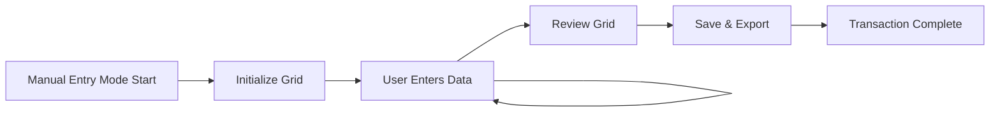
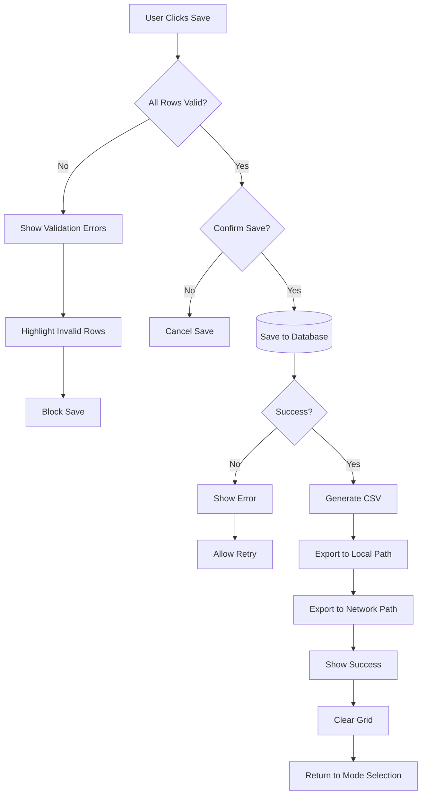
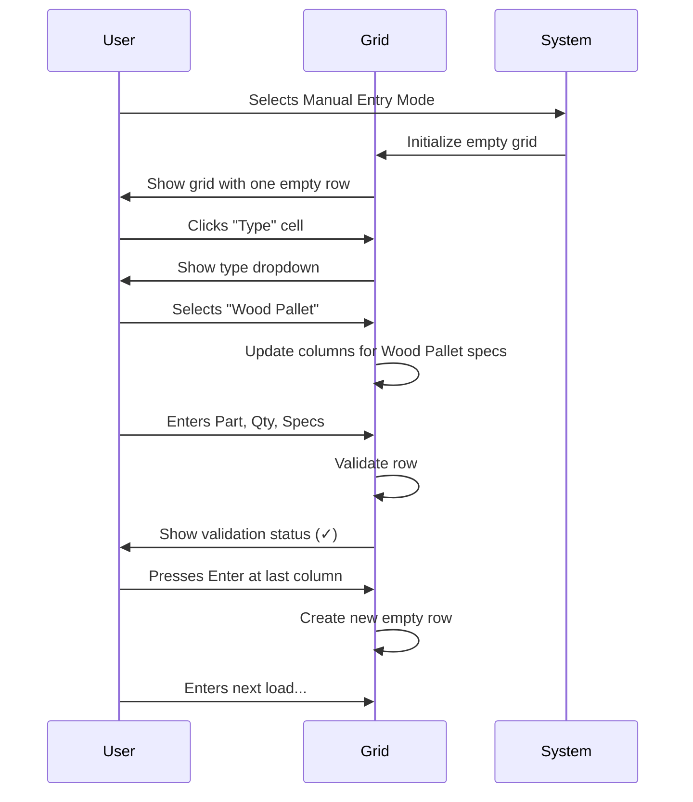
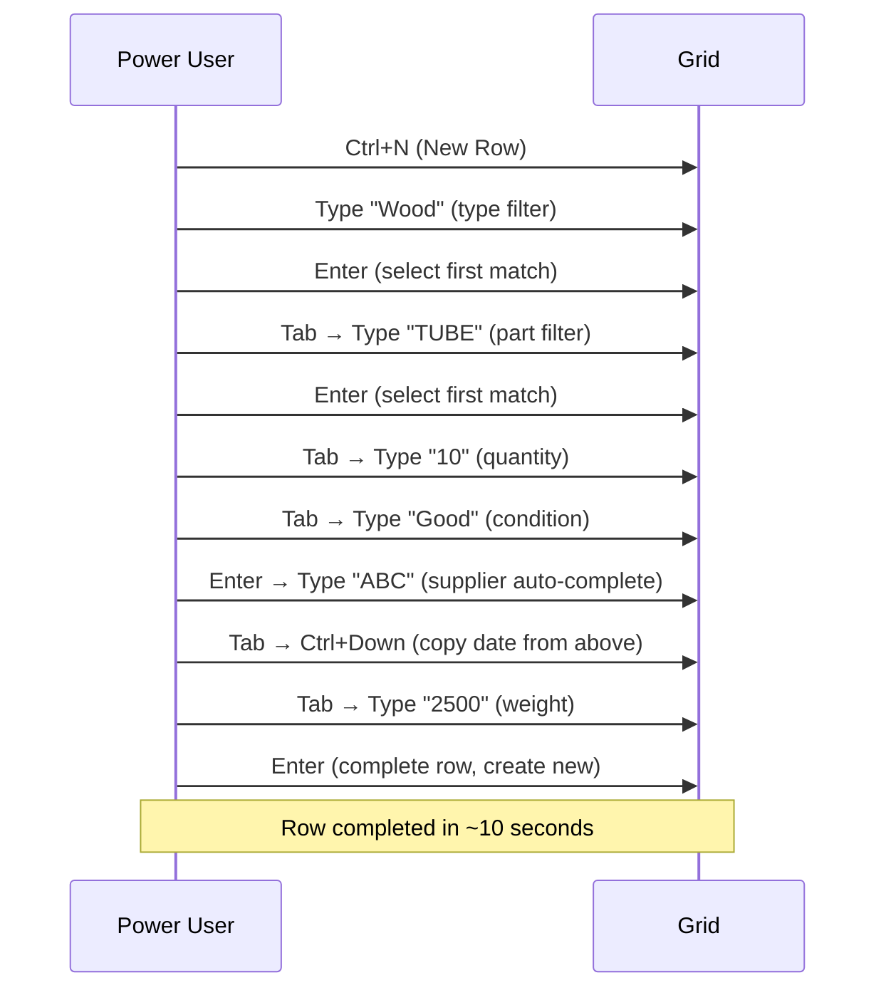

# Manual Entry Mode - Workflow Specification

**Category**: Workflow Mode  
**Last Updated**: 2026-01-25  
**Related Documents**: [Guided Mode](./001-guided-mode-specification.md), [Edit Mode](./003-edit-mode-specification.md)

---

## Purpose

Manual Entry Mode provides a grid-based, spreadsheet-style interface for high-volume dunnage receiving. It is optimized for speed and efficiency, allowing power users to enter 50+ loads quickly via keyboard navigation and bulk operations.

**When to Use Manual Entry Mode:**
- High-volume receiving (50+ loads per transaction)
- Power users proficient with keyboard shortcuts
- Repetitive data entry with similar values
- Time-critical receiving operations
- Users comfortable with grid/spreadsheet interfaces

---

## Workflow Overview

Manual Entry Mode is a **single-screen workflow** centered on an editable data grid:



**Key Characteristics:**
- No step-by-step wizard
- All fields visible simultaneously in grid
- Keyboard-first navigation
- Bulk operations supported
- Real-time validation per row

---

## UI Layout

### Main Grid Interface

```
┌─────────────────────────────────────────────────────────────────────────────────────────────┐
│ Manual Entry Mode - Dunnage Receiving                              [?] Help  [✕] Exit      │
│ ═══════════════════════════════════════════════════════════════════════════════════════════│
│                                                                                              │
│ [➕ Add Row]  [🗑️ Delete Selected]  [📋 Add Multiple Rows]  [💾 Save & Export CSV]         │
│                                                                                              │
│ Total Rows: 3  │  Valid: 2  │  Invalid: 1                                                  │
│                                                                                              │
│ ┌──────────────────────────────────────────────────────────────────────────────────────────┐│
│ │☑│ Type        │ Part       │ Qty │ Condition │ Supplier    │ Insp Date │ Weight Cap │⚙│││
│ ├─┼─────────────┼────────────┼─────┼───────────┼─────────────┼───────────┼────────────┼─┤││
│ │☑│ Wood Pallet │ TUBE-A123  │ 10  │ Good ▼   │ ABC Corp    │ 01/25 📅 │ 2500    ▲▼│⚠│││
│ │☑│ Wood Pallet │ TUBE-A123  │ 5   │ Fair ▼   │ XYZ Ind.    │ 01/24 📅 │ 1000    ▲▼│✓│││
│ │☑│ Cardboard   │ FRAME-B456 │ [?] │      ▼   │             │       📅 │         ▲▼│✗│││ ← Invalid
│ │ │             │            │     │          │             │          │           │ │││
│ │ │  [Click to add new row...]                                                      │ │││
│ └──────────────────────────────────────────────────────────────────────────────────────────┘│
│                                                                                              │
│ ⚠ Row 3 has validation errors:                                                             │
│   • Quantity is required                                                                    │
│   • Condition is required                                                                   │
│                                                                                              │
│ Keyboard Shortcuts:  Enter = Next Cell  |  Tab = Next Column  |  Ctrl+D = Duplicate Row    │
│                      Ctrl+N = New Row   |  Del = Clear Cell   |  Ctrl+S = Save            │
│                                                                                              │
│                                             [Cancel]  [💾 Save & Export CSV]                │
└─────────────────────────────────────────────────────────────────────────────────────────────┘
```

---

## Grid Columns

### Column Configuration

Columns are **dynamic** based on dunnage type specifications. The following columns are ALWAYS present:

**Fixed Columns (Always Present):**
1. **☑ (Checkbox)** - Row selection for bulk operations
2. **Type** - Dunnage type (Dropdown)
3. **Part** - Part number/description (ComboBox with search)
4. **Qty** - Quantity (NumberBox)
5. **⚙ (Status Icon)** - Validation status (✓✗⚠)

**Dynamic Columns (Based on Selected Type):**
- Rendered based on spec fields configured for selected type
- Column type matches field type (TextBox, NumberBox, ComboBox, DatePicker)
- Required fields marked with * in column header
- Columns adapt when type changes in row

**Example Grid Columns for "Wood Pallet 48x40":**
```
| ☑ | Type        | Part       | Qty | Condition* | Supplier* | Insp Date | Weight Cap* | ⚙ |
|---|-------------|------------|-----|------------|-----------|-----------|-------------|---|
```

**Example Grid Columns for "Cardboard Box":**
```
| ☑ | Type          | Part       | Qty | Size* | Color | Stacked | ⚙ |
|---|---------------|------------|-----|-------|-------|---------|---|
```

---

## Data Entry Workflow

### Adding First Row

**Step 1: Type Selection**
- Click in "Type" column of first row
- Dropdown shows all active dunnage types
- Select type → Grid columns update to show type's spec fields

**Step 2: Part Selection**
- Click in "Part" column
- ComboBox shows parts associated with selected type
- Type to search by part number or description
- Select part

**Step 3: Quantity Entry**
- Click in "Qty" column
- Enter quantity (NumberBox with up/down arrows)
- Press Tab or Enter to move to next column

**Step 4: Spec Field Entry**
- Grid automatically moved to first spec field
- Enter values for each spec field
- Tab/Enter to navigate between columns
- Required fields enforce validation

**Step 5: Row Complete**
- Validation icon (⚙) shows ✓ if valid, ✗ if invalid, ⚠ if warnings
- Validation errors displayed in status bar
- Press Enter at last column → Creates new row automatically

---

### Keyboard Navigation

**Primary Navigation:**
- **Tab** - Move to next column
- **Shift+Tab** - Move to previous column
- **Enter** - Move to next column (or next row if at last column)
- **Arrow Keys** - Navigate cells like Excel

**Editing:**
- **F2** - Enter edit mode in selected cell
- **Esc** - Cancel cell edit
- **Delete** - Clear cell contents
- **Ctrl+C** - Copy cell
- **Ctrl+V** - Paste cell
- **Ctrl+X** - Cut cell

**Row Operations:**
- **Ctrl+N** - Add new row
- **Ctrl+D** - Duplicate selected row(s)
- **Ctrl+Delete** - Delete selected row(s)
- **Ctrl+S** - Save & Export

**Bulk Operations:**
- **Ctrl+A** - Select all rows
- **Click checkbox** - Select/deselect row
- **Shift+Click** - Select range of rows

---

## Validation

### Real-Time Validation

**Validation Timing:**
- **On Cell Exit** - Validate when user leaves cell (blur event)
- **On Row Complete** - Validate entire row when user moves to new row
- **On Save** - Validate all rows before allowing save

**Validation Rules:**
- Required fields cannot be empty
- Quantity must be > 0
- Number fields validate range and format
- Dropdown fields validate against options
- Date fields validate format

**Validation Feedback:**

**Cell-Level:**
- Red border around invalid cell
- Tooltip on hover shows error message

**Row-Level:**
- Status icon (⚙):
  - ✓ Green checkmark = Valid
  - ✗ Red X = Invalid (blocks save)
  - ⚠ Yellow warning = Warning (allows save)

**Form-Level:**
- Status bar shows validation summary
- Error count: "Valid: 5 | Invalid: 2"
- Expandable error list shows all validation errors

---

### Validation Error Examples

**Example 1: Missing Required Field**
```
Row 3, Column "Condition": This field is required
```

**Example 2: Invalid Number**
```
Row 2, Column "Weight Capacity": Must be between 0 and 10,000
```

**Example 3: Invalid Date**
```
Row 5, Column "Inspection Date": Invalid date format (use MM/DD/YYYY)
```

---

## Bulk Operations

### Add Multiple Rows Dialog

**Trigger**: Click "📋 Add Multiple Rows" button

**Dialog UI:**
```
┌─────────────────────────────────────────────────────┐
│ Add Multiple Rows                                   │
│ ───────────────────────────────────────────────────│
│                                                      │
│ Copy the current row multiple times                 │
│                                                      │
│ Selected Row:                                       │
│   Type: Wood Pallet 48x40                          │
│   Part: TUBE-A123 - Tube Assembly A123             │
│   Qty: 10                                           │
│   Condition: Good                                   │
│   Supplier: ABC Corp                                │
│                                                      │
│ How many copies to create?                          │
│ ┌─────────────────────────────────────────────────┐│
│ │ 5                                         ▲▼  ││
│ └─────────────────────────────────────────────────┘│
│                                                      │
│ This will create 5 new rows with the same values.  │
│                                                      │
│                      [Cancel]  [Add Rows]           │
└─────────────────────────────────────────────────────┘
```

**Behavior:**
- User selects a row in grid
- Clicks "Add Multiple Rows"
- Dialog shows current row data
- User enters number of copies (1-100)
- Click "Add Rows" → Creates N duplicate rows
- New rows inserted after current row
- All field values copied except:
  - Checkbox state (unchecked)
  - Validation status (re-validated)

---

### Delete Selected Rows

**Trigger**: Select rows via checkbox, click "🗑️ Delete Selected" button

**Confirmation:**
```
┌─────────────────────────────────────────────────────┐
│ Confirm Delete                                      │
│ ───────────────────────────────────────────────────│
│                                                      │
│ Delete 3 selected rows?                             │
│                                                      │
│ This action cannot be undone.                       │
│                                                      │
│                      [Cancel]  [Delete]             │
└─────────────────────────────────────────────────────┘
```

**Behavior:**
- User selects rows via checkbox
- Clicks "Delete Selected"
- Confirmation prompt shows count
- On confirm: Rows removed from grid
- Total count updated

---

### Duplicate Row

**Trigger**: Select row, press **Ctrl+D**

**Behavior:**
- Current row duplicated
- New row inserted immediately below
- All values copied
- User can edit duplicated row

**Use Case**: Receiving multiple loads with same type/part but different specs

---

## Save & Export

### Save Process

**Trigger**: Click "💾 Save & Export CSV" or press **Ctrl+S**

**Validation Flow:**


**Save Confirmation:**
```
┌─────────────────────────────────────────────────────┐
│ Confirm Save                                        │
│ ───────────────────────────────────────────────────│
│                                                      │
│ Save 10 dunnage loads and export CSV?              │
│                                                      │
│ Summary:                                            │
│   • Total Loads: 10                                 │
│   • Unique Types: 2                                 │
│   • Unique Parts: 3                                 │
│                                                      │
│                      [Cancel]  [Save]               │
└─────────────────────────────────────────────────────┘
```

---

## Advanced Features

### Auto-Fill from Previous Row

**Trigger**: Press **Ctrl+Down Arrow** in a cell

**Behavior:**
- Copies value from same column in previous row
- Useful for repetitive values (same type, part, supplier, etc.)
- Validation re-applied after auto-fill

---

### Column Resizing

**Behavior:**
- Drag column border to resize
- Double-click border to auto-fit column width
- Column widths remembered per user session

---

### Column Reordering (Optional)

**Behavior:**
- Drag column header to reorder columns
- Fixed columns (checkbox, type, part, qty) cannot be reordered
- Spec field columns can be reordered
- Order preference saved per user

---

### Grid Virtualization

**Performance Optimization:**
- For grids with 100+ rows, use virtualization
- Only visible rows rendered in DOM
- Smooth scrolling maintained
- No performance degradation up to 500 rows

---

## Error Handling

### Grid-Level Errors

**Scenario 1: No Rows Entered**
```
Error: No rows to save. Please enter at least one dunnage load.
Action: Block save, focus grid
```

**Scenario 2: Validation Errors Exist**
```
Error: 3 rows have validation errors. Please correct before saving.
Action: Block save, highlight invalid rows, show error details
```

**Scenario 3: Database Save Failure**
```
Error: Failed to save transaction. Error: [Database error message]
Action: Allow retry, preserve grid data
```

---

### Row-Level Errors

**Scenario 1: Type Changed After Entering Specs**
```
Warning: Changing type will clear specification fields. Continue?
Action: Prompt user, clear specs if confirmed
```

**Scenario 2: Part Not Associated with Type**
```
Warning: Selected part is not associated with this type. Continue?
Action: Allow save but warn
```

---

## Performance Considerations

### Grid Performance Limits

**Recommended Limits:**
- Maximum 500 rows per transaction
- 50 rows = Optimal performance (<1s render)
- 100 rows = Good performance (1-2s render)
- 500 rows = Acceptable performance (3-5s render)
- 500+ rows = Warning shown, pagination suggested

**Performance Warning (500+ rows):**
```
┌─────────────────────────────────────────────────────┐
│ Performance Warning                                 │
│ ───────────────────────────────────────────────────│
│                                                      │
│ You are entering 650 rows, which may cause          │
│ performance issues.                                 │
│                                                      │
│ Recommendations:                                    │
│   • Split into multiple transactions               │
│   • Maximum 500 rows recommended                   │
│   • Use pagination for large datasets              │
│                                                      │
│              [Continue Anyway]  [Split Transaction] │
└─────────────────────────────────────────────────────┘
```

**Edge Case**: See [CLARIFICATIONS.md - Edge Case 18](../CLARIFICATIONS.md#edge-case-18-manual-entry-grid-performance-with-large-load-count)

---

## User Experience

### First-Time User Flow



---

### Power User Flow (Keyboard-Only)



---

## Success Criteria

**Manual Entry Mode is successful when:**
- Power user completes 50-load transaction in <2 minutes
- Keyboard navigation responsive (< 200ms per action)
- Grid renders without lag up to 500 rows
- Validation errors clear and actionable
- Bulk operations complete in <1 second

**Performance Targets:**
- 50 loads in <2 minutes (2.4 seconds per load)
- Grid initialization <500ms
- Row validation <100ms
- Save & export <5 seconds for 50 loads

---

## Related Documentation

- [Guided Mode Specification](./001-guided-mode-specification.md) - Step-by-step workflow
- [Edit Mode Specification](./003-edit-mode-specification.md) - Historical data editing
- [Dynamic Specification Fields](../01-Business-Rules/dynamic-specification-fields.md) - Spec field system
- [Data Flow](../00-Core/data-flow.md) - Complete data flow

---

**Document Version:** 1.0  
**Last Updated:** 2026-01-25  
**Status:** Complete
