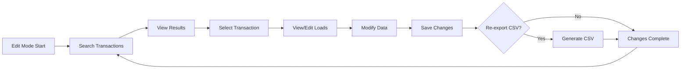
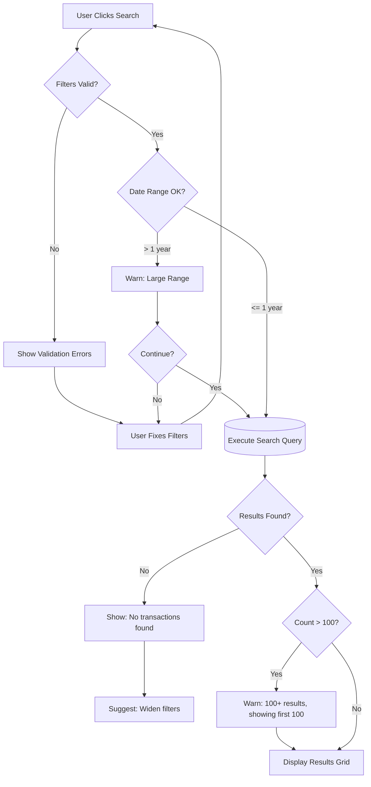
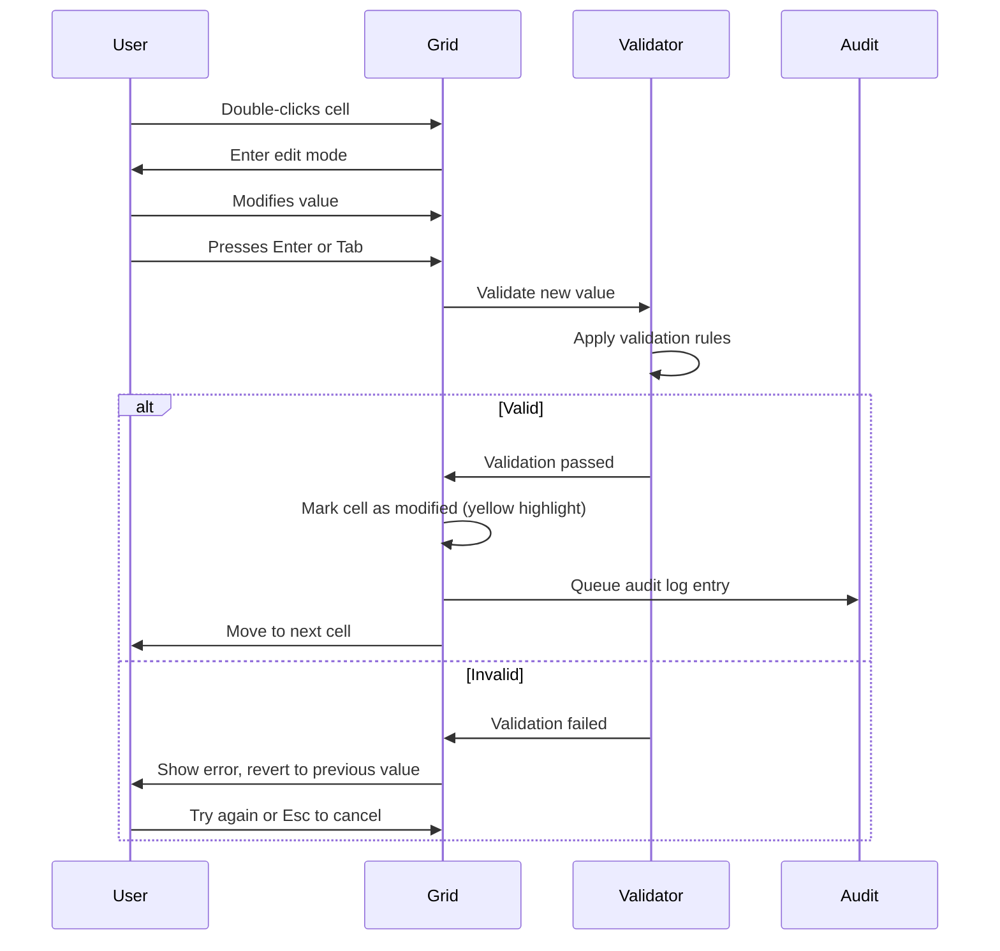
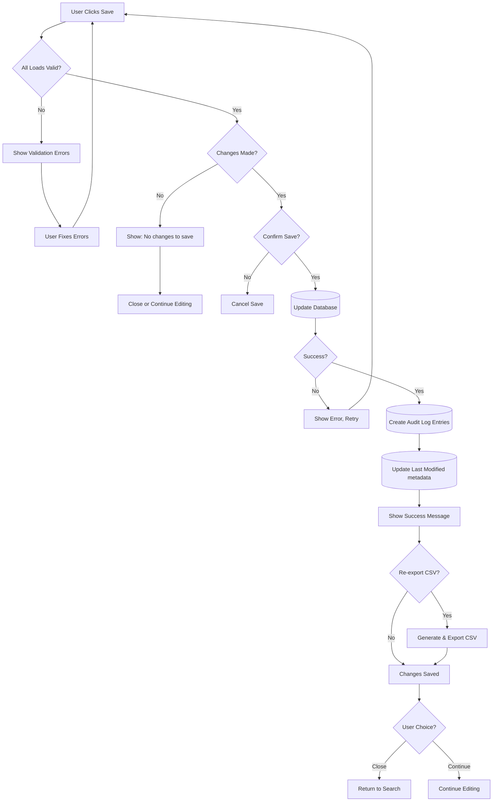

# Edit Mode - Workflow Specification

**Category**: Workflow Mode  
**Last Updated**: 2026-01-25  
**Related Documents**: [Guided Mode](./001-guided-mode-specification.md), [Manual Entry Mode](./002-manual-entry-mode-specification.md)

---

## Purpose

Edit Mode provides search, view, and modification capabilities for historical dunnage transactions. It is designed for supervisors and data correction personnel who need to correct errors, update information, or re-export labels for previously completed dunnage receiving transactions.

**When to Use Edit Mode:**
- Correcting data entry errors in historical transactions
- Updating information based on new information
- Re-exporting CSV labels for reprinting
- Auditing historical dunnage transactions
- Compliance and quality assurance reviews

---

## Workflow Overview

Edit Mode is a **search-based workflow** with three main phases:



**Key Characteristics:**
- Search-first interface
- Historical data preservation
- Audit trail for all changes
- Re-export capability
- Read-only fields for critical data
- Supervisor/admin access typically required

---

## UI Layout

### Main Edit Mode Interface

```
┌─────────────────────────────────────────────────────────────────────────────┐
│ Edit Mode - Search & Modify Dunnage Transactions          [?] Help  [✕] Exit│
│ ═══════════════════════════════════════════════════════════════════════════│
│                                                                              │
│ SEARCH FILTERS                                                              │
│ ───────────────────────────────────────────────────────────────────────────│
│                                                                              │
│ Transaction Date Range:                                                     │
│ From: [01/01/2026 📅]    To: [01/25/2026 📅]                               │
│                                                                              │
│ ┌──────────────────────────┬──────────────────────────┬──────────────────┐ │
│ │ Dunnage Type             │ Part Number              │ Load ID          │ │
│ │ ┌──────────────────────┐│ ┌──────────────────────┐│ ┌──────────────┐ │ │
│ │ │ All Types         ▼ ││ │ TUBE-A123            ││ │              │ │ │
│ │ └──────────────────────┘│ └──────────────────────┘│ └──────────────┘ │ │
│ └──────────────────────────┴──────────────────────────┴──────────────────┘ │
│                                                                              │
│ User: [All Users ▼]     Status: [All ▼]                                    │
│                                                                              │
│                         [Clear Filters]  [🔍 Search]                        │
│                                                                              │
│ ───────────────────────────────────────────────────────────────────────────│
│ SEARCH RESULTS (25 transactions found)                                     │
│ ───────────────────────────────────────────────────────────────────────────│
│                                                                              │
│ ┌───────────────────────────────────────────────────────────────────────┐ │
│ │ Trans ID│ Date      │ User      │ Type        │ Loads │ Last Modified││ │
│ ├─────────┼───────────┼───────────┼─────────────┼───────┼──────────────┤│ │
│ │ 12345   │ 01/25/26  │ jdoe      │ Wood Pallet │ 10    │ 01/25 10:30  ││ │
│ │ 12344   │ 01/24/26  │ jsmith    │ Cardboard   │ 5     │ 01/24 14:15  ││ │
│ │ 12343   │ 01/24/26  │ jdoe      │ Wood Pallet │ 8     │ 01/24 09:00  ││ │
│ │ ...                                                                    ││ │
│ └───────────────────────────────────────────────────────────────────────┘ │
│                                                                              │
│ [◀ Previous]  Page 1 of 3  [Next ▶]         [Double-click to open]         │
│                                                                              │
│                                                    [Cancel]  [New Search]    │
└─────────────────────────────────────────────────────────────────────────────┘
```

---

## Phase 1: Search Transactions

### Search Filters

**Available Filters:**

1. **Transaction Date Range** (Required)
   - From Date (date picker)
   - To Date (date picker)
   - Default: Last 30 days
   - Max range: 1 year (configurable)
   - Validation: From must be <= To

2. **Dunnage Type** (Optional)
   - Dropdown: All Types / specific type
   - Filters to transactions containing that type
   - Multiple types NOT supported (single select only)

3. **Part Number** (Optional)
   - Text box with auto-complete
   - Searches by part number or description
   - Filters to transactions containing that part

4. **Load ID** (Optional)
   - Text box for exact load ID match
   - If provided, other filters ignored (direct lookup)

5. **User** (Optional)
   - Dropdown: All Users / specific user
   - Filters to transactions created by that user
   - Populated from users who have created transactions

6. **Status** (Optional)
   - Dropdown: All / Active / Deleted / Modified
   - Active = Not modified since creation
   - Modified = Edited after creation
   - Deleted = Soft-deleted transactions

### Search Execution

**Flow:**


**Search Performance:**
- Database query with indexed fields
- Results limited to 100 per page
- Pagination for large result sets
- Query timeout: 30 seconds

**Error Handling:**
```
Scenario 1: Date range > 1 year
Warning: "Date range exceeds 1 year. This may return many results. Continue?"
Action: Allow user to confirm or revise

Scenario 2: No results found
Message: "No transactions found matching your criteria. Try:
  • Widening the date range
  • Removing some filters
  • Checking for typos in part number"

Scenario 3: Query timeout
Error: "Search timed out. Please narrow your filters and try again."
```

---

## Phase 2: View Search Results

### Results Grid

**Columns Displayed:**
- **Trans ID** - Unique transaction identifier
- **Date** - Transaction date (creation date)
- **User** - User who created the transaction
- **Type** - Primary dunnage type (if mixed, shows "Mixed")
- **Loads** - Count of loads in transaction
- **Last Modified** - Last edit timestamp (if edited)

**Row Actions:**
- **Double-click row** - Opens transaction for viewing/editing
- **Right-click menu**:
  - View Transaction
  - Export CSV (re-export without editing)
  - View Audit Log
  - Delete Transaction (soft delete, supervisor only)

**Pagination:**
- 25 results per page (configurable)
- Previous/Next buttons
- Page number display
- Jump to page (optional)

---

## Phase 3: View/Edit Transaction

### Transaction Detail View

**UI Layout:**
```
┌─────────────────────────────────────────────────────────────────────────────┐
│ Edit Transaction #12345                                    [?] Help  [✕] Close│
│ ═══════════════════════════════════════════════════════════════════════════│
│                                                                              │
│ TRANSACTION INFO (Read-Only)                                                │
│ ───────────────────────────────────────────────────────────────────────────│
│ Transaction ID: 12345                Created: 01/25/2026 10:15 AM          │
│ Created By: jdoe (John Doe)          Last Modified: 01/25/2026 10:30 AM    │
│                                      Modified By: supervisor                │
│                                                                              │
│ ───────────────────────────────────────────────────────────────────────────│
│ DUNNAGE LOADS (10 loads)                                                    │
│ ───────────────────────────────────────────────────────────────────────────│
│                                                                              │
│ [➕ Add Load]  [🗑️ Delete Selected]  [📋 View Audit Log]                   │
│                                                                              │
│ ┌───────────────────────────────────────────────────────────────────────┐ │
│ │☑│ Load ID │ Type        │ Part       │ Qty │ Condition │ Supplier   ││ │
│ ├─┼─────────┼─────────────┼────────────┼─────┼───────────┼────────────┤│ │
│ │☑│ 101     │ Wood Pallet │ TUBE-A123  │ 10  │ Good ▼   │ ABC Corp   ││ │
│ │☑│ 102     │ Wood Pallet │ TUBE-A123  │ 5   │ Fair ▼   │ XYZ Ind.   ││ │
│ │ │ 103     │ Wood Pallet │ FRAME-B456 │ 8   │ Good ▼   │ ABC Corp   ││ │
│ │ │ ...                                                               ││ │
│ └───────────────────────────────────────────────────────────────────────┘ │
│                                                                              │
│ ⚠ Modified fields highlighted in yellow  |  🔒 Read-only fields grayed     │
│                                                                              │
│            [Cancel]  [💾 Save Changes]  [💾 Save & Re-export CSV]           │
└─────────────────────────────────────────────────────────────────────────────┘
```

### Editable vs Read-Only Fields

**Read-Only (Cannot Edit):**
- Transaction ID
- Load ID (system-generated)
- Created Date/Time
- Created By User
- Original Type (if changing would invalidate specs)

**Editable:**
- Dunnage Type (with warning if specs change)
- Part Number
- Quantity
- All specification field values
- Notes/Comments (if field exists)

**Validation on Edit:**
- Same validation rules as creation
- Required fields must be filled
- Number ranges enforced
- Dropdown values must be valid
- Date formats validated

---

## Editing Workflow

### Inline Editing

**Process:**


**Modified Field Indicators:**
- Background: Light yellow/amber
- Icon: ✏️ (pencil) in cell
- Tooltip: Shows old value vs new value

---

### Add New Load

**Dialog UI:**
```
┌─────────────────────────────────────────────────────┐
│ Add Load to Transaction #12345                      │
│ ───────────────────────────────────────────────────│
│                                                      │
│ Type *                                              │
│ ┌─────────────────────────────────────────────────┐│
│ │ Wood Pallet 48x40                            ▼ ││
│ └─────────────────────────────────────────────────┘│
│                                                      │
│ Part *                                              │
│ ┌─────────────────────────────────────────────────┐│
│ │ TUBE-A123 - Tube Assembly A123               ▼ ││
│ └─────────────────────────────────────────────────┘│
│                                                      │
│ Quantity *                                          │
│ ┌─────────────────────────────────────────────────┐│
│ │ 5                                         ▲▼   ││
│ └─────────────────────────────────────────────────┘│
│                                                      │
│ [... Dynamic spec fields based on type ...]        │
│                                                      │
│                      [Cancel]  [Add Load]           │
└─────────────────────────────────────────────────────┘
```

**Behavior:**
- Same validation as Guided Mode Step 4
- New load added to transaction
- New Load ID generated
- Marked as "Added" in audit log

---

### Delete Load

**Confirmation:**
```
┌─────────────────────────────────────────────────────┐
│ Confirm Delete Load                                 │
│ ───────────────────────────────────────────────────│
│                                                      │
│ Delete 2 selected loads from this transaction?      │
│                                                      │
│ Loads to be deleted:                                │
│   • Load #101: Wood Pallet, TUBE-A123, Qty 10       │
│   • Load #102: Wood Pallet, TUBE-A123, Qty 5        │
│                                                      │
│ This will be recorded in the audit log.             │
│                                                      │
│                      [Cancel]  [Delete]             │
└─────────────────────────────────────────────────────┘
```

**Behavior:**
- Soft delete (marked as deleted, not removed from DB)
- Recorded in audit log
- Can be "undeleted" via audit log (supervisor only)

---

## Save & Re-Export

### Save Changes

**Validation Flow:**


**Save Confirmation:**
```
┌─────────────────────────────────────────────────────┐
│ Confirm Save Changes                                │
│ ───────────────────────────────────────────────────│
│                                                      │
│ Save changes to transaction #12345?                 │
│                                                      │
│ Summary of changes:                                 │
│   • 3 loads modified                                │
│   • 1 load added                                    │
│   • 2 loads deleted                                 │
│                                                      │
│ All changes will be recorded in the audit log.      │
│                                                      │
│ ☑ Re-export CSV after saving                        │
│                                                      │
│                      [Cancel]  [Save]               │
└─────────────────────────────────────────────────────┘
```

---

### Re-Export CSV

**Purpose**: Generate updated CSV file for reprinting labels after corrections

**Process:**
1. Save changes to database (if not already saved)
2. Generate CSV from updated data
3. Export to local and network paths (same as creation)
4. Log export action in audit trail

**Export Options:**
```
┌─────────────────────────────────────────────────────┐
│ CSV Export Options                                  │
│ ───────────────────────────────────────────────────│
│                                                      │
│ ☑ Export to local path                             │
│   C:\AppData\Dunnage\dunnage_12345.csv              │
│                                                      │
│ ☑ Export to network path (if available)            │
│   \\server\share\dunnage\dunnage_12345.csv          │
│                                                      │
│ ☐ Append timestamp to filename                      │
│   (e.g., dunnage_12345_20260125_103045.csv)         │
│                                                      │
│                      [Cancel]  [Export]             │
└─────────────────────────────────────────────────────┘
```

---

## Audit Trail

### Audit Log View

**Access**: Click "📋 View Audit Log" button

**UI Layout:**
```
┌─────────────────────────────────────────────────────────────────────────────┐
│ Audit Log - Transaction #12345                                              │
│ ═══════════════════════════════════════════════════════════════════════════│
│                                                                              │
│ ┌───────────────────────────────────────────────────────────────────────┐ │
│ │ Timestamp        │ User       │ Action      │ Details                 ││ │
│ ├──────────────────┼────────────┼─────────────┼─────────────────────────┤│ │
│ │ 01/25 10:30 AM   │ supervisor │ Modified    │ Load #101: Quantity     ││ │
│ │                  │            │             │ changed 10 → 12         ││ │
│ ├──────────────────┼────────────┼─────────────┼─────────────────────────┤│ │
│ │ 01/25 10:28 AM   │ supervisor │ Modified    │ Load #102: Condition    ││ │
│ │                  │            │             │ changed Good → Fair     ││ │
│ ├──────────────────┼────────────┼─────────────┼─────────────────────────┤│ │
│ │ 01/25 10:25 AM   │ supervisor │ Deleted     │ Load #105 deleted       ││ │
│ ├──────────────────┼────────────┼─────────────┼─────────────────────────┤│ │
│ │ 01/25 10:15 AM   │ jdoe       │ Created     │ Transaction created     ││ │
│ │                  │            │             │ with 10 loads           ││ │
│ └───────────────────────────────────────────────────────────────────────┘ │
│                                                                              │
│                                                              [Close]          │
└─────────────────────────────────────────────────────────────────────────────┘
```

**Audit Log Entries:**
- Transaction created
- Load added
- Load modified (field-level detail)
- Load deleted
- CSV exported
- Transaction deleted (soft delete)

**Retention**: Permanent (never deleted)

---

## Access Control & Permissions

### User Roles

**Standard User (Receiving Clerk):**
- ❌ Cannot access Edit Mode
- Redirected to Guided/Manual modes

**Supervisor:**
- ✅ Can search transactions
- ✅ Can view all transactions
- ✅ Can edit own transactions
- ✅ Can view audit logs
- ❌ Cannot delete transactions
- ✅ Can re-export CSV

**Administrator:**
- ✅ Full access to all Edit Mode features
- ✅ Can edit any transaction
- ✅ Can delete transactions (soft delete)
- ✅ Can restore deleted transactions
- ✅ Can view all audit logs

**Permission Check:**
```csharp
// Service layer permission check
public async Task<bool> CanEditTransactionAsync(int transactionId, int userId)
{
    var transaction = await _dao.GetTransactionAsync(transactionId);
    var user = await _sessionManager.GetCurrentUserAsync();
    
    // Admin can edit any transaction
    if (user.Role == UserRole.Administrator)
        return true;
    
    // Supervisor can edit own transactions
    if (user.Role == UserRole.Supervisor && transaction.CreatedBy == userId)
        return true;
    
    // Standard users cannot edit
    return false;
}
```

---

## Performance Considerations

### Search Optimization

**Database Indexes:**
```sql
CREATE INDEX idx_transaction_date ON dunnage_loads(transaction_date);
CREATE INDEX idx_user ON dunnage_loads(created_by);
CREATE INDEX idx_type ON dunnage_loads(type_id);
CREATE INDEX idx_part ON dunnage_loads(part_id);
```

**Query Optimization:**
- Limit results to 100 per query
- Use pagination for large result sets
- Cache frequently accessed transactions
- Index on date range (most common filter)

**Performance Targets:**
- Search execution: < 2 seconds
- Transaction load: < 1 second
- Save changes: < 3 seconds
- CSV export: < 5 seconds

---

## Error Handling

### Search Errors

**No Results:**
```
ℹ No transactions found matching your criteria.

Suggestions:
  • Widen the date range
  • Remove some filters
  • Check spelling in part number
  • Try searching by Load ID
```

**Query Timeout:**
```
❌ Search timed out after 30 seconds.

Please narrow your search by:
  • Reducing the date range
  • Adding more specific filters
  • Searching for a specific Load ID
```

---

### Edit Errors

**Concurrent Modification:**
```
⚠ This transaction was modified by another user while you were editing.

Your changes:  [Show details]
Their changes: [Show details]

Options:
  [Reload Transaction]  [Overwrite Their Changes]  [Cancel]
```

**Validation Errors:**
```
❌ Cannot save: 2 loads have validation errors

Load #101:
  • Quantity is required
  
Load #103:
  • Weight Capacity must be between 0 and 10,000
  
[View Errors in Grid]
```

**Save Failure:**
```
❌ Failed to save changes

Error: Database connection lost

[Retry]  [Save Offline (Coming Soon)]  [Cancel]
```

---

## Success Criteria

**Edit Mode is successful when:**
- Supervisors can find and edit transactions in < 30 seconds
- All changes logged in audit trail
- Re-export generates correct CSV
- No data loss on concurrent edits
- Historical data integrity maintained

**Performance Targets:**
- Search → Select → Edit → Save cycle: < 2 minutes
- Re-export time: < 5 seconds
- Zero data integrity violations
- 100% audit trail coverage

---

## Related Documentation

- [Guided Mode Specification](./001-guided-mode-specification.md)
- [Manual Entry Mode Specification](./002-manual-entry-mode-specification.md)
- [Edit Mode Search Business Rule](../01-Business-Rules/edit-mode-search.md)
- [Data Flow](../00-Core/data-flow.md)

---

**Document Version:** 1.0  
**Last Updated:** 2026-01-25  
**Status:** Complete
