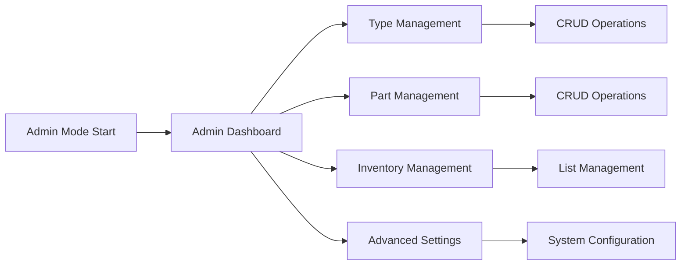

# Admin Mode - Workflow Specification

**Category**: Workflow Mode  
**Last Updated**: 2026-01-25  
**Related Documents**: [Type Management Settings](../../Module_Settings.Dunnage/01-Settings-Categories/dunnage-type-management.md), [Spec Field Configuration](../../Module_Settings.Dunnage/01-Settings-Categories/specification-field-configuration.md)

---

## Purpose

Admin Mode provides a centralized administrative interface for configuring all aspects of the Dunnage module. Administrators use this mode to manage dunnage types, specification fields, part associations, inventory lists, and system preferences.

**When to Use Admin Mode:**
- Initial system setup and configuration
- Adding new dunnage types or parts
- Modifying specification field definitions
- Managing inventory quick-add lists
- Troubleshooting configuration issues
- Periodic configuration maintenance

---

## Workflow Overview

Admin Mode is a **multi-section dashboard** with four primary management areas:



**Key Characteristics:**
- Administrator-only access
- Centralized configuration interface
- Real-time preview of changes
- Validation before save
- Audit trail for all changes
- Export/import configuration (future)

---

## Main Admin Dashboard

### UI Layout

```
┌─────────────────────────────────────────────────────────────────────────────┐
│ Dunnage Administration                                 [?] Help  [✕] Exit   │
│ ═══════════════════════════════════════════════════════════════════════════│
│                                                                              │
│ Welcome, Administrator                                  Last Login: 01/25   │
│                                                                              │
│ ┌────────────────────────┬────────────────────────┬────────────────────────┐│
│ │  📦 TYPE MANAGEMENT    │  🔧 PART MANAGEMENT    │  📋 INVENTORY MGMT     ││
│ │                        │                        │                        ││
│ │  Configure dunnage     │  Manage parts and      │  Customize inventory   ││
│ │  types, icons, and     │  type associations     │  quick-add lists       ││
│ │  spec fields           │                        │                        ││
│ │                        │                        │                        ││
│ │  Types: 8              │  Parts: 45             │  Inventory Items: 12   ││
│ │  Active: 7             │  Associations: 89      │                        ││
│ │                        │                        │                        ││
│ │  [Manage Types]        │  [Manage Parts]        │  [Manage Inventory]    ││
│ └────────────────────────┴────────────────────────┴────────────────────────┘│
│                                                                              │
│ ┌────────────────────────┬────────────────────────┬────────────────────────┐│
│ │  ⚙️ ADVANCED SETTINGS  │  📊 AUDIT LOG          │  💾 BACKUP/RESTORE     ││
│ │                        │                        │                        ││
│ │  CSV paths, grid       │  View configuration    │  Export/import         ││
│ │  performance, debug    │  change history        │  configuration         ││
│ │  options               │                        │  (coming soon)         ││
│ │                        │                        │                        ││
│ │  Last Config: 01/20    │  Recent Changes: 5     │                        ││
│ │                        │                        │                        ││
│ │  [Configure]           │  [View Log]            │  [Coming Soon]         ││
│ └────────────────────────┴────────────────────────┴────────────────────────┘│
│                                                                              │
│ RECENT ACTIVITY                                                             │
│ ───────────────────────────────────────────────────────────────────────────│
│ • 01/25 10:30 - admin added spec field "Color" to "Plastic Tote"           │
│ • 01/24 14:15 - admin created new type "Metal Cage"                        │
│ • 01/23 09:00 - admin associated part "FRAME-C789" with "Wood Pallet"      │
│                                                                              │
│                                                              [Exit]          │
└─────────────────────────────────────────────────────────────────────────────┘
```

---

## Section 1: Type Management

### Type List View

**Access**: Admin Dashboard → "Manage Types"

**UI Layout:**
```
┌─────────────────────────────────────────────────────────────────────────────┐
│ Dunnage Type Management                        [Back to Dashboard]  [✕] Exit│
│ ═══════════════════════════════════════════════════════════════════════════│
│                                                                              │
│ [➕ Add Type]  [🔍 Search: _______________]  [Filter: All ▼]                │
│                                                                              │
│ CONFIGURED TYPES (8 types, 7 active)                                        │
│ ───────────────────────────────────────────────────────────────────────────│
│                                                                              │
│ ┌───────────────────────────────────────────────────────────────────────┐ │
│ │⬆⬇│Icon│ Type Name         │ Spec Fields │ Active │ Parts │ Actions   ││ │
│ ├──┼────┼───────────────────┼─────────────┼────────┼───────┼───────────┤│ │
│ │⬍⬍│🪵  │ Wood Pallet 48x40 │     4       │   ✓    │  12   │Edit|Specs ││ │
│ │⬍⬍│📦  │ Cardboard Box     │     3       │   ✓    │   8   │Edit|Specs ││ │
│ │⬍⬍│🏗️  │ Metal Rack        │     5       │   ✓    │   6   │Edit|Specs ││ │
│ │⬍⬍│📋  │ Plastic Tote      │     2       │   ✓    │   4   │Edit|Specs ││ │
│ │⬍⬍│🗃️  │ Plastic Crate     │     3       │        │   5   │Edit|Specs ││ │
│ │...                                                                     ││ │
│ └───────────────────────────────────────────────────────────────────────┘ │
│                                                                              │
│ ⬆⬇ Drag to reorder display order                                           │
│                                                                              │
│ [Export Types]  [Import Types]              [Close]             [Apply]     │
└─────────────────────────────────────────────────────────────────────────────┘
```

**Grid Features:**
- Drag-and-drop rows to change display order
- Double-click row to edit type
- Right-click menu: Edit, Manage Specs, Deactivate, Delete
- Search filters by type name
- Filter dropdown: All / Active / Inactive

**Row Actions:**
- **Edit** - Opens type editor dialog
- **Specs** - Opens specification field management
- **Deactivate/Activate** - Toggles active status
- **Delete** - Soft delete with confirmation

---

### Add/Edit Type Dialog

**UI Layout:**
```
┌─────────────────────────────────────────────────────────────────────────────┐
│ Edit Dunnage Type: Wood Pallet 48x40                                        │
│ ═══════════════════════════════════════════════════════════════════════════│
│                                                                              │
│ BASIC INFORMATION                                                           │
│ ───────────────────────────────────────────────────────────────────────────│
│                                                                              │
│ Type Name *                                                                 │
│ ┌───────────────────────────────────────────────────────────────────────┐  │
│ │ Wood Pallet 48x40                                                     │  │
│ └───────────────────────────────────────────────────────────────────────┘  │
│                                                                              │
│ Icon *                                                                      │
│ ┌───────────────────────────────────────────────────────────────────────┐  │
│ │ 🪵  Wood/Lumber                                                    ▼ │  │
│ └───────────────────────────────────────────────────────────────────────┘  │
│                                                                              │
│ Icon Preview: 🪵                                                            │
│                                                                              │
│ Description (Optional)                                                      │
│ ┌───────────────────────────────────────────────────────────────────────┐  │
│ │ Standard 48" x 40" wooden pallet used for shipping and storage of    │  │
│ │ tube assemblies and frame components.                                │  │
│ └───────────────────────────────────────────────────────────────────────┘  │
│                                                                              │
│ STATUS & ORDERING                                                           │
│ ───────────────────────────────────────────────────────────────────────────│
│                                                                              │
│ ☑ Active (visible in workflows)                                            │
│                                                                              │
│ Display Order                                                               │
│ ┌───────────────────────────────────────────────────────────────────────┐  │
│ │ 10                                                               ▲▼  │  │
│ └───────────────────────────────────────────────────────────────────────┘  │
│ Lower numbers appear first in type selection                                │
│                                                                              │
│         [Cancel]  [Save] [Save & Manage Specs] [Save & Associate Parts]     │
└─────────────────────────────────────────────────────────────────────────────┘
```

**Validation:**
- Type Name required, unique (case-insensitive)
- Icon required (from predefined list)
- Display Order 0-999

**Save Options:**
- **Save** - Save and close
- **Save & Manage Specs** - Save and open spec field management
- **Save & Associate Parts** - Save and open part association management

---

### Specification Field Management

**Access**: Type Management → Select Type → "Specs" button OR "Manage Specifications"

**See**: [Specification Field Configuration](../../Module_Settings.Dunnage/01-Settings-Categories/specification-field-configuration.md) for complete UI specification

**Summary UI:**
```
┌─────────────────────────────────────────────────────────────────────────────┐
│ Manage Specifications: Wood Pallet 48x40                    [Back]  [✕] Exit│
│ ═══════════════════════════════════════════════════════════════════════════│
│                                                                              │
│ [➕ Add Field]  [⬆⬇ Reorder]  [🗑️ Delete Selected]                         │
│                                                                              │
│ SPECIFICATION FIELDS (4 fields)                                             │
│ ───────────────────────────────────────────────────────────────────────────│
│                                                                              │
│ ┌───────────────────────────────────────────────────────────────────────┐ │
│ │☑│Order│ Field Name        │ Type    │ Req │ Default │ Actions      ││ │
│ ├─┼─────┼──────────────────┼─────────┼─────┼─────────┼──────────────┤│ │
│ │☑│ 0   │ Condition         │ Dropdown│ ✓   │ Good    │ [Edit][Del]  ││ │
│ │ │ 10  │ Supplier          │ Text    │ ✓   │         │ [Edit][Del]  ││ │
│ │ │ 20  │ Inspection Date   │ Date    │     │ Today   │ [Edit][Del]  ││ │
│ │ │ 30  │ Weight Capacity   │ Number  │ ✓   │ 2500    │ [Edit][Del]  ││ │
│ └───────────────────────────────────────────────────────────────────────┘ │
│                                                                              │
│ ⬆⬇ Drag to reorder  |  ☑ Select for bulk operations                       │
│                                                                              │
│                                    [Close]                [Save Changes]     │
└─────────────────────────────────────────────────────────────────────────────┘
```

**Operations:**
- Add Field → Opens add/edit field dialog (see Spec Field Configuration doc)
- Edit Field → Opens edit dialog with current values
- Delete Field → Soft delete with confirmation
- Reorder → Drag-and-drop or auto-resequence

---

## Section 2: Part Management

### Part List View

**Access**: Admin Dashboard → "Manage Parts"

**UI Layout:**
```
┌─────────────────────────────────────────────────────────────────────────────┐
│ Part Management                                [Back to Dashboard]  [✕] Exit│
│ ═══════════════════════════════════════════════════════════════════════════│
│                                                                              │
│ [➕ Add Part]  [🔍 Search: _______________]  [Filter: All Parts ▼]          │
│                                                                              │
│ CONFIGURED PARTS (45 parts)                                                 │
│ ───────────────────────────────────────────────────────────────────────────│
│                                                                              │
│ ┌───────────────────────────────────────────────────────────────────────┐ │
│ │ Part Number  │ Description              │ Assoc Types │ Actions       ││ │
│ ├──────────────┼──────────────────────────┼─────────────┼───────────────┤│ │
│ │ TUBE-A123    │ Tube Assembly A123       │ 3 types     │ Edit|Assoc    ││ │
│ │ FRAME-B456   │ Frame Assembly B456      │ 2 types     │ Edit|Assoc    ││ │
│ │ BRACKET-C789 │ Bracket Assembly C789    │ 1 type      │ Edit|Assoc    ││ │
│ │ PANEL-D012   │ Panel Assembly D012      │ 4 types     │ Edit|Assoc    ││ │
│ │ ...                                                                    ││ │
│ └───────────────────────────────────────────────────────────────────────┘ │
│                                                                              │
│ [◀ Previous]  Page 1 of 5  [Next ▶]                                        │
│                                                                              │
│                                    [Close]                                   │
└─────────────────────────────────────────────────────────────────────────────┘
```

**Grid Features:**
- Search by part number or description
- Filter: All Parts / Parts with Associations / Parts without Associations
- Pagination (25 parts per page)
- Double-click to edit part

**Row Actions:**
- **Edit** - Opens part editor dialog
- **Assoc** - Opens type association management

---

### Add/Edit Part Dialog

**UI Layout:**
```
┌─────────────────────────────────────────────────────────────────────────────┐
│ Edit Part: TUBE-A123                                                        │
│ ═══════════════════════════════════════════════════════════════════════════│
│                                                                              │
│ Part Number *                                                               │
│ ┌───────────────────────────────────────────────────────────────────────┐  │
│ │ TUBE-A123                                                             │  │
│ └───────────────────────────────────────────────────────────────────────┘  │
│                                                                              │
│ Description *                                                               │
│ ┌───────────────────────────────────────────────────────────────────────┐  │
│ │ Tube Assembly A123 - Main structural tube component                  │  │
│ └───────────────────────────────────────────────────────────────────────┘  │
│                                                                              │
│ ☑ Active                                                                    │
│                                                                              │
│                 [Cancel]  [Save] [Save & Manage Associations]               │
└─────────────────────────────────────────────────────────────────────────────┘
```

**Validation:**
- Part Number required, unique
- Description required
- Active status optional (default: true)

---

### Type Association Management

**Access**: Part Management → Select Part → "Assoc" button OR "Manage Associations"

**UI Layout:**
```
┌─────────────────────────────────────────────────────────────────────────────┐
│ Manage Type Associations: TUBE-A123 - Tube Assembly A123                   │
│ ═══════════════════════════════════════════════════════════════════════════│
│                                                                              │
│ Select which dunnage types can be used for this part:                       │
│                                                                              │
│ ┌───────────────────────────────────────────────────────────────────────┐ │
│ │ ☑ Wood Pallet 48x40                                                   ││ │
│ │ ☑ Cardboard Box - Large                                               ││ │
│ │ ☑ Metal Rack - Standard                                               ││ │
│ │ ☐ Plastic Tote                                                        ││ │
│ │ ☐ Plastic Crate                                                       ││ │
│ │ ☐ Wooden Skid                                                         ││ │
│ │ ☐ Metal Cage                                                          ││ │
│ │ ☐ Custom Container                                                    ││ │
│ └───────────────────────────────────────────────────────────────────────┘ │
│                                                                              │
│ Currently associated with 3 types                                           │
│                                                                              │
│                                    [Cancel]                [Save]            │
└─────────────────────────────────────────────────────────────────────────────┘
```

**Behavior:**
- Checkbox list of all dunnage types
- Checked = Part can use this type
- Unchecked = Part cannot use this type
- Save updates database immediately

---

## Section 3: Inventory Management

### Inventory List View

**Access**: Admin Dashboard → "Manage Inventory"

**Purpose**: Configure "quick-add" inventory items that appear in workflow dialogs

**UI Layout:**
```
┌─────────────────────────────────────────────────────────────────────────────┐
│ Inventory List Management                      [Back to Dashboard]  [✕] Exit│
│ ═══════════════════════════════════════════════════════════════════════════│
│                                                                              │
│ Configure frequently used dunnage type-part combinations for quick access   │
│ in workflows. Items appear in "Add from Inventory" quick-add dialogs.       │
│                                                                              │
│ [➕ Add Item]  [🗑️ Remove Selected]  [⬆⬇ Reorder Priority]                 │
│                                                                              │
│ INVENTORY ITEMS (12 items)                                                  │
│ ───────────────────────────────────────────────────────────────────────────│
│                                                                              │
│ ┌───────────────────────────────────────────────────────────────────────┐ │
│ │⬆⬇│Priority│ Type              │ Part           │ Usage │ Actions    ││ │
│ ├──┼────────┼───────────────────┼────────────────┼───────┼────────────┤│ │
│ │⬍⬍│   1    │ Wood Pallet 48x40 │ TUBE-A123      │  45   │ Edit|Del   ││ │
│ │⬍⬍│   2    │ Cardboard Box     │ TUBE-A123      │  32   │ Edit|Del   ││ │
│ │⬍⬍│   3    │ Wood Pallet 48x40 │ FRAME-B456     │  28   │ Edit|Del   ││ │
│ │⬍⬍│   4    │ Metal Rack        │ PANEL-D012     │  15   │ Edit|Del   ││ │
│ │...                                                                     ││ │
│ └───────────────────────────────────────────────────────────────────────┘ │
│                                                                              │
│ ⬆⬇ Drag to change priority (higher priority = appears first in dialogs)    │
│                                                                              │
│ Usage = Number of times this combination was received in last 90 days       │
│                                                                              │
│                                    [Close]                                   │
└─────────────────────────────────────────────────────────────────────────────┘
```

**Features:**
- Drag-and-drop rows to change priority
- Usage count shows frequency of use
- Auto-suggests commonly used combinations (future)

---

### Add Inventory Item Dialog

**UI Layout:**
```
┌─────────────────────────────────────────────────────────────────────────────┐
│ Add Inventory Item                                                          │
│ ═══════════════════════════════════════════════════════════════════════════│
│                                                                              │
│ Dunnage Type *                                                              │
│ ┌───────────────────────────────────────────────────────────────────────┐  │
│ │ Wood Pallet 48x40                                                  ▼ │  │
│ └───────────────────────────────────────────────────────────────────────┘  │
│                                                                              │
│ Part *                                                                      │
│ ┌───────────────────────────────────────────────────────────────────────┐  │
│ │ TUBE-A123 - Tube Assembly A123                                     ▼ │  │
│ └───────────────────────────────────────────────────────────────────────┘  │
│                                                                              │
│ Priority (1 = highest)                                                      │
│ ┌───────────────────────────────────────────────────────────────────────┐  │
│ │ 1                                                                 ▲▼  │  │
│ └───────────────────────────────────────────────────────────────────────┘  │
│                                                                              │
│ ℹ This combination will appear in "Add from Inventory" quick-add dialogs   │
│                                                                              │
│                                    [Cancel]                [Add]             │
└─────────────────────────────────────────────────────────────────────────────┘
```

**Validation:**
- Type and Part required
- Combination must be unique (cannot add duplicate)
- Priority auto-assigned as "last + 1" if not specified

---

## Section 4: Advanced Settings

### Advanced Settings View

**Access**: Admin Dashboard → "Configure" (Advanced Settings)

**UI Layout:**
```
┌─────────────────────────────────────────────────────────────────────────────┐
│ Advanced Settings                               [Back to Dashboard]  [✕] Exit│
│ ═══════════════════════════════════════════════════════════════════════════│
│                                                                              │
│ CSV EXPORT PATHS                                                            │
│ ───────────────────────────────────────────────────────────────────────────│
│                                                                              │
│ Local CSV Path *                                                            │
│ ┌───────────────────────────────────────────────────────────────────────┐  │
│ │ C:\AppData\Dunnage\                                      [Browse]     │  │
│ └───────────────────────────────────────────────────────────────────────┘  │
│                                                                              │
│ Network CSV Path (Optional)                                                 │
│ ┌───────────────────────────────────────────────────────────────────────┐  │
│ │ \\server\share\dunnage\                                  [Browse]     │  │
│ └───────────────────────────────────────────────────────────────────────┘  │
│ ☑ Fail if network path unavailable (uncheck for graceful degradation)      │
│                                                                              │
│ GRID PERFORMANCE (Manual Entry Mode)                                       │
│ ───────────────────────────────────────────────────────────────────────────│
│                                                                              │
│ Cell Edit Delay (ms)                                                        │
│ ┌───────────────────────────────────────────────────────────────────────┐  │
│ │ 300                                                               ▲▼  │  │
│ └───────────────────────────────────────────────────────────────────────┘  │
│ Delay before processing cell edits (reduces flicker, increases lag)         │
│                                                                              │
│ Virtualization Threshold (rows)                                             │
│ ┌───────────────────────────────────────────────────────────────────────┐  │
│ │ 100                                                               ▲▼  │  │
│ └───────────────────────────────────────────────────────────────────────┘  │
│ Enable row virtualization when row count exceeds this value                 │
│                                                                              │
│ DEBUG & LOGGING                                                             │
│ ───────────────────────────────────────────────────────────────────────────│
│                                                                              │
│ ☐ Enable verbose logging (performance impact)                              │
│ ☐ Log all database queries                                                 │
│ ☐ Log validation errors to file                                            │
│                                                                              │
│ Log File Path                                                               │
│ ┌───────────────────────────────────────────────────────────────────────┐  │
│ │ C:\AppData\Logs\Dunnage\                                 [Browse]     │  │
│ └───────────────────────────────────────────────────────────────────────┘  │
│                                                                              │
│                          [Cancel]  [Apply]  [Save]                          │
└─────────────────────────────────────────────────────────────────────────────┘
```

**Settings Categories:**
- **CSV Export Paths**: Configure local and network CSV destinations
- **Grid Performance**: Tune Manual Entry Mode grid for large datasets
- **Debug & Logging**: Enable diagnostic logging for troubleshooting

**Save Behavior:**
- **Apply** - Apply changes immediately, keep dialog open
- **Save** - Apply changes and close dialog
- **Cancel** - Discard changes and close

---

## Section 5: Audit Log Viewer

### Audit Log View

**Access**: Admin Dashboard → "View Log" (Audit Log)

**UI Layout:**
```
┌─────────────────────────────────────────────────────────────────────────────┐
│ Configuration Audit Log                        [Back to Dashboard]  [✕] Exit│
│ ═══════════════════════════════════════════════════════════════════════════│
│                                                                              │
│ FILTERS                                                                     │
│ ───────────────────────────────────────────────────────────────────────────│
│                                                                              │
│ Date Range: [Last 30 Days ▼]   User: [All Users ▼]   Action: [All ▼]      │
│                                                                              │
│ [Clear Filters]  [🔍 Search]  [📥 Export Log]                              │
│                                                                              │
│ AUDIT LOG ENTRIES (125 entries found)                                      │
│ ───────────────────────────────────────────────────────────────────────────│
│                                                                              │
│ ┌───────────────────────────────────────────────────────────────────────┐ │
│ │ Timestamp        │ User  │ Action     │ Object          │ Details     ││ │
│ ├──────────────────┼───────┼────────────┼─────────────────┼─────────────┤│ │
│ │ 01/25 10:30 AM   │ admin │ Modified   │ Type: Wood      │ Changed icon││ │
│ │                  │       │            │ Pallet          │             ││ │
│ ├──────────────────┼───────┼────────────┼─────────────────┼─────────────┤│ │
│ │ 01/25 10:25 AM   │ admin │ Created    │ Spec Field:     │ For type:   ││ │
│ │                  │       │            │ Color           │ Plastic Tote││ │
│ ├──────────────────┼───────┼────────────┼─────────────────┼─────────────┤│ │
│ │ 01/24 14:15 AM   │ admin │ Created    │ Type: Metal     │ Icon: 🏗️   ││ │
│ │                  │       │            │ Cage            │             ││ │
│ │ ...                                                                    ││ │
│ └───────────────────────────────────────────────────────────────────────┘ │
│                                                                              │
│ [◀ Previous]  Page 1 of 13  [Next ▶]                                       │
│                                                                              │
│ [View Details] (Select entry to view full change details)                   │
│                                                                              │
│                                                              [Close]          │
└─────────────────────────────────────────────────────────────────────────────┘
```

**Filters:**
- Date Range: Last 7 days / Last 30 days / Last 90 days / Custom
- User: All users / specific user
- Action: All / Created / Modified / Deleted
- Object Type: All / Types / Spec Fields / Parts / Inventory Items

**Export:**
- Export to CSV for reporting/compliance
- Includes full change details

---

## Keyboard Shortcuts (Admin Mode)

**Global (Any Screen):**
- **Ctrl+H** - Return to Admin Dashboard
- **Esc** - Close current dialog/screen
- **F1** - Open help

**Type Management:**
- **Ctrl+N** - Add new type
- **Ctrl+F** - Focus search box
- **Ctrl+S** - Save changes

**Part Management:**
- **Ctrl+N** - Add new part
- **Ctrl+A** - Manage associations for selected part

**Inventory Management:**
- **Ctrl+N** - Add inventory item
- **Ctrl+Up/Down** - Change priority

---

## Access Control

### Role-Based Access

**Administrators:**
- ✅ Full access to all Admin Mode features
- ✅ Can create/modify/delete all configurations
- ✅ Can view audit logs
- ✅ Can export/import configuration (future)

**Supervisors:**
- ⚠️ Read-only access to Admin Mode (view only)
- ⚠️ Can suggest changes (future workflow)
- ❌ Cannot modify configurations
- ✅ Can view audit logs

**Standard Users:**
- ❌ No access to Admin Mode
- Attempting to access shows: "Admin Mode requires Administrator privileges"

---

## Performance Considerations

### Caching Strategy

**Configuration Cache:**
```
On Admin Mode load:
- Load all types into memory
- Load all spec fields into memory
- Load all parts into memory
- Cache for session duration

On Configuration Change:
- Update cache immediately
- Invalidate related caches
- Notify active workflows (optional)
```

**Database Optimization:**
- Batch updates for multiple changes
- Transaction wrapping for complex operations
- Indexes on frequently queried fields

---

## Success Criteria

**Admin Mode is successful when:**
- Admin can configure new type in < 5 minutes
- Admin can add spec field in < 2 minutes
- All changes immediately reflected in workflows
- Zero configuration errors in production
- Complete audit trail for compliance

**Performance Targets:**
- Dashboard load: < 1 second
- Type list load: < 500ms
- Save operation: < 2 seconds
- Cache refresh: < 500ms

---

## Related Documentation

- [Type Management Settings](../../Module_Settings.Dunnage/01-Settings-Categories/dunnage-type-management.md)
- [Specification Field Configuration](../../Module_Settings.Dunnage/01-Settings-Categories/specification-field-configuration.md)
- [Data Flow](../00-Core/data-flow.md)

---

**Document Version:** 1.0  
**Last Updated:** 2026-01-25  
**Status:** Complete
