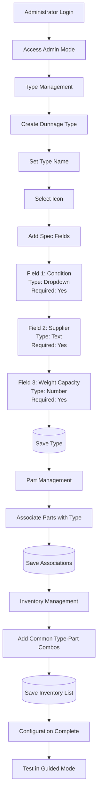

# Module_Settings.Dunnage - Purpose and Overview

**Category**: Core Specification  
**Last Updated**: 2026-01-25  
**Related Documents**: [Settings Architecture](./settings-architecture.md), [Module_Dunnage Purpose](../../Module_Dunnage/00-Core/purpose-and-overview.md)

---

## Purpose

Module_Settings.Dunnage provides centralized configuration and preference management for the Dunnage module. It allows administrators to define dunnage types with custom specification fields, manage part associations, configure inventory lists, and set system-level preferences that govern how the Dunnage module operates.

---

## Core Functionality

The settings module provides six primary categories of configuration:

### 1. Dunnage Type Management
Configure and manage dunnage types (pallets, boxes, racks, etc.):
- **Type CRUD Operations** - Create, edit, delete dunnage types
- **Icon Assignment** - Visual identification per type
- **Active/Inactive Status** - Control type visibility
- **Display Ordering** - Control type selection order
- **Specification Field Definitions** - Custom fields per type

**Access Level**: Administrators  
**Impact Scope**: All users selecting types in workflows

### 2. Specification Field Configuration
Define dynamic specification fields for each dunnage type:
- **Field Type Selection** - Text, Number, Dropdown, Date
- **Required Flag** - Mandatory vs optional fields
- **Default Values** - Pre-populate common values
- **Dropdown Options** - Define selection lists
- **Display Order** - Control field rendering sequence
- **Validation Rules** - Min/max values, patterns

**Access Level**: Administrators  
**Impact Scope**: Details Entry step in Guided Mode, grid columns in Manual Mode

### 3. Part Management
Configure parts and their associations with dunnage types:
- **Part CRUD Operations** - Create, edit, delete parts
- **Type Associations** - Link parts to compatible dunnage types
- **Multi-Type Support** - Single part can use multiple dunnage types
- **Quick-Add Configuration** - Enable/disable quick-add in workflows

**Access Level**: Administrators, Supervisors  
**Impact Scope**: Part Selection step in Guided Mode

### 4. Inventory List Management
Manage the inventoried dunnage list for quick access:
- **Add to Inventory** - Mark frequently used dunnage for quick selection
- **Remove from Inventory** - Unmark items
- **Priority Ordering** - Control display order in quick-add lists
- **Usage Tracking** - Monitor frequently used combinations

**Access Level**: Administrators, Supervisors  
**Impact Scope**: Quick-add dialogs and inventory views

### 5. Workflow Preferences
User-specific settings for workflow behavior:
- **Default Workflow Mode** - Set preferred mode (Guided/Manual/Edit)
- **Auto-Fill Preferences** - Enable/disable field auto-fill
- **Last Used Values** - Remember recent entries
- **Session Recovery** - Enable/disable session data recovery

**Access Level**: Individual users (self-configuration)  
**Impact Scope**: Only the configuring user

### 6. Advanced Settings
System-level configuration options:
- **CSV Export Paths** - Configure local and network CSV destinations
- **Grid Performance Tuning** - Manual Entry Mode grid delay settings
- **Debug/Logging Options** - Enable verbose logging for troubleshooting
- **Validation Strictness** - Set validation behavior (Strict/Warning/Permissive)

**Access Level**: Administrators only  
**Impact Scope**: System-wide

---

## Key Features

### Centralized Configuration
- **Single Source of Truth** - All dunnage configuration in one location
- **Cross-Mode Integration** - Settings apply across Guided, Manual, and Edit modes
- **Real-Time Application** - Changes take effect immediately or on next session (configurable)

### Dynamic Specification System
- **Unlimited Flexibility** - Each type can have 0-N custom fields
- **Type-Specific Configuration** - Different fields for different types
- **No Code Changes Required** - Add/modify fields without deployment

### User-Friendly Interface
- **Admin Mode Integration** - Settings accessible via dedicated admin workflow
- **Search and Filter** - Quickly find types, parts, and configurations
- **Bulk Operations** - Manage multiple items simultaneously
- **Validation Feedback** - Real-time validation of configuration values

### Audit and Compliance
- **Change Tracking** - Record who changed what and when
- **Configuration History** - View historical configurations
- **Compliance Reporting** - Generate configuration reports

### Integration with Dunnage Workflow
- **Seamless Integration** - Settings automatically applied during receiving
- **Dynamic Rendering** - UI adapts to configuration changes
- **Validation Enforcement** - Configured rules applied consistently

---

## User Personas

### Administrator
- **Role**: System configuration and maintenance
- **Uses**: All settings categories
- **Permissions**: Full read/write access to all settings
- **Responsibilities**: Configure dunnage types, specification fields, manage parts, maintain system settings

### Supervisor
- **Role**: Operational configuration
- **Uses**: Part Management, Inventory List Management
- **Permissions**: Read all settings, write to part and inventory configurations
- **Responsibilities**: Maintain part associations, update inventory lists, assist with day-to-day configuration

### Standard User (Receiving Clerk)
- **Role**: Daily dunnage receiving operations
- **Uses**: Workflow Preferences only
- **Permissions**: Read all settings, write only to personal workflow preferences
- **Responsibilities**: Configure personal workflow preferences, view dunnage type configurations

---

## Integration Points

### Module_Dunnage Integration
Settings are consumed by all Dunnage workflow modes:

**Guided Mode:**
- Type Selection: Loads active types with icons and names
- Part Selection: Filters parts by type associations
- Details Entry: Renders dynamic spec fields based on type configuration
- Validation: Enforces required fields and validation rules from settings

**Manual Entry Mode:**
- Grid Columns: Dynamic columns based on spec field configuration
- Auto-Fill: Uses default values from spec field definitions
- Validation: Enforces settings-based validation rules

**Edit Mode:**
- Type/Part Display: Shows configured names and descriptions
- Spec Field Display: Renders historical spec values with current field definitions
- Validation: Validates against current settings (with warnings for old data)

**Admin Mode:**
- Direct access to all settings categories
- CRUD operations for types, parts, specs
- Inventory management interface

### Database Integration
Settings persistence and retrieval:
- **MySQL Tables**: All configuration stored in dedicated tables
  - `dunnage_types` - Type definitions
  - `dunnage_specs` - Specification field definitions
  - `dunnage_parts` - Part definitions
  - `dunnage_part_type_associations` - Part-type relationships
  - `inventoried_dunnage` - Inventory list
  - `dunnage_user_preferences` - User preferences
- **Transaction Support**: Configuration changes wrapped in transactions
- **Audit Trail**: Change history tracked in audit tables

### Module_Core Integration
- **Settings Service**: Integration with core settings persistence
- **Error Handler**: Centralized error management for configuration errors
- **Logger**: Structured logging of configuration changes
- **User Session**: User-specific preference retrieval

---

## Success Metrics

### Configuration Efficiency
- Time to configure new dunnage type: < 5 minutes
- Time to add new spec field: < 2 minutes
- Time to associate part with types: < 1 minute
- Bulk configuration operations: 10+ items in < 5 minutes

### User Adoption
- 80%+ of users configure personal workflow preferences
- 100% of dunnage types properly configured within 1 week of deployment
- Reduced support tickets related to missing fields or types

### Data Quality
- 0% invalid configurations persisted (validation catches before save)
- 100% dunnage types have at least one spec field (business rule)
- Complete audit trail for all configuration changes

---

## Out of Scope

The following items are explicitly NOT part of Module_Settings.Dunnage:

- **User Account Management** - Handled by Module_Core authentication
- **Role/Permission Management** - Handled by Module_Core security
- **Historical Data Migration** - Settings apply to future transactions only
- **ERP Integration** - No direct integration with external ERP systems
- **Label Template Configuration** - CSV format is standardized, not configurable
- **Workflow Logic Changes** - Settings configure behavior, not define new workflows
- **Database Schema Changes** - Settings work within existing schema

---

## Settings Scope and Behavior

### Immediate vs Deferred Application

**Immediate Application (No session impact):**
- Workflow Preferences changes (user-specific)
- Grid performance tuning changes
- Advanced settings (logging, validation strictness)

**Deferred Application (Next session):**
- Dunnage type changes (name, icon, active status)
- Spec field changes (type, required flag, options)
- Part-type association changes

**Session-Locked (Until save/exit):**
- Active workflow sessions preserve configuration at workflow start
- Changes don't affect in-progress workflows
- New workflows use updated configuration

### Override Hierarchy

Settings follow a clear precedence order:

```
1. User Workflow Preferences (highest priority - user-specific)
   ↓
2. Type-Specific Configuration (dunnage type settings)
   ↓
3. Spec Field Defaults (default values per field)
   ↓
4. System-Wide Settings (advanced settings)
   ↓
5. Hardcoded Application Defaults (lowest priority - fallback)
```

**Example:**
- System Default: Guided Mode
- User Preference: Manual Mode
- **Result**: User enters Manual Mode directly (preference wins)

---

## Configuration Workflow

### Typical Administrator Workflow



---

## Related Documentation

- [Settings Architecture](./settings-architecture.md) - Technical implementation details
- [Dunnage Type Management](../01-Settings-Categories/dunnage-type-management.md) - Type configuration
- [Specification Field Configuration](../01-Settings-Categories/specification-field-configuration.md) - Spec field setup
- [Module_Dunnage Purpose](../../Module_Dunnage/00-Core/purpose-and-overview.md) - Main dunnage module overview

---

**Document Version:** 1.0  
**Last Updated:** 2026-01-25  
**Status:** Complete
