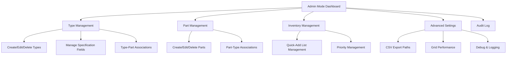

# Settings Architecture

**Category**: Core Documentation  
**Last Updated**: 2026-01-25  
**Related Documents**: [Admin Mode](../../Module_Dunnage/02-Workflow-Modes/004-admin-mode-specification.md), [Purpose and Overview](./purpose-and-overview.md)

---

## Overview

The Settings Architecture defines how the Dunnage module's configuration system is organized, accessed, and managed. It provides a centralized framework for administrators to configure all aspects of the dunnage receiving workflow.

---

## Architecture Principles

### Principle 1: Centralized Configuration

**Definition**: All dunnage-related settings accessible from a single Admin Mode interface.

**Benefits**:
- Single source of truth for configuration
- Consistent user experience across settings
- Simplified troubleshooting
- Easier onboarding for new administrators

---

### Principle 2: Real-Time Application

**Definition**: Configuration changes apply immediately without requiring application restart.

**Implementation**:
```
Admin saves setting:
→ Update database immediately
→ Invalidate in-memory cache
→ Reload configuration from database
→ Notify active workflows (optional)
→ Changes visible in next user action
```

**Exception**: Some advanced settings may require application restart (clearly marked in UI).

---

### Principle 3: Validation Before Save

**Definition**: All configuration changes validated before committing to database.

**Validation Levels**:
1. **Format Validation**: Data type, length, format correct
2. **Business Rule Validation**: Meets business logic requirements
3. **Referential Integrity**: References to other entities valid
4. **Consistency Check**: No conflicting settings

**Example**:
```
Admin adds spec field "Weight Capacity":
✓ Field name format valid (letters, numbers, spaces)
✓ Field type selected (Number)
✓ Number range valid (0-10,000)
✓ Field name unique within type
✓ Display order valid (0-999)
→ Save allowed
```

---

### Principle 4: Audit Trail for All Changes

**Definition**: Every configuration change logged with who, when, what changed.

**Audit Log Entry Structure**:
```json
{
  "timestamp": "2026-01-25T10:30:00Z",
  "user": "admin@company.com",
  "action": "modified",
  "object_type": "spec_field",
  "object_id": 5,
  "object_name": "Condition",
  "changes": {
    "required": {"old": false, "new": true},
    "default_value": {"old": null, "new": "Good"}
  }
}
```

**Retention**: Permanent (never deleted, for compliance/auditing)

---

## Settings Hierarchy



---

## Settings Categories

### Category 1: Type Management

**Purpose**: Configure dunnage types, icons, and specifications.

**Access**: Admin Mode → Type Management

**Sub-Settings**:
- Dunnage Type CRUD
- Specification Field Configuration
- Type-Part Associations (view/manage)
- Display Order Management

**See**: [Dunnage Type Management](../01-Settings-Categories/dunnage-type-management.md)

---

### Category 2: Part Management

**Purpose**: Configure parts and their associations with dunnage types.

**Access**: Admin Mode → Part Management

**Sub-Settings**:
- Part CRUD
- Part-Type Associations
- Part Search and Filtering

**See**: [Part Management](../01-Settings-Categories/part-management.md)

---

### Category 3: Inventory Management

**Purpose**: Configure quick-add inventory lists for common type-part combinations.

**Access**: Admin Mode → Inventory Management

**Sub-Settings**:
- Inventory Item CRUD
- Priority Management
- Usage Tracking (read-only)

**See**: [Inventory List Management](../01-Settings-Categories/inventory-list-management.md)

---

### Category 4: Workflow Preferences

**Purpose**: Configure user-level workflow preferences and defaults.

**Access**: User Settings → Workflow Preferences (or Admin Mode for defaults)

**Sub-Settings**:
- Default Workflow Mode
- Grid Display Options
- Auto-Save Preferences

**See**: [Workflow Preferences](../01-Settings-Categories/workflow-preferences.md)

---

### Category 5: Advanced Settings

**Purpose**: Configure system-level settings for CSV export, performance, and debugging.

**Access**: Admin Mode → Advanced Settings

**Sub-Settings**:
- CSV Export Paths (local and network)
- Grid Performance Tuning
- Debug and Logging Options

**See**: [Advanced Settings](../01-Settings-Categories/advanced-settings.md)

---

### Category 6: Specification Field Configuration

**Purpose**: Configure custom data fields for each dunnage type.

**Access**: Admin Mode → Type Management → Select Type → Manage Specifications

**Sub-Settings**:
- Field CRUD
- Field Type Configuration (Text, Number, Dropdown, Date)
- Dropdown Options Management
- Display Order and Validation

**See**: [Specification Field Configuration](../01-Settings-Categories/specification-field-configuration.md)

---

## Data Storage Strategy

### Database Tables

**system_settings** (Key-Value Store):
```sql
CREATE TABLE system_settings (
    setting_key VARCHAR(100) PRIMARY KEY,
    setting_value TEXT,
    setting_type VARCHAR(20),  -- 'string', 'number', 'boolean', 'json'
    updated_date DATETIME,
    updated_by INT,
    FOREIGN KEY (updated_by) REFERENCES users(user_id)
);
```

**Example Rows**:
```sql
INSERT INTO system_settings VALUES
  ('csv_local_path', 'C:\AppData\Dunnage\', 'string', NOW(), 1),
  ('csv_network_path', '\\server\share\dunnage\', 'string', NOW(), 1),
  ('csv_fail_if_network_unavailable', 'false', 'boolean', NOW(), 1),
  ('grid_virtualization_threshold', '100', 'number', NOW(), 1),
  ('debug_verbose_logging', 'false', 'boolean', NOW(), 1);
```

**user_preferences** (Per-User Settings):
```sql
CREATE TABLE user_preferences (
    user_id INT,
    preference_key VARCHAR(100),
    preference_value TEXT,
    updated_date DATETIME,
    PRIMARY KEY (user_id, preference_key),
    FOREIGN KEY (user_id) REFERENCES users(user_id)
);
```

**Example Rows**:
```sql
INSERT INTO user_preferences VALUES
  (1, 'default_dunnage_mode', 'guided', NOW()),
  (1, 'grid_cell_edit_delay', '300', NOW()),
  (2, 'default_dunnage_mode', 'manual', NOW());
```

---

## Caching Strategy

### In-Memory Cache

**Purpose**: Minimize database queries for frequently accessed settings.

**Cache Structure**:
```csharp
public class SettingsCache
{
    private static readonly Dictionary<string, object> _systemSettings = new();
    private static readonly Dictionary<int, Dictionary<string, object>> _userPreferences = new();
    private static DateTime _lastRefresh = DateTime.MinValue;
    private static readonly TimeSpan _cacheExpiration = TimeSpan.FromHours(1);
    
    public static T GetSystemSetting<T>(string key, T defaultValue)
    {
        RefreshIfExpired();
        
        if (_systemSettings.TryGetValue(key, out var value))
            return (T)Convert.ChangeType(value, typeof(T));
        
        return defaultValue;
    }
    
    public static T GetUserPreference<T>(int userId, string key, T defaultValue)
    {
        RefreshIfExpired();
        
        if (_userPreferences.TryGetValue(userId, out var prefs) && 
            prefs.TryGetValue(key, out var value))
            return (T)Convert.ChangeType(value, typeof(T));
        
        return defaultValue;
    }
    
    public static void Invalidate()
    {
        _systemSettings.Clear();
        _userPreferences.Clear();
        _lastRefresh = DateTime.MinValue;
    }
    
    private static void RefreshIfExpired()
    {
        if (DateTime.Now - _lastRefresh > _cacheExpiration)
        {
            // Reload from database
            LoadSettingsFromDatabase();
            _lastRefresh = DateTime.Now;
        }
    }
}
```

**Cache Invalidation**:
```
Admin saves setting:
→ Update database
→ Call SettingsCache.Invalidate()
→ Next access reloads from database
```

---

## Access Control

### Role-Based Permissions

**Administrator:**
- ✅ Full access to all settings categories
- ✅ Can create/modify/delete configurations
- ✅ Can view all audit logs
- ✅ Can export/import configuration (future)

**Supervisor:**
- ⚠️ Read-only access to Type Management
- ⚠️ Read-only access to Part Management
- ❌ Cannot modify system settings
- ✅ Can view audit logs
- ✅ Can modify own user preferences

**Standard User:**
- ❌ No access to Admin Mode
- ✅ Can modify own user preferences (Workflow Preferences only)
- ❌ Cannot view audit logs

**Permission Check Example**:
```csharp
public class Service_SettingsAccess
{
    public bool CanAccessAdminMode(User user)
    {
        return user.Role == UserRole.Administrator;
    }
    
    public bool CanModifySettings(User user)
    {
        return user.Role == UserRole.Administrator;
    }
    
    public bool CanViewAuditLog(User user)
    {
        return user.Role == UserRole.Administrator || 
               user.Role == UserRole.Supervisor;
    }
    
    public bool CanModifyUserPreferences(User user, int targetUserId)
    {
        return user.UserId == targetUserId; // Can only modify own preferences
    }
}
```

---

## Configuration Import/Export (Future)

### Export Configuration

**Purpose**: Backup or share configuration across environments.

**Export Format**: JSON

**Example Export**:
```json
{
  "export_version": "1.0",
  "export_date": "2026-01-25T10:30:00Z",
  "exported_by": "admin@company.com",
  "dunnage_types": [
    {
      "type_name": "Wood Pallet 48x40",
      "icon": "🪵",
      "active": true,
      "display_order": 10,
      "spec_fields": [
        {
          "field_name": "Condition",
          "field_type": "Dropdown",
          "required": true,
          "default_value": "Good",
          "dropdown_options": ["Excellent", "Good", "Fair", "Poor"],
          "display_order": 0
        }
      ]
    }
  ],
  "parts": [
    {
      "part_number": "TUBE-A123",
      "description": "Tube Assembly A123",
      "active": true,
      "associated_types": ["Wood Pallet 48x40", "Cardboard Box"]
    }
  ],
  "system_settings": {
    "csv_local_path": "C:\\AppData\\Dunnage\\",
    "csv_network_path": "\\\\server\\share\\dunnage\\",
    "grid_virtualization_threshold": 100
  }
}
```

**Export Scope Options**:
- ☑ Dunnage Types (including spec fields)
- ☑ Parts (including associations)
- ☑ Inventory Quick-Add Lists
- ☑ System Settings
- ☐ User Preferences (exclude by default for privacy)

---

### Import Configuration

**Purpose**: Restore backup or apply configuration from another environment.

**Import Modes**:

**1. Replace (Destructive)**:
```
Delete all existing configuration
Import new configuration
```

**2. Merge (Additive)**:
```
Keep existing configuration
Add new items from import
Skip duplicates (by name/ID)
```

**3. Update (Smart Merge)**:
```
Keep existing configuration
Add new items from import
Update existing items if import is newer
Preserve items not in import
```

**Validation**:
```
Before import:
✓ Validate JSON format
✓ Validate schema version compatibility
✓ Check for required fields
✓ Validate referential integrity
✓ Preview changes (show what will be added/modified/deleted)

On import:
→ Backup existing configuration
→ Apply import in transaction
→ If error: Rollback transaction, restore backup
→ If success: Log audit entry, invalidate cache
```

---

## Performance Considerations

### Setting Access Optimization

**Frequency-Based Strategy**:
```
High Frequency (every workflow action):
→ Cache in memory for 1 hour
→ Examples: Default workflow mode, CSV paths

Medium Frequency (per transaction):
→ Cache in memory for 5 minutes
→ Examples: Type list, Part list

Low Frequency (admin actions):
→ No caching, query database directly
→ Examples: Audit log, spec field CRUD
```

**Lazy Loading**:
```
Don't load all settings on app startup
Load settings on-demand when accessed
Cache after first access
```

---

## Error Handling

### Configuration Load Errors

**Scenario 1: Missing Required Setting**
```
❌ Required setting 'csv_local_path' not found in database.

Action: Using default value: C:\AppData\Dunnage\

Please configure in Admin Mode → Advanced Settings.
```

**Scenario 2: Invalid Setting Value**
```
❌ Invalid value for 'grid_virtualization_threshold': 'abc'

Expected: Number between 1 and 1000
Action: Using default value: 100

Please correct in Admin Mode → Advanced Settings.
```

**Scenario 3: Database Connection Failure**
```
❌ Cannot load settings: Database connection failed.

Action: Using cached values from previous session.

If problem persists, contact system administrator.
```

---

## Related Documentation

- [Admin Mode Specification](../../Module_Dunnage/02-Workflow-Modes/004-admin-mode-specification.md)
- [Dunnage Type Management](../01-Settings-Categories/dunnage-type-management.md)
- [Part Management](../01-Settings-Categories/part-management.md)
- [Inventory List Management](../01-Settings-Categories/inventory-list-management.md)
- [Workflow Preferences](../01-Settings-Categories/workflow-preferences.md)
- [Advanced Settings](../01-Settings-Categories/advanced-settings.md)

---

**Document Version:** 1.0  
**Last Updated:** 2026-01-25  
**Status:** Complete
