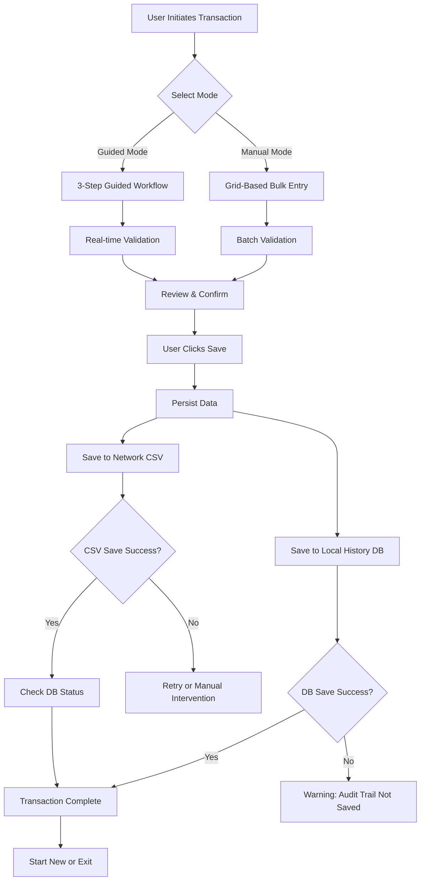
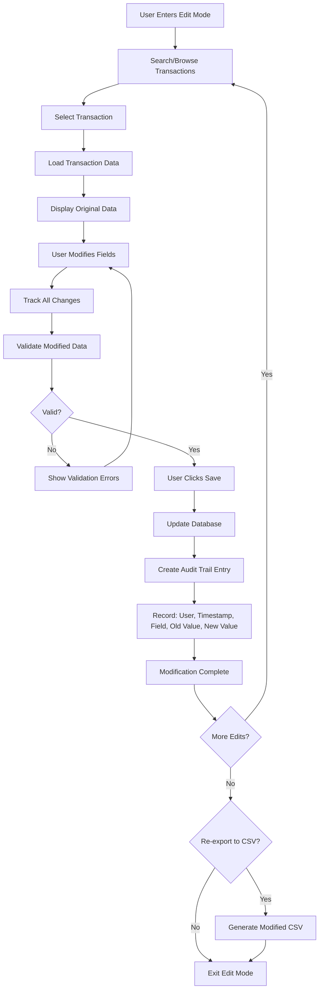

# Module Receiving - Data Flow

**Category**: Core Specification  
**Last Updated**: 2026-01-25  
**Related Documents**: [Purpose and Overview](./purpose-and-overview.md), [Business Rules](../01-Business-Rules/)

## Overview

This document defines the complete data flow for Module_Receiving, covering transaction creation through Wizard or Manual modes, persistence to multiple data stores, and historical data modification through Edit Mode.

## Primary Data Flow

### Transaction Creation Flow



### Data Flow Stages

#### Stage 1: Data Entry

**Guided Mode (Wizard):**
1. User enters PO Number and Part Number
2. User specifies Load Count
3. System auto-populates receiving location and part details
4. User proceeds to Load Details entry
5. User enters load-specific data (weight, heat lot, package type)
6. User reviews complete transaction
7. User confirms and saves

**Manual Entry Mode:**
1. User enters PO Number and Part Number
2. User specifies Load Count
3. System displays grid with pre-initialized rows
4. User enters data directly into grid cells
5. User applies bulk copy operations as needed
6. User validates all rows
7. User saves complete transaction

#### Stage 2: Validation

All data undergoes validation before persistence:

**Field-Level Validation:**
- PO Number: Format "PO-XXXXXX" (6 digits)
- Part Number: Valid prefix and format
- Weight/Quantity: Positive numeric values
- Heat Lot: Required, non-empty
- Package Type: Valid for selected part
- Receiving Location: Valid Infor Visual location

**Business Rule Validation:**
- Load Number calculations (if auto-calc enabled)
- Load Composition rules (pieces per load)
- Quality Hold requirements
- Part-specific constraints

**Cross-Field Validation:**
- Total weight distribution across loads
- Uneven division calculations (if applicable)
- Session-level data consistency

#### Stage 3: Persistence

Data is persisted to two targets:

**Target 1: Network CSV File**
- **Purpose**: Label printing and downstream system integration
- **Location**: Configurable network path (future: Settings → CSV Export Path)
- **Format**: Standardized CSV with fixed column structure
- **Contents**: Complete receiving transaction data
- **Action**: Append mode (adds to existing file)
- **Failure Handling**: Retry logic with user notification

**Target 2: Local History Database**
- **Purpose**: Audit trail and Edit Mode data source
- **Location**: Local MySQL database
- **Tables**: ReceivingTransactions, ReceivingLines, AuditTrail
- **Contents**: Complete transaction data + metadata
- **Metadata**: User ID, Timestamp, Source Mode, Validation Status
- **Action**: Insert operation with transaction integrity
- **Failure Handling**: Rollback and error notification

#### Stage 4: Completion

After successful save:
1. Display success confirmation with save status details
2. Show number of loads saved
3. Provide next action options:
   - Start New Entry
   - Reset CSV (clear network file)
   - Return to Mode Selection
   - Exit application

## Edit Mode Data Flow

### Historical Data Modification Flow



### Edit Mode Stages

#### Stage 1: Search and Load
1. User enters search criteria (PO Number, Date Range, Part Number)
2. System queries local history database
3. Display matching transactions with summary details
4. User selects transaction for editing
5. System loads complete transaction data
6. Display original values alongside current values

#### Stage 2: Modification
1. User modifies field values
2. System marks modified fields with visual indicators
3. System tracks each change: field name, old value, new value
4. Real-time validation of modified values
5. Display validation errors inline
6. User can undo changes before saving

#### Stage 3: Audit Trail Creation
1. User confirms save operation
2. System shows change summary
3. For each modified field:
   - Create audit trail entry
   - Record: Transaction ID, User ID, Timestamp, Field Name, Old Value, New Value
4. Update database with new values
5. Preserve original data in archive table
6. Display confirmation with audit trail summary

#### Stage 4: Re-Export (Optional)
1. User selects "Export to CSV"
2. Choose export option:
   - Export as New File
   - Append to Existing CSV
   - Replace Original CSV
3. Generate CSV with modified data
4. Add audit columns: AUDIT_MODIFIED_BY, AUDIT_MODIFIED_DATE
5. Save to configured network location
6. Record export event in audit trail

## Data Structures

### Session Object

All modes use a unified session object:

```csharp
public class ReceivingSession
{
    public Guid SessionId { get; set; }
    public string SelectedMode { get; set; } // "Guided", "Manual", "Edit"
    public string PONumber { get; set; }
    public string PartNumber { get; set; }
    public int LoadCount { get; set; }
    public List<LoadDetail> Loads { get; set; }
    public string CurrentStep { get; set; } // For Guided Mode
    public Dictionary<string, string> SessionPreferences { get; set; }
    public ValidationState ValidationStatus { get; set; }
    public DateTime CreatedAt { get; set; }
    public string CreatedBy { get; set; }
}

public class LoadDetail
{
    public int LoadNumber { get; set; }
    public decimal Weight { get; set; }
    public string HeatLot { get; set; }
    public string PackageType { get; set; }
    public int PackagesPerLoad { get; set; }
    public string ReceivingLocation { get; set; }
    public bool IsAutoFilled { get; set; }
    public List<ValidationError> Errors { get; set; }
}
```

### CSV Output Format

Standard CSV structure for network export:

```csv
PO_Number,Part_Number,Load_Number,Weight,Heat_Lot,Package_Type,Packages_Per_Load,Receiving_Location,Created_By,Created_Date
PO-123456,MMC0001000,1,15000,HL-001,SKID,3,V-C0-01,JDoe,2026-01-25 10:30:00
PO-123456,MMC0001000,2,15000,HL-001,SKID,3,V-C0-01,JDoe,2026-01-25 10:30:00
PO-123456,MMC0001000,3,15000,HL-001,SKID,3,V-C0-01,JDoe,2026-01-25 10:30:00
```

Modified CSV includes audit columns:

```csv
PO_Number,Part_Number,Load_Number,Weight,Heat_Lot,Package_Type,Packages_Per_Load,Receiving_Location,Created_By,Created_Date,AUDIT_MODIFIED_BY,AUDIT_MODIFIED_DATE
PO-123456,MMC0001000,1,16000,HL-002,SKID,3,V-C0-01,JDoe,2026-01-25 10:30:00,Admin,2026-01-25 14:15:00
```

### Database Schema

**ReceivingTransactions Table:**
- TransactionId (PK, GUID)
- PONumber (VARCHAR)
- PartNumber (VARCHAR)
- LoadCount (INT)
- CreatedBy (VARCHAR)
- CreatedDate (DATETIME)
- SourceMode (VARCHAR) // "Guided", "Manual"
- SaveStatusNetwork (BOOL)
- SaveStatusLocal (BOOL)

**ReceivingLines Table:**
- LineId (PK, GUID)
- TransactionId (FK)
- LoadNumber (INT)
- Weight (DECIMAL)
- HeatLot (VARCHAR)
- PackageType (VARCHAR)
- PackagesPerLoad (INT)
- ReceivingLocation (VARCHAR)
- IsAutoFilled (BOOL)

**AuditTrail Table:**
- AuditId (PK, GUID)
- TransactionId (FK)
- ModifiedBy (VARCHAR)
- ModifiedDate (DATETIME)
- FieldName (VARCHAR)
- OldValue (VARCHAR)
- NewValue (VARCHAR)
- ChangeReason (VARCHAR)

## Error Handling

### Save Failures

**Network CSV Failure:**
- Display error: "Failed to save to network CSV. Data saved to local database."
- Offer retry option
- Log error details
- Allow user to continue or abort

**Database Failure:**
- Display error: "Failed to save to local database. Audit trail not created."
- Offer retry option
- Block CSV save until database succeeds
- Preserve session data for recovery

**Complete Failure:**
- Display error: "Save operation failed. Your data has NOT been saved."
- Preserve session state
- Offer retry option
- Allow user to export session data as backup

### Validation Failures

**Pre-Save Validation:**
- Block save operation
- Display all validation errors
- Highlight invalid fields
- Provide correction guidance
- Allow user to fix errors and retry

## Data Consistency

### Transaction Integrity

All save operations follow ACID principles:

- **Atomicity**: All-or-nothing save (both CSV and DB, or neither)
- **Consistency**: Data matches validation rules before and after save
- **Isolation**: Transaction changes are isolated during save process
- **Durability**: Once saved, data persists across system restarts

### Session State Management

Session data is maintained in memory during workflow:

- Step navigation preserves all entered data
- Mode switching clears session (with warning)
- Successful save clears session
- Abnormal termination attempts recovery

## Performance Considerations

### Large Transaction Handling

For transactions with 100+ loads:

- Use virtual scrolling in Manual Entry Mode grid
- Lazy-load data in Edit Mode search results
- Batch validation operations
- Optimize CSV write operations
- Use database bulk insert operations

### Network Latency

For network CSV writes:

- Implement timeout handling (30 seconds default)
- Provide progress feedback for large saves
- Support retry with exponential backoff
- Cache data locally if network unavailable

## Related Documentation

- [Load Number Dynamics](../01-Business-Rules/load-number-dynamics.md) - Load calculation rules
- [Load Composition Rules](../01-Business-Rules/load-composition-rules.md) - Pieces per load handling
- [Validation Rules](../01-Business-Rules/) - Complete validation specifications
- [Guided Mode Specification](../02-Workflow-Modes/001-workflow-consolidation-spec.md)
- [Manual Entry Mode Specification](../02-Workflow-Modes/003-manual-mode-specification.md)
- [Edit Mode Specification](../02-Workflow-Modes/002-editmode-specification.md)
