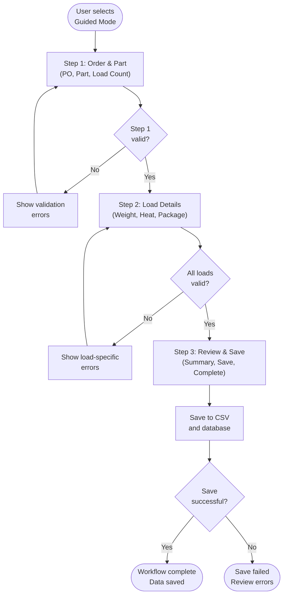
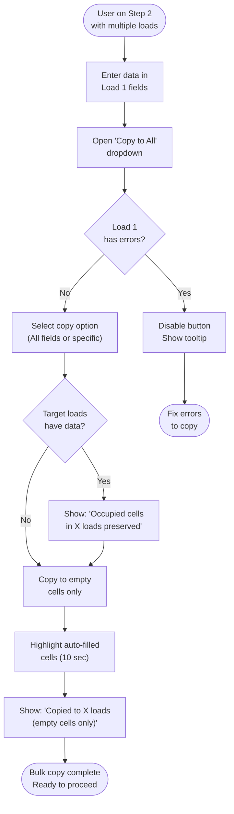
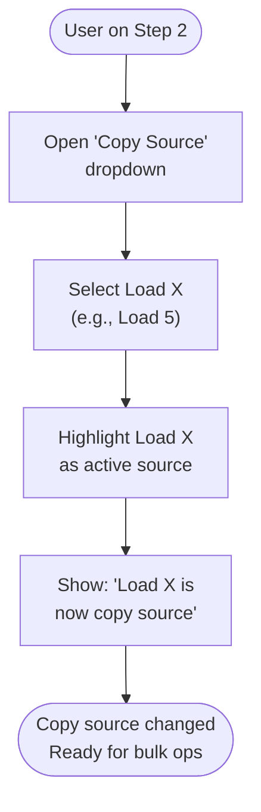
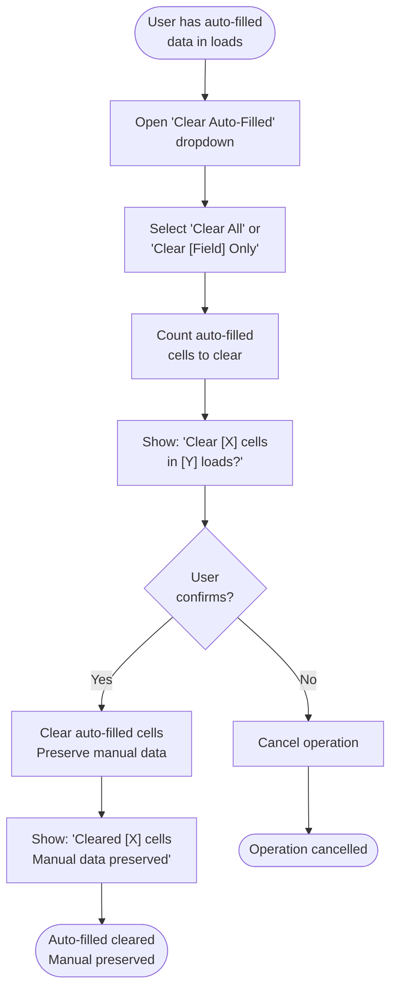
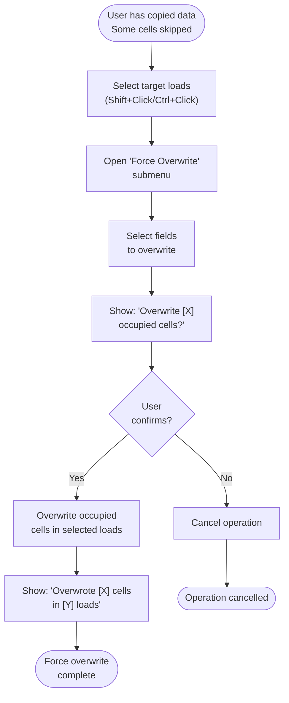
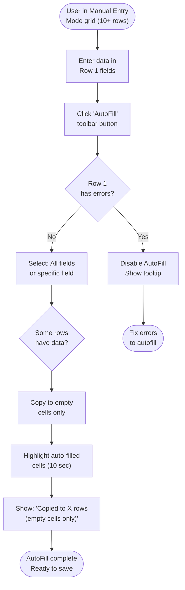
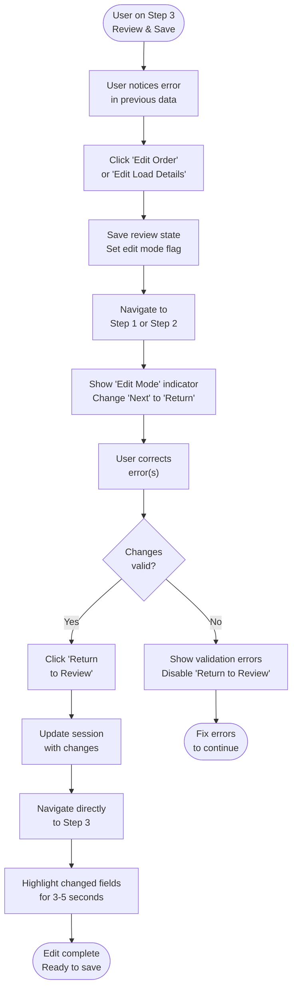
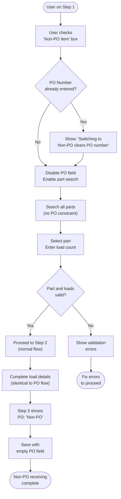
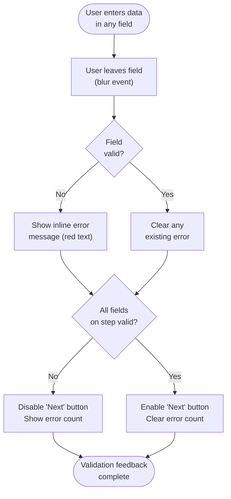

# Feature Specification: Receiving Workflow - Guided Mode (3-Step Wizard)

**Feature Branch**: `001-workflow-consolidation`  
**Created**: 2026-01-24  
**Last Updated**: 2026-01-25  
**Status**: Draft  
**Input**: User description: "Consolidate Module_Receiving wizard workflow from 12 steps to 3 steps by grouping related functionality: Step 1 combines PO/Part/Load entry, Step 2 combines Weight/HeatLot/Package entry, Step 3 combines Review/Save/Complete"

**Related Business Rules:**
- [PO Number Dynamics](../01-Business-Rules/po-number-dynamics.md) - PO Number validation and auto-standardization
- [Part Number Dynamics](../01-Business-Rules/part-number-dynamics.md) - Part Number validation and auto-padding
- [Non-PO Receiving](../01-Business-Rules/non-po-receiving.md) - **Non-PO mode selected at Hub level** (Mode Selection screen)
- [Bulk Copy Operations](../01-Business-Rules/bulk-copy-operations.md) - Copy to empty cells only logic
- [Workflow Navigation & In-Step Editing](../01-Business-Rules/workflow-navigation-and-in-step-editing.md) - Edit Mode and Return to Review
- [Load Number Dynamics](../01-Business-Rules/load-number-dynamics.md) - Load count changes
- [Quality Hold](../01-Business-Rules/quality-hold.md) - Quality Hold procedures
- [Hub Orchestration](./004-hub-orchestration-specification.md) - Mode selection with PO/Non-PO toggle

**Important Note on Non-PO Mode:**  
Non-PO mode is **NOT** selected within Guided Mode Step 1. Instead, users select Non-PO mode at the **Hub Orchestration level** (Mode Selection screen) before entering Guided Mode. The session carries the `IsNonPO` flag throughout the workflow.

When `IsNonPO = true`:
- Step 1: PO Number field is disabled/hidden
- Step 1: Part search is unrestricted (all parts available)
- Step 2-3: No behavioral changes
- Review: Shows "Non-PO" indicator instead of PO Number

## User Scenarios & Testing

### User Story 1 - Streamlined Order Entry (Priority: P1)

Manufacturing receiving clerk needs to receive incoming shipments quickly and accurately. Currently, they must navigate through 9 separate wizard steps to complete a single receiving transaction, which takes unnecessary time and increases the chance of navigation errors.

**Why this priority**: This is the core functionality that all users must complete for every receiving transaction. Reducing steps from 9 to 3 directly impacts daily productivity for all users.

**Independent Test**: Can be fully tested by entering a complete receiving transaction from start to finish and verifying that all data is captured correctly with only 3 navigation steps. Delivers immediate value by reducing time-to-completion for standard receiving workflows.

**Acceptance Scenarios**:

1. **Given** I am on the Mode Selection screen and select "Guided Mode", **When** I proceed to Step 1, **Then** I see a single screen with PO Number entry, Part selection, and Load count entry fields
2. **Given** I have completed Step 1 (Order & Part Selection), **When** I proceed to Step 2, **Then** I see a single screen with all load details entry fields (Weight/Quantity, Heat Lot, Package Type, Packages Per Load) for all loads
3. **Given** I have completed Step 2 (Load Details Entry), **When** I proceed to Step 3, **Then** I see review summary, save functionality, and completion message all on one screen
4. **Given** I complete all 3 steps, **When** I review the saved data, **Then** all data is preserved correctly matching the 12-step workflow output

<!-- WORKFLOW_START: 1.1 --><!--
WORKFLOW: 1.1
TITLE: Complete 3-Step Guided Workflow
DIRECTION: TD
DEPENDS_ON: NONE
CONFLICTS_WITH: NONE
INTERACTION: Primary happy path for streamlined receiving workflow

NODE: W1_1_Start
TYPE: start
SHAPE: stadium
LABEL: User selects Guided Mode

NODE: W1_1_Step1
TYPE: process
SHAPE: rect
LABEL: Step 1: Order & Part (PO, Part, Load Count)

NODE: W1_1_ValidateStep1
TYPE: decision
SHAPE: diamond
LABEL: Step 1 valid?

NODE: W1_1_ShowStep1Errors
TYPE: process
SHAPE: rect
LABEL: Show validation errors

NODE: W1_1_Step2
TYPE: process
SHAPE: rect
LABEL: Step 2: Load Details (Weight, Heat, Package)

NODE: W1_1_ValidateStep2
TYPE: decision
SHAPE: diamond
LABEL: All loads valid?

NODE: W1_1_ShowStep2Errors
TYPE: process
SHAPE: rect
LABEL: Show load-specific errors

NODE: W1_1_Step3
TYPE: process
SHAPE: rect
LABEL: Step 3: Review & Save (Summary, Save, Complete)

NODE: W1_1_Save
TYPE: process
SHAPE: rect
LABEL: Save to CSV and database

NODE: W1_1_SaveSuccess
TYPE: decision
SHAPE: diamond
LABEL: Save successful?

NODE: W1_1_SuccessEnd
TYPE: end
SHAPE: stadium
LABEL: Workflow complete Data saved

NODE: W1_1_ErrorEnd
TYPE: end
SHAPE: stadium
LABEL: Save failed Review errors

CONNECTION: W1_1_Start -> W1_1_Step1
CONNECTION: W1_1_Step1 -> W1_1_ValidateStep1
CONNECTION: W1_1_ValidateStep1 -> W1_1_ShowStep1Errors [No]
CONNECTION: W1_1_ValidateStep1 -> W1_1_Step2 [Yes]
CONNECTION: W1_1_ShowStep1Errors -> W1_1_Step1
CONNECTION: W1_1_Step2 -> W1_1_ValidateStep2
CONNECTION: W1_1_ValidateStep2 -> W1_1_ShowStep2Errors [No]
CONNECTION: W1_1_ValidateStep2 -> W1_1_Step3 [Yes]
CONNECTION: W1_1_ShowStep2Errors -> W1_1_Step2
CONNECTION: W1_1_Step3 -> W1_1_Save
CONNECTION: W1_1_Save -> W1_1_SaveSuccess
CONNECTION: W1_1_SaveSuccess -> W1_1_SuccessEnd [Yes]
CONNECTION: W1_1_SaveSuccess -> W1_1_ErrorEnd [No]
--><!-- WORKFLOW_END: 1.1 -->

## User Story 1 Workflow Diagrams

### Workflow 1.1: Complete 3-Step Guided Workflow

---

### User Story 2 - Bulk Load Entry (Priority: P2)

When receiving multiple loads of the same part with identical attributes (same heat lot, package type, etc.), clerk needs to enter data once and apply to all loads rather than entering the same information repeatedly.

**Why this priority**: Reduces data entry time for the common scenario of receiving multiple identical loads. Enhances user experience but isn't blocking for MVP.

**Independent Test**: Can be tested by entering data for Load 1, using the "Copy to All Loads" dropdown options, and verifying all loads now have identical values in **empty cells only** (occupied cells remain unchanged). Delivers value by reducing repetitive data entry for multi-load shipments.

**Acceptance Scenarios**:

1. **Given** I am on Step 2 (Load Details Entry) with 5 loads, **When** I enter Weight/Quantity, Heat Lot, and Package Type for Load 1 and select "Copy All Fields to All Loads" from the dropdown button, **Then** only empty cells in Loads 2-5 are filled with Load 1's values, and any occupied cells remain unchanged
2. **Given** I have partially filled Load 2 with Heat Lot and Load 3 with Package Type, **When** I select "Copy All Fields to All Loads" from the dropdown, **Then** Load 2's Heat Lot is preserved, Load 3's Package Type is preserved, and only empty fields are populated
3. **Given** I am entering load details, **When** I use the "Copy to All Loads" dropdown multiple times with different options, **Then** each copy operation only fills empty cells, never overwriting existing data
4. **Given** I am on Step 2 with 10 loads and have entered data for Load 1, **When** I open the "Copy to All Loads" dropdown and select individual field options (Weight/Quantity, Heat Lot, Package Type, Packages Per Load), **Then** only empty cells for the selected field are copied to other loads while occupied cells remain unchanged
5. **Given** I have partially filled Load 1 with only Weight and Heat Lot, **When** I select "Copy All Fields to All Loads" from the dropdown, **Then** only the populated fields (Weight and Heat Lot) are copied to empty cells in other loads, leaving all occupied cells unchanged
6. **Given** I am on Step 2 with 20 loads where loads 5-10 have some data already, **When** I select a different load from the "Copy Source" dropdown and then choose "Copy All Fields to All Loads", **Then** the selected load's data copies only to empty cells in all other loads, preserving all existing data
7. **Given** I have entered different values for loads 2 and 3, **When** I attempt to select "Copy All Fields to All Loads" from the dropdown, **Then** I see a notification "Copying to empty cells only. Occupied cells in 2 loads will be preserved (Load 2, Load 3)" and the copy proceeds without overwriting
8. **Given** I am on Step 2 with validation errors on Load 1 (e.g., negative weight), **When** I attempt to open the "Copy to All Loads" dropdown, **Then** the dropdown button is disabled with a tooltip showing "Cannot copy: Load 1 has validation errors. Fix errors before copying"
9. **Given** I have completed Step 2 with data copied to empty cells in all 5 loads from Load 1, **When** I navigate back to Step 1 and increase the load count to 8, **Then** the system automatically applies Load 1's data to all empty cells in the 3 new loads (6-8) and shows a notification "New loads initialized with Load 1 data (empty cells only)"
10. **Given** I am receiving 50 loads where 20 loads have partial data, **When** I enter Load 1's data and select "Copy All Fields to All Loads" from the dropdown, **Then** the operation completes in under 1 second, fills only empty cells, and displays "Data copied to 50 loads (empty cells only, 20 loads had existing data preserved)" with a green checkmark icon
11. **Given** I have just used the "Copy to All Loads" dropdown for Weight and Heat Lot fields, **When** I view the data grid within 10 seconds of the operation, **Then** I see a subtle highlight or copy indicator icon on the newly populated cells (not on cells that were already occupied) to confirm the bulk operation succeeded
12. **Given** I am on Step 3 (Review & Save) after bulk copying data to empty cells in all loads, **When** I view the review summary, **Then** I see indicators showing "Data auto-filled from Load 1 (occupied cells preserved)" for quick verification
13. **Given** I return to Step 2 via the "Edit Load Details" button from Step 3, **When** I view the data grid, **Then** the system shows which fields were populated via bulk copy (e.g., with an icon or tooltip on hover showing "Auto-filled from Load 1") versus which were manually entered or previously existed
14. **Given** I am entering load details for 100 loads with varying amounts of pre-existing data, **When** I execute a "Copy All Fields to All Loads" operation from the dropdown, **Then** the system displays a progress bar showing "Copying to empty cells in 100 loads..." and shows a summary "Filled X empty cells, preserved Y occupied cells"
15. **Given** I have copied data to empty cells across all loads and want to remove only the auto-filled data, **When** I open the "Clear Auto-Filled Data" dropdown and select "Clear All Auto-Filled Fields", **Then** I see a confirmation dialog "This will clear auto-filled data in [X] cells across [Y] loads. Manually entered data will be preserved. Continue?" and only auto-filled cells are cleared upon confirmation
16. **Given** I am on Step 2 with mixed data across loads, **When** I open the "Copy Source" dropdown and select any load (e.g., Load 5), **Then** that load becomes the designated source for bulk copy operations, and subsequent "Copy to All Loads" dropdown actions will fill empty cells from Load 5 instead of Load 1
17. **Given** I used "Copy All Fields to All Loads" from the dropdown and some cells were skipped because they were occupied, **When** I want to force overwrite specific fields, **Then** I can select loads using Shift+Click or Ctrl+Click in the grid and use the "Force Overwrite" submenu in the dropdown which shows a confirmation dialog before overwriting occupied cells
18. **Given** I am receiving 30 loads where loads 1-15 share one set of attributes and loads 16-30 have different partial data, **When** I select loads 1-15 using Shift+Click in the grid and choose "Copy to Selected Loads Only" from the dropdown, **Then** I can bulk copy only to empty cells in that subset
19. **Given** I have completed bulk copy operations on Step 2 filling only empty cells, **When** I accidentally click the browser back button or close the window, **Then** the system preserves all data (both auto-filled and manually entered) in the session and warns me "You have unsaved changes. Continue without saving?" before clearing the workflow
20. **Given** I am on Step 2 and have validation errors on loads 3, 7, and 12 after bulk copying to empty cells, **When** I view the data grid, **Then** the system highlights error rows with red borders, displays error icons, and provides a "Jump to Next Error" button that scrolls to each problematic load in sequence
21. **Given** I am on Step 2 with 25 loads with varying amounts of existing data, **When** I select "Preview Copy Operation" from the "Copy to All Loads" dropdown, **Then** the system shows me a preview dialog with empty cells highlighted in green (to be filled) and occupied cells highlighted in yellow (to be preserved) before I confirm the operation
22. **Given** I have copied data to empty cells across multiple loads, **When** I later discover I want to clear specific auto-filled values, **Then** I can open the "Clear Auto-Filled Data" dropdown and select individual field options (e.g., "Clear Auto-Filled Heat Lot Only", "Clear Auto-Filled Weight Only") without affecting manually entered data or other auto-filled fields

<!-- WORKFLOW_START: 2.1 --><!--
WORKFLOW: 2.1
TITLE: Bulk Copy to Empty Cells in Step 2
DIRECTION: TD
DEPENDS_ON: 1.1
CONFLICTS_WITH: NONE
INTERACTION: Extends 1.1 by adding bulk copy operations for efficiency

NODE: W2_1_Start
TYPE: start
SHAPE: stadium
LABEL: User on Step 2 with multiple loads

NODE: W2_1_EnterData
TYPE: process
SHAPE: rect
LABEL: Enter data in Load 1 fields

NODE: W2_1_OpenDropdown
TYPE: process
SHAPE: rect
LABEL: Open 'Copy to All' dropdown

NODE: W2_1_ValidateSource
TYPE: decision
SHAPE: diamond
LABEL: Load 1 has errors?

NODE: W2_1_DisableButton
TYPE: process
SHAPE: rect
LABEL: Disable button Show tooltip

NODE: W2_1_SelectOption
TYPE: process
SHAPE: rect
LABEL: Select copy option (All fields or specific)

NODE: W2_1_CheckOccupied
TYPE: decision
SHAPE: diamond
LABEL: Target loads have data?

NODE: W2_1_ShowNotification
TYPE: process
SHAPE: rect
LABEL: Show: 'Occupied cells in X loads preserved'

NODE: W2_1_CopyToEmpty
TYPE: process
SHAPE: rect
LABEL: Copy to empty cells only

NODE: W2_1_HighlightCells
TYPE: process
SHAPE: rect
LABEL: Highlight auto-filled cells (10 sec)

NODE: W2_1_ShowSuccess
TYPE: process
SHAPE: rect
LABEL: Show: 'Copied to X loads (empty cells only)'

NODE: W2_1_SuccessEnd
TYPE: end
SHAPE: stadium
LABEL: Bulk copy complete Ready to proceed

NODE: W2_1_ErrorEnd
TYPE: end
SHAPE: stadium
LABEL: Fix errors to copy

CONNECTION: W2_1_Start -> W2_1_EnterData
CONNECTION: W2_1_EnterData -> W2_1_OpenDropdown
CONNECTION: W2_1_OpenDropdown -> W2_1_ValidateSource
CONNECTION: W2_1_ValidateSource -> W2_1_DisableButton [Yes]
CONNECTION: W2_1_ValidateSource -> W2_1_SelectOption [No]
CONNECTION: W2_1_DisableButton -> W2_1_ErrorEnd
CONNECTION: W2_1_SelectOption -> W2_1_CheckOccupied
CONNECTION: W2_1_CheckOccupied -> W2_1_ShowNotification [Yes]
CONNECTION: W2_1_CheckOccupied -> W2_1_CopyToEmpty [No]
CONNECTION: W2_1_ShowNotification -> W2_1_CopyToEmpty
CONNECTION: W2_1_CopyToEmpty -> W2_1_HighlightCells
CONNECTION: W2_1_HighlightCells -> W2_1_ShowSuccess
CONNECTION: W2_1_ShowSuccess -> W2_1_SuccessEnd
--><!-- WORKFLOW_END: 2.1 -->

<!-- WORKFLOW_START: 2.2 --><!--
WORKFLOW: 2.2
TITLE: Change Copy Source
DIRECTION: TD
DEPENDS_ON: 2.1
CONFLICTS_WITH: NONE
INTERACTION: Extends 2.1 by allowing any load to be copy source

NODE: W2_2_Start
TYPE: start
SHAPE: stadium
LABEL: User on Step 2

NODE: W2_2_OpenSource
TYPE: process
SHAPE: rect
LABEL: Open 'Copy Source' dropdown

NODE: W2_2_SelectLoad
TYPE: process
SHAPE: rect
LABEL: Select Load X (e.g., Load 5)

NODE: W2_2_UpdateUI
TYPE: process
SHAPE: rect
LABEL: Highlight Load X as active source

NODE: W2_2_ShowConfirm
TYPE: process
SHAPE: rect
LABEL: Show: 'Load X is now copy source'

NODE: W2_2_End
TYPE: end
SHAPE: stadium
LABEL: Copy source changed Ready for bulk ops

CONNECTION: W2_2_Start -> W2_2_OpenSource
CONNECTION: W2_2_OpenSource -> W2_2_SelectLoad
CONNECTION: W2_2_SelectLoad -> W2_2_UpdateUI
CONNECTION: W2_2_UpdateUI -> W2_2_ShowConfirm
CONNECTION: W2_2_ShowConfirm -> W2_2_End
--><!-- WORKFLOW_END: 2.2 -->

<!-- WORKFLOW_START: 2.3 --><!--
WORKFLOW: 2.3
TITLE: Clear Auto-Filled Data
DIRECTION: TD
DEPENDS_ON: 2.1
CONFLICTS_WITH: NONE
INTERACTION: Reverses 2.1 by clearing only auto-filled cells

NODE: W2_3_Start
TYPE: start
SHAPE: stadium
LABEL: User has auto-filled data in loads

NODE: W2_3_OpenClear
TYPE: process
SHAPE: rect
LABEL: Open 'Clear Auto-Filled' dropdown

NODE: W2_3_SelectOption
TYPE: process
SHAPE: rect
LABEL: Select 'Clear All' or 'Clear [Field] Only'

NODE: W2_3_CountCells
TYPE: process
SHAPE: rect
LABEL: Count auto-filled cells to clear

NODE: W2_3_ShowConfirm
TYPE: process
SHAPE: rect
LABEL: Show: 'Clear [X] cells in [Y] loads?'

NODE: W2_3_UserDecides
TYPE: decision
SHAPE: diamond
LABEL: User confirms?

NODE: W2_3_Cancel
TYPE: process
SHAPE: rect
LABEL: Cancel operation

NODE: W2_3_ClearCells
TYPE: process
SHAPE: rect
LABEL: Clear auto-filled cells Preserve manual data

NODE: W2_3_ShowSuccess
TYPE: process
SHAPE: rect
LABEL: Show: 'Cleared [X] cells Manual data preserved'

NODE: W2_3_SuccessEnd
TYPE: end
SHAPE: stadium
LABEL: Auto-filled cleared Manual preserved

NODE: W2_3_CancelEnd
TYPE: end
SHAPE: stadium
LABEL: Operation cancelled

CONNECTION: W2_3_Start -> W2_3_OpenClear
CONNECTION: W2_3_OpenClear -> W2_3_SelectOption
CONNECTION: W2_3_SelectOption -> W2_3_CountCells
CONNECTION: W2_3_CountCells -> W2_3_ShowConfirm
CONNECTION: W2_3_ShowConfirm -> W2_3_UserDecides
CONNECTION: W2_3_UserDecides -> W2_3_Cancel [No]
CONNECTION: W2_3_UserDecides -> W2_3_ClearCells [Yes]
CONNECTION: W2_3_Cancel -> W2_3_CancelEnd
CONNECTION: W2_3_ClearCells -> W2_3_ShowSuccess
CONNECTION: W2_3_ShowSuccess -> W2_3_SuccessEnd
--><!-- WORKFLOW_END: 2.3 -->

<!-- WORKFLOW_START: 2.4 --><!--
WORKFLOW: 2.4
TITLE: Force Overwrite Occupied Cells
DIRECTION: TD
DEPENDS_ON: 2.1
CONFLICTS_WITH: NONE
INTERACTION: Extends 2.1 with power-user override capability

NODE: W2_4_Start
TYPE: start
SHAPE: stadium
LABEL: User has copied data Some cells skipped

NODE: W2_4_SelectLoads
TYPE: process
SHAPE: rect
LABEL: Select target loads (Shift+Click/Ctrl+Click)

NODE: W2_4_OpenForce
TYPE: process
SHAPE: rect
LABEL: Open 'Force Overwrite' submenu

NODE: W2_4_SelectFields
TYPE: process
SHAPE: rect
LABEL: Select fields to overwrite

NODE: W2_4_ShowWarning
TYPE: process
SHAPE: rect
LABEL: Show: 'Overwrite [X] occupied cells?'

NODE: W2_4_UserConfirms
TYPE: decision
SHAPE: diamond
LABEL: User confirms?

NODE: W2_4_Cancel
TYPE: process
SHAPE: rect
LABEL: Cancel operation

NODE: W2_4_Overwrite
TYPE: process
SHAPE: rect
LABEL: Overwrite occupied cells in selected loads

NODE: W2_4_ShowSuccess
TYPE: process
SHAPE: rect
LABEL: Show: 'Overwrote [X] cells in [Y] loads'

NODE: W2_4_SuccessEnd
TYPE: end
SHAPE: stadium
LABEL: Force overwrite complete

NODE: W2_4_CancelEnd
TYPE: end
SHAPE: stadium
LABEL: Operation cancelled

CONNECTION: W2_4_Start -> W2_4_SelectLoads
CONNECTION: W2_4_SelectLoads -> W2_4_OpenForce
CONNECTION: W2_4_OpenForce -> W2_4_SelectFields
CONNECTION: W2_4_SelectFields -> W2_4_ShowWarning
CONNECTION: W2_4_ShowWarning -> W2_4_UserConfirms
CONNECTION: W2_4_UserConfirms -> W2_4_Cancel [No]
CONNECTION: W2_4_UserConfirms -> W2_4_Overwrite [Yes]
CONNECTION: W2_4_Cancel -> W2_4_CancelEnd
CONNECTION: W2_4_Overwrite -> W2_4_ShowSuccess
CONNECTION: W2_4_ShowSuccess -> W2_4_SuccessEnd
--><!-- WORKFLOW_END: 2.4 -->

## User Story 2 Workflow Diagrams

### Workflow 2.1: Bulk Copy to Empty Cells in Step 2

### Workflow 2.2: Change Copy Source

### Workflow 2.3: Clear Auto-Filled Data

### Workflow 2.4: Force Overwrite Occupied Cells

---

### User Story 3 - Manual Entry Mode Autofill (Priority: P2)

User working in Manual Entry Mode (bulk grid entry) needs the same efficient bulk copy operations available in Guided Mode to avoid repetitive data entry when receiving multiple identical loads.

**Why this priority**: Manual Entry Mode is heavily used for high-volume receiving scenarios. Providing autofill capabilities ensures feature parity with Guided Mode and improves productivity for power users.

**Independent Test**: Can be tested by opening Manual Entry Mode, entering data for the first row, using toolbar autofill buttons/dropdowns, and verifying that data copies to empty cells only in other rows. Delivers value by reducing manual entry time for bulk receiving operations.

**Acceptance Scenarios**:

1. **Given** I am in Manual Entry Mode with a blank data grid showing 10 rows, **When** I enter Weight/Quantity, Heat Lot, Package Type, and Packages Per Load for Row 1 and click the "AutoFill" toolbar button dropdown, **Then** I see options: "Copy All Fields to Empty Rows", "Copy Weight Only", "Copy Heat Lot Only", "Copy Package Type Only", "Copy Packages Per Load Only"
2. **Given** I select "Copy All Fields to Empty Rows" from the AutoFill dropdown, **When** Rows 3, 5, and 7 already have partial data, **Then** only empty cells in Rows 2-10 are filled with Row 1's values, and occupied cells in Rows 3, 5, 7 remain unchanged
3. **Given** I have 20 rows in Manual Entry Mode with 8 rows having partial data, **When** I select "Copy Heat Lot Only" from the AutoFill dropdown, **Then** only empty Heat Lot cells are filled from Row 1, all other fields remain unchanged
4. **Given** I am in Manual Entry Mode, **When** I select Row 5 in the grid and then click the "Set as Copy Source" toolbar button, **Then** Row 5 becomes the designated source for subsequent AutoFill operations (indicated by highlight or icon)
5. **Given** Row 5 is set as the copy source, **When** I select "Copy All Fields to Empty Rows" from the AutoFill dropdown, **Then** data copies from Row 5 to empty cells in all other rows
6. **Given** I have filled rows using AutoFill, **When** I click the "Clear AutoFilled Data" toolbar button dropdown and select "Clear All AutoFilled Fields", **Then** only auto-filled cells are cleared, manually entered data is preserved
7. **Given** I am in Manual Entry Mode with Row 1 containing validation errors (negative weight), **When** I attempt to open the AutoFill dropdown, **Then** the dropdown button is disabled with tooltip: "Cannot autofill: Row 1 has validation errors"
8. **Given** I am in Manual Entry Mode with 50 rows, **When** I execute "Copy All Fields to Empty Rows" from the AutoFill dropdown, **Then** the operation completes in under 1 second and shows notification: "Data copied to 50 rows (empty cells only)"
9. **Given** I have used AutoFill to populate multiple rows, **When** I view the data grid within 10 seconds, **Then** newly auto-filled cells display a subtle highlight or indicator icon to confirm the operation
10. **Given** I am in Manual Entry Mode and have made changes to Row 7 after auto-filling, **When** I click "Save and Finish", **Then** both auto-filled data and manual edits are saved correctly
11. **Given** I am in Manual Entry Mode with mixed auto-filled and manual data, **When** I select Rows 2, 5, 8 using Ctrl+Click and click the "Clear Selected Rows" toolbar button, **Then** I see confirmation: "Clear data in 3 selected rows?" and upon confirmation, all data (auto-filled and manual) is cleared from those rows only
12. **Given** I am in Manual Entry Mode, **When** I add 5 new rows using the "Add Multiple Rows" button after already using AutoFill, **Then** the system automatically applies the copy source data to empty cells in the new rows and shows notification: "New rows initialized with autofill data"
13. **Given** I am in Manual Entry Mode with autofill data in 15 rows, **When** I change the copy source from Row 1 to Row 8 using "Set as Copy Source", **Then** the system prompts: "Change copy source to Row 8? Existing autofill metadata will update." and updates the auto-fill tracking accordingly
14. **Given** I am in Manual Entry Mode and have validation errors on Rows 3, 7, 12 after using AutoFill, **When** I click the "Jump to Next Error" toolbar button, **Then** the grid scrolls to and highlights Row 3, then Row 7, then Row 12 in sequence
15. **Given** I am in Manual Entry Mode with 30 rows, **When** I select "Preview Autofill Operation" from the AutoFill dropdown, **Then** a preview dialog shows which cells will be filled (green) and which will be preserved (yellow) before I confirm

<!-- WORKFLOW_START: 3.1 --><!--
WORKFLOW: 3.1
TITLE: Manual Entry Mode AutoFill
DIRECTION: TD
DEPENDS_ON: 1.1
CONFLICTS_WITH: NONE
INTERACTION: Parallel to 2.1 but for Manual Entry Mode grid

NODE: W3_1_Start
TYPE: start
SHAPE: stadium
LABEL: User in Manual Entry Mode grid (10+ rows)

NODE: W3_1_EnterRow1
TYPE: process
SHAPE: rect
LABEL: Enter data in Row 1 fields

NODE: W3_1_OpenAutoFill
TYPE: process
SHAPE: rect
LABEL: Click 'AutoFill' toolbar button

NODE: W3_1_ValidateRow1
TYPE: decision
SHAPE: diamond
LABEL: Row 1 has errors?

NODE: W3_1_DisableButton
TYPE: process
SHAPE: rect
LABEL: Disable AutoFill Show tooltip

NODE: W3_1_SelectOption
TYPE: process
SHAPE: rect
LABEL: Select: All fields or specific field

NODE: W3_1_CheckOccupied
TYPE: decision
SHAPE: diamond
LABEL: Some rows have data?

NODE: W3_1_CopyToEmpty
TYPE: process
SHAPE: rect
LABEL: Copy to empty cells only

NODE: W3_1_HighlightCells
TYPE: process
SHAPE: rect
LABEL: Highlight auto-filled cells (10 sec)

NODE: W3_1_ShowSuccess
TYPE: process
SHAPE: rect
LABEL: Show: 'Copied to X rows (empty cells only)'

NODE: W3_1_SuccessEnd
TYPE: end
SHAPE: stadium
LABEL: AutoFill complete Ready to save

NODE: W3_1_ErrorEnd
TYPE: end
SHAPE: stadium
LABEL: Fix errors to autofill

CONNECTION: W3_1_Start -> W3_1_EnterRow1
CONNECTION: W3_1_EnterRow1 -> W3_1_OpenAutoFill
CONNECTION: W3_1_OpenAutoFill -> W3_1_ValidateRow1
CONNECTION: W3_1_ValidateRow1 -> W3_1_DisableButton [Yes]
CONNECTION: W3_1_ValidateRow1 -> W3_1_SelectOption [No]
CONNECTION: W3_1_DisableButton -> W3_1_ErrorEnd
CONNECTION: W3_1_SelectOption -> W3_1_CheckOccupied
CONNECTION: W3_1_CheckOccupied -> W3_1_CopyToEmpty
CONNECTION: W3_1_CopyToEmpty -> W3_1_HighlightCells
CONNECTION: W3_1_HighlightCells -> W3_1_ShowSuccess
CONNECTION: W3_1_ShowSuccess -> W3_1_SuccessEnd
--><!-- WORKFLOW_END: 3.1 -->

## User Story 3 Workflow Diagrams

### Workflow 3.1: Manual Entry Mode AutoFill

---

### User Story 4 - In-Step Editing (Priority: P3)

User realizes they made an error in a previous step and needs to correct it without restarting the entire workflow.

**Why this priority**: Improves user experience by preventing frustration from minor mistakes, but users can work around this by using the "Back" button or restarting if needed.

**Independent Test**: Can be tested by proceeding to Step 3, clicking "Edit" button next to Order/Part information, making changes, and verifying changes are reflected in review. Delivers value by reducing workflow restarts due to corrections.

**Acceptance Scenarios**:

1. **Given** I am on Step 3 (Review & Save) and notice incorrect PO Number, **When** I click "Edit Order & Part" button, **Then** I return to Step 1 with all previously entered data preserved and the "Next" button changes to "Return to Review"
2. **Given** I am on Step 3 and notice incorrect heat lot for Load 2, **When** I click "Edit Load Details" button, **Then** I return to Step 2 with all load data preserved, Load 2 highlighted or scrolled into view, and the "Next" button changes to "Return to Review"
3. **Given** I have edited data from Step 1 or Step 2 using the Edit buttons, **When** I click the "Return to Review" button, **Then** I navigate directly back to Step 3 (bypassing intermediate steps) and see the updated values in the review summary
4. **Given** I am on Step 1 or Step 2 after clicking an Edit button from Step 3, **When** I use the standard "Back" button instead of "Return to Review", **Then** the system warns me "You are in edit mode. Use 'Return to Review' to save changes or 'Back' to navigate normally (may lose edit context)"
5. **Given** I am on Step 3 and click "Edit Order & Part", **When** I change the number of loads from 3 to 5 and click "Return to Review", **Then** the system preserves existing load data for loads 1-3, initializes empty loads 4-5, and Step 2 automatically updates to reflect the new load count
6. **Given** I am on Step 3 and click "Edit Order & Part", **When** I change the number of loads from 5 to 3 and click "Return to Review", **Then** the system warns me "This will discard data for loads 4 and 5. Continue?" and requires confirmation before proceeding
7. **Given** I am on Step 3 and click "Edit Load Details", **When** I modify Load 2's weight and click "Return to Review", **Then** only Load 2's weight is updated in the review summary while all other load data remains unchanged
8. **Given** I am on Step 3 and click "Edit Order & Part", **When** I switch from PO mode to Non-PO mode (or vice versa), **Then** the system prompts me to confirm clearing part selection and related data
9. **Given** I am on Step 3 and notice multiple errors across different sections, **When** I see the review summary, **Then** each editable section has a clearly visible "Edit" button positioned near the relevant data with a tooltip showing which specific section will be edited (e.g., "Edit Order & Part Information - Step 1")
10. **Given** I am on Step 1 or Step 2 in edit mode (after clicking Edit from Step 3), **When** I close the window or attempt to exit the workflow, **Then** the system warns me "You have unsaved edits. Return to review to preserve changes or discard all workflow data?"
11. **Given** I have clicked "Edit" from Step 3 and made changes, **When** validation errors prevent me from proceeding, **Then** the "Return to Review" button is disabled and shows a tooltip explaining "Fix validation errors to return to review"
12. **Given** I am on Step 3 and click "Edit Load Details" for a transaction with 20 loads, **When** I return to Step 2, **Then** the data grid scrolls to show the first load that has validation errors (if any) or the load that was being edited
13. **Given** I have edited data from Step 3 and clicked "Return to Review" multiple times, **When** I finally click "Save" on Step 3, **Then** all changes from all edit sessions are preserved correctly
14. **Given** I am on Step 3 after editing from a previous review, **When** the review summary displays, **Then** recently edited fields are visually highlighted (e.g., with a subtle background color or badge) for 3-5 seconds to confirm the change
15. **Given** I am on Step 3 reviewing a transaction with 10 loads, **When** I notice Load 7 has an incorrect package type and click "Edit Load Details", **Then** the system scrolls directly to Load 7 and highlights it for immediate editing
16. **Given** I click "Edit Order & Part" from Step 3 and make a change to the part selection, **When** the part change would invalidate some load details (e.g., different unit of measure), **Then** the system warns me which load fields will be cleared and requires confirmation
17. **Given** I am on Step 3 and accidentally click "Edit Order & Part" when I meant to click "Edit Load Details", **When** I immediately click the standard "Back" button on Step 1, **Then** I return to Step 3 without loss of data or position (edit mode is cancelled)
18. **Given** I have clicked "Edit Load Details" from Step 3 and made changes to Load 5, **When** I attempt to click "Back" instead of "Return to Review", **Then** the system warns me "Unsaved changes detected. Use 'Return to Review' to save changes or continue with 'Back' (may lose edit context)"
19. **Given** I am on Step 3 and notice I entered the wrong part for a Non-PO transaction, **When** I click "Edit Order & Part", search for a different part, and click "Return to Review", **Then** the system preserves the load count and prompts me whether to keep existing load details or clear them for the new part
20. **Given** I am on Step 1 or Step 2 in edit mode, **When** I look at the page title or breadcrumb, **Then** I see a visual indicator that I am in "Edit Mode" (e.g., "Step 1 - Edit Mode" or an edit icon next to the step title)
21. **Given** I am on Step 1 or Step 2 in edit mode and have made multiple changes, **When** I click "Return to Review", **Then** the system briefly shows a confirmation message "Changes applied. Returning to review..." before navigating to Step 3
22. **Given** I am on Step 3 and click "Edit Load Details", **When** I make changes to multiple loads and some loads have validation errors, **Then** the "Return to Review" button remains disabled until all validation errors are resolved across all loads

<!-- WORKFLOW_START: 4.1 --><!--
WORKFLOW: 4.1
TITLE: Edit from Review Screen (Step 3)
DIRECTION: TD
DEPENDS_ON: 1.1
CONFLICTS_WITH: NONE
INTERACTION: Extends 1.1 by adding edit capability from review

NODE: W4_1_Start
TYPE: start
SHAPE: stadium
LABEL: User on Step 3 Review & Save

NODE: W4_1_NoticeError
TYPE: process
SHAPE: rect
LABEL: User notices error in previous data

NODE: W4_1_ClickEdit
TYPE: process
SHAPE: rect
LABEL: Click 'Edit Order' or 'Edit Load Details'

NODE: W4_1_SaveContext
TYPE: process
SHAPE: rect
LABEL: Save review state Set edit mode flag

NODE: W4_1_NavToStep
TYPE: process
SHAPE: rect
LABEL: Navigate to Step 1 or Step 2

NODE: W4_1_ShowEditMode
TYPE: process
SHAPE: rect
LABEL: Show 'Edit Mode' indicator Change 'Next' to 'Return'

NODE: W4_1_UserCorrects
TYPE: process
SHAPE: rect
LABEL: User corrects error(s)

NODE: W4_1_Validate
TYPE: decision
SHAPE: diamond
LABEL: Changes valid?

NODE: W4_1_ShowErrors
TYPE: process
SHAPE: rect
LABEL: Show validation errors Disable 'Return to Review'

NODE: W4_1_ClickReturn
TYPE: process
SHAPE: rect
LABEL: Click 'Return to Review'

NODE: W4_1_UpdateSession
TYPE: process
SHAPE: rect
LABEL: Update session with changes

NODE: W4_1_NavReview
TYPE: process
SHAPE: rect
LABEL: Navigate directly to Step 3

NODE: W4_1_HighlightChanges
TYPE: process
SHAPE: rect
LABEL: Highlight changed fields for 3-5 seconds

NODE: W4_1_SuccessEnd
TYPE: end
SHAPE: stadium
LABEL: Edit complete Ready to save

NODE: W4_1_ErrorEnd
TYPE: end
SHAPE: stadium
LABEL: Fix errors to continue

CONNECTION: W4_1_Start -> W4_1_NoticeError
CONNECTION: W4_1_NoticeError -> W4_1_ClickEdit
CONNECTION: W4_1_ClickEdit -> W4_1_SaveContext
CONNECTION: W4_1_SaveContext -> W4_1_NavToStep
CONNECTION: W4_1_NavToStep -> W4_1_ShowEditMode
CONNECTION: W4_1_ShowEditMode -> W4_1_UserCorrects
CONNECTION: W4_1_UserCorrects -> W4_1_Validate
CONNECTION: W4_1_Validate -> W4_1_ShowErrors [No]
CONNECTION: W4_1_Validate -> W4_1_ClickReturn [Yes]
CONNECTION: W4_1_ShowErrors -> W4_1_ErrorEnd
CONNECTION: W4_1_ClickReturn -> W4_1_UpdateSession
CONNECTION: W4_1_UpdateSession -> W4_1_NavReview
CONNECTION: W4_1_NavReview -> W4_1_HighlightChanges
CONNECTION: W4_1_HighlightChanges -> W4_1_SuccessEnd
--><!-- WORKFLOW_END: 4.1 -->

## User Story 4 Workflow Diagrams

### Workflow 4.1: Edit from Review Screen (Step 3)

---

### User Story 5 - Non-PO Receiving (Priority: P1)

User needs to receive items that don't have a Purchase Order (miscellaneous items, returns, samples, etc.) through the same workflow.

**Why this priority**: This is a required business scenario that must be supported for complete functionality. Many facilities receive non-PO items regularly.

**Independent Test**: Can be tested by checking the "Non-PO Item" checkbox on Step 1, completing the workflow without entering a PO number, and verifying the receiving transaction is saved correctly. Delivers value by supporting all receiving scenarios.

**Acceptance Scenarios**:

1. **Given** I am on Step 1 (Order & Part Selection), **When** I check the "Non-PO Item" checkbox, **Then** the PO Number field is disabled and Part selection allows manual search without PO constraint
2. **Given** I have selected Non-PO mode, **When** I search for parts, **Then** I see all available parts in the system regardless of PO status
3. **Given** I have selected Non-PO mode and chosen a part, **When** I proceed to Step 2 (Load Details Entry), **Then** all load detail fields function identically to PO-based receiving
4. **Given** I complete a Non-PO receiving transaction, **When** I review the saved data in Step 3, **Then** the PO Number field is empty or marked as "Non-PO" and all other data is saved correctly
5. **Given** I am on Step 1 with Non-PO mode active, **When** I uncheck the "Non-PO Item" checkbox, **Then** the PO Number field becomes enabled and required again
6. **Given** I have entered data in Non-PO mode, **When** I navigate backward from Step 2 to Step 1 and switch to PO mode, **Then** the system prompts me to confirm clearing Non-PO part selection
7. **Given** I am in Non-PO mode on Step 1, **When** I attempt to proceed without selecting a part, **Then** I see an error message "Part selection is required for Non-PO items" and cannot proceed
8. **Given** I am entering a Non-PO receiving transaction, **When** I navigate to Step 3 (Review & Save), **Then** the review summary clearly indicates this is a Non-PO transaction with visual distinction (e.g., badge, icon, or label)
9. **Given** I accidentally check the Non-PO checkbox with a PO number already entered, **When** the checkbox is checked, **Then** the system clears the PO number field and shows a confirmation message "Switching to Non-PO mode will clear the current PO number"
10. **Given** I am in Non-PO mode and have selected a part, **When** I search for a different part, **Then** the system shows me recently used parts for Non-PO receiving to speed up selection for common items
11. **Given** I complete a Non-PO receiving transaction and click "Start New Entry" on Step 3, **When** I return to Step 1, **Then** the Non-PO checkbox is unchecked (defaulting back to PO mode)
12. **Given** I am receiving a Non-PO item that requires special handling (e.g., hazmat, fragile), **When** I select the part in Step 1, **Then** any part-specific attributes or warnings are displayed to guide proper receiving

<!-- WORKFLOW_START: 5.1 --><!--
WORKFLOW: 5.1
TITLE: Non-PO Receiving Path
DIRECTION: TD
DEPENDS_ON: 1.1
CONFLICTS_WITH: NONE
INTERACTION: Alternative to 1.1 for non-PO items - modifies Step 1

NODE: W5_1_Start
TYPE: start
SHAPE: stadium
LABEL: User on Step 1

NODE: W5_1_CheckNonPO
TYPE: process
SHAPE: rect
LABEL: User checks 'Non-PO Item' box

NODE: W5_1_ShowConfirm
TYPE: decision
SHAPE: diamond
LABEL: PO Number already entered?

NODE: W5_1_ConfirmClear
TYPE: process
SHAPE: rect
LABEL: Show: 'Switching to Non-PO clears PO number'

NODE: W5_1_DisablePO
TYPE: process
SHAPE: rect
LABEL: Disable PO field Enable part search

NODE: W5_1_SearchPart
TYPE: process
SHAPE: rect
LABEL: Search all parts (no PO constraint)

NODE: W5_1_SelectPart
TYPE: process
SHAPE: rect
LABEL: Select part Enter load count

NODE: W5_1_Validate
TYPE: decision
SHAPE: diamond
LABEL: Part and loads valid?

NODE: W5_1_ShowErrors
TYPE: process
SHAPE: rect
LABEL: Show validation errors

NODE: W5_1_ProceedStep2
TYPE: process
SHAPE: rect
LABEL: Proceed to Step 2 (normal flow)

NODE: W5_1_CompleteStep2
TYPE: process
SHAPE: rect
LABEL: Complete load details (identical to PO flow)

NODE: W5_1_ReviewNonPO
TYPE: process
SHAPE: rect
LABEL: Step 3 shows PO: 'Non-PO'

NODE: W5_1_SaveNonPO
TYPE: process
SHAPE: rect
LABEL: Save with empty PO field

NODE: W5_1_SuccessEnd
TYPE: end
SHAPE: stadium
LABEL: Non-PO receiving complete

NODE: W5_1_ErrorEnd
TYPE: end
SHAPE: stadium
LABEL: Fix errors to proceed

CONNECTION: W5_1_Start -> W5_1_CheckNonPO
CONNECTION: W5_1_CheckNonPO -> W5_1_ShowConfirm
CONNECTION: W5_1_ShowConfirm -> W5_1_ConfirmClear [Yes]
CONNECTION: W5_1_ShowConfirm -> W5_1_DisablePO [No]
CONNECTION: W5_1_ConfirmClear -> W5_1_DisablePO
CONNECTION: W5_1_DisablePO -> W5_1_SearchPart
CONNECTION: W5_1_SearchPart -> W5_1_SelectPart
CONNECTION: W5_1_SelectPart -> W5_1_Validate
CONNECTION: W5_1_Validate -> W5_1_ShowErrors [No]
CONNECTION: W5_1_Validate -> W5_1_ProceedStep2 [Yes]
CONNECTION: W5_1_ShowErrors -> W5_1_ErrorEnd
CONNECTION: W5_1_ProceedStep2 -> W5_1_CompleteStep2
CONNECTION: W5_1_CompleteStep2 -> W5_1_ReviewNonPO
CONNECTION: W5_1_ReviewNonPO -> W5_1_SaveNonPO
CONNECTION: W5_1_SaveNonPO -> W5_1_SuccessEnd
--><!-- WORKFLOW_END: 5.1 -->

## User Story 5 Workflow Diagrams

### Workflow 5.1: Non-PO Receiving Path

---

### User Story 6 - Validation Feedback (Priority: P2)

User needs immediate feedback when they enter invalid data to correct mistakes before proceeding to the next step.

**Why this priority**: Reduces errors and improves data quality, but basic validation can be deferred to save operation if needed for MVP.

**Independent Test**: Can be tested by entering invalid data (negative weight, empty heat lot, etc.) and verifying that clear error messages appear and navigation to next step is prevented. Delivers value by improving data quality and reducing save failures.

**Acceptance Scenarios**:

1. **Given** I am on Step 1, **When** I try to proceed with an empty PO Number (and Non-PO unchecked), **Then** I see an error message "PO Number is required" and cannot proceed
2. **Given** I am on Step 1, **When** I enter a valid PO Number but don't select a part, **Then** I see an error message "Part selection is required" and cannot proceed
3. **Given** I am on Step 1, **When** I enter a load count of 0 or leave it empty, **Then** I see an error message "Load count must be at least 1" and cannot proceed
4. **Given** I am on Step 2, **When** I enter a negative weight for any load, **Then** I see an error message "Weight must be positive" for that load
5. **Given** I am on Step 2, **When** I enter a weight of 0 for any load, **Then** I see an error message "Weight cannot be zero" for that load
6. **Given** I am on Step 2 with 3 loads, **When** Load 1 has valid data but Load 2 is missing heat lot, **Then** I see validation error only for Load 2 and cannot proceed until corrected
7. **Given** I am on Step 2, **When** I enter an invalid package type format, **Then** I see an error message "Invalid package type format" for that load
8. **Given** I am on Step 2, **When** I enter packages per load of 0 or negative number, **Then** I see an error message "Packages per load must be at least 1" for that load
9. **Given** I am on Step 2 with multiple validation errors across different loads, **When** I view the step, **Then** I see error indicators on all affected loads with specific error messages for each
10. **Given** all validation errors are corrected, **When** I attempt to proceed, **Then** navigation to next step is allowed
11. **Given** I am on Step 3, **When** the review summary shows validation warnings (not blockers), **Then** I see yellow warning indicators but can still proceed with save
12. **Given** validation errors exist on the current step, **When** I attempt to use the "Back" button, **Then** navigation backward is allowed (errors don't block going back)

<!-- WORKFLOW_START: 6.1 --><!--
WORKFLOW: 6.1
TITLE: Real-Time Validation Feedback
DIRECTION: TD
DEPENDS_ON: 1.1
CONFLICTS_WITH: NONE
INTERACTION: Enhances 1.1 with immediate validation feedback

NODE: W6_1_Start
TYPE: start
SHAPE: stadium
LABEL: User enters data in any field

NODE: W6_1_FieldBlur
TYPE: process
SHAPE: rect
LABEL: User leaves field (blur event)

NODE: W6_1_ValidateField
TYPE: decision
SHAPE: diamond
LABEL: Field valid?

NODE: W6_1_ShowError
TYPE: process
SHAPE: rect
LABEL: Show inline error message (red text)

NODE: W6_1_ClearError
TYPE: process
SHAPE: rect
LABEL: Clear any existing error

NODE: W6_1_CheckStep
TYPE: decision
SHAPE: diamond
LABEL: All fields on step valid?

NODE: W6_1_DisableNext
TYPE: process
SHAPE: rect
LABEL: Disable 'Next' button Show error count

NODE: W6_1_EnableNext
TYPE: process
SHAPE: rect
LABEL: Enable 'Next' button Clear error count

NODE: W6_1_End
TYPE: end
SHAPE: stadium
LABEL: Validation feedback complete

CONNECTION: W6_1_Start -> W6_1_FieldBlur
CONNECTION: W6_1_FieldBlur -> W6_1_ValidateField
CONNECTION: W6_1_ValidateField -> W6_1_ShowError [No]
CONNECTION: W6_1_ValidateField -> W6_1_ClearError [Yes]
CONNECTION: W6_1_ShowError -> W6_1_CheckStep
CONNECTION: W6_1_ClearError -> W6_1_CheckStep
CONNECTION: W6_1_CheckStep -> W6_1_DisableNext [No]
CONNECTION: W6_1_CheckStep -> W6_1_EnableNext [Yes]
CONNECTION: W6_1_DisableNext -> W6_1_End
CONNECTION: W6_1_EnableNext -> W6_1_End
--><!-- WORKFLOW_END: 6.1 -->

## User Story 6 Workflow Diagrams

### Workflow 6.1: Real-Time Validation Feedback

---

### Edge Cases

- What happens when user navigates backward from Step 2 to Step 1 and changes the number of loads from 3 to 5? (Assumption: Preserve existing 3 loads' data, initialize 2 new empty loads) - Correct
- What happens when user navigates backward and changes number of loads from 5 to 3? (Assumption: Discard loads 4 and 5 with user confirmation warning) - Correct
- How does system handle very large load counts (e.g., 100 loads)? - Use `Module_Core\Services\Service_Pagination.cs` for everything that would cause a scroll wheel.
- What happens when save operation fails for some loads but succeeds for others? - All data must be validated "Savable" before processing the save to csv files and MySQL server, if failure after that occurs, we will remediate then.
- What happens when user closes the wizard mid-workflow? - Prompt User that they will lose all data if they leave the current "Mode" if they leave do NOT preserve data.
- How does system handle part selection when PO has multiple line items with same part? (Assumption: Show all matching PO lines with line number to distinguish them) - Correct
- What happens when user uses bulk copy operations and immediately navigates backward to Step 1? (Assumption: Auto-filled metadata is preserved across navigation so cells remain marked as auto-filled vs. manual) - Correct
- What happens when user changes copy source from Load 1 to Load 5, then uses Clear Auto-Filled? (Assumption: System tracks which load was the source for each auto-fill operation and clears only cells filled from the most recent copy source) - Needs Review
- How does system distinguish between auto-filled cells and manually entered identical values? (Assumption: Maintain Auto-Fill metadata separately from cell values, tracking which cells were populated by bulk operations) - Correct
- What happens when user force overwrites occupied cells, then wants to undo? (Assumption: No undo capability for force overwrite - user must manually re-enter original values or use Back navigation before proceeding to Step 3) - Correct
- How does system handle preview mode for bulk copy on Step 2 with 100 loads? (Assumption: Preview dialog uses virtualization to show only visible rows with green/yellow highlights, full operation applies to all rows) - Correct
- What happens when user selects multiple loads using Shift+Click but some selected loads have validation errors? (Assumption: Force overwrite operation is disabled with tooltip: "Selected loads have validation errors. Fix errors before overwriting") - Correct
- How does system handle "Jump to Next Error" with 50 loads where errors are on loads 3, 15, 32, 48? (Assumption: Scrolls to each error in sequence, wraps to first error after last, highlights error row for 2-3 seconds) - Correct
- What happens when user is in edit mode from Step 3 and accidentally clicks browser Back button? (Assumption: Browser navigation triggers unsaved changes warning: "You are in edit mode. Return to review to save changes?") - Correct
- How does system handle load count increase from 3 to 10 in edit mode when auto-fill was previously used? (Assumption: New loads 4-10 automatically receive copy source data as empty cells, show notification: "New loads initialized with auto-fill data") - Correct
- What happens when user selects Non-PO mode with 20 loads already entered and auto-filled? (Assumption: Switching to Non-PO clears part selection, prompts confirmation: "Switch to Non-PO? This will clear part selection and preserve load data for manual re-entry") - Needs Review
- How does Manual Entry Mode AutoFill interact with the Service_Pagination for 100+ rows? (Assumption: AutoFill operation processes all rows in background, pagination only affects UI rendering, progress bar shows "Auto-filling X of Y rows") - Correct
- What happens when user sets Row 50 as copy source in Manual Entry Mode with rows 1-49 already having partial data? (Assumption: System validates Row 50 first, then copies only to empty cells in rows 1-100, notification shows count of preserved vs. filled cells) - Correct

## Requirements

### Functional Requirements

- **FR-001**: System MUST consolidate POEntry, PartSelection, and LoadEntry steps into a single "Order & Part Selection" step
- **FR-002**: System MUST consolidate WeightQuantityEntry, HeatLotEntry, and PackageTypeEntry steps into a single "Load Details Entry" step
- **FR-003**: System MUST consolidate Review, Saving, and Complete steps into a single "Review & Save" step
- **FR-004**: System MUST preserve all existing data validation rules from the 12-step workflow in the Wizard 3-step workflow
- **FR-005**: System MUST allow users to navigate backward from any step to previous steps without data loss
- **FR-006**: System MUST support Non-PO item receiving through the same Wizard workflow
- **FR-007**: System MUST display clear step indicators showing "Step 1 of 3", "Step 2 of 3", "Step 3 of 3"
- **FR-008**: System MUST provide "Copy to All Loads" bulk operation functionality in Step 2 for Weight/Quantity, Heat Lot, Package Type, and Packages Per Load
- **FR-009**: System MUST display per-load validation feedback in Step 2 indicating which loads have incomplete or invalid data
- **FR-010**: System MUST prevent navigation to next step when current step has validation errors
- **FR-011**: System MUST show complete receiving transaction summary in Step 3 before save operation
- **FR-012**: System MUST display save progress indicator during save operation in Step 3
- **FR-013**: System MUST show save results (success/failure counts) after save completion in Step 3
- **FR-014**: System MUST provide "Start New Entry" functionality in Step 3 after successful save
- **FR-015**: System MUST provide "Edit" buttons in Step 3 to return to Step 1 or Step 2 with data preserved
- **FR-016**: System MUST preserve session state across workflow navigation (forward/backward)
- **FR-017**: System MUST maintain backward compatibility with existing session data format or provide migration
- **FR-018**: System MUST integrate help content for each of the 3 Wizard steps
- **FR-019**: System MUST update step title display to reflect new step names
- **FR-020**: System MUST handle dynamic load count changes (increase/decrease) with appropriate data preservation or confirmation
- **FR-021**: Users MUST be able to complete a receiving transaction end-to-end using only 3 wizard steps (plus Mode Selection)
- **FR-022**: System MUST save identical data structure to database as 12-step workflow to ensure no data loss
- **FR-023**: System MUST mark old workflow step enums as obsolete while maintaining them for backward compatibility
- **FR-024**: System MUST register new ViewModels and Views in dependency injection container
- **FR-025**: System MUST maintain existing CSV export functionality with no changes to output format
- **FR-026**: System MUST track auto-fill metadata separately from cell values to distinguish auto-filled vs. manually entered data in Step 2
- **FR-027**: System MUST support changing copy source from default Load 1 to any other load via "Copy Source" dropdown
- **FR-028**: System MUST provide "Clear Auto-Filled Data" dropdown with options for clearing all auto-filled fields or specific fields only
- **FR-029**: System MUST provide "Force Overwrite" submenu for power users to overwrite occupied cells in selected loads with confirmation dialog
- **FR-030**: System MUST support multi-select of loads using Shift+Click and Ctrl+Click for targeted bulk operations
- **FR-031**: System MUST display progress bar for bulk copy operations on large load counts (50+ loads)
- **FR-032**: System MUST highlight auto-filled cells for 10 seconds after bulk copy operation to provide visual confirmation
- **FR-033**: System MUST show auto-fill indicators on Step 3 Review screen showing which data was auto-filled vs. manually entered
- **FR-034**: System MUST provide "Preview Copy Operation" option showing which cells will be filled (green) vs. preserved (yellow) before execution
- **FR-035**: System MUST preserve auto-fill metadata across backward/forward navigation and edit mode operations
- **FR-036**: System MUST automatically apply copy source data to empty cells when load count is increased in Step 1
- **FR-037**: System MUST provide "Jump to Next Error" button on Step 2 that scrolls to each load with validation errors in sequence
- **FR-038**: System MUST support Manual Entry Mode with identical AutoFill capabilities as Guided Mode Step 2
- **FR-039**: System MUST provide "Set as Copy Source" toolbar button in Manual Entry Mode to designate any row as the autofill source
- **FR-040**: System MUST support "Copy to Selected Loads Only" for targeted subset bulk operations using multi-select
- **FR-041**: System MUST warn users when attempting to navigate away during edit mode: "You are in edit mode. Return to review to save changes?"
- **FR-042**: System MUST show "Edit Mode" visual indicator on page title when user enters edit mode from Step 3 Review
- **FR-043**: System MUST disable "Return to Review" button when validation errors exist in edit mode
- **FR-044**: System MUST highlight recently edited fields on Step 3 Review for 3-5 seconds after returning from edit mode
- **FR-045**: System MUST support Non-PO mode by disabling PO Number field and allowing unrestricted part search
- **FR-046**: System MUST display "Non-PO" indicator on Step 3 Review for transactions without PO numbers
- **FR-047**: System MUST provide confirmation dialog when switching between PO and Non-PO modes if data will be cleared
- **FR-048**: System MUST show real-time inline validation errors on field blur events without waiting for step submission
- **FR-049**: System MUST disable "Next" button when current step has validation errors and show error count
- **FR-050**: System MUST allow backward navigation even when current step has validation errors (don't block "Back" button)

### Key Entities

- **ReceivingSession**: Represents the complete receiving transaction state, containing order information, selected part, list of loads, workflow metadata, edit mode flag, and copy source designation. Updated to track Wizard step progress and auto-fill operations.
- **ReceivingLoad**: Represents a single load within a receiving transaction, containing Weight/Quantity, Heat Lot Number, Package Type, Packages Per Load, validation status, and auto-fill metadata for each field (IsAutoFilled flag, AutoFilledFromLoadId, AutoFilledTimestamp).
- **WorkflowStep Enum**: Enumeration of workflow steps. Extended with new Wizard step values (OrderPartSelection, LoadDetailsEntry, ReviewSave) while preserving old values as obsolete.
- **Order/Part Information**: Combined entity state in Step 1 including PO Number, Non-PO flag (IsNonPO boolean), Selected Part details (Part ID, Part Type, PO Line Number, Description), and Load Count.
- **ValidationResult**: Represents validation state for individual fields and loads, including error messages, severity, field path, and timestamp.
- **AutoFillMetadata**: Tracks auto-fill operations including source load/row ID, target field name, timestamp, operation type (CopyAll, CopySingle, ForceOverwrite), and user ID who performed operation.
- **CopySourceDesignation**: Entity tracking which load or row is currently designated as the copy source for bulk operations, including designation timestamp and scope (AllLoads, SelectedLoads).
- **ManualEntryRow**: Represents a single row in Manual Entry Mode grid, containing same fields as ReceivingLoad plus row selection state and auto-fill metadata.
- **EditModeContext**: Tracks edit mode state including source step (Step3Review), target step (Step1 or Step2), edit timestamp, and list of fields being edited.

## Success Criteria

### Measurable Outcomes

- **SC-001**: Users can complete a standard receiving transaction (PO-based, single part, 3 loads) in 3 wizard steps instead of 9 steps (67% reduction in navigation steps)
- **SC-002**: Average time to complete a receiving transaction is reduced by at least 30% compared to 12-step workflow baseline
- **SC-003**: Data validation error rate remains equal to or better than current 12-step workflow (no increase in validation failures)
- **SC-004**: System maintains 100% data fidelity between 3-step and 12-step workflows (all saved data matches exactly)
- **SC-005**: Users can navigate backward and forward through Wizard workflow without data loss in 100% of scenarios
- **SC-006**: Bulk "Copy to All Loads" operation successfully applies data to all loads in less than 1 second for up to 50 loads
- **SC-007**: UI remains responsive (no freezing) when displaying load details for up to 100 loads using virtual scrolling
- **SC-008**: Help content is accessible and relevant for all 3 Wizard steps
- **SC-009**: Session state is preserved correctly across application restarts for in-progress workflows
- **SC-010**: 100% of existing receiving transaction functionality is preserved in Wizard workflow
- **SC-011**: Codebase maintains or improves current code quality metrics (no increase in complexity or decrease in test coverage)
- **SC-012**: All existing unit and integration tests continue to pass with Wizard workflow implementation
- **SC-013**: New Wizard workflow passes user acceptance testing with 90% or higher task completion rate on first attempt
- **SC-014**: Support tickets related to receiving workflow confusion or navigation errors decrease by at least 40% after deployment

## Assumptions

- **Assumption 1**: Existing validation logic is sound and should be preserved without modification in Wizard workflow - Correct
- **Assumption 2**: Database schema and stored procedures for receiving transactions remain unchanged - Correct
- **Assumption 3**: CSV export format remains unchanged to maintain compatibility with downstream systems - Correct
- **Assumption 4**: Session management infrastructure supports the Wizard workflow state without modification - Needs Review
- **Assumption 5**: Dependency injection container configuration can be extended for new ViewModels and Views - Make sure to use the `Infrastructure\DependencyInjection\{RequiredExtension}.cs`
- **Assumption 6**: Help content exists or can be created for the 3 Wizard steps - Exists, needs consolidation as well
- **Assumption 7**: Users are familiar with current receiving workflow and will adapt quickly to Wizard version - App is still in Alpha, not tested yet.
- **Assumption 8**: Performance requirements are met with current hardware/infrastructure for up to 100 loads per transaction - Correct
- **Assumption 9**: WinUI 3 data grid controls support virtual scrolling for large load counts - Correct
- **Assumption 10**: Old workflow step enums can be marked obsolete without breaking existing code that references them - Review after implementation, if there are no references to these enums, remove them.
- **Assumption 11**: Testing infrastructure supports both unit tests for new ViewModels and integration tests for workflow transitions - No Testing Infrastructure for Module_Review, removed due to major refactoring
- **Assumption 12**: Deployment can include a feature flag for gradual rollout if needed - No Gradual Roll Out - App not released yet, this will be a 1-Shot Implementation.
- **Assumption 13**: Standard industry practice for multi-load receiving is to allow bulk operations for identical loads - Correct
- **Assumption 14**: Users expect immediate validation feedback rather than waiting until save operation - Correct

## Dependencies

- **Dependency 1**: WinUI 3 framework and Windows App SDK 1.6+ must support required UI patterns (data grids, virtual scrolling, etc.)
- **Dependency 2**: CommunityToolkit.Mvvm must support Wizard ViewModel pattern with observable properties and relay commands
- **Dependency 3**: Existing `Model_ReceivingSession` and `Model_ReceivingLoad` must be sufficient or extensible for Wizard workflow state
- **Dependency 4**: Existing `Helper_Database_StoredProcedure` and DAO layer must support batch operations if bulk operations are optimized
- **Dependency 5**: Existing `IService_ErrorHandler` must support displaying multiple validation errors per step
- **Dependency 6**: Testing framework (xUnit, FluentAssertions) must support testing Wizard ViewModels with mocked services
- **Dependency 7**: Documentation system must support updates for Wizard workflow steps
- **Dependency 8**: Development team must have access to test environment with representative data for validation

## Out of Scope

The following items are explicitly OUT OF SCOPE for this feature:

- **Manual Entry Mode**: The 12-to-3 step consolidation applies ONLY to Guided Mode. Manual Entry mode (bulk grid entry) remains unchanged.
- **Edit Mode**: Historical data editing mode remains unchanged as a separate workflow.
- **Database Schema Changes**: No changes to database tables, stored procedures, or data structures.
- **CSV Format Changes**: CSV export format remains identical to current implementation.
- **New Functionality**: No new features beyond consolidation (e.g., barcode scanning, mobile support, etc.).
- **Integration Changes**: No changes to Infor Visual integration, quality hold system, or other external integrations.
- **Settings/Configuration**: No changes to user preferences or application settings beyond those required for workflow display.
- **Localization**: No new localization efforts; existing localization approach applies to Wizard steps.
- **Reporting**: No changes to reporting or analytics systems.
- **Performance Optimization**: Beyond virtual scrolling for large load counts, no general performance optimization work.
- **UI Redesign**: Visual styling and theme remain unchanged; only layout consolidation within existing design system.
- **Accessibility Improvements**: No additional accessibility work beyond maintaining current WCAG compliance.
- **Documentation Overhaul**: Only workflow-specific documentation updates; no comprehensive documentation project.

## Risks & Mitigation

- **Risk 1**: Users may be confused by Wizard steps if change is too abrupt
  - *Mitigation*: Provide user training materials, in-app tooltips, and optional feature flag for gradual rollout
  
- **Risk 2**: Performance degradation with large load counts in Step 2 data grid
  - *Mitigation*: Implement virtual scrolling, test with load counts up to 100, set warning at 50 loads
  
- **Risk 3**: Regression bugs in existing validation logic during consolidation
  - *Mitigation*: Maintain comprehensive test coverage, run existing test suite, add new integration tests for Wizard workflow
  
- **Risk 4**: Backward compatibility issues with old session format
  - *Mitigation*: Create session migration utility, test with variety of old session states, provide fallback to old workflow if migration fails
  
- **Risk 5**: Increased ViewModel complexity makes code harder to maintain
  - *Mitigation*: Follow MVVM patterns strictly, use partial classes for organization, document complex logic, maintain code review standards
  
- **Risk 6**: UI layout doesn't scale well on different screen sizes/resolutions
  - *Mitigation*: Redesign each related view from the ground up, making sure text, controls, cards, exc.. are all designed in a way that fits the context area inside of `MainWindow.xaml`.

## Notes

- This specification is based on detailed planning documents including UI mockups, task breakdown, and technical implementation strategy
- Estimated implementation time: 3-4 weeks across 15 development phases
- The Wizard workflow represents a 67% reduction in navigation steps (from 9 to 3 in Guided Mode)
- All existing functionality is preserved; this is purely a UX improvement through consolidation
- Mode Selection step remains as the entry point; consolidation applies to the workflow that follows
- Success will be measured by both technical metrics (data fidelity, performance) and user metrics (time-to-completion, error rates, satisfaction)
