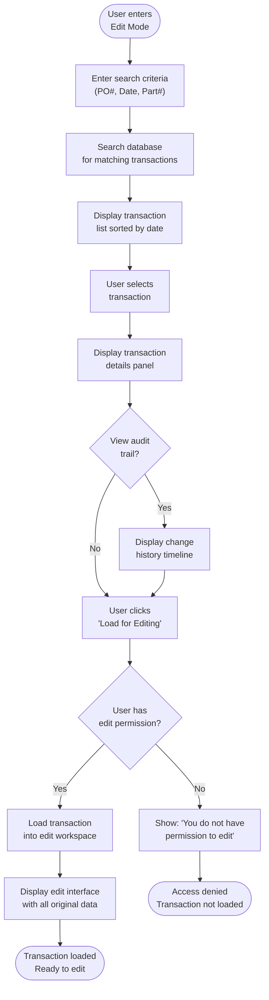
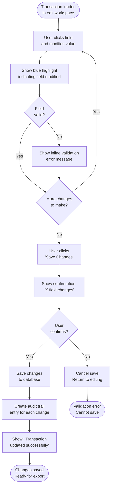

# Feature Specification: Edit Mode for Historical Receiving Data

**Feature Branch**: `002-editmode-specification`  
**Created**: 2026-01-25  
**Status**: Draft  
**Input**: Edit Mode allows users to view, modify, and re-save previously completed receiving transactions with full audit trail tracking and change history.

## Overview

Edit Mode provides users with the ability to modify historical receiving transaction data (completed transactions that have been saved to database and CSV). This feature maintains complete audit trails, tracks all modifications with timestamps and user information, and allows re-exporting modified data to CSV while preserving the original transaction records.

## User Scenarios & Testing

### User Story 1 - Browse Historical Transactions (Priority: P1)

Receiving clerk needs to find and access previously completed receiving transactions to verify data or make corrections.

**Why this priority**: Core functionality required for any historical data access feature. Users must be able to locate transactions before they can edit them.

**Independent Test**: Can be tested by accessing Edit Mode, entering search criteria (PO Number, Date Range, Part Number), and verifying that matching historical transactions are displayed with all relevant details. Delivers immediate value by enabling transaction lookup and review.

**Acceptance Scenarios**:

1. **Given** I am in Edit Mode, **When** I view the transaction list, **Then** I see all completed receiving transactions sorted by date (most recent first) with columns: Transaction Date, PO Number, Part Number, Load Count, Completed By, Status
2. **Given** I am searching for a specific transaction, **When** I enter a PO Number in the search field and click "Search", **Then** I see all matching transactions within 1 second with highlighted search terms
3. **Given** I am searching by Date Range, **When** I select a date range (From/To) and click "Search", **Then** I see all transactions completed within that date range sorted chronologically
4. **Given** I have multiple transactions in the list, **When** I click on a transaction row, **Then** I see a detail panel showing: Transaction ID, PO Number, Part Number, Load Count, Total Weight, Completion Date, Completed By, Last Modified Date, Last Modified By, Save Status (Local CSV, Network CSV, Database)
5. **Given** I have found a transaction, **When** I click the "Load for Editing" button, **Then** the transaction is loaded into the edit workspace with all original data preserved
6. **Given** I am viewing transaction details, **When** I click the "View Change History" button, **Then** I see a timeline of all modifications made to this transaction including: Modification Date, Modified By, Field Changed, Previous Value, New Value
7. **Given** I am searching for transactions, **When** I apply multiple filters (PO Number + Date Range + Status), **Then** the search results are narrowed to match ALL criteria simultaneously
8. **Given** I am in the transaction list, **When** I click the "Export Selected" button after selecting 1 or more transactions, **Then** I can choose to export to CSV with option to append to existing file or create new file
9. **Given** I am viewing a transaction list with 100+ results, **When** I scroll down or use pagination, **Then** the list loads data efficiently without freezing the UI
10. **Given** I am viewing transaction details, **When** I click the "Compare with Original" button, **Then** I see a side-by-side comparison showing original values vs. current values with differences highlighted

## User Story 2 - Modify Transaction Data (Priority: P1)

Receiving clerk discovered an error in a completed transaction and needs to correct the data (e.g., wrong heat lot, incorrect package type) without losing the historical record of the original entry.

**Why this priority**: Critical functionality for data correction workflow. Users must be able to fix mistakes without re-entering entire transactions from scratch.

**Independent Test**: Can be tested by loading a historical transaction, modifying a single field (e.g., heat lot), clicking "Save Changes", and verifying that the transaction is updated with audit trail entry. Delivers value by enabling efficient error correction.

**Acceptance Scenarios**:

1. **Given** I have loaded a historical transaction for editing, **When** I modify a single load's Heat Lot value and click "Save Changes", **Then** the system shows a confirmation dialog: "Change Heat Lot from [Old] to [New]? This will be recorded in the audit trail."
2. **Given** I am editing a transaction, **When** I click on an editable field and make a change, **Then** the field shows a visual indicator (blue highlight or edit icon) showing it has been modified
3. **Given** I have modified multiple fields across multiple loads, **When** I click "Save All Changes", **Then** the system shows a summary of all changes before confirming: "You are about to save X field changes. Continue?"
4. **Given** I am editing a transaction, **When** I attempt to change the Part Number, **Then** the system warns me: "Changing Part Number may invalidate load details. Continue?" and requires confirmation
5. **Given** I have made changes to a transaction, **When** I click the "Undo All Changes" button, **Then** all modifications are reverted and the view returns to showing original data
6. **Given** I am editing a transaction with 20 loads, **When** I modify Load 5's weight and then scroll to Load 15, **Then** the Load 5 modification is preserved while I edit Load 15
7. **Given** I have completed editing and click "Save Changes", **When** the save is successful, **Then** I see a confirmation message: "Transaction updated. Audit trail entry created." with timestamp
8. **Given** I am editing a transaction, **When** validation errors appear (e.g., negative weight), **Then** I see inline error messages and the "Save Changes" button is disabled until errors are fixed
9. **Given** I have edited a transaction, **When** I click "Save & Export to CSV", **Then** the system saves the changes AND generates a new CSV file with the updated data marked as "[Modified]"
10. **Given** I am editing multiple loads in a transaction, **When** I use the "Copy to Empty Cells" functionality, **Then** the same bulk copy operations work identically to Guided Mode, respecting the rule of only filling empty cells

## User Story 3 - Maintain Audit Trail (Priority: P1)

System must automatically track all modifications to historical transactions with complete audit information to ensure data integrity and comply with data governance requirements.

**Why this priority**: Critical for compliance, accountability, and dispute resolution. Every change must be traceable to a specific user and timestamp.

**Independent Test**: Can be tested by modifying a transaction field, checking the audit trail, and verifying all modification details are recorded correctly. Delivers value by ensuring data integrity and regulatory compliance.

**Acceptance Scenarios**:

1. **Given** I have modified a transaction field, **When** I view the audit trail, **Then** I see an entry showing: Timestamp, User Name, Field Name, Old Value, New Value, Change Type (Manual Edit)
2. **Given** I have made multiple changes to a transaction, **When** I view the audit trail, **Then** all changes are shown in chronological order with each change on a separate line
3. **Given** I am viewing the audit trail, **When** I click on an audit entry, **Then** the system highlights the corresponding field in the edit view for easy reference
4. **Given** a transaction has been modified, **When** another user opens the transaction, **Then** they see a badge or indicator showing "Last Modified: [User Name] on [Date/Time]"
5. **Given** I have saved changes to a transaction, **When** I close the transaction and reopen it, **Then** the audit trail shows the save operation with timestamp and user information
6. **Given** I view audit trail entries, **When** I see a modification, **Then** the system shows WHO made the change (full username), WHEN (exact timestamp), and WHAT changed (before/after values)
7. **Given** I have modified a transaction, **When** I attempt to export to CSV, **Then** the CSV header includes an audit note: "Last Modified: [User] on [DateTime]"
8. **Given** a transaction has a long audit trail (10+ entries), **When** I view it, **Then** I can scroll through the audit history and expand individual entries to see full details
9. **Given** I am viewing a transaction's audit trail, **When** I click "Export Audit Trail", **Then** I can download a detailed audit report showing all modifications with full details
10. **Given** a transaction modification is saved, **When** the system records it, **Then** the database audit log captures: Transaction ID, User ID, Timestamp, Field Changed, Old Value, New Value, IP Address

## User Story 4 - Validate Modified Data (Priority: P2)

System must validate all modified data using the same validation rules as the original data entry to ensure quality of corrected transactions.

**Why this priority**: Prevents invalid data from being re-saved. Maintains data quality standards across original and modified entries.

**Independent Test**: Can be tested by modifying a field to an invalid value (negative weight), attempting to save, and verifying that validation error prevents save. Delivers value by ensuring corrected data meets quality standards.

**Acceptance Scenarios**:

1. **Given** I am editing a transaction, **When** I change a load's weight to a negative number, **Then** I see an error message "Weight must be positive" and the "Save Changes" button is disabled
2. **Given** I am editing a transaction, **When** I attempt to save with empty required fields (e.g., missing heat lot), **Then** I see specific error messages for each invalid field
3. **Given** I have made multiple changes and some are invalid, **When** I attempt to save, **Then** the system shows all validation errors at once rather than one at a time
4. **Given** a field fails validation, **When** I click on the error message, **Then** the system scrolls to and highlights that field for easy correction
5. **Given** I have corrected all validation errors, **When** I attempt to save, **Then** the "Save Changes" button becomes enabled and the save proceeds without errors
6. **Given** I am editing a transaction, **When** I modify a package type to an invalid value, **Then** I see a tooltip suggesting valid package types based on the part number
7. **Given** I have imported external data or bulk-modified multiple fields, **When** I click "Validate All Fields", **Then** the system performs comprehensive validation and shows a summary report

## User Story 5 - Re-export Modified Data (Priority: P2)

User needs to generate updated CSV exports after correcting transaction data so downstream systems receive the corrected information.

**Why this priority**: Ensures corrected data propagates through system. Important for maintaining data consistency across systems.

**Independent Test**: Can be tested by modifying transaction data, clicking "Export to CSV", and verifying that the new CSV file contains the modified data with audit markers. Delivers value by enabling downstream system updates.

**Acceptance Scenarios**:

1. **Given** I have modified a transaction, **When** I click "Export to CSV", **Then** I see options: "Export as New File", "Append to Existing CSV", "Replace Original CSV"
2. **Given** I select "Export as New File", **When** I confirm the export, **Then** a new CSV file is created with naming format: "ReceivingTransaction_[PO#]_[Date]_MODIFIED.csv"
3. **Given** I select "Append to Existing CSV", **When** I confirm, **Then** the modified record is added to the existing CSV file with a note marking it as modified vs. original
4. **Given** I have exported modified data, **When** I review the CSV file, **Then** it includes: All original fields, Plus a column "AUDIT_MODIFIED_BY" showing user who made changes, Plus a column "AUDIT_MODIFIED_DATE" showing when changes were made
5. **Given** I am exporting a transaction with audit trail entries, **When** I select "Include Audit Trail" option, **Then** the CSV export includes a summary section showing all modifications
6. **Given** I have re-exported a transaction, **When** I view the export history, **Then** I can see all previous exports with timestamps, export type (New/Append/Replace), and export file path
7. **Given** I have modified multiple transactions, **When** I select "Batch Export", **Then** I can select multiple transactions and export all at once to a single CSV or individual files
8. **Given** I am exporting modified data, **When** I include the audit trail, **Then** each row in the CSV includes a column showing "Original | Modified" status for easy identification

## User Story 6 - View Change History and Comparisons (Priority: P3)

User needs to understand what changed between original and current versions of a transaction for audit purposes and data verification.

**Why this priority**: Enhances audit capabilities and user confidence in data corrections. Useful for dispute resolution and verification.

**Independent Test**: Can be tested by modifying a field, clicking "View Change History", and verifying that old and new values are displayed side-by-side. Delivers value by providing transparency into modifications.

**Acceptance Scenarios**:

1. **Given** I have modified a transaction, **When** I click "Compare with Original", **Then** I see a side-by-side view showing: Original Data (Left Column) | Current Data (Right Column) with differences highlighted
2. **Given** I am viewing a comparison, **When** a field differs between original and current, **Then** it is highlighted in color (e.g., yellow background) to draw attention
3. **Given** I am reviewing change history, **When** I view a specific modification, **Then** I see a detailed view showing: Field Name, Original Value, New Value, Changed By, Changed When, Reason for Change (if provided)
4. **Given** I have made multiple changes, **When** I click "Timeline View", **Then** I see a chronological timeline of all modifications with expandable entries
5. **Given** I am viewing the change history, **When** I click on a specific modification, **Then** I can see the exact state of the entire transaction at that point in time
6. **Given** I want to revert a specific change, **When** I click "Revert This Change" on a history entry, **Then** the system shows a confirmation dialog and reverts only that specific change
7. **Given** I am comparing two versions of a transaction, **When** I click "Show All Changes", **Then** I see a list of ONLY the fields that differ, filtering out unchanged fields for easier review

<!-- WORKFLOW_START: 1.1 --><!--
WORKFLOW: 1.1
TITLE: Browse and Load Transaction for Editing
DIRECTION: TD
DEPENDS_ON: NONE
CONFLICTS_WITH: NONE
INTERACTION: Primary entry point for Edit Mode workflow

NODE: W1_1_Start
TYPE: start
SHAPE: stadium
LABEL: User enters Edit Mode

NODE: W1_1_SearchCriteria
TYPE: process
SHAPE: rect
LABEL: Enter search criteria (PO#, Date, Part#)

NODE: W1_1_Search
TYPE: process
SHAPE: rect
LABEL: Search database for matching transactions

NODE: W1_1_ShowResults
TYPE: process
SHAPE: rect
LABEL: Display transaction list (sorted by date)

NODE: W1_1_SelectTransaction
TYPE: process
SHAPE: rect
LABEL: User selects transaction

NODE: W1_1_ViewDetails
TYPE: process
SHAPE: rect
LABEL: Display transaction details panel

NODE: W1_1_ViewHistory
TYPE: decision
SHAPE: diamond
LABEL: View audit trail?

NODE: W1_1_ShowHistory
TYPE: process
SHAPE: rect
LABEL: Display change history timeline

NODE: W1_1_LoadForEdit
TYPE: process
SHAPE: rect
LABEL: User clicks 'Load for Editing'

NODE: W1_1_VerifyPermissions
TYPE: decision
SHAPE: diamond
LABEL: User has edit permission?

NODE: W1_1_DenyAccess
TYPE: process
SHAPE: rect
LABEL: Show: 'You do not have permission to edit'

NODE: W1_1_LoadTransaction
TYPE: process
SHAPE: rect
LABEL: Load transaction into edit workspace

NODE: W1_1_ShowEditMode
TYPE: process
SHAPE: rect
LABEL: Display edit interface with all original data

NODE: W1_1_SuccessEnd
TYPE: end
SHAPE: stadium
LABEL: Transaction loaded Ready to edit

NODE: W1_1_ErrorEnd
TYPE: end
SHAPE: stadium
LABEL: Access denied Transaction not loaded

CONNECTION: W1_1_Start -> W1_1_SearchCriteria
CONNECTION: W1_1_SearchCriteria -> W1_1_Search
CONNECTION: W1_1_Search -> W1_1_ShowResults
CONNECTION: W1_1_ShowResults -> W1_1_SelectTransaction
CONNECTION: W1_1_SelectTransaction -> W1_1_ViewDetails
CONNECTION: W1_1_ViewDetails -> W1_1_ViewHistory [Yes]
CONNECTION: W1_1_ViewDetails -> W1_1_LoadForEdit [No]
CONNECTION: W1_1_ViewHistory -> W1_1_ShowHistory
CONNECTION: W1_1_ShowHistory -> W1_1_LoadForEdit
CONNECTION: W1_1_LoadForEdit -> W1_1_VerifyPermissions
CONNECTION: W1_1_VerifyPermissions -> W1_1_DenyAccess [No]
CONNECTION: W1_1_VerifyPermissions -> W1_1_LoadTransaction [Yes]
CONNECTION: W1_1_LoadTransaction -> W1_1_ShowEditMode
CONNECTION: W1_1_ShowEditMode -> W1_1_SuccessEnd
CONNECTION: W1_1_DenyAccess -> W1_1_ErrorEnd
--><!-- WORKFLOW_END: 1.1 -->

### Workflow 1.1: Browse and Load Transaction for Editing

<!-- WORKFLOW_START: 2.1 --><!--
WORKFLOW: 2.1
TITLE: Modify Transaction Data
DIRECTION: TD
DEPENDS_ON: 1.1
CONFLICTS_WITH: NONE
INTERACTION: Extends 1.1 by adding modification and validation

NODE: W2_1_Start
TYPE: start
SHAPE: stadium
LABEL: Transaction loaded in edit workspace

NODE: W2_1_ModifyField
TYPE: process
SHAPE: rect
LABEL: User clicks field and modifies value

NODE: W2_1_ShowIndicator
TYPE: process
SHAPE: rect
LABEL: Show blue highlight indicating field modified

NODE: W2_1_ValidateField
TYPE: decision
SHAPE: diamond
LABEL: Field valid?

NODE: W2_1_ShowError
TYPE: process
SHAPE: rect
LABEL: Show inline validation error message

NODE: W2_1_MultipleChanges
TYPE: decision
SHAPE: diamond
LABEL: More changes to make?

NODE: W2_1_SaveChanges
TYPE: process
SHAPE: rect
LABEL: User clicks 'Save Changes'

NODE: W2_1_ShowSummary
TYPE: process
SHAPE: rect
LABEL: Show confirmation: 'X field changes'

NODE: W2_1_UserConfirms
TYPE: decision
SHAPE: diamond
LABEL: User confirms?

NODE: W2_1_Cancel
TYPE: process
SHAPE: rect
LABEL: Cancel save Return to editing

NODE: W2_1_SaveToDatabase
TYPE: process
SHAPE: rect
LABEL: Save changes to database

NODE: W2_1_CreateAuditEntry
TYPE: process
SHAPE: rect
LABEL: Create audit trail entry for each change

NODE: W2_1_ShowSuccess
TYPE: process
SHAPE: rect
LABEL: Show: 'Transaction updated successfully'

NODE: W2_1_SuccessEnd
TYPE: end
SHAPE: stadium
LABEL: Changes saved Ready for export

NODE: W2_1_ErrorEnd
TYPE: end
SHAPE: stadium
LABEL: Validation error Cannot save

CONNECTION: W2_1_Start -> W2_1_ModifyField
CONNECTION: W2_1_ModifyField -> W2_1_ShowIndicator
CONNECTION: W2_1_ShowIndicator -> W2_1_ValidateField
CONNECTION: W2_1_ValidateField -> W2_1_ShowError [No]
CONNECTION: W2_1_ValidateField -> W2_1_MultipleChanges [Yes]
CONNECTION: W2_1_ShowError -> W2_1_MultipleChanges
CONNECTION: W2_1_MultipleChanges -> W2_1_ModifyField [Yes]
CONNECTION: W2_1_MultipleChanges -> W2_1_SaveChanges [No]
CONNECTION: W2_1_SaveChanges -> W2_1_ShowSummary
CONNECTION: W2_1_ShowSummary -> W2_1_UserConfirms
CONNECTION: W2_1_UserConfirms -> W2_1_Cancel [No]
CONNECTION: W2_1_UserConfirms -> W2_1_SaveToDatabase [Yes]
CONNECTION: W2_1_SaveToDatabase -> W2_1_CreateAuditEntry
CONNECTION: W2_1_CreateAuditEntry -> W2_1_ShowSuccess
CONNECTION: W2_1_ShowSuccess -> W2_1_SuccessEnd
CONNECTION: W2_1_Cancel -> W2_1_ErrorEnd
--><!-- WORKFLOW_END: 2.1 -->

### Workflow 2.1: Modify Transaction Data

## Edge Cases

- What happens when user modifies a transaction while another user has it open for editing? (Assumption: System shows warning "Another user has this transaction open. Your changes may conflict.") - Needs Implementation
- What happens when user attempts to modify transaction data that has been deleted from database? (Assumption: System shows error "Transaction no longer exists in database. Cannot load for editing.") - Correct
- How does system handle modification of a part that has since been discontinued? (Assumption: Allow modification but show warning "This part is discontinued. Consider selecting an active part.") - Needs Review
- What happens when edit mode user tries to modify original transaction while Wizard Mode user is creating new transaction with same PO? (Assumption: No conflict - they are separate transactions) - Correct
- How does system handle very large transactions (100+ loads) in edit mode? (Assumption: Use virtual scrolling and lazy-load load details) - Correct
- What happens when user modifies a transaction and network connection is lost during save? (Assumption: Show error "Network connection lost. Changes NOT saved. Please try again.") - Needs Implementation
- How does system handle permission checks for edit mode access? (Assumption: Implement role-based access control - only Supervisors/Admins can edit) - Needs Implementation
- What happens when user exports modified data to CSV while database save is still in progress? (Assumption: Block export until database save completes) - Needs Implementation

## Requirements

### Functional Requirements

- **FR-001**: System MUST maintain a complete edit mode interface separate from Guided Mode
- **FR-002**: System MUST provide transaction search functionality by PO Number, Date Range, and Part Number
- **FR-003**: System MUST display complete audit trail for each transaction showing all modifications
- **FR-004**: System MUST track modifications with: User ID, Timestamp, Field Changed, Old Value, New Value
- **FR-005**: System MUST validate all modified data using identical rules as original entry
- **FR-006**: System MUST prevent saving of transactions with validation errors
- **FR-007**: System MUST require user confirmation before saving any modifications
- **FR-008**: System MUST create an audit trail entry for every modification with full details
- **FR-009**: System MUST preserve original data in database while storing modifications as separate records
- **FR-010**: System MUST support re-exporting modified transactions to CSV with audit markers
- **FR-011**: System MUST provide role-based access control for edit mode (Supervisor/Admin only)
- **FR-012**: System MUST display visual indicators for modified fields (blue highlight or edit icon)
- **FR-013**: System MUST support undo functionality to revert all changes before save
- **FR-014**: System MUST display side-by-side comparison of original vs. current data
- **FR-015**: System MUST track export history for modified transactions
- **FR-016**: System MUST support bulk modifications of multiple transactions
- **FR-017**: System MUST show warning when modifying transactions with related data (e.g., part discontinued)
- **FR-018**: System MUST maintain referential integrity when modifying related data
- **FR-019**: System MUST log all edit mode activities to compliance audit log
- **FR-020**: System MUST prevent concurrent editing of same transaction by multiple users

### Key Entities

- **ReceivingTransaction_EditHistory**: Stores modification records with Transaction ID, User ID, Timestamp, Field Name, Old Value, New Value, Change Type
- **ReceivingTransaction_OriginalData**: Preserves original data snapshot for comparison purposes
- **AuditTrail**: Complete audit log of all modifications with immutable records
- **PermissionLevel**: User roles (User, Supervisor, Admin) with specific edit permissions
- **ExportHistory**: Tracks all CSV exports including re-exports of modified data
- **SearchCriteria**: Stores transaction search parameters for filtering and display
- **ComparisonView**: Data structure for side-by-side original vs. current comparison

## Success Criteria

### Measurable Outcomes

- **SC-001**: Users can search for a transaction and load it for editing in under 5 seconds
- **SC-002**: Audit trail captures 100% of modifications with accurate timestamp and user information
- **SC-003**: All modified transactions pass validation rules before allowing save (0% invalid saves)
- **SC-004**: System prevents data loss by requiring confirmation before any save operation
- **SC-005**: Modified transactions can be re-exported to CSV and propagate correctly to downstream systems
- **SC-006**: Concurrent editing conflicts are prevented through role-based access control
- **SC-007**: Change history is complete and auditable for compliance purposes
- **SC-008**: Performance remains acceptable when editing large transactions (100+ loads)
- **SC-009**: Original transaction data is preserved and recoverable for audit purposes

## Out of Scope

The following items are explicitly OUT OF SCOPE for Edit Mode:

- **Historical Data Restoration**: Reverting to previous versions of transaction data
- **Bulk Delete**: Deleting multiple historical transactions at once
- **Advanced Reporting**: Complex analytics or reports on modified transactions
- **Third-party System Integration**: Automatic propagation to Infor Visual or other systems
- **Version Control Branching**: Creating alternate versions of transaction data
- **Role Creation**: Adding new user roles; using existing role hierarchy only

## Risks & Mitigation

- **Risk 1**: Data corruption from incorrect modifications in edit mode
  - *Mitigation*: Strict validation, audit trails, original data preservation, role-based access

- **Risk 2**: Audit trail becoming too large and impacting performance
  - *Mitigation*: Archive old audit entries, implement efficient indexing on audit tables

- **Risk 3**: Unauthorized users attempting to edit sensitive transactions
  - *Mitigation*: Implement strong role-based access control with supervisor approval workflow

- **Risk 4**: User mistakes in edit mode affecting business data integrity
  - *Mitigation*: Require confirmation for all saves, show change summary before committing

## Notes

- Edit Mode is a separate workflow from Guided Mode but uses same validation rules and business logic
- All modifications must be fully auditable for compliance purposes
- Original transaction data must be preserved immutably in database
- This specification provides foundation for rebuilding Edit Mode module from scratch
