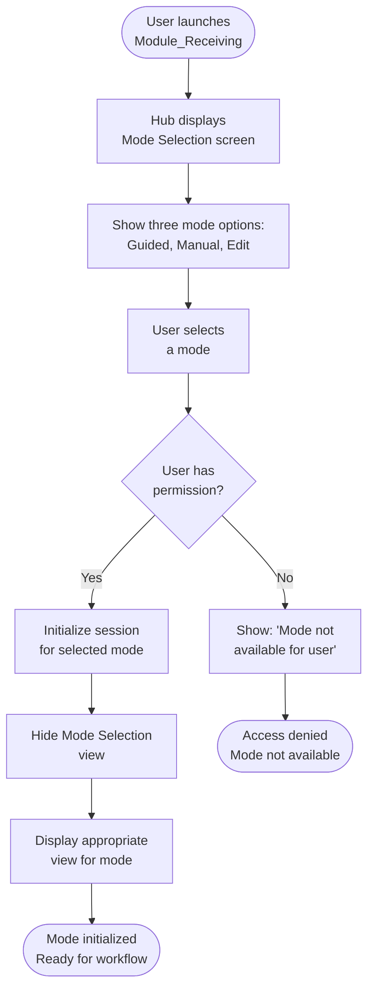
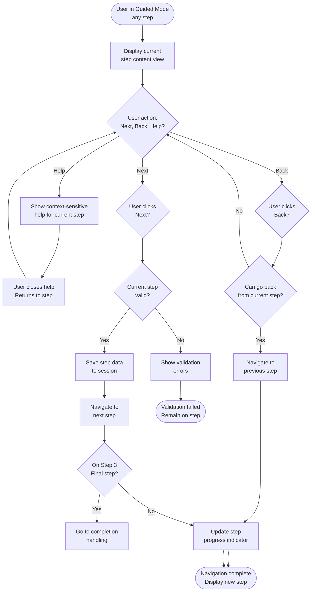

# Feature Specification: Module Hub and Workflow Orchestration

**Feature Branch**: `004-hub-orchestration-specification`  
**Created**: 2026-01-25  
**Last Updated**: 2026-01-25  
**Status**: Draft  
**Input**: The Module Hub is the central orchestration point that manages workflow mode selection (including PO/Non-PO mode), view switching, navigation between modes, and unified session state across Guided Mode, Manual Entry Mode, and Edit Mode within the Module_Receiving application.

**Related Business Rules:**
- [Non-PO Receiving](../01-Business-Rules/non-po-receiving.md) - Non-PO mode selection at Hub level

## Overview

The Module Hub (View_Receiving_Wizard_Orchestration_MainWorkflow) serves as the central orchestration layer for the entire Module_Receiving application. It manages:
1. **Mode Selection**: Users choose between Guided Mode, Manual Entry Mode, or Edit Mode
2. **PO/Non-PO Selection**: Users indicate if receiving is PO-based or Non-PO (miscellaneous items)
3. **View Switching**: Dynamically displays appropriate views based on selected mode
4. **Navigation**: Handles forward/backward navigation within Guided Mode workflow
5. **Session Management**: Maintains unified session state across all modes
6. **Workflow State**: Tracks current step in Guided Mode (Step 1, 2, 3)
7. **Help System**: Provides context-sensitive help for each workflow step
8. **Completion Handling**: Manages workflow completion, save results, and next steps

## User Scenarios & Testing

### User Story 1 - Mode Selection Interface (Priority: P1)

User needs to select which receiving workflow mode to use (Guided, Manual, or Edit) AND whether this is PO-based or Non-PO receiving at application startup.

**Why this priority**: Core entry point for all receiving workflows. Users must be able to select appropriate mode and transaction type for their use case upfront.

**Independent Test**: Can be tested by launching Mode Selection view and verifying all mode options are displayed with PO/Non-PO toggle. Delivers immediate value by providing clear mode and transaction type selection interface.

**Acceptance Scenarios**:

1. **Given** I launch the Receiving application, **When** I first reach the Mode Selection screen, **Then** I see three mode cards: "Guided Mode", "Manual Entry Mode", "Edit Mode" each with description, icon, and PO/Non-PO toggle
2. **Given** I am viewing Mode Selection, **When** I read each mode description, **Then** I understand the purpose: "Guided Mode: Step-by-step workflow" "Manual Entry Mode: Spreadsheet-style bulk entry" "Edit Mode: Modify historical transactions"
3. **Given** I am on Mode Selection, **When** I hover over "Guided Mode", **Then** I see tooltip with additional details and recommended user profile (e.g., "Best for: New users, occasional receiving")
4. **Given** I am viewing "Guided Mode" card, **When** I look at the PO/Non-PO toggle, **Then** I see a checkbox labeled "Non-PO Item (samples, returns, misc)" that is unchecked by default
5. **Given** I am viewing "Manual Entry Mode" card, **When** I look at the PO/Non-PO toggle, **Then** I see the same "Non-PO Item" checkbox that is unchecked by default
6. **Given** I am viewing "Edit Mode" card, **When** I look for PO/Non-PO toggle, **Then** it is NOT present (Edit Mode determines PO/Non-PO from loaded transaction)
7. **Given** I check "Non-PO Item" checkbox on "Guided Mode" card, **When** I view the card, **Then** I see visual indication (icon, color change, or label) showing "Non-PO Mode"
8. **Given** I select "Guided Mode" with "Non-PO Item" checked, **When** I click "Continue", **Then** the Hub switches to Guided Mode with session flag `IsNonPO = true` and displays Step 1 (Order & Part Selection) with PO Number field disabled
9. **Given** I select "Guided Mode" with "Non-PO Item" UNchecked, **When** I click "Continue", **Then** the Hub switches to Guided Mode with session flag `IsNonPO = false` and displays Step 1 with PO Number field enabled
10. **Given** I select "Manual Entry Mode" with "Non-PO Item" checked, **When** I click "Continue", **Then** the Hub switches to Manual Entry Mode with session flag `IsNonPO = true` and displays grid with PO Number column hidden
11. **Given** I select "Manual Entry Mode" with "Non-PO Item" UNchecked, **When** I click "Continue", **Then** the Hub switches to Manual Entry Mode with session flag `IsNonPO = false` and displays grid with PO Number column visible
12. **Given** I select "Edit Mode", **When** I click "Continue", **Then** the Hub switches to Edit Mode and displays the transaction search/browse interface (PO/Non-PO determined by selected transaction)
13. **Given** I have selected a mode, **When** I click "Change Mode" button in the footer, **Then** I return to Mode Selection screen with all checkboxes reset to default (unchecked)
14. **Given** I am viewing Mode Selection, **When** I notice help button, **Then** clicking it shows context-sensitive help about mode selection and PO/Non-PO options
15. **Given** I am viewing Mode Selection, **When** a mode is disabled (e.g., Edit Mode for non-supervisors), **Then** that option appears grayed out with tooltip explaining why

## User Story 2 - Unified Navigation System (Priority: P1)

User needs consistent navigation controls (Next, Back, Help buttons) that work across all workflow modes with clear indication of progress.

**Why this priority**: Essential UX element. Consistent navigation prevents user confusion and enables efficient workflow.

**Independent Test**: Can be tested by navigating through Guided Mode steps and verifying Next/Back buttons work correctly and show progress. Delivers immediate value by providing clear navigation.

**Acceptance Scenarios**:

1. **Given** I am in Guided Mode Step 1, **When** I look at the footer navigation, **Then** I see: Left-aligned "Return to Mode Selection" button, Center "Help" button, Right-aligned "Back" and "Next" buttons
2. **Given** I am on Step 1 of Guided Mode, **When** I look at the "Back" button, **Then** it is disabled (grayed out) since I cannot go back from first step
3. **Given** I have completed Step 1 validation, **When** I look at the "Next" button, **Then** it is enabled and styled as primary action button
4. **Given** I have not completed Step 1 validation (errors exist), **When** I look at the "Next" button, **Then** it is disabled with tooltip showing: "Complete validation to proceed"
5. **Given** I click "Next" button, **When** the system validates and stores Step 1 data, **Then** I am navigated to Step 2
6. **Given** I am on Step 2, **When** I click "Back" button, **Then** I return to Step 1 with all data preserved
7. **Given** I am in Manual Entry Mode, **When** I look at navigation buttons, **Then** I see: "Return to Mode Selection" (left), "Help" (center), "Save and Finish" (right)
8. **Given** I am in Edit Mode, **When** I look at navigation buttons, **Then** I see: "Return to Mode Selection" (left), "Help" (center), appropriate action buttons for current view
9. **Given** I am navigating between steps, **When** I need help with current step, **Then** I click "Help" button to access context-sensitive help for that specific step
10. **Given** I want to return to Mode Selection, **When** I click "Return to Mode Selection" button, **Then** system warns "You will lose current workflow. Continue?" if data is unsaved

## User Story 3 - Dynamic View Switching (Priority: P1)

System must dynamically display appropriate view components based on selected mode and current workflow state without page reloads.

**Why this priority**: Core Hub functionality. Smooth view switching creates seamless user experience.

**Independent Test**: Can be tested by switching between modes and verifying appropriate views are displayed and previous view is hidden. Delivers immediate value by providing responsive view switching.

**Acceptance Scenarios**:

1. **Given** I am in Mode Selection and select "Guided Mode", **When** the transition occurs, **Then** Mode Selection view is hidden and Guided Mode Step 1 view is displayed
2. **Given** I am viewing Guided Mode Step 1, **When** I click "Next" and Step 1 validation passes, **Then** Step 1 view transitions to Step 2 view without page reload
3. **Given** I am viewing Guided Mode Step 2, **When** I click "Back", **Then** Step 2 view transitions back to Step 1 view with all previous data intact
4. **Given** I am in Guided Mode Step 3 and click "Start New Entry", **When** the action completes, **Then** the view transitions back to Mode Selection
5. **Given** I am in Guided Mode and click "Return to Mode Selection", **When** I confirm the action, **Then** all views are hidden and Mode Selection view is displayed
6. **Given** I have left Manual Entry Mode and selected a different mode, **When** I later select Manual Entry Mode again, **Then** the session state is reset (grid is cleared)
7. **Given** I am switching between modes, **When** each mode transition occurs, **Then** no page reload happens (smooth client-side transition)
8. **Given** I am in Edit Mode viewing transaction list, **When** I select a transaction to edit, **Then** the transaction list view transitions to edit interface view
9. **Given** I am viewing a workflow step, **When** the system displays overlay (e.g., help panel), **Then** the underlying view remains visible and partially interactive (if appropriate)

## User Story 4 - Session State Management (Priority: P1)

System must maintain complete session state across navigation, mode switches, and allow recovery of incomplete workflows.

**Why this priority**: Critical for data integrity and user experience. Users expect work-in-progress to be preserved during navigation.

**Independent Test**: Can be tested by entering data in Guided Mode Step 1, navigating to Step 2, then returning to Step 1 and verifying data is preserved. Delivers value by preventing data loss.

**Acceptance Scenarios**:

1. **Given** I have entered data in Guided Mode Step 1, **When** I click "Next", **Then** all Step 1 data is saved to session memory
2. **Given** I am on Guided Mode Step 2, **When** I click "Back", **Then** Step 1 data is retrieved from session and displayed with all previous entries intact
3. **Given** I have filled multiple loads in Guided Mode Step 2, **When** I navigate to Step 3, **Then** all load data is preserved in session
4. **Given** I am on Step 3 and click "Edit Load Details", **When** I edit loads and return to Step 3, **Then** all changes are reflected in the review summary
5. **Given** I have been in Manual Entry Mode entering data, **When** I accidentally click "Return to Mode Selection" and confirm, **Then** the system warns: "You have unsaved data. Save before leaving?" with options to Save or Discard
6. **Given** I have completed Guided Mode workflow, **When** I save the transaction successfully, **Then** the session is cleared and application returns to Mode Selection
7. **Given** I have partially completed Guided Mode, **When** the browser is refreshed or connection is lost, **Then** the system attempts to recover the session state if it's recoverable
8. **Given** I have multiple sessions in progress (unlikely but possible if using multiple windows), **When** I save in one session, **Then** it does not interfere with other active sessions
9. **Given** I am using Edit Mode and have made modifications, **When** I navigate between views, **Then** changes are tracked in session until explicitly saved or discarded
10. **Given** the workflow is complete and saved, **When** I click "Start New Entry", **Then** the entire session is cleared and fresh session begins

## User Story 5 - Step Progress Indication (Priority: P2)

User needs clear visual indication of current step/progress within Guided Mode workflow to avoid confusion about position in multi-step process.

**Why this priority**: Improves UX by providing clear progress feedback. Users know where they are in workflow.

**Independent Test**: Can be tested by viewing each step of Guided Mode and verifying progress indicator shows correct step (1 of 3, 2 of 3, 3 of 3). Delivers value by reducing user confusion.

**Acceptance Scenarios**:

1. **Given** I am viewing Guided Mode Step 1, **When** I look at the page header or breadcrumb, **Then** I see "Step 1 of 3: Order & Part Selection"
2. **Given** I am on Step 2, **When** I view the header, **Then** it shows "Step 2 of 3: Load Details Entry"
3. **Given** I am on Step 3, **When** I view the header, **Then** it shows "Step 3 of 3: Review & Save"
4. **Given** I am viewing the Guided Mode interface, **When** I look at visual progress indicator, **Then** I see a progress bar or step counter showing 1/3, 2/3, or 3/3
5. **Given** I am on Step 2 and click "Next", **When** the progress indicator updates, **Then** it immediately shows Step 3 status
6. **Given** I am on Step 2, **When** I click "Back", **Then** the progress indicator updates to show Step 1 status
7. **Given** each step is displayed, **When** I look at the content area, **Then** the step-specific content (Step 1 form, Step 2 grid, Step 3 review) matches the step number shown in header

## User Story 6 - Help System Integration (Priority: P2)

User needs context-sensitive help for the current step/mode they are viewing without leaving the workflow.

**Why this priority**: Improves user self-sufficiency. Users can get help without contacting support.

**Independent Test**: Can be tested by clicking Help button on each step and verifying appropriate help content displays. Delivers value by enabling self-service support.

**Acceptance Scenarios**:

1. **Given** I am viewing Guided Mode Step 1, **When** I click "Help" button, **Then** a help panel appears showing content relevant to Step 1: "How to enter PO information", "How to select parts", "How to enter load count"
2. **Given** I am viewing Guided Mode Step 2, **When** I click "Help" button, **Then** help panel shows content for Step 2: "How to enter weight", "How to enter heat lot", "How to use bulk copy"
3. **Given** I am in Manual Entry Mode, **When** I click "Help" button, **Then** help panel shows Manual Entry specific content: "Grid navigation", "Keyboard shortcuts", "Bulk operations"
4. **Given** I am in Edit Mode, **When** I click "Help" button, **Then** help panel shows Edit Mode content: "Searching for transactions", "Modifying data", "Audit trail"
5. **Given** help panel is open, **When** I click "Close" or click elsewhere on the page, **Then** the help panel closes smoothly
6. **Given** I am viewing help content, **When** I need more information, **Then** I can click links in help to access detailed documentation
7. **Given** I am in workflow, **When** I notice a UI element with question mark icon (?), **Then** hovering over it shows a tooltip with brief explanation

## User Story 7 - Workflow Completion and Results (Priority: P1)

System must clearly communicate workflow completion status, save results, and next available actions after successful transaction save.

**Why this priority**: Critical for user confidence that work was completed successfully. Users need to know if save succeeded.

**Independent Test**: Can be tested by completing Guided Mode workflow and verifying success/failure message and available next actions are displayed. Delivers value by providing clear completion feedback.

**Acceptance Scenarios**:

1. **Given** I have completed all three steps of Guided Mode and clicked "Save", **When** the save operation completes successfully, **Then** I see a completion screen with: Success icon/message, "Receiving transaction saved successfully", Save details (Local CSV: Success, Network CSV: Success, Database: Success)
2. **Given** save is successful, **When** I view the completion screen, **Then** I see number of loads saved and transaction details
3. **Given** the workflow is complete, **When** I look at available actions, **Then** I see buttons: "Start New Entry", "Reset CSV", "Return to Mode Selection"
4. **Given** the save operation partially fails (e.g., Network CSV fails but Database succeeds), **When** completion screen displays, **Then** I see detailed status for each save target with red X for failures and green checkmark for successes
5. **Given** the save operation completely fails, **When** the completion screen appears, **Then** I see failure icon/message with error details and option to "Retry Save" or "Return to Step 3"
6. **Given** I am viewing the completion screen, **When** I click "Start New Entry", **Then** the entire session is cleared and I return to Mode Selection
7. **Given** workflow is complete, **When** I click "Reset CSV", **Then** the system clears the CSV file and confirms: "CSV file cleared"
8. **Given** I have completed workflow, **When** I want to review the saved transaction, **Then** I can click "Load in Edit Mode" if available to view/modify the saved data

<!-- WORKFLOW_START: 1.1 --><!--
WORKFLOW: 1.1
TITLE: Mode Selection and Hub Initialization
DIRECTION: TD
DEPENDS_ON: NONE
CONFLICTS_WITH: NONE
INTERACTION: Primary entry point for all receiving workflows

NODE: W1_1_Start
TYPE: start
SHAPE: stadium
LABEL: User launches<br/>Module_Receiving

NODE: W1_1_DisplayModeSelection
TYPE: process
SHAPE: rect
LABEL: Hub displays<br/>Mode Selection screen

NODE: W1_1_ShowModes
TYPE: process
SHAPE: rect
LABEL: Show three mode options:<br/>Guided, Manual, Edit

NODE: W1_1_UserSelects
TYPE: process
SHAPE: rect
LABEL: User selects<br/>a mode

NODE: W1_1_ValidateAccess
TYPE: decision
SHAPE: diamond
LABEL: User has<br/>permission?

NODE: W1_1_DenyAccess
TYPE: process
SHAPE: rect
LABEL: Show: 'Mode not<br/>available for user'

NODE: W1_1_InitializeSession
TYPE: process
SHAPE: rect
LABEL: Initialize session<br/>for selected mode

NODE: W1_1_HideModSelection
TYPE: process
SHAPE: rect
LABEL: Hide Mode Selection<br/>view

NODE: W1_1_DisplayMode
TYPE: process
SHAPE: rect
LABEL: Display appropriate<br/>view for mode

NODE: W1_1_SuccessEnd
TYPE: end
SHAPE: stadium
LABEL: Mode initialized<br/>Ready for workflow

NODE: W1_1_ErrorEnd
TYPE: end
SHAPE: stadium
LABEL: Access denied<br/>Mode not available

CONNECTION: W1_1_Start -> W1_1_DisplayModeSelection
CONNECTION: W1_1_DisplayModeSelection -> W1_1_ShowModes
CONNECTION: W1_1_ShowModes -> W1_1_UserSelects
CONNECTION: W1_1_UserSelects -> W1_1_ValidateAccess
CONNECTION: W1_1_ValidateAccess -> W1_1_DenyAccess [No]
CONNECTION: W1_1_ValidateAccess -> W1_1_InitializeSession [Yes]
CONNECTION: W1_1_InitializeSession -> W1_1_HideModSelection
CONNECTION: W1_1_HideModSelection -> W1_1_DisplayMode
CONNECTION: W1_1_DisplayMode -> W1_1_SuccessEnd
CONNECTION: W1_1_DenyAccess -> W1_1_ErrorEnd
--><!-- WORKFLOW_END: 1.1 -->

### Workflow 1.1: Mode Selection and Hub Initialization



<!-- WORKFLOW_START: 2.1 --><!--
WORKFLOW: 2.1
TITLE: Guided Mode Navigation
DIRECTION: TD
DEPENDS_ON: 1.1
CONFLICTS_WITH: NONE
INTERACTION: Handles step-by-step navigation in Guided Mode

NODE: W2_1_Start
TYPE: start
SHAPE: stadium
LABEL: User in Guided Mode<br/>any step

NODE: W2_1_ViewStep
TYPE: process
SHAPE: rect
LABEL: Display current<br/>step content view

NODE: W2_1_UserAction
TYPE: decision
SHAPE: diamond
LABEL: User action:<br/>Next, Back, Help?

NODE: W2_1_Help
TYPE: process
SHAPE: rect
LABEL: Show context-sensitive<br/>help for current step

NODE: W2_1_CloseHelp
TYPE: process
SHAPE: rect
LABEL: User closes help<br/>Returns to step

NODE: W2_1_Back
TYPE: decision
SHAPE: diamond
LABEL: User clicks<br/>Back?

NODE: W2_1_ValidateBack
TYPE: decision
SHAPE: diamond
LABEL: Can go back<br/>from current step?

NODE: W2_1_GoBack
TYPE: process
SHAPE: rect
LABEL: Navigate to<br/>previous step

NODE: W2_1_Next
TYPE: decision
SHAPE: diamond
LABEL: User clicks<br/>Next?

NODE: W2_1_ValidateStep
TYPE: decision
SHAPE: diamond
LABEL: Current step<br/>valid?

NODE: W2_1_ShowErrors
TYPE: process
SHAPE: rect
LABEL: Show validation<br/>errors

NODE: W2_1_SaveStepData
TYPE: process
SHAPE: rect
LABEL: Save step data<br/>to session

NODE: W2_1_GoNext
TYPE: process
SHAPE: rect
LABEL: Navigate to<br/>next step

NODE: W2_1_CheckFinal
TYPE: decision
SHAPE: diamond
LABEL: On Step 3<br/>Final step?

NODE: W2_1_Complete
TYPE: process
SHAPE: rect
LABEL: Go to completion<br/>handling

NODE: W2_1_UpdateProgress
TYPE: process
SHAPE: rect
LABEL: Update step<br/>progress indicator

NODE: W2_1_SuccessEnd
TYPE: end
SHAPE: stadium
LABEL: Navigation complete<br/>Display new step

NODE: W2_1_ErrorEnd
TYPE: end
SHAPE: stadium
LABEL: Validation failed<br/>Remain on step

CONNECTION: W2_1_Start -> W2_1_ViewStep
CONNECTION: W2_1_ViewStep -> W2_1_UserAction
CONNECTION: W2_1_UserAction -> W2_1_Help [Help]
CONNECTION: W2_1_UserAction -> W2_1_Back [Back]
CONNECTION: W2_1_UserAction -> W2_1_Next [Next]
CONNECTION: W2_1_Help -> W2_1_CloseHelp
CONNECTION: W2_1_CloseHelp -> W2_1_UserAction
CONNECTION: W2_1_Back -> W2_1_ValidateBack
CONNECTION: W2_1_ValidateBack -> W2_1_GoBack [Yes]
CONNECTION: W2_1_ValidateBack -> W2_1_UserAction [No]
CONNECTION: W2_1_GoBack -> W2_1_UpdateProgress
CONNECTION: W2_1_UpdateProgress -> W2_1_SuccessEnd
CONNECTION: W2_1_Next -> W2_1_ValidateStep
CONNECTION: W2_1_ValidateStep -> W2_1_ShowErrors [No]
CONNECTION: W2_1_ShowErrors -> W2_1_ErrorEnd
CONNECTION: W2_1_ValidateStep -> W2_1_SaveStepData [Yes]
CONNECTION: W2_1_SaveStepData -> W2_1_GoNext
CONNECTION: W2_1_GoNext -> W2_1_CheckFinal
CONNECTION: W2_1_CheckFinal -> W2_1_Complete [Yes]
CONNECTION: W2_1_CheckFinal -> W2_1_UpdateProgress [No]
CONNECTION: W2_1_UpdateProgress -> W2_1_SuccessEnd
--><!-- WORKFLOW_END: 2.1 -->

### Workflow 2.1: Guided Mode Navigation



## Edge Cases

- What happens when user navigates away from workflow without saving? (Assumption: Show warning "Unsaved changes will be lost") - Correct
- What happens when session expires during multi-step workflow? (Assumption: Show error "Session expired. Your work may not be saved." with option to retry) - Needs Implementation
- How does hub handle browser back button during Guided Mode? (Assumption: Intercept browser back and use app navigation instead) - Needs Implementation
- What happens when user switches modes mid-workflow? (Assumption: Warn "Switching modes will discard current workflow. Continue?" with confirmation required) - Needs Implementation

## Requirements

### Functional Requirements

- **FR-001**: Hub MUST display Mode Selection as primary entry point
- **FR-002**: Hub MUST support three modes: Guided, Manual, Edit with dynamic view switching
- **FR-003**: Hub MUST maintain unified session state across all modes
- **FR-004**: Hub MUST provide consistent navigation controls (Next, Back, Help) across all modes
- **FR-005**: Hub MUST display progress indication for Guided Mode (Step X of 3)
- **FR-006**: Hub MUST validate step completion before allowing navigation to next step
- **FR-007**: Hub MUST provide context-sensitive help for each workflow step
- **FR-008**: Hub MUST handle workflow completion with clear success/failure feedback
- **FR-009**: Hub MUST support smooth view transitions without page reload
- **FR-010**: Hub MUST prevent data loss through unsaved changes warnings
- **FR-011**: Hub MUST implement permission checks for mode access
- **FR-012**: Hub MUST restore session state on backward navigation

### Key Entities

- **WorkflowSession**: Central session object containing state for all three modes
- **ModeSetting**: User's selected mode (Guided/Manual/Edit)
- **CurrentStep**: Tracks current step in Guided Mode (1/2/3)
- **SessionData**: Unified data structure containing all entered data
- **NavigationState**: Tracks navigation history and current position
- **PermissionSet**: User roles and access permissions for modes

## Success Criteria

### Measurable Outcomes

- **SC-001**: Users can switch between modes smoothly without page reloads
- **SC-002**: Session state is preserved across all navigation operations
- **SC-003**: Progress indication is accurate and updated in real-time
- **SC-004**: Help content is context-appropriate for each step/mode
- **SC-005**: Workflow completion feedback is clear and actionable
- **SC-006**: No data loss when navigating or switching modes (with warnings)
- **SC-007**: Navigation performance is responsive (no delays/freezing)

## Out of Scope

- **Advanced Analytics**: Tracking user workflows for analytics
- **Workflow History**: Maintaining history of past workflows
- **Custom Navigation Flows**: Non-standard workflows or navigation paths
- **Role Management**: Creating/modifying user roles; using existing roles only

## Risks & Mitigation

- **Risk 1**: Session state becoming inconsistent across mode switches
  - *Mitigation*: Implement robust session management with validation checks

- **Risk 2**: User confusion about available modes or access restrictions
  - *Mitigation*: Provide clear mode descriptions and disable unavailable modes

- **Risk 3**: Data loss due to premature mode switching
  - *Mitigation*: Show unsaved changes warnings before mode switches

- **Risk 4**: Navigation getting stuck or unable to proceed
  - *Mitigation*: Implement safety checks and allow return to Mode Selection as escape hatch

## Mode Selection User Interface

### Visual Layout

The Mode Selection screen presents three cards (Guided Mode, Manual Entry Mode, Edit Mode) with PO/Non-PO toggle on applicable cards.

**UI Mockup:**
```
┌────────────────────────────────────────────────────────────────────┐
│  MTM Receiving Application - Mode Selection                       │
│  ────────────────────────────────────────────────────────────────  │
│                                                                    │
│  Select Receiving Mode:                                           │
│                                                                    │
│  ┌──────────────────┐  ┌──────────────────┐  ┌─────────────────┐ │
│  │  📋 Guided Mode  │  │  📊 Manual Entry │  │  ✏️ Edit Mode   │ │
│  │                  │  │       Mode       │  │                 │ │
│  │  Step-by-step    │  │                  │  │  Modify         │ │
│  │  wizard workflow │  │  Spreadsheet-    │  │  historical     │ │
│  │  for standard    │  │  style bulk      │  │  transactions   │ │
│  │  receiving       │  │  entry for high  │  │                 │ │
│  │                  │  │  volume          │  │  For supervisors│ │
│  │  ─────────────   │  │  ─────────────   │  │                 │ │
│  │                  │  │                  │  │                 │ │
│  │  ☐ Non-PO Item   │  │  ☐ Non-PO Item   │  │                 │ │
│  │  (samples,       │  │  (samples,       │  │  [Continue]     │ │
│  │   returns, misc) │  │   returns, misc) │  │                 │ │
│  │                  │  │                  │  │                 │ │
│  │  [Continue]      │  │  [Continue]      │  │                 │ │
│  └──────────────────┘  └──────────────────┘  └─────────────────┘ │
│                                                                    │
│  Best for:           Best for:             Best for:              │
│  • New users         • Power users         • Supervisors          │
│  • Occasional use    • 50+ loads/session   • Corrections          │
│  • Step validation   • Keyboard efficiency • Audit trail          │
│                                                                    │
│                                                      [Help]        │
└────────────────────────────────────────────────────────────────────┘
```

### Mode Card Components

**Each Mode Card Contains:**
1. **Icon** - Visual identifier (📋, 📊, ✏️)
2. **Mode Name** - "Guided Mode", "Manual Entry Mode", "Edit Mode"
3. **Description** - 2-3 line summary of mode purpose
4. **PO/Non-PO Toggle** - Checkbox (Guided & Manual only, not Edit)
5. **Continue Button** - Initiates selected mode
6. **"Best for" Section** - Below cards, shows recommended use cases

### PO/Non-PO Toggle Behavior

**Checkbox Label:**
```
☐ Non-PO Item (samples, returns, misc)
```

**States:**
- **Unchecked (Default):** PO-based receiving
  - Session flag: `IsNonPO = false`
  - Visual: Standard card appearance
  
- **Checked:** Non-PO receiving
  - Session flag: `IsNonPO = true`
  - Visual: Card border/background changes (e.g., light blue tint)
  - Card label updates: "Guided Mode - Non-PO" or icon indicator

**Tooltip (Hover over checkbox):**
```
Check this to receive items without a Purchase Order:
• Miscellaneous supplies
• Customer returns
• Free samples
• Warranty replacements
• Emergency deliveries
```

### Session Initialization Based on Selection

**User selects: Guided Mode + Non-PO checked**
```csharp
var session = new ReceivingSession
{
    SessionId = Guid.NewGuid(),
    Mode = WorkflowMode.Guided,
    IsNonPO = true, // ← Set from checkbox
    CurrentStep = "Step1",
    CreatedDate = DateTime.Now
};

// Navigate to Guided Mode Step 1
// PO Number field will be disabled/hidden
// Part search will be unrestricted
```

**User selects: Manual Entry Mode + Non-PO checked**
```csharp
var session = new ReceivingSession
{
    SessionId = Guid.NewGuid(),
    Mode = WorkflowMode.Manual,
    IsNonPO = true, // ← Set from checkbox
    CreatedDate = DateTime.Now
};

// Navigate to Manual Entry Mode
// PO Number column will be hidden in grid
// Part search will be unrestricted
```

**User selects: Edit Mode**
```csharp
var session = new ReceivingSession
{
    SessionId = Guid.NewGuid(),
    Mode = WorkflowMode.Edit,
    IsNonPO = null, // ← Determined by loaded transaction
    CreatedDate = DateTime.Now
};

// Navigate to Edit Mode
// PO/Non-PO determined when user selects transaction to edit
```

### Visual Indicators When Non-PO Selected

**Mode Card with Non-PO Checked:**
```
┌──────────────────────────────────────┐
│  📋 Guided Mode - Non-PO      ⬛     │ ← Badge/icon indicator
│                                      │
│  Step-by-step wizard workflow        │
│  for standard receiving              │
│                                      │
│  ─────────────────────────────────   │
│                                      │
│  ☑ Non-PO Item (samples, returns...) │ ← Checked
│                                      │
│  [Continue]                          │
└──────────────────────────────────────┘
```

**Border/Background Change:**
- Light blue or gray tint on card when Non-PO is checked
- Subtle visual distinction from PO mode cards

### Help System Integration

**Help Button on Mode Selection:**

**User clicks "Help":**
```
┌────────────────────────────────────────────┐
│  📘 Mode Selection Help                    │
│  ────────────────────────────────────────  │
│                                            │
│  Choose the receiving mode that best      │
│  fits your workflow:                       │
│                                            │
│  **Guided Mode**                           │
│  • Step-by-step wizard                    │
│  • Real-time validation                   │
│  • Best for: New users, occasional use    │
│                                            │
│  **Manual Entry Mode**                     │
│  • Spreadsheet-style grid                 │
│  • Keyboard shortcuts                     │
│  • Best for: High volume (50+ loads)      │
│                                            │
│  **Edit Mode**                             │
│  • Modify historical transactions         │
│  • Audit trail tracking                   │
│  • Best for: Supervisors, corrections     │
│                                            │
│  **Non-PO Item Checkbox**                 │
│  Check this if you're receiving items     │
│  WITHOUT a Purchase Order:                │
│  • Samples, returns, misc supplies        │
│  • Warranty replacements                  │
│  • Emergency deliveries                   │
│                                            │
│  When checked, PO Number will not be      │
│  required and all parts will be           │
│  available for selection.                 │
│                                            │
│                                [Close]     │
└────────────────────────────────────────────┘
```

### Validation Rules

**Mode Selection Validation:**

```csharp
public class ModeSelectionValidator
{
    public ValidationResult Validate(ModeSelection selection)
    {
        // Mode must be selected
        if (selection.Mode == WorkflowMode.None)
        {
            return ValidationResult.Error("Please select a receiving mode");
        }
        
        // Check user permissions for selected mode
        if (selection.Mode == WorkflowMode.Edit && !_currentUser.HasPermission("Edit_Historical_Transactions"))
        {
            return ValidationResult.Error("You do not have permission to use Edit Mode");
        }
        
        // Non-PO checkbox only valid for Guided and Manual modes
        if (selection.IsNonPO && selection.Mode == WorkflowMode.Edit)
        {
            return ValidationResult.Error("Non-PO toggle not applicable to Edit Mode");
        }
        
        return ValidationResult.Success();
    }
}
```

### Session State Structure

**ReceivingSession with IsNonPO:**

```csharp
public class ReceivingSession
{
    public Guid SessionId { get; set; }
    public WorkflowMode Mode { get; set; } // Guided, Manual, Edit
    public bool IsNonPO { get; set; } // Set from Mode Selection checkbox
    public string CurrentStep { get; set; } // For Guided Mode: "Step1", "Step2", "Step3"
    public DateTime CreatedDate { get; set; }
    
    // Step 1 Data
    public string PONumber { get; set; } // NULL or empty if IsNonPO = true
    public string PartNumber { get; set; }
    public int LoadCount { get; set; }
    
    // Step 2 Data
    public List<LoadDetail> Loads { get; set; }
    
    // ... (rest of session properties)
}
```

### Return to Mode Selection

**User clicks "Return to Mode Selection" from active workflow:**

**Behavior:**
1. Show unsaved changes warning (if applicable)
2. On confirm: Reset session, return to Mode Selection
3. All checkboxes reset to default (unchecked)
4. User can make fresh mode selection

**Warning Dialog:**
```
┌──────────────────────────────────────────────┐
│ ⚠ Return to Mode Selection?                 │
│ ────────────────────────────────────────────│
│                                              │
│ You have unsaved changes in your current    │
│ workflow.                                    │
│                                              │
│ Returning to Mode Selection will discard    │
│ all unsaved data.                            │
│                                              │
│ Continue?                                    │
│                                              │
│          [Cancel]  [Discard and Return]     │
└──────────────────────────────────────────────┘
```

## Notes

- Hub serves as the main orchestrator for all Module_Receiving workflows
- All views are swapped dynamically without page reloads for smooth UX
- Session state must be maintained reliably across navigation
- **Non-PO mode is selected at Hub level** and flows to Guided/Manual modes
- Edit Mode determines PO/Non-PO from loaded transaction (no checkbox)
- This specification provides foundation for rebuilding Hub/Orchestration from scratch
